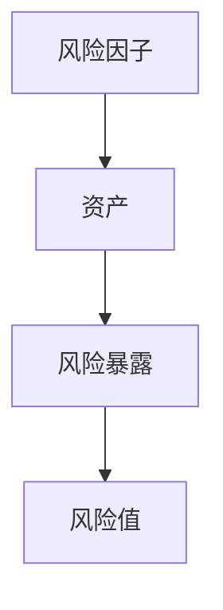
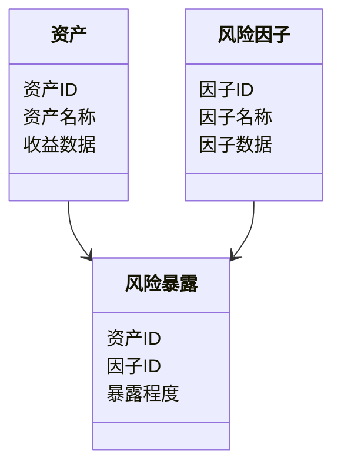
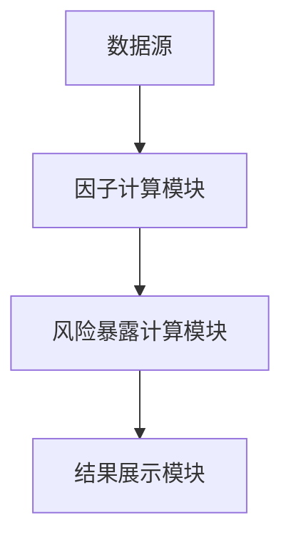
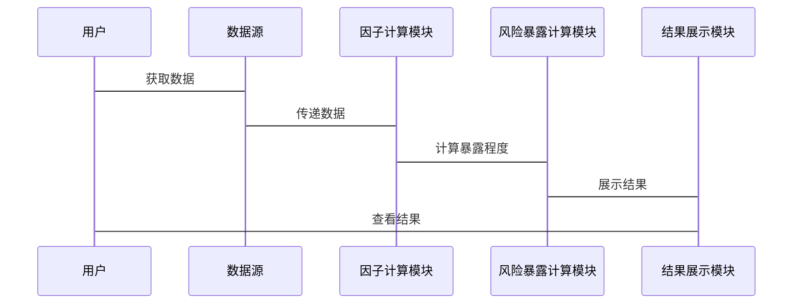

                 


# 金融市场风险因子暴露分析工具

> 关键词：金融市场、风险因子、暴露分析、金融工具、风险管理

> 摘要：金融市场风险因子暴露分析工具是一种用于识别和量化金融资产在不同风险因子上的暴露程度的工具。通过对风险因子的分析，投资者和金融机构可以更好地理解市场风险，制定有效的风险管理策略。本文将详细介绍风险因子暴露分析的核心概念、算法原理、系统架构以及项目实战，帮助读者深入理解这一工具的应用和实现。

---

## 第1章: 风险因子暴露分析的背景与概念

### 1.1 风险因子暴露分析的背景与问题背景

金融市场中的风险因子暴露分析是金融风险管理的核心内容之一。随着金融市场的复杂化和全球化，投资者和金融机构需要面对越来越多的市场风险，例如市场波动、利率风险、信用风险等。这些风险往往通过风险因子来体现，例如市场指数、行业因子、风格因子等。

#### 1.1.1 风险因子的定义与概念
风险因子是指影响资产价格波动的关键因素。常见的风险因子包括：
- **市场因子（Market Factor）**：如大盘指数波动。
- **行业因子（Industry Factor）**：如行业特定风险。
- **风格因子（Style Factor）**：如市值、流动性、价值与成长风格等。
- **信用因子（Credit Factor）**：如信用评级相关的风险。

#### 1.1.2 金融市场中的风险暴露问题
风险暴露是指资产或投资组合在特定风险因子上的敏感程度。例如，一只股票在市场因子上的高暴露意味着其价格波动与市场指数密切相关。通过分析风险因子的暴露程度，投资者可以更好地理解资产的风险来源，并采取相应的风险管理策略。

#### 1.1.3 风险因子暴露分析的重要性
风险因子暴露分析是金融风险管理的重要工具，可以帮助投资者：
1. 识别投资组合中的主要风险来源。
2. 优化投资组合的结构，降低不必要的风险暴露。
3. 评估不同资产在不同市场环境下的表现。

### 1.2 风险因子暴露分析的核心概念

#### 1.2.1 风险因子的分类与特征
风险因子可以根据不同的标准进行分类，例如：
- **系统性风险因子**：如市场因子、利率因子，影响整个市场的风险。
- **非系统性风险因子**：如行业因子、信用因子，影响特定资产或行业的风险。

#### 1.2.2 风险因子暴露的数学定义
风险因子暴露是指资产或投资组合在特定风险因子上的敏感程度，可以用以下公式表示：
$$\text{暴露程度} = \frac{\partial \text{资产收益}}{\partial \text{风险因子}}$$

#### 1.2.3 风险因子暴露分析的边界与外延
风险因子暴露分析的边界通常包括：
- **可量化风险因子**：仅考虑能够量化的风险因子，如市场因子、行业因子等。
- **时间范围**：分析特定时间段内的风险暴露。
- **数据限制**：受限于数据的可得性和质量。

### 1.3 风险因子暴露分析的框架与方法

#### 1.3.1 风险因子暴露分析的基本流程
1. **数据收集**：收集相关资产的历史价格数据和风险因子数据。
2. **因子选择**：根据研究目标选择合适的风险因子。
3. **模型构建**：建立风险因子暴露分析的数学模型。
4. **结果解读**：分析资产或投资组合在不同风险因子上的暴露程度。

#### 1.3.2 风险因子暴露分析的常用工具与技术
- **统计分析工具**：如回归分析、协方差矩阵分析。
- **金融建模工具**：如Python中的pandas、numpy库，或者MATLAB等。
- **风险管理框架**：如VaR（Value at Risk）、CVaR（Conditional Value at Risk）等。

#### 1.3.3 风险因子暴露分析的行业应用
- **资产管理**：优化投资组合的风险暴露。
- **风险管理**：识别和管理市场风险。
- **金融产品设计**：设计符合特定风险暴露要求的金融产品。

### 1.4 本章小结
本章从背景和概念两个方面介绍了风险因子暴露分析的重要性，详细阐述了风险因子的分类、数学定义以及分析框架。这些内容为后续章节的深入分析奠定了基础。

---

## 第2章: 风险因子暴露分析的核心概念与联系

### 2.1 风险因子模型的原理与特点

#### 2.1.1 风险因子模型的基本原理
风险因子模型通过将资产收益分解为多个风险因子的线性组合，帮助投资者理解资产收益的来源。例如，CAPM（资本资产定价模型）就是一个简单的风险因子模型，其中市场因子是唯一的风险因子。

#### 2.1.2 风险因子模型的分类与对比
常见的风险因子模型包括：
- **单因子模型**：仅考虑一个风险因子，如市场因子。
- **多因子模型**：考虑多个风险因子，如Fama-French三因子模型。

#### 2.1.3 风险因子模型的优缺点
- **优点**：能够分解资产收益，识别主要风险来源。
- **缺点**：可能忽略某些重要的风险因子，模型假设可能与实际不符。

### 2.2 风险因子的属性特征对比

#### 2.2.1 风险因子的分类属性
| 风险因子类型 | 描述 | 示例 |
|----------------|------|------|
| 市场因子       | 影响整个市场的风险因子 | 大盘指数 |
| 行业因子       | 影响特定行业的风险因子 | 医疗行业指数 |
| 风格因子       | 影响具有相似风格的资产 | 小盘股、价值股 |

#### 2.2.2 风险因子的量化特征
| 特征 | 描述 |
|------|------|
| 协方差 | 风险因子之间的相关性 |
| 方差   | 单个风险因子的波动性 |
| 负荷   | 资产对风险因子的敏感程度 |

#### 2.2.3 风险因子的权重计算
风险因子的权重通常基于其对资产收益的贡献程度。例如，在多因子模型中，每个因子的权重可以通过回归分析确定。

### 2.3 风险因子暴露的ER实体关系图



### 2.4 本章小结
本章详细讨论了风险因子模型的原理、分类以及风险因子的属性特征。通过ER实体关系图，我们展示了风险因子、资产和风险暴露之间的关系。

---

## 第3章: 风险因子暴露分析的算法原理

### 3.1 风险因子分析的数学模型

#### 3.1.1 风险因子的协方差矩阵
协方差矩阵用于描述风险因子之间的相关性，公式如下：
$$\text{协方差矩阵} = \frac{1}{n-1}\sum_{i=1}^{n}(x_i - \bar{x})(x_i - \bar{x})^T$$

#### 3.1.2 风险因子的载荷矩阵
载荷矩阵描述了资产对每个风险因子的敏感程度，公式如下：
$$\text{载荷矩阵} = \frac{1}{n}\sum_{i=1}^{n}x_i y_i^T$$

### 3.2 风险因子分析的算法步骤

#### 3.2.1 数据预处理
1. 数据清洗：处理缺失值和异常值。
2. 标准化：将数据标准化，确保每个因子的方差相同。

#### 3.2.2 因子分析
1. 计算协方差矩阵。
2. 主成分分析（PCA）：提取主要风险因子。
3. 确定因子数量：通常基于累计方差贡献率。

#### 3.2.3 计算因子暴露
1. 因子载荷矩阵：通过回归分析确定资产对每个因子的暴露程度。
2. 因子暴露的解释：分析每个因子对资产收益的贡献。

### 3.3 风险因子分析的代码实现

#### 3.3.1 Python代码示例
```python
import numpy as np
import pandas as pd

# 示例数据：资产收益和风险因子
returns = pd.DataFrame({
    '资产A': [0.02, -0.01, 0.03, 0.01, -0.02],
    '资产B': [0.01, 0.02, -0.01, 0.03, 0.01],
    '市场因子': [0.01, 0.01, 0.02, 0.01, -0.01],
    '行业因子': [0.005, -0.005, 0.005, 0.005, -0.005]
})

# 计算协方差矩阵
cov_matrix = returns.cov()

# 主成分分析（PCA）
from sklearn.decomposition import PCA
pca = PCA(n_components=2)
pca.fit(cov_matrix)

# 计算因子暴露
factor_exposures = pca.components_
```

#### 3.3.2 代码解读
- **协方差矩阵**：计算资产收益和风险因子之间的协方差，反映因子之间的相关性。
- **主成分分析（PCA）**：提取主要风险因子，通常用于降维和因子选择。
- **因子暴露**：通过PCA的主成分确定资产对每个因子的暴露程度。

### 3.4 本章小结
本章详细讲解了风险因子暴露分析的数学模型和算法步骤，并通过Python代码示例展示了如何实现这些算法。这些内容为后续章节的系统架构设计和项目实战奠定了基础。

---

## 第4章: 风险因子暴露分析的系统架构设计

### 4.1 项目背景与目标

#### 4.1.1 项目背景
随着金融市场的复杂化，投资者需要一种高效的风险因子暴露分析工具来识别和量化市场风险。

#### 4.1.2 项目目标
- 实现风险因子暴露分析的核心功能。
- 提供用户友好的界面，方便用户进行风险分析。

### 4.2 系统功能设计

#### 4.2.1 领域模型


#### 4.2.2 系统架构


#### 4.2.3 系统接口设计
- **输入接口**：接收资产收益数据和风险因子数据。
- **输出接口**：输出风险因子暴露结果。

#### 4.2.4 系统交互


### 4.3 本章小结
本章详细讨论了风险因子暴露分析系统的架构设计，包括领域模型、系统架构、接口设计和系统交互。

---

## 第5章: 风险因子暴露分析的项目实战

### 5.1 环境安装与配置

#### 5.1.1 Python环境
安装Python 3.8及以上版本，并安装以下库：
- numpy
- pandas
- scikit-learn
- matplotlib

#### 5.1.2 数据源
使用公开数据集，例如Yahoo Finance的股票数据。

### 5.2 核心代码实现

#### 5.2.1 数据预处理
```python
import pandas as pd
import numpy as np
from sklearn.decomposition import PCA

# 从Yahoo Finance获取数据
def get_data(ticker, start, end):
    # 实现数据获取功能
    pass

tickers = ['AAPL', 'MSFT', 'GOOGL']
start = '2020-01-01'
end = '2023-12-31'

# 获取数据
data = pd.DataFrame()
for ticker in tickers:
    df = get_data(ticker, start, end)
    data[ticker] = df['Close']

# 计算收益
returns = data.pct_change().dropna()
```

#### 5.2.2 因子分析
```python
# 计算协方差矩阵
cov_matrix = returns.cov()

# PCA分析
pca = PCA(n_components=2)
pca.fit(cov_matrix)

# 因子暴露
factor_exposures = pca.components_
```

### 5.3 实际案例分析与解读

#### 5.3.1 案例分析
分析某投资组合在市场因子和行业因子上的暴露程度。

#### 5.3.2 结果解读
- **市场因子暴露**：投资组合对市场波动的高度敏感。
- **行业因子暴露**：投资组合在特定行业上有较高的暴露。

### 5.4 本章小结
本章通过实际案例展示了如何使用Python代码实现风险因子暴露分析，帮助读者理解理论与实践的结合。

---

## 第6章: 风险因子暴露分析的总结与展望

### 6.1 本章总结
本文详细介绍了金融市场风险因子暴露分析工具的核心概念、算法原理、系统架构和项目实战。通过这些内容，读者可以深入了解如何识别和量化金融资产的风险暴露。

### 6.2 最佳实践 tips
- **数据质量**：确保数据的准确性和完整性。
- **模型选择**：根据实际需求选择合适的因子模型。
- **风险管理**：定期监控和调整投资组合的风险暴露。

### 6.3 未来展望
随着人工智能和大数据技术的发展，风险因子暴露分析工具将更加智能化和自动化。未来的研究方向包括：
- **机器学习**：用于自动识别新的风险因子。
- **实时分析**：实现实时风险暴露监控。

### 6.4 本章小结
本章总结了全文的主要内容，并对未来的研究方向进行了展望。

---

## 附录: 参考文献与进一步阅读

1. Fama, E. F., & French, K. R. (1993). Common risk factors in returns on stocks and bonds.
2. Sharpe, W. F. (1964). Capital asset prices: A theory of market equilibrium under conditions of risk.
3. Python官方文档：https://www.python.org/
4. Pandas官方文档：https://pandas.pydata.org/

---

通过以上内容，我们系统地介绍了金融市场风险因子暴露分析工具的核心概念、算法原理、系统架构和项目实战。希望读者通过本文能够深入理解风险因子暴露分析的理论与实践，并在实际工作中灵活应用这些工具和方法。

