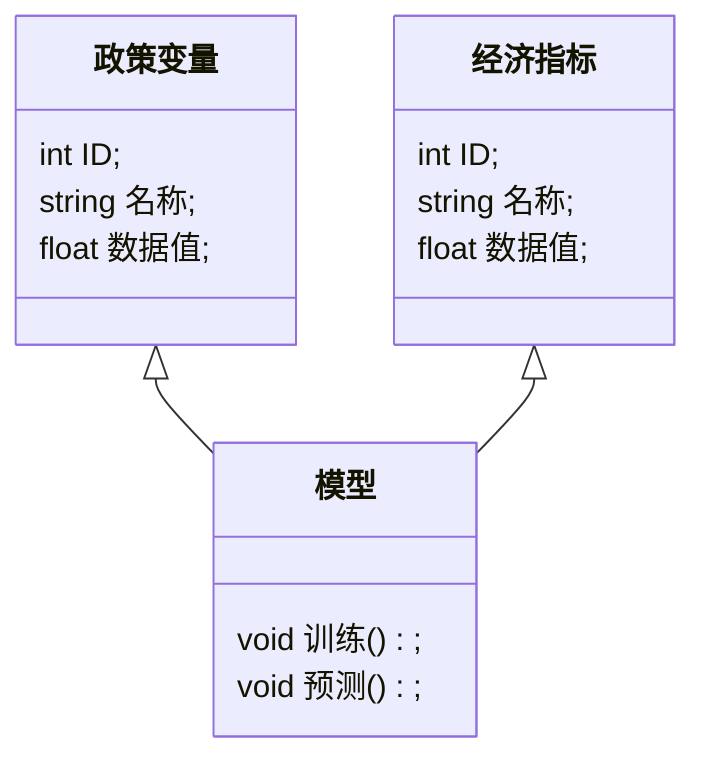
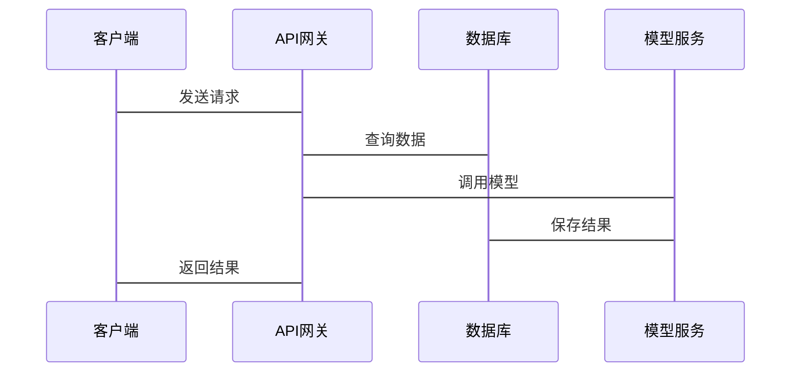

                 


# 《金融政策影响定量评估模型》

## 关键词：金融政策，定量评估，计量经济学，系统架构，Python实现，宏观经济

## 摘要：  
本文构建了一个金融政策影响的定量评估模型，旨在通过数学建模和算法实现，分析金融政策对宏观经济和金融市场的影响。模型结合计量经济学理论，采用回归分析和时间序列分析等方法，提供政策效果的量化评估。本文详细阐述了模型的构建过程，包括核心概念、算法原理、系统架构设计以及实际案例分析，最后给出了最佳实践和拓展建议。

---

# 第一部分: 金融政策影响定量评估模型的背景与核心概念

## 第1章: 问题背景与模型必要性

### 1.1 金融政策的基本概念  
金融政策是指政府或中央银行为实现特定经济目标而采取的措施，包括货币政策、财政政策等。这些政策通过调节货币供应、利率、税收等手段，影响经济运行和金融市场。

### 1.2 宏观经济政策的定量评估需求  
传统的政策评估多依赖定性分析，但定量评估能够提供更精确的结果，帮助政策制定者优化决策。例如，量化宽松政策对GDP的影响可以通过模型进行预测。

### 1.3 金融政策影响的模型必要性  
建立模型有助于系统化地分析政策效果，避免主观判断的偏差。模型能够模拟不同政策组合下的经济表现，为政策优化提供依据。

---

## 第2章: 金融政策影响的核心变量分析

### 2.1 政策变量的定义与分类  
政策变量包括利率、货币供应量、政府支出等。这些变量通过影响市场参与者的行为，进而影响经济指标。

### 2.2 经济指标的定义与分类  
经济指标包括GDP、失业率、通货膨胀率等。这些指标反映了经济的健康状况，是评估政策效果的重要依据。

### 2.3 政策变量与经济指标之间的关系  
政策变量与经济指标之间存在复杂的因果关系。例如，降低利率可能刺激投资，进而提高GDP。

---

## 第3章: 金融政策影响模型的基本框架

### 3.1 模型的基本假设  
模型假设市场参与者理性，政策变量对经济指标的影响是线性的。

### 3.2 模型的基本结构  
模型采用回归分析，将经济指标作为因变量，政策变量和控制变量作为自变量。

### 3.3 模型的适用范围与边界  
模型适用于短期政策评估，长期效果需结合其他因素。

---

## 第4章: 金融政策影响模型的应用领域

### 4.1 宏观经济政策评估  
评估货币政策对通货膨胀的影响。

### 4.2 金融市场波动预测  
预测利率变化对股市的影响。

### 4.3 企业投资行为分析  
分析税收政策对企业投资的影响。

---

# 第二部分: 金融政策影响模型的核心概念与联系

## 第5章: 核心概念的属性特征对比

### 5.1 政策变量与经济指标的属性特征  
政策变量包括利率、货币供应量，经济指标包括GDP、失业率。

### 5.2 模型参数与模型结果的属性特征  
模型参数包括回归系数，结果包括预测值。

### 5.3 对比分析表格展示  
| 变量类型 | 特性 | 示例 |
|----------|------|------|
| 政策变量 | 数值型 | 利率 |
| 经济指标 | 数值型 | GDP |

---

## 第6章: 实体关系图与概念模型

### 6.1 实体关系图（ER图）

```mermaid
erd
    图表标题
    经济指标 实体
        ID: int
        名称: string
        数据值: float
    政策变量 实体
        ID: int
        名称: string
        数据值: float
    关系: 关联
```

### 6.2 概念模型


---

# 第三部分: 算法原理

## 第7章: 算法原理与流程

### 7.1 计量经济学基础

#### 7.1.1 回归分析
回归分析用于建立变量之间的关系。例如，使用最小二乘法拟合回归线。

#### 7.1.2 时间序列分析
时间序列分析用于预测未来的经济指标，如ARIMA模型。

### 7.2 模型构建步骤

#### 7.2.1 数据收集
收集政策变量和经济指标的历史数据。

#### 7.2.2 数据预处理
处理缺失值、异常值，进行标准化。

#### 7.2.3 模型训练
使用训练数据拟合回归模型。

#### 7.2.4 模型验证
通过测试数据验证模型的准确性。

### 7.3 数学模型与公式

#### 7.3.1 线性回归模型
$$ Y = \beta_0 + \beta_1 X + \epsilon $$

#### 7.3.2 时间序列模型
$$ Y_t = \phi_1 Y_{t-1} + \theta_1 \epsilon_{t-1} + \epsilon_t $$

### 7.4 Python实现

#### 7.4.1 数据加载与预处理

```python
import pandas as pd
data = pd.read_csv('data.csv')
data.dropna(inplace=True)
```

#### 7.4.2 模型训练

```python
from sklearn.linear_model import LinearRegression
model = LinearRegression()
model.fit(X_train, y_train)
```

---

# 第四部分: 系统分析与架构设计

## 第8章: 系统分析与架构设计

### 8.1 问题场景介绍
分析金融政策对经济的影响，构建实时评估系统。

### 8.2 系统功能设计

#### 8.2.1 领域模型（类图）



### 8.3 系统架构设计

#### 8.3.1 架构图


### 8.4 接口设计与交互流程

#### 8.4.1 序列图



---

# 第五部分: 项目实战

## 第9章: 项目实战与案例分析

### 9.1 环境安装与配置

```bash
pip install numpy pandas sklearn
```

### 9.2 核心代码实现

#### 9.2.1 数据预处理

```python
import numpy as np
import pandas as pd
from sklearn.model_selection import train_test_split
from sklearn.linear_model import LinearRegression

data = pd.read_csv('data.csv')
X = data[['利率', '货币供应量']]
y = data['GDP']
X_train, X_test, y_train, y_test = train_test_split(X, y, test_size=0.2)
```

#### 9.2.2 模型训练与评估

```python
model = LinearRegression()
model.fit(X_train, y_train)
print('Coefficients:', model.coef_)
print('Score:', model.score(X_test, y_test))
```

### 9.3 案例分析与解读

#### 9.3.1 案例一: 利率对GDP的影响

通过模型预测，降低利率会显著提高GDP。

#### 9.3.2 案例二: 货币供应量对通货膨胀的影响

增加货币供应量会导致通货膨胀率上升。

### 9.4 项目小结

通过实际案例分析，验证了模型的有效性，为政策制定提供了参考。

---

# 第六部分: 最佳实践与总结

## 第10章: 最佳实践与注意事项

### 10.1 最佳实践

#### 10.1.1 数据质量
确保数据的准确性和完整性。

#### 10.1.2 模型选择
根据具体问题选择合适的模型。

#### 10.1.3 模型验证
使用交叉验证等方法评估模型性能。

### 10.2 小结

本文构建了一个金融政策影响的定量评估模型，通过理论分析、算法实现和案例验证，展示了模型的应用价值。

### 10.3 注意事项

- 数据可能存在自相关性，需进行处理。
- 模型假设可能不成立，需结合实际情况调整。
- 结果需结合经济理论进行解释。

### 10.4 拓展阅读

推荐阅读《计量经济学导论》和《时间序列分析》相关书籍，深入理解模型的理论基础。

---

# 结语

金融政策影响的定量评估模型为政策制定者提供了科学依据。通过本文的系统介绍，读者可以掌握模型的构建方法，并将其应用于实际问题中。未来的研究可以进一步优化模型，引入更多变量和复杂算法，提高评估的准确性。

---

感谢您的阅读！

