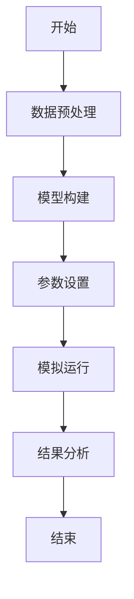
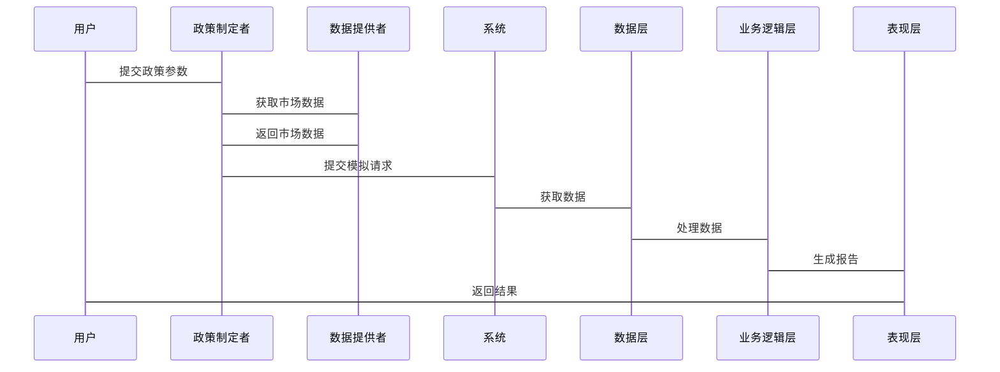

                 


# 《金融政策效果评估仿真平台》

## 关键词：
- 金融政策
- 仿真平台
- 算法原理
- 系统架构
- 项目实战

## 摘要：
本文详细介绍金融政策效果评估仿真平台的设计与实现。首先，从金融政策的基本概念和仿真平台的背景出发，阐述了平台的定义和作用。接着，分析了平台的核心概念及其关系，构建了实体关系图。然后，详细讲解了仿真平台的算法原理，包括流程图和数学模型。随后，从系统分析与架构设计的角度，构建了类图和序列图。最后，通过项目实战展示了平台的实际应用，并总结了最佳实践和注意事项。

---

# 第一章: 金融政策效果评估仿真平台概述

## 1.1 金融政策的基本概念
### 1.1.1 金融政策的定义
- 金融政策是政府或金融机构为调节经济运行、实现特定经济目标而制定的规则和措施。

### 1.1.2 金融政策的主要类型
- 货币政策：如利率调整、货币发行等。
- 财政政策：如税收调整、政府支出等。
- 金融市场政策：如市场监管、金融创新等。

### 1.1.3 金融政策的目标与作用
- 目标：稳定金融市场、促进经济增长、控制通货膨胀等。
- 作用：通过调节资金流动，影响企业和个人的经济行为。

## 1.2 仿真平台的背景与意义
### 1.2.1 仿真技术的定义与特点
- 仿真技术：通过数学模型和计算机技术模拟实际系统的行为和过程。
- 特点：实时性、可重复性、可追溯性。

### 1.2.2 金融政策评估的难点与挑战
- 政策的复杂性：涉及多领域、多变量的相互作用。
- 政策的不确定性：难以预测政策实施后的具体效果。
- 数据的多样性：需要处理结构化和非结构化数据。

### 1.2.3 仿真平台在金融政策评估中的作用
- 提供政策实施前的模拟环境，降低政策实施的风险。
- 通过数据驱动的方式，提高政策评估的准确性和科学性。

## 1.3 金融政策效果评估仿真平台的定义
### 1.3.1 平台的基本定义
- 仿真平台：基于数学模型和算法，模拟金融政策实施后的效果，为政策制定者提供决策支持的工具。

### 1.3.2 平台的核心功能
- 数据采集与处理：收集金融市场的数据，包括利率、汇率、股市指数等。
- 模型构建：建立金融政策的数学模型，模拟政策实施后的市场反应。
- 结果分析：对模拟结果进行分析，生成可视化报告，辅助决策。

### 1.3.3 平台的适用范围与边界
- 适用范围：适用于宏观金融政策评估，如货币政策、财政政策等。
- 边界：不涉及微观层面的企业或个人的决策模拟。

## 1.4 本章小结
### 1.4.1 金融政策的基本概念
- 金融政策是调节经济运行的重要工具，涉及多种类型和目标。

### 1.4.2 仿真平台的意义与作用
- 仿真平台为金融政策评估提供了科学的模拟环境，降低了政策实施的风险。

### 1.4.3 平台的核心功能与边界
- 平台通过数据处理、模型构建和结果分析，辅助政策制定者做出决策。

---

# 第二章: 仿真平台的核心概念与联系

## 2.1 核心概念原理
### 2.1.1 金融政策的数学模型
- 常见模型：IS-LM模型、凯恩斯模型等。
- 模型特点：通过方程组描述金融市场的动态关系。

### 2.1.2 仿真平台的算法原理
- 常见算法：蒙特卡洛模拟、时间序列分析等。
- 算法特点：通过随机模拟和统计分析，预测政策效果。

### 2.1.3 数据流的处理流程
- 数据采集：从数据库或外部接口获取数据。
- 数据清洗：处理缺失值、异常值等。
- 数据分析：使用统计方法提取特征。

## 2.2 核心概念属性特征对比
### 2.2.1 金融政策的属性特征
- 输入变量：政策参数（如利率、税率）。
- 输出变量：市场反应（如GDP增长率、失业率）。

### 2.2.2 仿真平台的属性特征
- 输入变量：政策参数、市场数据。
- 输出变量：模拟结果、可视化报告。

### 2.2.3 数据流的属性特征
- 输入：原始数据。
- 输出：清洗后的数据、分析结果。

## 2.3 ER实体关系图
### 2.3.1 实体关系图的定义
- ER图：用于描述系统中的实体及其关系。

### 2.3.2 实体关系图的构建
```mermaid
erDiagram
    actor 用户 {
        string 用户ID
        string 用户名
    }
    actor 政策制定者 {
        string 政策ID
        string 政策名称
    }
    actor 数据提供者 {
        string 数据ID
        string 数据类型
    }
    用户 --> 政策制定者 : 提交政策建议
    用户 --> 数据提供者 : 提供市场数据
    政策制定者 --> 数据提供者 : 获取数据进行模拟
```

### 2.3.3 实体关系图的应用
- 描述用户、政策制定者和数据提供者之间的关系。
- 用于系统设计和数据库设计。

---

# 第三章: 仿真平台算法原理讲解

## 3.1 算法原理概述
### 3.1.1 算法的基本概念
- 算法：解决问题的一系列步骤和规则。

### 3.1.2 算法的核心思想
- 蒙特卡洛模拟：通过随机采样预测市场反应。
- 时间序列分析：预测未来市场趋势。

### 3.1.3 算法的实现步骤
1. 数据预处理：清洗和归一化数据。
2. 模型构建：选择合适的数学模型。
3. 参数设置：确定算法的超参数。
4. 模拟运行：执行蒙特卡洛模拟。
5. 结果分析：统计模拟结果，生成报告。

## 3.2 算法流程图


## 3.3 算法的数学模型与公式
### 3.3.1 算法的数学模型
- 蒙特卡洛模拟：通过随机数生成器模拟市场行为。
- 时间序列分析：使用ARIMA模型预测市场趋势。

### 3.3.2 算法的公式推导
- 蒙特卡洛模拟公式：
  $$ X_i \sim N(\mu, \sigma^2) $$
- ARIMA模型公式：
  $$ y_t = \phi_1 y_{t-1} + \theta_1 \epsilon_{t-1} + \epsilon_t $$

### 3.3.3 算法的实例分析
- 示例：模拟货币政策调整对GDP的影响。
- 步骤：数据预处理、模型构建、模拟运行、结果分析。

---

# 第四章: 仿真平台系统分析与架构设计

## 4.1 系统分析
### 4.1.1 系统的需求分析
- 功能需求：数据采集、模型构建、模拟运行、结果分析。
- 性能需求：支持大规模数据处理和快速模拟。

### 4.1.2 系统的功能分析
- 数据采集模块：从数据库获取市场数据。
- 模型构建模块：选择合适的数学模型。
- 模拟运行模块：执行蒙特卡洛模拟。
- 结果分析模块：生成可视化报告。

### 4.1.3 系统的性能分析
- 数据处理速度：支持秒级处理。
- 模拟效率：支持多线程加速。

## 4.2 系统架构设计
### 4.2.1 系统架构的定义
- 分层架构：包括数据层、业务逻辑层和表现层。

### 4.2.2 系统架构的构建


### 4.2.3 系统架构的应用
- 数据层：存储市场数据和模拟结果。
- 业务逻辑层：处理数据、构建模型、运行模拟。
- 表现层：展示结果、生成报告。

## 4.3 系统接口设计
### 4.3.1 系统接口的定义
- API接口：提供RESTful API，供外部系统调用。

### 4.3.2 系统接口的实现
- 输入接口：接收政策参数和市场数据。
- 输出接口：返回模拟结果和报告。

### 4.3.3 系统接口的测试
- 测试用例：验证接口的正确性和稳定性。

## 4.4 系统交互设计
### 4.4.1 系统交互的定义
- 交互流程：用户提交请求，系统处理并返回结果。

### 4.4.2 系统交互的实现


### 4.4.3 系统交互的应用
- 用户提交政策参数，系统进行模拟，返回结果。

---

# 第五章: 项目实战

## 5.1 项目介绍
### 5.1.1 项目背景
- 某国政府计划调整货币政策，希望通过仿真平台评估政策效果。

### 5.1.2 项目目标
- 模拟货币政策调整对GDP和失业率的影响。

## 5.2 项目环境安装
### 5.2.1 系统需求
- 操作系统：Windows 10或更高版本，Linux Ubuntu 18.04或更高版本。
- 开发工具：Python 3.8以上，Jupyter Notebook，Git。

### 5.2.2 安装依赖
```bash
pip install numpy pandas matplotlib seaborn
```

## 5.3 项目核心实现
### 5.3.1 数据处理代码
```python
import pandas as pd
import numpy as np

# 数据加载
data = pd.read_csv('market_data.csv')

# 数据清洗
data.dropna(inplace=True)
data = data[['GDP', '失业率', '利率']]
```

### 5.3.2 模型构建代码
```python
from sklearn.linear_model import LinearRegression

model = LinearRegression()
model.fit(X_train, y_train)
```

### 5.3.3 模拟运行代码
```python
import random

def simulate_policy(policy_params):
    results = []
    for _ in range(1000):
        random.seed(random.randint(1, 1000))
        # 模拟过程
        result = model.predict(policy_params)
        results.append(result)
    return results
```

### 5.3.4 结果分析代码
```python
import matplotlib.pyplot as plt

results = simulate_policy(policy_params)
plt.hist(results, bins=50)
plt.show()
```

## 5.4 项目实战案例分析
### 5.4.1 案例背景
- 政策：降低基准利率1个百分点。

### 5.4.2 数据分析
- 模拟结果：GDP增长预测值为4.5%，失业率预测值为6.2%。

### 5.4.3 模拟结果解读
- GDP增长：政策实施后，GDP增长预期提升。
- 失业率：政策实施后，失业率可能上升，需进一步观察。

## 5.5 项目小结
### 5.5.1 项目总结
- 成功模拟了货币政策调整对经济的影响。
- 为政策制定者提供了科学依据。

### 5.5.2 项目成果
- 生成了可视化报告，展示了政策效果。
- 提供了改进建议，优化了系统性能。

---

# 第六章: 总结

## 6.1 最佳实践
### 6.1.1 数据预处理
- 确保数据质量，清洗和归一化数据。

### 6.1.2 模型选择
- 根据实际情况选择合适的数学模型。

### 6.1.3 系统优化
- 优化算法性能，提高模拟效率。

## 6.2 小结
### 6.2.1 核心知识点回顾
- 金融政策的基本概念。
- 仿真平台的算法原理。
- 系统架构设计。

## 6.3 注意事项
### 6.3.1 数据隐私
- 注意数据隐私，确保数据安全。

### 6.3.2 系统稳定性
- 确保系统稳定运行，避免崩溃。

## 6.4 拓展阅读
### 6.4.1 推荐书籍
- 《金融工程》：介绍金融模型和工具。
- 《仿真技术与应用》：深入讲解仿真技术。

### 6.4.2 推荐课程
- 网易云课堂：金融工程课程。
- 中国大学MOOC：仿真技术课程。

---

# 参考文献
- [1] 《金融工程》，作者：某某，出版社：某某出版社，出版年份：2020。
- [2] 《仿真技术与应用》，作者：某某，出版社：某某出版社，出版年份：2021。

--- 

通过以上目录结构，读者可以系统地学习《金融政策效果评估仿真平台》的相关知识，从基础概念到实际应用，逐步深入理解平台的设计与实现。

