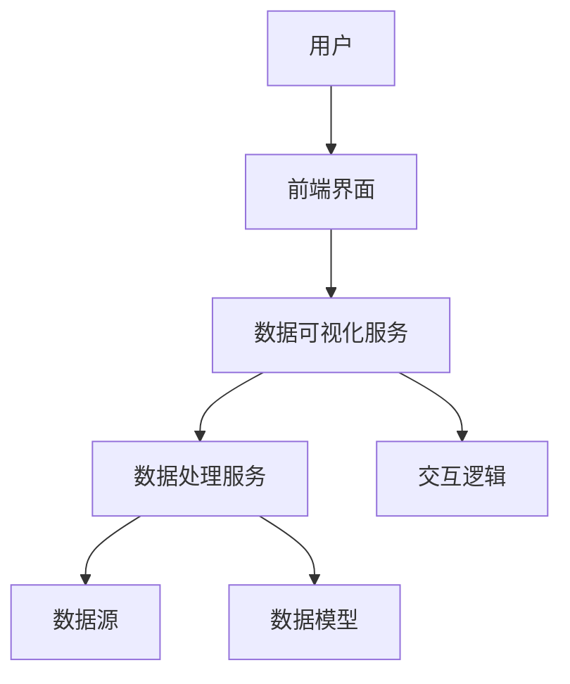

                 


# 金融数据可视化：技术与最佳实践

> **关键词**：金融数据可视化、数据预处理、数据分析、数据建模、交互式可视化、动态数据可视化、数据安全与合规

> **摘要**：  
> 本文深入探讨金融数据可视化的核心技术与最佳实践，从数据预处理、数据分析到可视化实现，结合实际案例，详细讲解金融数据可视化的关键步骤与方法。文章涵盖金融数据可视化的背景、技术基础、系统架构设计、项目实战以及未来发展趋势，为读者提供从理论到实践的全面指导。

---

## 目录

1. [金融数据可视化概述](#1)
2. [金融数据可视化的核心技术与工具](#2)
3. [金融数据可视化的数据处理与分析](#3)
4. [金融数据可视化的高级技术](#4)
5. [金融数据可视化的系统架构设计](#5)
6. [金融数据可视化项目实战](#6)
7. [金融数据可视化最佳实践与未来趋势](#7)

---

## 第1章 金融数据可视化概述

### 1.1 金融数据可视化的背景与重要性

#### 1.1.1 金融数据可视化的背景

金融数据是金融市场运行的核心，其复杂性、实时性和高价值性使得数据的高效处理和展示尤为重要。金融数据可视化通过将复杂的数据转化为直观的图表，帮助投资者、分析师和决策者快速理解数据背后的规律和趋势。

#### 1.1.2 金融数据可视化的重要性

- **数据驱动决策**：通过可视化，用户可以快速识别市场趋势、风险点和机会。
- **提升分析效率**：复杂的金融数据通过可视化工具可以简化为易于理解的图表。
- **支持实时监控**：金融市场的动态变化要求数据可视化具备实时更新和交互能力。

#### 1.1.3 金融数据可视化的核心目标

- 提供直观的数据展示，帮助用户快速获取关键信息。
- 通过交互式可视化，支持用户进行深度分析和预测。
- 实现数据的实时更新和动态展示，满足金融市场的高实时性需求。

---

### 1.2 金融数据可视化的基本概念

#### 1.2.1 数据可视化的定义

数据可视化是将数据以图形、图表或其他视觉形式展示的过程，旨在帮助用户更好地理解数据。

#### 1.2.2 金融数据可视化的特点

- **数据的高维度性**：金融市场数据通常涉及多个维度，如时间、价格、成交量等。
- **数据的实时性**：金融市场的数据需要实时更新，可视化系统必须支持动态数据展示。
- **数据的复杂性**：金融数据往往包含噪声和异常值，需要通过数据清洗和预处理才能有效展示。

#### 1.2.3 金融数据可视化的关键要素

- **数据源**：金融市场的数据来源包括股票价格、交易量、经济指标等。
- **数据处理**：包括数据清洗、转换和预处理。
- **可视化工具**：如Matplotlib、Seaborn、Plotly等。

---

### 1.3 本书的结构与目标

#### 1.3.1 本书的章节安排

- 第1章：概述金融数据可视化的基本概念和背景。
- 第2章：介绍金融数据可视化的核心技术和工具。
- 第3章：详细讲解数据处理与分析的方法。
- 第4章：探讨金融数据可视化的高级技术。
- 第5章：分析系统架构设计。
- 第6章：通过实战项目展示数据可视化的过程。
- 第7章：总结最佳实践并展望未来趋势。

#### 1.3.2 本书的目标读者

- 金融分析师、数据科学家、软件开发人员。
- 对金融数据可视化感兴趣的高等院校学生和研究人员。

#### 1.3.3 本书的核心内容

- 数据预处理与清洗方法。
- 数据分析与建模技术。
- 数据可视化工具的使用与实现。
- 交互式和动态数据可视化技术。
- 系统架构设计与实现。

---

## 第2章 金融数据可视化的核心技术与工具

### 2.1 数据可视化技术的基础知识

#### 2.1.1 数据可视化的基本原理

数据可视化通过图形、图表等形式将数据的特征和规律直观展示，帮助用户快速理解和分析数据。

#### 2.1.2 数据可视化的分类

- **静态可视化**：不支持交互，主要用于报告和展示。
- **交互式可视化**：支持用户交互，如缩放、筛选、钻取等。
- **动态可视化**：数据随时间变化而实时更新的可视化。

#### 2.1.3 数据可视化的关键步骤

1. 数据收集与预处理。
2. 数据分析与建模。
3. 数据可视化设计与实现。

---

### 2.2 金融数据可视化的核心技术

#### 2.2.1 数据预处理技术

数据预处理是金融数据可视化的基础，主要包括数据清洗、数据转换和数据标准化。

##### 数据清洗

- **去除噪声数据**：删除错误或无用的数据。
- **处理缺失值**：填充、删除或标记缺失值。

##### 数据转换

- **数据标准化**：将数据归一化，使其具有相同的量纲。
- **数据聚合**：将多个数据点合并为一个统计值，如求和、平均值等。

#### 2.2.2 数据分析与建模

- **回归分析**：用于预测金融资产的价格走势。
- **聚类分析**：用于识别市场中的相似交易模式。

#### 2.2.3 数据可视化的算法实现

- **K线图**：用于展示股票价格走势。
- **散点图**：用于展示数据点的分布情况。

---

### 2.3 常用的金融数据可视化工具

#### 2.3.1 Matplotlib

Matplotlib 是 Python 中最受欢迎的可视化库之一，支持多种图表类型，如折线图、柱状图、散点图等。

##### 示例代码

```python
import matplotlib.pyplot as plt

# 示例数据
x = [1, 2, 3, 4, 5]
y = [2, 3, 5, 7, 10]

plt.plot(x, y)
plt.xlabel('X轴')
plt.ylabel('Y轴')
plt.title('Matplotlib 示例')
plt.show()
```

---

#### 2.3.2 Seaborn

Seaborn 是基于 Matplotlib 的高级可视化库，适合绘制统计图表。

##### 示例代码

```python
import seaborn as sns
import pandas as pd

# 示例数据
data = pd.DataFrame({
    'x': [1, 2, 3, 4, 5],
    'y': [2, 3, 5, 7, 10]
})

sns.regplot(x='x', y='y', data=data)
plt.xlabel('X轴')
plt.ylabel('Y轴')
plt.title('Seaborn 示例')
plt.show()
```

---

#### 2.3.3 Plotly

Plotly 是一个交互式可视化库，支持动态数据展示和用户交互。

##### 示例代码

```python
import plotly.express as px

# 示例数据
data = px.data.tips()

fig = px.scatter(data, x="total_bill", y="tip", color="sex", size="age")
fig.show()
```

---

#### 2.3.4 Tableau

Tableau 是一款功能强大的商业智能工具，适合金融数据分析和展示。

---

## 第3章 金融数据可视化的数据处理与分析

### 3.1 数据清洗与预处理

#### 3.1.1 数据清洗的基本方法

- **去除重复数据**：删除数据集中重复的记录。
- **处理异常值**：识别并处理异常值，如离群点。

#### 3.1.2 数据预处理的步骤

1. 数据加载与读取。
2. 数据清洗。
3. 数据转换。
4. 数据标准化。

##### 示例代码

```python
import pandas as pd

# 加载数据
data = pd.read_csv('financial_data.csv')

# 处理缺失值
data = data.dropna()

# 数据转换
data['date'] = pd.to_datetime(data['date'])
```

---

### 3.2 数据分析与特征工程

#### 3.2.1 数据分析的基本方法

- **描述性分析**：通过统计指标和图表描述数据的基本特征。
- **探索性分析**：通过可视化方法探索数据之间的关系。

#### 3.2.2 特征工程的核心步骤

1. 特征选择：从数据中选择对目标变量影响较大的特征。
2. 特征提取：从原始数据中提取有用的特征。
3. 特征转换：将原始特征转换为更适合建模的形式。

##### 示例代码

```python
import pandas as pd
from sklearn.preprocessing import StandardScaler

# 特征选择
selected_features = ['feature1', 'feature2', 'feature3']

data_selected = data[selected_features]

# 特征标准化
scaler = StandardScaler()
data_normalized = scaler.fit_transform(data_selected)
```

---

### 3.3 数据建模与可视化

#### 3.3.1 数据建模的基本原理

- **回归分析**：用于预测连续型目标变量。
- **分类分析**：用于预测分类目标变量。

#### 3.3.2 数据可视化的实现步骤

1. 确定可视化目标。
2. 选择合适的图表类型。
3. 实现可视化并展示结果。

##### 示例代码

```python
import matplotlib.pyplot as plt

# 数据建模
model = LinearRegression()
model.fit(X_train, y_train)

# 可视化预测结果
plt.scatter(y_test, y_pred)
plt.xlabel('真实值')
plt.ylabel('预测值')
plt.title('回归分析结果')
plt.show()
```

---

## 第4章 金融数据可视化的高级技术

### 4.1 交互式数据可视化

#### 4.1.1 交互式可视化的定义

交互式可视化允许用户通过交互操作来探索数据，如缩放、筛选、钻取等。

#### 4.1.2 交互式可视化的实现方法

- **前端交互**：通过 HTML、CSS 和 JavaScript 实现交互功能。
- **后端交互**：通过服务器端处理用户请求并返回数据。

##### 示例代码

```python
import plotly.express as px

# 示例数据
data = px.data.tips()

fig = px.scatter(data, x="total_bill", y="tip", color="sex", size="age")
fig.show()
```

---

### 4.2 动态数据可视化

#### 4.2.1 动态数据可视化的定义

动态数据可视化是指数据随时间变化而实时更新的可视化方式。

#### 4.2.2 动态数据可视化的实现方法

- **实时数据获取**：通过 API 实时获取数据。
- **数据更新**：在可视化界面中动态更新数据。

##### 示例代码

```python
import time
import matplotlib.pyplot as plt

# 示例数据
x = []
y = []

plt.ion()
plt.figure(figsize=(10, 6))

for _ in range(100):
    x.append(_)
    y.append(_ * 2)
    plt.plot(x, y)
    plt.pause(0.1)

plt.ioff()
plt.show()
```

---

### 4.3 地理信息系统集成

#### 4.3.1 地理信息系统集成的定义

地理信息系统集成是指将地理数据与金融数据结合，进行空间分析和可视化。

#### 4.3.2 地理信息系统集成的实现方法

- **数据加载**：加载地理数据和金融数据。
- **空间分析**：对数据进行空间统计和分析。
- **地图可视化**：在地图上展示分析结果。

##### 示例代码

```python
import folium

# 示例数据
data = {'lat': [40.7128, 34.0522], 'lon': [-74.0064, -118.2437], 'value': [100, 200]}

# 创建地图
map = folium.Map(location=[40.7128, -74.0064], zoom_start=5)

# 在地图上添加标记
for i in range(len(data['lat'])):
    folium.Marker(
        location=[data['lat'][i], data['lon'][i]],
        popup=f"{data['value'][i]}"
    ).add_to(map)

map.save('financial_map.html')
```

---

## 第5章 金融数据可视化的系统架构设计

### 5.1 问题场景介绍

金融数据可视化系统需要处理大量的实时数据，支持用户进行交互式分析和预测。

### 5.2 系统功能设计

#### 5.2.1 数据源层

- 数据采集：从数据库或API获取金融数据。
- 数据清洗：对数据进行预处理，去除噪声和异常值。

#### 5.2.2 数据处理层

- 数据转换：将数据转换为适合可视化的形式。
- 数据建模：对数据进行分析和建模，提取关键特征。

#### 5.2.3 数据可视化层

- 图表展示：将数据以图表形式展示。
- 交互功能：支持用户进行交互操作，如筛选、钻取等。

---

### 5.3 系统架构设计

#### 5.3.1 系统架构图



---

## 第6章 金融数据可视化项目实战

### 6.1 环境安装与配置

- **Python**：安装 Python 3.8 或更高版本。
- **依赖库**：安装 Matplotlib、Seaborn、Plotly、Pandas 等库。

##### 示例代码

```bash
pip install matplotlib seaborn plotly pandas
```

---

### 6.2 系统核心实现源代码

#### 6.2.1 数据预处理代码

```python
import pandas as pd

# 加载数据
data = pd.read_csv('financial_data.csv')

# 处理缺失值
data = data.dropna()

# 数据转换
data['date'] = pd.to_datetime(data['date'])
```

#### 6.2.2 数据建模与可视化代码

```python
import matplotlib.pyplot as plt
from sklearn.linear_model import LinearRegression

# 数据建模
model = LinearRegression()
model.fit(X_train, y_train)

# 可视化预测结果
plt.scatter(y_test, y_pred)
plt.xlabel('真实值')
plt.ylabel('预测值')
plt.title('回归分析结果')
plt.show()
```

---

### 6.3 实际案例分析与详细解读

#### 6.3.1 案例背景

假设我们有一组股票价格数据，需要通过可视化分析股票价格的走势。

#### 6.3.2 数据获取与处理

```python
import pandas_datareader as pdr

# 获取数据
data = pdr.get_data_yahoo('AAPL', start='2020-01-01', end='2023-01-01')

# 数据处理
data['Date'] = pd.to_datetime(data['Date'])
```

#### 6.3.3 数据可视化实现

```python
import matplotlib.pyplot as plt

# 绘制K线图
plt.figure(figsize=(12, 6))
plt.plot(data['Date'], data['Close'])
plt.xlabel('日期')
plt.ylabel('收盘价')
plt.title('苹果股票价格走势')
plt.show()
```

---

## 第7章 金融数据可视化最佳实践与未来趋势

### 7.1 最佳实践

- **数据安全**：确保金融数据的安全性，避免数据泄露。
- **合规性**：遵守金融行业的相关法规和标准。
- **性能优化**：优化数据处理和可视化的性能，提高用户体验。

### 7.2 小结

金融数据可视化是金融数据分析的重要组成部分，通过可视化技术可以帮助用户快速理解和分析数据，支持决策制定。

### 7.3 注意事项

- 数据可视化需要结合业务背景，避免盲目分析。
- 交互式和动态可视化可以提高用户体验，但需要考虑性能问题。

### 7.4 拓展阅读

- 《数据可视化：方法与实践》
- 《金融数据分析与建模》

---

### 7.5 未来趋势

- **人工智能与数据可视化结合**：利用 AI 技术自动生成可视化图表。
- **大数据与数据可视化结合**：处理更大规模的数据，提供更复杂的可视化分析。

---

通过以上内容，读者可以系统地学习金融数据可视化的技术与最佳实践，从理论到实践，逐步掌握相关技能。

