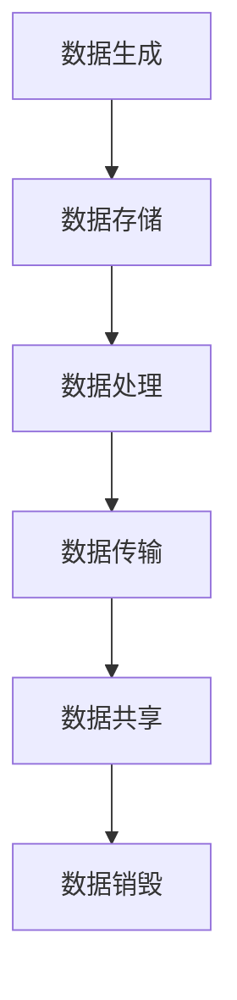

                 


# 《金融数据隐私保护增强技术》

> 关键词：金融数据隐私保护，数据加密，隐私计算，数据脱敏，数据安全，隐私保护技术

> 摘要：本文深入探讨了金融数据隐私保护的增强技术，从背景分析、核心概念、技术实现、系统架构设计到项目实战，结合具体案例，详细讲解了如何通过加密技术、隐私计算框架、数据脱敏等手段，实现金融数据的安全存储与传输，保护用户隐私。文章内容丰富，涵盖了从理论到实践的各个方面，帮助读者全面理解和掌握金融数据隐私保护的核心技术。

---

# 第一部分: 金融数据隐私保护增强技术背景介绍

## 第1章: 金融数据隐私保护概述

### 1.1 问题背景与问题描述

#### 1.1.1 金融数据隐私保护的重要性

金融数据是现代社会的核心资产之一，涉及个人隐私、企业机密以及国家金融安全。随着数字化转型的加速，金融数据的收集、存储和处理变得更加频繁，同时也面临更高的安全风险。金融数据的泄露可能导致严重的经济损失、身份盗窃、信用诈骗等问题，甚至可能引发系统性金融风险。因此，保护金融数据的隐私和安全已成为金融机构和监管部门的首要任务。

#### 1.1.2 当前金融数据隐私保护的主要问题

1. **数据泄露风险**：金融机构在处理大量用户数据时，可能因为系统漏洞、内部人员疏忽或外部攻击而面临数据泄露的风险。
2. **数据滥用**：未经授权的人员可能利用数据进行非法活动，例如身份盗用、欺诈交易等。
3. **数据跨境传输**：在全球化背景下，金融数据可能需要跨境传输，这涉及到不同国家的法律法规和技术标准，增加了数据保护的复杂性。
4. **技术与法规的双重挑战**：金融数据隐私保护不仅需要先进的技术手段，还需要符合严格的法律法规，如《通用数据保护条例》（GDPR）和《数据安全法》等。

#### 1.1.3 问题解决的必要性与紧迫性

金融机构需要采取多种技术手段和管理措施，确保金融数据在生命周期中的安全性。通过增强数据隐私保护技术，金融机构可以有效降低数据泄露风险，保障用户隐私，维护金融系统的稳定和信任。

---

### 1.2 金融数据隐私保护的核心概念

#### 1.2.1 数据分类与分级

数据分类是指根据数据的类型、用途和敏感程度，将数据划分为不同的类别。例如，个人身份信息（PII）如姓名、地址、身份证号等属于高度敏感数据，而交易记录和账单信息则属于中度敏感数据。数据分级是根据数据的重要性、敏感性和影响程度，将其划分为不同的安全级别，例如 confidential（机密）、private（私密）和 public（公开）。

#### 1.2.2 隐私保护的基本原则

隐私保护的基本原则包括：

1. **最小化原则**：仅收集和处理必要的数据。
2. **目的限制原则**：数据的使用必须符合收集时的目的。
3. **同意与透明原则**：用户需要明确同意数据的收集和使用，并有权了解数据的处理方式。
4. **安全保护原则**：确保数据在存储和传输过程中的安全性。

#### 1.2.3 数据生命周期中的隐私保护

数据生命周期包括数据生成、存储、处理、传输、共享和销毁等阶段。在每个阶段，都需要采取相应的隐私保护措施：

- **生成阶段**：确保数据的合法性收集，避免未经授权的数据获取。
- **存储阶段**：使用加密技术保护数据，确保存储介质的安全。
- **处理阶段**：通过数据脱敏技术隐藏敏感信息，避免直接暴露真实数据。
- **传输阶段**：使用加密协议确保数据在传输过程中的安全性。
- **共享阶段**：采用匿名化或伪匿名化技术，确保数据共享的安全性。
- **销毁阶段**：彻底删除数据，防止数据被恢复或滥用。

---

### 1.3 问题的边界与外延

#### 1.3.1 金融数据隐私保护的边界

金融数据隐私保护的边界主要涉及以下几个方面：

1. **数据范围**：仅针对金融相关的数据，如账户信息、交易记录、信用评分等，不涉及其他领域数据。
2. **数据主体**：主要保护个人用户和企业的金融数据隐私，不包括政府机构和公共机构的数据。
3. **技术手段**：主要通过技术手段实现数据的加密、脱敏和访问控制，不涉及法律合规层面的措施。

#### 1.3.2 相关概念的对比与区分

| 概念           | 描述                                                                 |
|----------------|----------------------------------------------------------------------|
| 数据隐私       | 数据的私密性，确保未经授权的人员无法访问或使用数据。                 |
| 数据安全       | 数据的机密性、完整性和可用性，确保数据在存储和传输过程中的安全。   |
| 数据脱敏       | 通过技术手段隐藏或变形敏感数据，使其在不泄露真实信息的情况下可用。 |
| 数据加密       | 使用加密算法对数据进行加密，确保数据在传输和存储中的安全性。       |

#### 1.3.3 核心要素与组成部分

- **数据分类与分级**：确定数据的重要性和敏感程度。
- **数据加密技术**：保护数据在存储和传输中的安全性。
- **数据脱敏技术**：隐藏敏感信息，降低数据泄露风险。
- **访问控制**：限制未经授权的人员访问数据。
- **隐私计算**：在保护数据隐私的前提下，进行数据处理和分析。

---

## 第2章: 核心概念与联系

### 2.1 数据隐私保护的核心原理

#### 2.1.1 数据加密与解密的基本原理

数据加密是通过将明文转换为密文，确保数据在存储和传输过程中的安全性。加密过程需要使用密钥和加密算法，常见的加密算法包括对称加密（如AES）和非对称加密（如RSA）。解密则是将密文还原为明文的过程，通常需要使用对应的密钥。

#### 2.1.2 数据脱敏技术的实现机制

数据脱敏技术通过对敏感数据进行变形、替换或隐藏，使其在不泄露真实信息的前提下可用。例如，使用数据替换技术将真实姓名替换为虚拟名称，或者使用数据屏蔽技术隐藏部分数据（如将身份证号的中间部分替换为星号）。

#### 2.1.3 数据访问控制的实现原理

数据访问控制通过权限管理、身份验证和授权机制，确保只有授权人员才能访问数据。例如，使用基于角色的访问控制（RBAC）模型，根据用户的角色和权限，限制其对数据的访问范围。

---

### 2.2 核心概念的属性特征对比

| 概念           | 属性特征                                                                 |
|----------------|--------------------------------------------------------------------------|
| 数据分类       | 数据类型、数据用途、数据敏感程度                                         |
| 数据脱敏       | 数据变形、数据匿名化、数据屏蔽                                           |
| 数据加密       | 加密算法、密钥管理、加密模式                                             |
| 数据访问控制   | 权限管理、身份验证、授权机制                                             |

---

### 2.3 数据生命周期的概念图



---

## 第3章: 数据加密与解密技术

### 3.1 数据加密技术

#### 3.1.1 对称加密算法

对称加密算法是一种加密方式，使用相同的密钥进行加密和解密。常见的对称加密算法包括AES（高级加密标准）和DES（数据加密标准）。

##### AES加密算法的工作流程

1. **明文准备**：将明文填充为固定长度的块。
2. **初始轮密钥加**：将初始轮密钥与明文块进行异或操作。
3. **多轮加密**：对明文块进行多轮的线性变换和非线性变换。
4. **密文输出**：输出加密后的密文块。

##### AES加密算法的代码实现

```python
from cryptography.hazmat.primitives.ciphers import Cipher, algorithms, modes
from cryptography.hazmat.primitives.asymmetric import padding
import os

# 生成随机密钥
key = os.urandom(16)  # AES-128

# 定义加密函数
def aes_encrypt(plaintext, key):
    cipher = Cipher(algorithms.AES(key), modes.ECB())
    encryptor = cipher.encryptor()
    return encryptor.update(plaintext) + encryptor.finalize()

# 示例
plaintext = b"Sensitive financial data"
encrypted = aes_encrypt(plaintext, key)
print("Encrypted:", encrypted)

# 解密
decryptor = cipher.decryptor()
decrypted = decryptor.update(encrypted) + decryptor.finalize()
print("Decrypted:", decrypted.decode())
```

#### 3.1.2 非对称加密算法

非对称加密算法使用公钥和私钥进行加密和解密。常见的非对称加密算法包括RSA和椭圆曲线加密（ECC）。

##### RSA加密算法的工作流程

1. **生成密钥对**：生成公钥和私钥。
2. **加密**：使用公钥对明文进行加密。
3. **解密**：使用私钥对密文进行解密。

##### RSA加密算法的代码实现

```python
from cryptography.hazmat.primitives.asymmetric import rsa
from cryptography.hazmat.primitives import serialization

# 生成RSA密钥对
key = rsa.generate_private_key(
    public_exponent=65537,
    key_size=2048,
)
public_key = key.public_key().serialize_in_pem().decode()
private_key = key.private_bytes(serialization.Encoding.PKCS8, serialization.PasswordBasedEncryption.AES128, b"test").decode()

# 示例
message = b"Private financial information"
encrypted_message = key.public_key().encrypt(message, padding.PKCSv1_5())
print("Encrypted:", encrypted_message)

# 解密
decrypted_message = key.decrypt(encrypted_message, padding.PKCSv1_5())
print("Decrypted:", decrypted_message.decode())
```

---

## 第4章: 隐私计算技术

### 4.1 隐私计算的基本概念

隐私计算是一种在保护数据隐私的前提下，进行数据处理和分析的技术。常见的隐私计算技术包括：

1. **联邦学习**：在不共享原始数据的情况下，通过加密通信进行模型训练。
2. **秘密分享**：将数据分割成多个部分，每个部分都不包含完整的数据，但可以通过组合恢复数据。

---

### 4.2 隐私计算框架

#### 4.2.1 联邦学习框架

联邦学习是一种分布式机器学习技术，通过在不同设备或机构之间协作训练模型，而不共享数据。联邦学习框架的核心流程包括：

1. **数据准备**：将数据分割成多个部分，每个部分保存在不同的设备上。
2. **模型初始化**：在中央服务器上初始化模型参数。
3. **本地训练**：每个设备在本地数据上训练模型，并将模型更新发送到中央服务器。
4. **模型聚合**：中央服务器将所有设备的模型更新进行聚合，生成新的全局模型。
5. **模型分发**：将新的全局模型分发给所有设备。

#### 4.2.2 秘密分享框架

秘密分享是一种通过将数据分割成多个秘密份额，确保只有在特定条件下才能恢复原始数据的技术。秘密分享的核心流程包括：

1. **数据分割**：将原始数据分割成多个秘密份额，每个份额都不包含完整的数据。
2. **份额传输**：将秘密份额分发给不同的设备或机构。
3. **份额组合**：通过组合秘密份额，恢复原始数据。

---

### 4.3 隐私计算框架的代码实现

#### 联邦学习框架的代码实现

```python
import numpy as np
from sklearn.linear_model import LinearRegression

# 模拟数据分割
data = np.random.rand(100, 2)
labels = np.random.randint(2, size=100)

# 分割数据
client1_data = data[:50]
client1_labels = labels[:50]
client2_data = data[50:]
client2_labels = labels[50:]

# 客户端1训练
model_client1 = LinearRegression()
model_client1.fit(client1_data, client1_labels)

# 客户端2训练
model_client2 = LinearRegression()
model_client2.fit(client2_data, client2_labels)

# 模型聚合
global_model = (model_client1.coef_ + model_client2.coef_) / 2
global_intercept = (model_client1.intercept_ + model_client2.intercept_) / 2

# 全局模型
global_model = LinearRegression()
global_model.coef_ = global_model
global_model.intercept_ = global_intercept
```

---

### 4.4 隐私计算的数学模型

#### 联邦学习的数学模型

假设我们有 $n$ 个客户端，每个客户端有 $m_i$ 个样本，特征维度为 $d$。全局模型的参数为 $\theta$，每个客户端的模型参数为 $\theta_i$。联邦学习的目标是通过聚合各个客户端的模型参数，得到全局模型参数 $\theta_{\text{global}}$：

$$
\theta_{\text{global}} = \frac{1}{n} \sum_{i=1}^{n} \theta_i
$$

---

## 第5章: 数据脱敏技术

### 5.1 数据脱敏技术的实现方法

数据脱敏技术通过对敏感数据进行变形、替换或隐藏，使其在不泄露真实信息的前提下可用。常见的数据脱敏技术包括：

1. **数据替换**：将敏感字段替换为虚拟值，例如将真实姓名替换为虚拟名称。
2. **数据变形**：通过对数据进行加密、哈希或模糊处理，使其无法被还原为真实数据。
3. **数据屏蔽**：隐藏部分数据，例如将身份证号的中间部分替换为星号。

---

### 5.2 数据脱敏技术的代码实现

#### 数据屏蔽技术的代码实现

```python
def data_masking(data, mask_char='*', mask_start=5, mask_end=-5):
    return data[:mask_start] + mask_char * (len(data[

