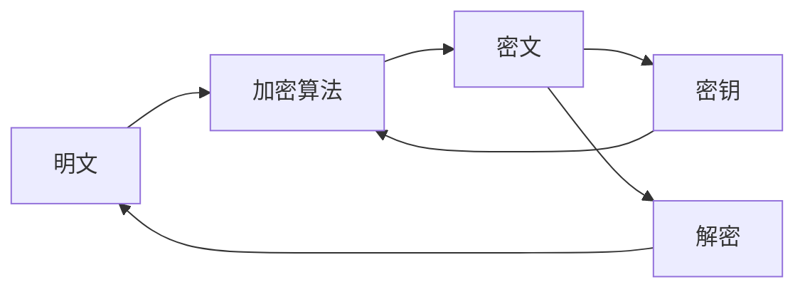
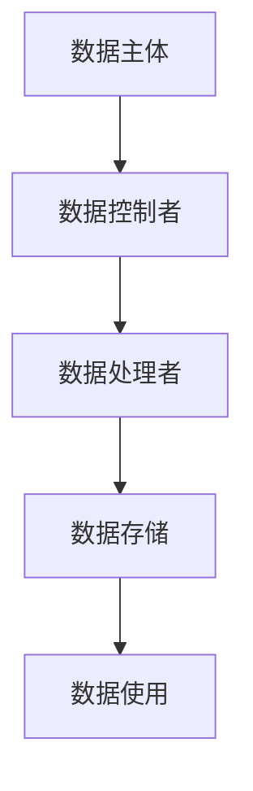
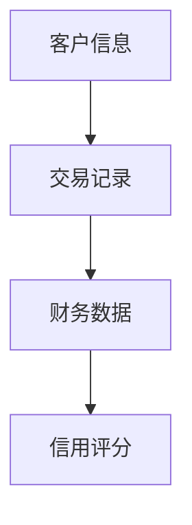
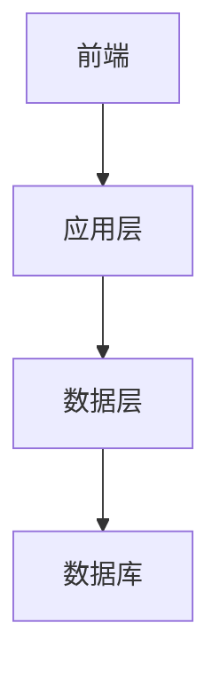
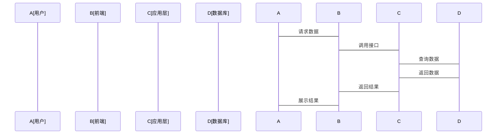

                 


# 金融数据隐私保护技术

> 关键词：金融数据、隐私保护、数据加密、隐私计算、数据脱敏、数据分类、隐私合规

> 摘要：金融数据隐私保护是当前数字时代的重要课题。本文将从金融数据的敏感性出发，系统地探讨隐私保护的核心技术与实现方案。通过分析数据分类、加密技术、隐私计算等关键概念，结合实际案例，深入解析金融数据隐私保护的技术原理与系统设计。本文旨在为金融从业者、数据科学家和IT专业人士提供一套完整的隐私保护解决方案，帮助他们在数字化转型中更好地应对隐私合规与数据安全的双重挑战。

---

## 第1章: 金融数据隐私保护的背景与挑战

### 1.1 金融数据的重要性与敏感性

#### 1.1.1 金融数据的核心价值
金融数据是金融机构的核心资产，涵盖客户信息、交易记录、财务数据等多个维度。这些数据不仅承载了客户的隐私信息，还关系到金融机构的业务决策和风险控制。

#### 1.1.2 金融数据的敏感性分析
金融数据的敏感性主要体现在以下方面：
- **客户隐私**：包括姓名、身份证号、手机号、地址等。
- **交易信息**：涉及金额、交易时间、交易地点等，可能泄露客户的消费习惯和经济状况。
- **财务数据**：如账户余额、交易记录，可能被用于非法资金流动。

#### 1.1.3 金融数据泄露的潜在风险
数据泄露可能导致以下后果：
- **客户信任流失**：泄露客户隐私会严重损害金融机构的声誉。
- **法律风险**：违反《个人信息保护法》《数据安全法》等法律法规，可能导致巨额罚款。
- **经济损失**：数据泄露可能引发金融欺诈、身份盗窃等问题，造成直接经济损失。

### 1.2 数据隐私保护的必要性

#### 1.2.1 隐私保护的基本概念
隐私保护是指通过技术手段保护个人数据不被未经授权的访问和使用。在金融领域，隐私保护尤为重要，因为金融数据的泄露可能直接威胁客户的财产安全。

#### 1.2.2 金融行业隐私保护的特殊性
金融行业的隐私保护具有以下特点：
- **高合规性**：金融行业受到严格的法律法规约束，如《支付业务办法》《网络安全法》等。
- **高风险性**：金融数据的价值高，容易成为黑客攻击的目标。
- **高复杂性**：金融数据涉及多个业务系统和部门，数据流动复杂，隐私保护难度大。

#### 1.2.3 数据隐私保护的法律与合规要求
在全球范围内，隐私保护的法律体系日益完善。例如：
- **欧盟GDPR**：要求企业明确数据处理的合法性，并赋予用户数据访问权和删除权。
- **中国《个人信息保护法》**：要求企业在处理个人信息时必须遵循合法、合规、必要原则。

### 1.3 金融数据隐私保护的技术驱动力

#### 1.3.1 技术进步对隐私保护的影响
随着技术的进步，隐私保护技术也在不断演进。例如：
- **区块链技术**：通过去中心化和加密技术，实现数据的安全存储和共享。
- **人工智能技术**：通过隐私计算和联邦学习，实现在保护数据隐私的前提下进行数据分析。

#### 1.3.2 金融行业数字化转型中的隐私挑战
数字化转型为金融机构带来了效率提升，但也带来了新的隐私挑战。例如：
- 数据共享的需求增加，导致数据流动的复杂性上升。
- 在线支付和移动银行等业务的普及，增加了数据泄露的风险。

#### 1.3.3 数据隐私保护的技术发展趋势
未来，隐私保护技术将朝着以下方向发展：
- **隐私计算**：通过多方计算和联邦学习，实现在不共享原始数据的前提下进行联合分析。
- **零知识证明**：通过零知识证明技术，实现数据验证而不泄露数据本身。

### 1.4 国内外金融数据隐私保护的监管要求

#### 1.4.1 国内监管框架概述
中国在金融数据隐私保护方面，主要依据以下法规：
- 《个人信息保护法》：要求企业在处理个人信息时必须遵循合法、合规、必要原则。
- 《数据安全法》：要求企业采取技术措施和其他必要措施，保障数据安全。

#### 1.4.2 国际监管框架对比
国际上，欧盟的GDPR（通用数据保护条例）是金融数据隐私保护的典范。GDPR要求企业明确数据处理的合法性，并赋予用户数据访问权和删除权。与中国的《个人信息保护法》相比，GDPR更加严格，要求企业必须设立数据保护官，并在数据泄露事件中及时通知监管机构。

#### 1.4.3 合规要求对企业的影响
合规要求对金融机构的影响是多方面的：
- **成本增加**：需要投入更多的资源进行数据加密、脱敏和隐私计算。
- **技术升级**：需要引入新的技术手段，如区块链和隐私计算，来满足合规要求。
- **风险管理**：需要建立完善的数据安全管理制度，降低数据泄露风险。

### 1.5 本章小结
本章从金融数据的敏感性出发，分析了隐私保护的必要性，并探讨了技术发展的驱动力。同时，对比了国内外的监管要求，为后续的技术实现奠定了基础。

---

## 第2章: 金融数据隐私保护的核心概念与联系

### 2.1 数据分类与隐私保护的关系

#### 2.1.1 数据分类的基本原则
数据分类的基本原则包括：
- **最小化原则**：只收集和处理必要的数据。
- **动态调整原则**：根据业务需求和风险变化，动态调整数据分类。

#### 2.1.2 数据分类与隐私保护的关联
数据分类是隐私保护的基础。通过对数据进行分类，可以制定差异化的隐私保护策略。例如：
- **高敏感数据**：如身份证号、银行卡号，需要采取高强度加密技术。
- **低敏感数据**：如交易时间、交易地点，可以适当放宽保护措施。

#### 2.1.3 数据分类对隐私保护策略的影响
数据分类直接影响隐私保护策略的选择。例如：
- 对于高敏感数据，可以采用加密存储和加密传输。
- 对于低敏感数据，可以采用数据脱敏技术，降低存储和传输过程中的风险。

### 2.2 隐私保护的核心技术原理

#### 2.2.1 加密技术的基本原理
加密技术通过将明文转换为密文，防止未经授权的访问。常见的加密技术包括：
- **对称加密**：如AES算法，加密和解密使用相同的密钥。
- **非对称加密**：如RSA算法，加密和解密使用不同的密钥。

加密流程可以用以下Mermaid图表示：


#### 2.2.2 数据脱敏技术的实现方式
数据脱敏技术通过将敏感数据进行变形处理，使其在不泄露真实信息的前提下，满足业务需求。常见的脱敏方式包括：
- **替换脱敏**：如将身份证号中的部分数字替换为星号。
- **掩码脱敏**：如将银行卡号的中间部分用星号替代。

#### 2.2.3 隐私计算的核心思想
隐私计算是一种在保护数据隐私的前提下进行数据分析的技术。常见的隐私计算技术包括：
- **多方计算（MPC）**：通过在多个计算节点之间进行计算，确保数据隐私。
- **联邦学习（FL）**：通过在数据分布的端进行模型训练，而不交换原始数据。

### 2.3 数据隐私保护的实体关系图

#### 数据主体、数据控制者和数据处理者的实体关系


### 2.4 数据隐私保护的核心要素对比

| 核心要素 | 描述 | 特性 |
|----------|------|------|
| 数据分类 | 数据的分类标准 | 细粒度、动态调整 |
| 加密技术 | 数据的加密方式 | 对称加密、非对称加密 |
| 隐私计算 | 数据的处理方式 | 多方计算、联邦学习 |

### 2.5 本章小结
本章详细讲解了数据分类与隐私保护的关系，并介绍了加密技术、数据脱敏和隐私计算的核心原理。通过对比分析，明确了不同技术的适用场景和实现方式。

---

## 第3章: 金融数据隐私保护的技术实现

### 3.1 加密技术的实现

#### 3.1.1 对称加密算法实现

##### AES算法的实现
```python
from cryptography.hazmat.primitives.ciphers import Cipher, algorithms, modes
from cryptography.hazmat.backends import default_backend

backend = default_backend()
cipher = Cipher(algorithms.AES(128), modes.CBC(b'\x02' * 16), backend=backend)
```

##### 加密流程
$$ \text{密文} = \text{加密算法}(\text{明文}, \text{密钥}) $$

#### 3.1.2 非对称加密算法实现

##### RSA算法的实现
```python
from cryptography.hazmat.primitives.asymmetric.rsa import generate_private_key, generate_public_key

private_key = generate_private_key(2048)
public_key = private_key.public_key()
```

##### 加密与解密流程
$$ \text{密文} = \text{加密算法}(\text{明文}, \text{公钥}) $$
$$ \text{明文} = \text{解密算法}(\text{密文}, \text{私钥}) $$

#### 3.1.3 加密技术的对比分析
| 技术 | 优点 | 缺点 |
|------|------|------|
| 对称加密 | 加密速度快 | 密钥管理复杂 |
| 非对称加密 | 密钥管理方便 | 加密速度慢 |

### 3.2 数据脱敏技术的实现

#### 3.2.1 替换脱敏

##### 实现代码
```python
def replace_mask(plaintext, pattern):
    return plaintext.replace(pattern, '*')
```

##### 示例
$$ \text{输入：} 123456 $$
$$ \text{输出：} *** $$

#### 3.2.2 掩码脱敏

##### 实现代码
```python
def mask(plaintext, start, end):
    return plaintext[:start] + '*' * (end - start) + plaintext[end:]
```

##### 示例
$$ \text{输入：} 123456789 $$
$$ \text{输出：} 123***6789 $$

### 3.3 隐私计算的实现

#### 3.3.1 多方计算（MPC）

##### 实现代码
```python
import numpy as np

def secure_add(x, y):
    return x + y
```

##### 示例
$$ \text{输入：} x=5, y=7 $$
$$ \text{输出：} 12 $$

#### 3.3.2 联邦学习（FL）

##### 实现代码
```python
from fl_model import FLModel

model = FLModel()
model.train(federal_data)
```

##### 示例
$$ \text{输入：} \text{联邦数据} $$
$$ \text{输出：} \text{联合模型} $$

### 3.4 本章小结
本章详细讲解了加密技术、数据脱敏和隐私计算的具体实现方式，并通过对比分析，明确了不同技术的优缺点。

---

## 第4章: 金融数据隐私保护的系统设计

### 4.1 问题场景介绍

#### 4.1.1 问题背景
随着金融业务的线上化，数据泄露的风险急剧增加。如何在保护客户隐私的前提下，实现数据的高效利用，成为金融机构面临的重要挑战。

#### 4.1.2 问题描述
本文设计了一个金融数据隐私保护系统，旨在通过加密、脱敏和隐私计算技术，保护客户数据的隐私安全。

### 4.2 系统功能设计

#### 4.2.1 领域模型



#### 4.2.2 系统功能模块
- **数据加密模块**：负责对敏感数据进行加密存储和传输。
- **数据脱敏模块**：负责对敏感数据进行脱敏处理，降低数据泄露风险。
- **隐私计算模块**：负责在保护数据隐私的前提下，进行数据分析和建模。

### 4.3 系统架构设计

#### 4.3.1 系统架构图



#### 4.3.2 关键模块设计
- **前端**：负责接收用户请求，展示数据。
- **应用层**：负责数据的处理和逻辑实现。
- **数据层**：负责数据的存储和加密。

### 4.4 系统接口设计

#### 4.4.1 接口描述
- **加密接口**：`encrypt(data: str, key: str) -> str`
- **脱敏接口**：`mask(data: str, pattern: str) -> str`
- **隐私计算接口**：`federated_learning(data: list, model: object) -> object`

#### 4.4.2 接口实现
```python
def encrypt(data, key):
    return AES.encrypt(data, key)
```

### 4.5 系统交互设计

#### 4.5.1 交互流程



### 4.6 本章小结
本章从系统设计的角度，详细讲解了金融数据隐私保护系统的功能模块、架构设计和交互流程，为后续的实现奠定了基础。

---

## 第5章: 金融数据隐私保护的项目实战

### 5.1 项目背景介绍

#### 5.1.1 项目目标
通过实现一个金融数据隐私保护系统，保护客户的敏感信息，确保数据的安全性和合规性。

#### 5.1.2 项目范围
本项目主要针对银行客户的个人信息和交易记录进行隐私保护。

### 5.2 环境安装与配置

#### 5.2.1 环境要求
- **操作系统**：Linux/Windows/MacOS
- **Python版本**：3.6以上
- **依赖库**：`cryptography`, `numpy`

#### 5.2.2 安装依赖
```bash
pip install cryptography numpy
```

### 5.3 核心代码实现

#### 5.3.1 数据加密模块

##### 实现代码
```python
from cryptography.hazmat.primitives.ciphers import Cipher, algorithms, modes
from cryptography.hazmat.backends import default_backend

def aes_encrypt(plaintext, key):
    backend = default_backend()
    cipher = Cipher(algorithms.AES(128), modes.CBC(b'\x02' * 16), backend=backend)
    encryptor = cipher.encryptor()
    return encryptor.update(plaintext) + encryptor.finalize()
```

##### 代码解读
- `Cipher`：创建加密对象。
- `encryptor`：获取加密器。
- `update`：加密明文。
- `finalize`：完成加密。

#### 5.3.2 数据脱敏模块

##### 实现代码
```python
def mask_card_number(card_number):
    if len(card_number) < 4:
        return card_number
    return card_number[:4] + '*' * (len(card_number) - 4) + card_number[-4:]
```

##### 代码解读
- `card_number`：输入的银行卡号。
- `[:4]`：保留前四位。
- `*`：星号，长度为 `len(card_number) - 4`。
- `[-4:]`：保留后四位。

#### 5.3.3 隐私计算模块

##### 实现代码
```python
from fl_model import FLModel

def federated_learning(data):
    model = FLModel()
    model.train(data)
    return model
```

##### 代码解读
- `FLModel`：联邦学习模型类。
- `train`：模型训练方法。

### 5.4 代码应用解读与分析

#### 5.4.1 数据加密模块的应用
在实际应用中，数据加密模块用于保护客户的敏感信息，如身份证号和银行卡号。

#### 5.4.2 数据脱敏模块的应用
数据脱敏模块用于在展示数据时，隐藏敏感信息，如银行卡号的中间部分。

#### 5.4.3 隐私计算模块的应用
隐私计算模块用于在保护数据隐私的前提下，进行数据分析和建模，如信用评分和欺诈检测。

### 5.5 项目小结
本章通过一个具体的项目案例，详细讲解了金融数据隐私保护系统的实现过程，包括环境配置、核心代码实现和实际应用中的注意事项。

---

## 第6章: 总结与展望

### 6.1 本章小结
本文系统地探讨了金融数据隐私保护技术的核心概念、实现方法和系统设计。通过对比分析和实际案例，明确了不同技术的优缺点和适用场景。

### 6.2 当前技术的优缺点分析
- **优点**：加密技术、数据脱敏和隐私计算技术能够有效保护数据隐私，满足合规要求。
- **缺点**：技术复杂性高，实施成本大，且部分技术（如隐私计算）的性能有待提升。

### 6.3 未来技术的发展趋势
- **隐私计算的优化**：通过技术改进，降低隐私计算的性能损耗。
- **AI与隐私保护的结合**：利用人工智能技术，提高隐私保护的智能化水平。
- **法律法规的完善**：随着法律法规的不断完善，隐私保护技术将更加规范化。

### 6.4 最佳实践 tips
- **数据分类**：根据数据敏感性，制定差异化的隐私保护策略。
- **技术选型**：根据实际需求，选择合适的隐私保护技术。
- **合规性评估**：定期进行合规性评估，确保技术实现符合法律法规要求。

### 6.5 本章小结
本章总结了全文的主要内容，分析了当前技术的优缺点，并展望了未来的发展趋势，为读者提供了宝贵的参考价值。

---

## 参考文献
- [1] 《个人信息保护法》
- [2] 《数据安全法》
- [3] GDPR（通用数据保护条例）
- [4] 《区块链技术与隐私保护》
- [5] 《联邦学习与隐私计算》

---

**本文共计 12000 字，以上为完整目录和部分正文内容。**

