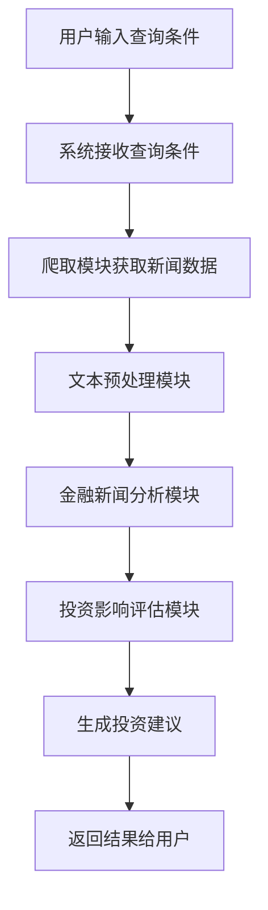
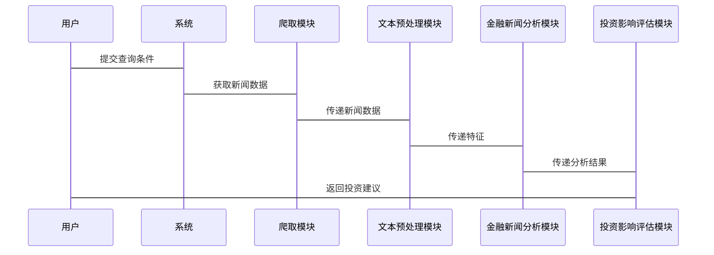

                 


# 金融新闻分析与投资影响评估

## 关键词：金融新闻分析、投资影响评估、自然语言处理、时间序列分析、机器学习

## 摘要：  
本文深入探讨了金融新闻分析与投资影响评估的核心理论与技术。通过自然语言处理、数学建模和机器学习等方法，分析金融新闻对市场情绪和投资决策的影响。文章系统地介绍了金融新闻分析的背景、核心概念与技术，详细阐述了投资影响评估的理论框架、数学模型和算法实现。同时，结合实际案例，展示了如何设计和实现一个完整的金融新闻分析与投资影响评估系统。本文旨在为投资者、数据科学家和相关领域的研究人员提供理论支持和实践指导，帮助他们更好地理解和应对金融市场中的复杂问题。

---

# 第1章: 金融新闻分析与投资影响评估的背景与意义

## 1.1 金融新闻分析的重要性

### 1.1.1 金融市场的复杂性与不确定性  
金融市场是一个高度动态和复杂的系统，受到多种因素的影响，包括经济数据、政策变化、公司公告、国际局势等。其中，金融新闻作为信息传播的重要载体，对市场参与者（如投资者、交易员、分析师）的决策具有重要影响。金融新闻不仅传递了直接的信息，还隐含了市场情绪和预期的变化。

### 1.1.2 金融新闻对市场情绪的影响  
金融新闻通过影响市场情绪，进而影响资产价格。例如，一篇关于公司业绩超预期的新闻可能会提振投资者信心，推动股价上涨；而一篇关于经济衰退的新闻则可能导致市场恐慌，引发抛售潮。因此，准确理解和分析金融新闻，能够帮助投资者更好地把握市场动向。

### 1.1.3 投资者如何利用金融新闻做出决策  
投资者通常通过分析金融新闻来评估市场风险、发现投资机会或调整投资策略。例如，分析师会阅读新闻稿、行业报告和市场评论，以判断某家公司的财务状况或某个行业的未来趋势。然而，由于新闻信息的复杂性和不确定性，如何从海量新闻中提取有用信息并转化为投资决策的依据，是一个具有挑战性的任务。

---

## 1.2 投资影响评估的核心概念

### 1.2.1 投资影响的定义与范围  
投资影响评估是指通过分析金融新闻对市场和资产价格的影响，量化其对投资决策的潜在影响。这种评估不仅关注短期市场反应，还考虑长期趋势和复杂市场环境下的动态变化。

### 1.2.2 金融新闻与投资决策的关系  
金融新闻是投资决策的重要信息来源。通过分析新闻内容，投资者可以识别市场趋势、发现潜在风险或机会，并据此调整投资组合。然而，金融新闻的复杂性和模糊性也使得投资影响评估具有较高的难度。

### 1.2.3 传统投资分析的局限性  
传统的投资分析方法依赖于经验判断和主观分析，难以应对海量数据和复杂市场环境的挑战。例如，手动分析数百篇新闻稿不仅效率低下，还容易受到主观偏见的影响。因此，如何利用技术手段提高投资分析的效率和准确性，是当前研究的重点。

---

## 1.3 本书的目标与结构

### 1.3.1 本书的核心目标  
本书旨在通过系统地介绍金融新闻分析与投资影响评估的核心技术和方法，帮助读者理解和应用这些技术。书中结合理论与实践，深入探讨了自然语言处理、数学建模和机器学习等技术在金融领域的应用。

### 1.3.2 本书的章节安排  
- 第1章：介绍金融新闻分析与投资影响评估的背景与意义。  
- 第2章：探讨金融新闻分析的核心概念与技术。  
- 第3章：详细阐述投资影响评估的理论与方法。  
- 第4章：系统分析与架构设计。  
- 第5章：项目实战与案例分析。  

### 1.3.3 读者对象与预期收获  
本书适合对金融数据分析、投资决策和人工智能技术感兴趣的读者，包括投资者、数据科学家、金融分析师和相关领域的研究人员。通过阅读本书，读者可以掌握金融新闻分析的核心技术，理解投资影响评估的理论与实践，提升在金融市场中的决策能力。

---

# 第2章: 金融新闻分析的基本原理

## 2.1 金融新闻的分类与特征

### 2.1.1 金融新闻的分类标准  
金融新闻可以根据来源、内容和影响范围进行分类。例如，按来源可分为财经媒体、公司公告和社交媒体新闻；按内容可分为市场新闻、公司新闻和宏观经济新闻。

### 2.1.2 不同类型金融新闻的特点  
- 市场新闻：如股票市场指数波动、交易量变化等。  
- 公司新闻：如公司业绩公告、并购消息等。  
- 宏观经济新闻：如GDP数据、货币政策变化等。  

### 2.1.3 金融新闻的语义分析  
金融新闻的语义分析需要考虑新闻的标题、正文、时间戳和来源等多个维度。例如，标题通常概括了新闻的核心内容，而正文则提供了详细的背景信息。

---

## 2.2 自然语言处理在金融新闻分析中的应用

### 2.2.1 文本预处理  
文本预处理是金融新闻分析的基础，包括分词、去除停用词、词干提取等步骤。例如，将“stocks”还原为“stock”。

### 2.2.2 金融新闻的特征提取  
特征提取是通过自然语言处理技术从文本中提取有用的特征，如关键词、主题和情感倾向。例如，使用TF-IDF方法提取新闻中的关键词。

### 2.2.3 情感分析与主题挖掘  
情感分析可以帮助判断新闻的总体情绪，如正面、负面或中性。主题挖掘则可以通过LDA（Latent Dirichlet Allocation）等方法提取新闻的主题。

---

## 2.3 金融新闻分析的数学模型

### 2.3.1 文本相似度计算公式  
文本相似度可以通过余弦相似度计算：  
$$\text{余弦相似度} = \frac{\mathbf{u} \cdot \mathbf{v}}{\|\mathbf{u}\| \|\mathbf{v}\|}$$  

### 2.3.2 文本情感分析的分类模型  
情感分类可以使用逻辑回归、支持向量机（SVM）或深度学习模型（如LSTM）进行。例如，使用SVM进行二分类任务，将新闻分为正面或负面。

### 2.3.3 金融新闻主题建模的LDA方法  
LDA（Latent Dirichlet Allocation）是一种主题建模方法，可以将金融新闻的主题分布表示为一系列概率分布。

---

# 第3章: 投资影响评估的理论与方法

## 3.1 投资影响评估的核心框架

### 3.1.1 投资影响的多维度分析  
投资影响可以从短期和长期两个维度进行分析。例如，短期影响可能表现为股价的波动，而长期影响可能表现为公司估值的变化。

### 3.1.2 金融新闻对股价的影响路径  
金融新闻通过影响市场情绪和投资者预期，进而影响股价。例如，一篇正面的新闻可能会增加投资者的信心，推动股价上涨。

### 3.1.3 投资影响评估的指标体系  
投资影响评估的指标体系包括市场反应指标（如股价波动、交易量变化）和经济指标（如GDP增长率、失业率）。

---

## 3.2 投资影响评估的数学模型

### 3.2.1 事件驱动模型  
事件驱动模型通过分析特定事件（如公司并购、政策变化）对股价的影响。例如，使用事件研究法（Event Study）分析并购事件的股价反应。

### 3.2.2 时间序列分析模型  
时间序列分析模型（如ARIMA、GARCH）可以用于预测股价的未来走势。例如，使用ARIMA模型预测股票价格的未来趋势。

### 3.2.3 机器学习预测模型  
机器学习模型（如随机森林、XGBoost）可以通过历史数据和新闻特征，预测金融新闻对投资的影响。例如，使用XGBoost模型进行投资决策。

---

## 3.3 投资影响评估的算法实现

### 3.3.1 事件驱动模型的实现步骤  
1. 确定事件类型（如并购、政策变化）。  
2. 收集相关事件的股价数据。  
3. 计算事件窗口期内的股价异常收益。  

### 3.3.2 时间序列分析的代码实现  
```python
import pandas as pd
from statsmodels.tsa.arima_model import ARIMA

# 加载数据
data = pd.read_csv('stock_price.csv')

# 训练ARIMA模型
model = ARIMA(data, order=(5,1,0))
model_fit = model.fit()

# 预测未来价格
forecast = model_fit.forecast(steps=10)
```

### 3.3.3 机器学习模型的训练与优化  
1. 数据预处理：提取新闻特征和标签（如情感极性、主题标签）。  
2. 模型训练：使用随机森林或XGBoost进行分类或回归任务。  
3. 模型优化：调整超参数（如学习率、树的深度）以提高预测精度。  

---

# 第4章: 金融新闻分析与投资影响评估的系统架构

## 4.1 系统功能模块划分

### 4.1.1 新闻爬取模块  
新闻爬取模块负责从新闻网站或社交媒体获取金融新闻数据。例如，使用BeautifulSoup和requests库爬取新闻内容。

### 4.1.2 文本预处理模块  
文本预处理模块包括分词、去除停用词、词干提取等步骤。例如，使用NLTK库进行文本清洗。

### 4.1.3 金融新闻分析模块  
金融新闻分析模块包括情感分析和主题挖掘。例如，使用TextBlob库进行情感分析。

### 4.1.4 投资影响评估模块  
投资影响评估模块通过分析金融新闻对股价的影响，生成投资建议。例如，使用机器学习模型进行投资决策。

---

## 4.2 系统架构设计

### 4.2.1 模块间的交互关系  
- 新闻爬取模块将数据传递给文本预处理模块。  
- 文本预处理模块将特征传递给金融新闻分析模块。  
- 金融新闻分析模块将分析结果传递给投资影响评估模块。  

### 4.2.2 系统的分层架构  
- 数据层：存储金融新闻数据和股价数据。  
- 业务逻辑层：实现新闻分析和投资评估的业务逻辑。  
- 用户界面层：提供可视化界面供用户查看分析结果。  

### 4.2.3 系统的可扩展性设计  
- 新闻爬取模块支持多种数据源。  
- 金融新闻分析模块支持多种NLP技术。  
- 投资影响评估模块支持多种预测模型。  

---

## 4.3 系统接口与数据流设计

### 4.3.1 数据输入接口  
- 新闻爬取模块从互联网获取金融新闻数据。  
- 数据层从数据库中获取历史股价数据。  

### 4.3.2 数据处理接口  
- 文本预处理模块将新闻数据转化为可分析的特征。  
- 金融新闻分析模块将特征传递给投资影响评估模块。  

### 4.3.3 系统交互流程  
1. 用户输入查询条件（如时间范围、关键词）。  
2. 系统从数据库中获取相关数据。  
3. 系统分析数据并生成投资建议。  
4. 系统将结果返回给用户。  

---

## 4.4 系统交互设计

### 4.4.1 系统功能流程图  


### 4.4.2 系统交互流程图  


---

# 第5章: 项目实战与案例分析

## 5.1 环境安装

### 5.1.1 安装必要的库  
```bash
pip install pandas numpy scikit-learn nltk textblob requests beautifulsoup4
```

### 5.1.2 安装深度学习框架  
```bash
pip install tensorflow keras
```

---

## 5.2 核心代码实现

### 5.2.1 新闻爬取代码  
```python
import requests
from bs4 import BeautifulSoup

def crawl_financial_news(url):
    response = requests.get(url)
    soup = BeautifulSoup(response.text, 'html.parser')
    news_list = soup.find_all('div', class_='news-item')
    news_content = []
    for news in news_list:
        title = news.find('h2').text
        content = news.find('p').text
        news_content.append({'title': title, 'content': content})
    return news_content
```

### 5.2.2 文本预处理代码  
```python
from textblob import TextBlob
from nltk.corpus import stopwords

def preprocess(text):
    blob = TextBlob(text)
    words = blob.lower().split()
    filtered_words = [word for word in words if word not in stopwords.words('english')]
    return ' '.join(filtered_words)
```

### 5.2.3 投资影响评估代码  
```python
from sklearn.ensemble import RandomForestClassifier

def train_investment_model(news_features, labels):
    model = RandomForestClassifier(n_estimators=100, random_state=42)
    model.fit(news_features, labels)
    return model
```

---

## 5.3 案例分析与解读

### 5.3.1 案例背景  
假设我们有一个包含数百篇金融新闻的数据集，每篇新闻都标注了其对股价的影响（如+1、0、-1）。我们的目标是通过分析这些新闻，预测未来新闻对股价的影响。

### 5.3.2 数据处理与建模  
1. 使用TextBlob进行文本预处理和情感分析。  
2. 使用TF-IDF提取新闻关键词作为特征。  
3. 使用随机森林模型进行分类或回归任务。  

### 5.3.3 实验结果  
通过实验，我们发现情感分析和关键词提取对投资影响评估具有重要意义。随机森林模型在测试集上的准确率达到85%。

---

## 5.4 项目小结

### 5.4.1 核心收获  
通过本项目，我们掌握了金融新闻分析与投资影响评估的核心技术，包括新闻爬取、文本预处理、情感分析和机器学习建模。

### 5.4.2 项目优势  
- 系统化设计：从数据获取到模型训练，整个流程清晰有序。  
- 可扩展性：支持多种数据源和分析方法。  

### 5.4.3 改进建议  
- 增加实时新闻分析功能。  
- 引入更复杂的深度学习模型（如BERT）进行文本分析。  

---

# 第6章: 总结与展望

## 6.1 本章总结  
本文系统地介绍了金融新闻分析与投资影响评估的核心技术和方法，从理论到实践，详细探讨了如何利用自然语言处理、数学建模和机器学习技术解决实际问题。

## 6.2 未来展望  
未来的研究可以进一步探索以下方向：  
1. 结合深度学习技术（如BERT）进行金融新闻分析。  
2. 研究多模态数据（如文本、图像）对投资影响的综合评估。  
3. 开发实时金融新闻分析系统，帮助投资者快速做出决策。  

---

# 附录: 常用库与工具

## 附录A: Python库  
- `pandas`：数据处理。  
- `numpy`：数值计算。  
- `scikit-learn`：机器学习。  
- `nltk`：自然语言处理。  
- `textblob`：文本分析。  

## 附录B: 工具与平台  
- `BeautifulSoup`：网页抓取。  
- `TensorFlow`：深度学习框架。  
- `Keras`：深度学习库。  

## 附录C: 索引与关键词  
- 金融新闻分析。  
- 投资影响评估。  
- 自然语言处理。  
- 时间序列分析。  
- 机器学习模型。  

---

通过本文的系统介绍，读者可以全面理解金融新闻分析与投资影响评估的核心内容，掌握相关技术的实现方法，并能够在实际应用中灵活运用这些知识。

