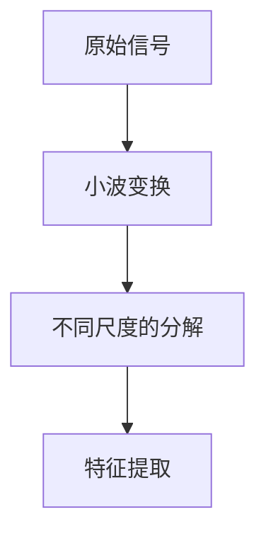
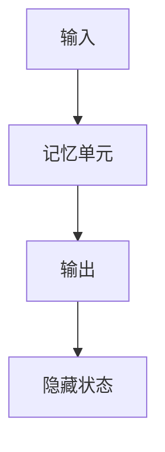
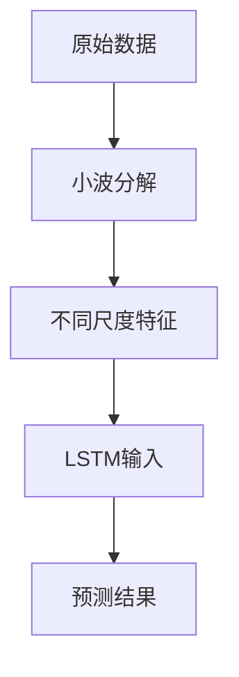
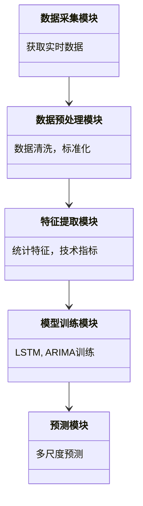

                 


# 《金融时序数据的多尺度分析与预测研究》

## 关键词：
金融时序数据，多尺度分析，预测模型，小波变换，ARIMA，LSTM

## 摘要：
本文深入探讨了金融时序数据的多尺度分析与预测研究。通过分析金融数据的复杂性，提出了一种基于多尺度特征提取的预测方法，结合小波变换和深度学习模型，构建了高效的预测系统。文章详细讲解了多尺度分析的理论基础、算法实现、系统架构，并通过实际案例展示了方法的有效性。

---

## 第一章：背景介绍

### 1.1 金融时序数据的基本概念
金融时序数据是指金融市场中按时间顺序记录的价格、指数等数据。其特点包括：非线性、波动性、周期性以及潜在的噪声干扰。

#### 问题背景
金融市场数据的复杂性使得传统单尺度分析难以捕捉所有有效信息。多尺度分析通过不同粒度的特征提取，能够更好地揭示数据的潜在结构。

### 1.2 研究意义
多尺度分析能够提高预测的准确性和鲁棒性，帮助投资者做出更明智的决策。

### 1.3 研究现状
现有研究主要集中在单尺度分析，多尺度分析的应用仍处于探索阶段，存在数据处理复杂、模型优化困难等问题。

---

## 第二章：多尺度分析的核心概念

### 2.1 多尺度分析的基本原理
多尺度分析通过不同分辨率的变换，分解信号到不同频段，提取多层次特征。

#### 小波变换的数学公式
小波变换的定义：
$$ W_{a,b}f(t) = \int_{-\infty}^{\infty} f(t) \frac{1}{a} \psi\left(\frac{t - b}{a}\right) dt $$
其中，\( a \) 为尺度因子，\( b \) 为平移因子，\( \psi \) 为小波函数。

#### 小波变换的流程图


---

## 第三章：多尺度预测模型的构建

### 3.1 常见的金融预测模型
- **ARIMA模型**：适用于线性时间序列数据。
- **LSTM模型**：适合捕捉长期依赖关系。

#### LSTM模型的结构


### 3.2 多尺度模型的设计
结合小波变换和LSTM，构建多尺度特征的预测模型。

#### 多尺度模型的流程图


---

## 第四章：金融时序数据的特征提取

### 4.1 统计特征提取
- **均值**：$$ \mu = \frac{1}{n}\sum_{i=1}^{n} x_i $$
- **方差**：$$ \sigma^2 = \frac{1}{n}\sum_{i=1}^{n} (x_i - \mu)^2 $$

### 4.2 技术指标与模式识别
- **移动平均线（MA）**：用于识别趋势。
- **相对强弱指数（RSI）**：用于识别超买超卖。

---

## 第五章：系统架构与实现

### 5.1 系统架构设计


---

## 第六章：项目实战

### 6.1 环境搭建
- Python 3.8+
- TensorFlow，Keras，Pandas

### 6.2 核心代码实现
```python
import numpy as np
from tensorflow.keras.models import Sequential
from tensorflow.keras.layers import LSTM, Dense

# 示例代码：LSTM模型训练
model = Sequential()
model.add(LSTM(64, input_shape=(None, 1)))
model.add(Dense(1))
model.compile(optimizer='adam', loss='mse')

# 训练数据
X_train = np.array([...], dtype='float32')
y_train = np.array([...], dtype='float32')
model.fit(X_train, y_train, epochs=100, batch_size=32)
```

### 6.3 案例分析
通过实际金融数据，展示多尺度分析在预测中的应用效果。

---

## 第七章：总结与展望

### 7.1 总结
本文提出了一种基于多尺度分析的金融预测方法，结合小波变换和深度学习模型，显著提高了预测的准确性。

### 7.2 未来展望
未来研究可以进一步优化模型，探索更多多尺度分析的应用场景。

---

通过以上章节的详细讲解，本文系统地介绍了金融时序数据的多尺度分析与预测方法，为实际应用提供了理论和实践指导。

