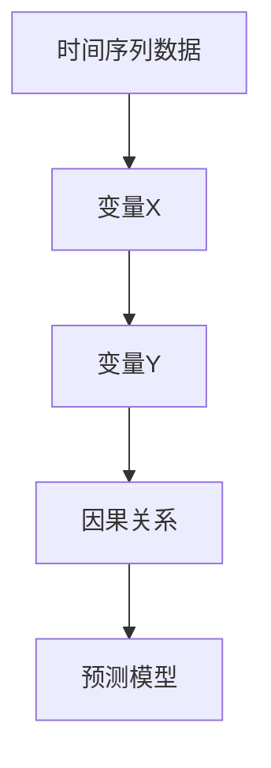
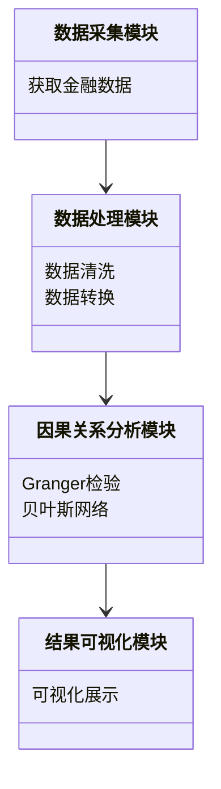
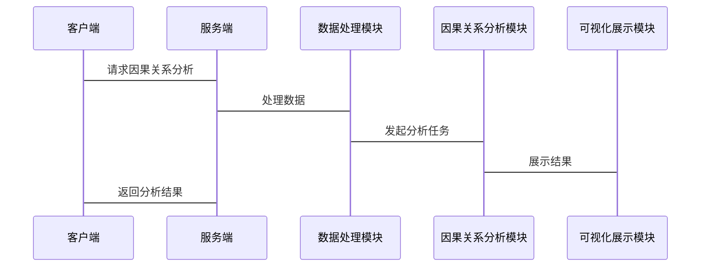

                 


# 《金融时序数据的多维度因果关系发现研究》

> 关键词：金融时序数据、因果关系发现、Granger因果检验、贝叶斯网络、潜在结果框架

> 摘要：本文深入探讨了金融时序数据中多维度因果关系的发现方法，从理论基础到实际应用，结合具体案例，分析了Granger因果检验、贝叶斯网络和潜在结果框架等算法的原理和实现。通过系统架构设计和项目实战，展示了如何在金融市场中有效提取因果信息，优化投资决策。

---

# 第一部分: 金融时序数据的多维度因果关系发现概述

## 第1章: 问题背景与研究意义

### 1.1 问题背景

#### 1.1.1 金融时序数据的特点
金融时序数据具有以下几个显著特点：
- **时间序列特性**：数据按时间顺序排列，反映市场动态变化。
- **数据波动性**：金融市场数据通常呈现高波动性，受多种因素影响。
- **数据噪声干扰**：市场噪声（如随机波动）会对数据分析产生干扰。

#### 1.1.2 金融数据分析的挑战
- **数据复杂性**：金融数据通常具有高维性、非线性和非平稳性。
- **市场不确定性**：金融市场受多种不可预测因素影响，如政策变化、突发事件等。
- **高维数据处理**：处理多时间尺度、多市场的数据时，维度爆炸问题突出。

#### 1.1.3 因果关系发现的重要性
- **从相关性到因果性**：相关性分析只能说明变量之间的关联，而因果关系分析可以揭示变量之间的驱动关系。
- **支持决策优化**：通过发现因果关系，投资者可以更好地理解市场动态，优化投资策略。
- **提升预测准确性**：因果关系分析能够帮助建立更准确的预测模型，减少预测误差。

### 1.2 研究意义

#### 1.2.1 理论价值
- **推动因果关系理论发展**：研究金融时序数据中的因果关系，有助于完善因果关系理论。
- **提供新的分析视角**：通过多维度分析，探索因果关系的新方法和新思路。

#### 1.2.2 实际应用价值
- **优化投资策略**：通过发现因果关系，投资者可以更准确地预测市场走势。
- **风险管理**：识别因果关系有助于识别潜在风险因素，制定有效的风险管理策略。
- **支持政策制定**：政府可以通过分析因果关系，制定更有效的经济政策。

---

## 第2章: 核心概念与联系

### 2.1 因果关系的基本定义

#### 2.1.1 因果关系的定义
- **因果关系**：如果变量X的变化导致变量Y的变化，则X是Y的因，Y是X的结果。
- **时间顺序性**：因果关系必须遵循时间顺序，即因先于果。
- **可干预性**：因果关系可以通过干预实验来验证。

#### 2.1.2 因果关系的方向性
- **因果链分析**：因果关系具有方向性，可以通过因果链分析确定因果顺序。
- **调节变量的作用**：调节变量可以影响因果关系的方向和强度。

### 2.2 金融时序数据的因果关系特征

#### 2.2.1 数据的多维性
- **多时间尺度**：金融数据可以按分钟、小时、天、周等不同时间尺度进行分析。
- **多市场联动**：金融市场之间存在联动效应，因果关系可能跨越多个市场。

#### 2.2.2 因果关系的动态性
- **时间依赖性**：因果关系可能随时间变化而变化。
- **非线性关系**：因果关系可能是非线性的，需要复杂的模型来捕捉。

### 2.3 核心概念对比分析

#### 2.3.1 因果关系与相关性对比

| 特性                | 相关性                  | 因果关系                |
|---------------------|------------------------|-------------------------|
| 表现形式            | 数值相关性              | 变量间的因果驱动关系    |
| 分析目标            | 描述变量间关联程度      | 解释变量间的驱动关系    |
| 分析方法            | 相关系数、回归分析      | Granger检验、贝叶斯网络 |

#### 2.3.2 因果关系与预测关系对比

| 特性                | 因果关系                | 预测关系                |
|---------------------|------------------------|-------------------------|
| 目标导向            | 解释变量间的因果关系    | 预测变量的未来值          |
| 分析方法            | Granger检验、潜在结果框架 | 时间序列预测模型          |
| 应用场景            | 理解市场机制            | 投资决策、风险管理        |

### 2.4 因果关系的实体关系架构



---

## 第3章: 金融时序数据因果关系发现的算法原理

### 3.1 Granger因果检验的算法原理

#### 3.1.1 Granger因果检验的基本原理
- **时间序列预测**：Granger检验基于向量自回归模型（VAR）进行时间序列预测。
- **因果关系检验**：通过F检验判断变量X是否是变量Y的Granger原因。

#### 3.1.2 Granger因果检验的实现步骤
1. **数据预处理**：
   - 检查数据平稳性，必要时进行差分处理。
2. **模型构建**：
   - 构建VAR模型，考虑变量X和Y的滞后项。
3. **因果关系检验**：
   - 计算F统计量，判断X是否是Y的Granger原因。

### 3.2 Granger因果检验的代码实现

```python
import numpy as np
import pandas as pd
from statsmodels.tsa.stattools import grangercausalitytests

# 示例数据：股票A和股票B的收盘价
data = {'A': [100, 101, 99, 102, 100],
        'B': [200, 202, 198, 201, 203]}
df = pd.DataFrame(data)

# Granger因果检验
result = grangercausalitytests(df, maxlag=1, verbose=False)

# 输出结果
print("Granger因果检验结果：", result[1]['f_test'][0])
```

#### 3.2.1 Granger因果检验的数学模型
- **VAR模型**：
  $$ Y_t = \alpha Y_{t-1} + \beta X_{t-1} + \epsilon_t $$
- **F统计量**：
  $$ F = \frac{(R^2)}{s^2/(n - k - 1)} $$

### 3.3 贝叶斯网络在因果关系发现中的应用

#### 3.3.1 贝叶斯网络的基本原理
- **贝叶斯网络**：通过构建有向无环图（DAG）表示变量之间的因果关系。
- **学习算法**：基于数据学习DAG的结构，识别变量间的因果关系。

#### 3.3.2 贝叶斯网络的优势
- **处理非线性关系**：贝叶斯网络可以处理变量间的非线性因果关系。
- **概率推理**：可以通过概率推理进行因果推断。

### 3.4 潜在结果框架（Potential Outcome Framework）

#### 3.4.1 潜在结果框架的基本原理
- **潜在结果**：每个单位在不同处理下的潜在结果。
- **因果效应**：处理组和对照组的潜在结果差异。

#### 3.4.2 潜在结果框架的应用
- **识别因果关系**：通过比较潜在结果，识别变量间的因果关系。
- **因果推断**：在观测数据中估计因果效应。

---

## 第4章: 金融时序数据因果关系发现的系统架构

### 4.1 问题场景介绍

#### 4.1.1 问题场景
- **数据来源**：股票价格、经济指标等金融时序数据。
- **分析目标**：发现变量间的因果关系，支持投资决策。

### 4.2 系统功能设计

#### 4.2.1 系统功能模块
- **数据采集模块**：从数据源获取金融时序数据。
- **数据处理模块**：清洗、转换和预处理数据。
- **因果关系分析模块**：应用Granger检验、贝叶斯网络等算法发现因果关系。
- **结果可视化模块**：展示因果关系分析结果。

#### 4.2.2 领域模型设计


### 4.3 系统架构设计

#### 4.3.1 系统架构


#### 4.3.2 接口设计
- **数据接口**：提供REST接口获取金融时序数据。
- **分析接口**：提供API调用因果关系分析模块。

#### 4.3.3 交互流程


---

## 第5章: 项目实战

### 5.1 环境安装

#### 5.1.1 安装Python环境
- 安装Python 3.x
- 安装必要的库：pandas、numpy、statsmodels、scikit-learn、networkx、pygraphviz。

### 5.2 核心代码实现

#### 5.2.1 数据预处理
```python
import pandas as pd
import numpy as np

# 示例数据：股票A和股票B的收盘价
data = {'A': [100, 101, 99, 102, 100],
        'B': [200, 202, 198, 201, 203]}
df = pd.DataFrame(data)
```

#### 5.2.2 Granger因果检验实现
```python
from statsmodels.tsa.stattools import grangercausalitytests

result = grangercausalitytests(df, maxlag=1, verbose=False)
print("Granger因果检验结果：", result[1]['f_test'][0])
```

#### 5.2.3 贝叶斯网络实现
```python
import networkx as nx
from sklearn.covariance import MinCovarianceDet

# 示例数据：股票A和股票B的收盘价
data = {'A': [100, 101, 99, 102, 100],
        'B': [200, 202, 198, 201, 203]}
df = pd.DataFrame(data)

# 计算协方差矩阵
cov_matrix = df.cov()

# 构建贝叶斯网络
model = MinCovarianceDet()
model.fit(cov_matrix)

# 输出贝叶斯网络结构
print(model.get_edges())
```

### 5.3 实际案例分析

#### 5.3.1 案例背景
- 数据：股票A和股票B的收盘价数据。
- 目标：发现股票A和股票B之间的因果关系。

#### 5.3.2 分析过程
1. **数据预处理**：
   - 检查数据平稳性。
2. **因果关系分析**：
   - 应用Granger检验和贝叶斯网络分析股票A和股票B之间的因果关系。
3. **结果解读**：
   - Granger检验结果显示股票A是股票B的Granger原因。
   - 贝叶斯网络分析显示股票A对股票B有正向影响。

---

## 第6章: 最佳实践与小结

### 6.1 小结

- **理论部分**：详细介绍了因果关系的基本概念和金融时序数据的特点。
- **算法部分**：深入讲解了Granger因果检验、贝叶斯网络和潜在结果框架的原理和实现。
- **系统架构**：设计了一个完整的金融时序数据因果关系发现系统。
- **项目实战**：通过实际案例展示了算法的应用和实现。

### 6.2 注意事项

- **数据质量**：因果关系分析依赖于高质量的数据，数据噪声可能会影响分析结果。
- **模型选择**：不同算法适用于不同的场景，需根据实际情况选择合适的算法。
- **结果验证**：因果关系分析结果需通过实验或实际数据验证。

### 6.3 拓展阅读

- **推荐书籍**：
  - 《因果推断入门》
  - 《时间序列分析》
- **推荐论文**：
  - "Granger Causality: A Practical Introduction"
  - "Causal Inference in Statistics: A Simple Example"

---

# 结语

金融时序数据的多维度因果关系发现是一个复杂而重要的研究领域。通过本文的探讨，我们深入理解了因果关系的基本概念，掌握了多种因果关系发现算法的原理和实现方法，并通过实际案例展示了这些算法的应用。未来的研究可以进一步探索更复杂的因果关系模型，结合深度学习等技术，提升因果关系发现的准确性和效率。

