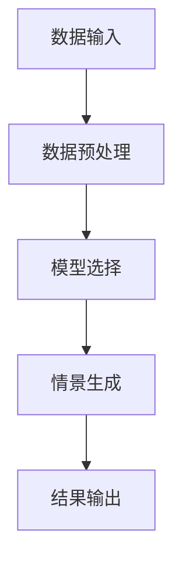

                 


# 金融机构压力测试情景生成器

> 关键词：压力测试、情景生成器、时间序列分析、机器学习、金融机构风险管理

> 摘要：本文详细介绍金融机构压力测试情景生成器的构建与应用，从理论基础到实际案例，结合数学模型和系统架构设计，帮助金融机构有效管理和优化压力测试流程。

---

# 第一部分: 金融机构压力测试情景生成器概述

## 第1章: 金融机构压力测试背景与概念

### 1.1 金融机构压力测试的定义与作用

压力测试是评估金融机构在极端市场条件下的抗风险能力的重要工具。通过模拟潜在的不利情景，机构可以识别潜在风险并制定应对策略。

#### 1.1.1 压力测试的基本概念
压力测试通过模拟极端市场条件，评估金融机构在这些条件下的表现。常见的测试情景包括市场崩盘、利率骤升、流动性危机等。

#### 1.1.2 压力测试在金融机构中的重要性
压力测试帮助机构识别潜在风险，优化资本配置，制定应急预案，增强市场信心。

#### 1.1.3 压力测试的分类与应用场景
压力测试分为历史情景测试、假设情景测试和敏感性测试。每种方法适用于不同的风险评估场景。

### 1.2 压力测试情景生成器的定义与特点

情景生成器是一种工具，用于自动生成多种压力测试情景。它通过数学模型和算法模拟市场变化，提供多样化的测试环境。

#### 1.2.1 情景生成器的基本概念
情景生成器利用算法生成各种市场变化，帮助机构全面评估风险。

#### 1.2.2 情景生成器的核心功能与优势
- 自动化生成多种情景
- 提供多样化的市场变化
- 支持用户自定义参数

#### 1.2.3 情景生成器与传统压力测试方法的区别
传统方法依赖历史数据，而生成器基于算法模拟新的情景。

### 1.3 金融机构压力测试的现状与挑战

#### 1.3.1 当前压力测试的主要方法
包括历史情景测试、假设情景测试和敏感性测试。

#### 1.3.2 情景生成器在实际应用中的挑战
- 数据质量
- 模型准确性
- 计算效率

#### 1.3.3 技术进步对压力测试的影响
人工智能和大数据技术的引入，提升了压力测试的效率和准确性。

### 1.4 本章小结
压力测试是金融机构风险管理的重要工具，情景生成器通过自动化生成多样化情景，显著提升了测试效率和效果。

---

## 第2章: 压力测试情景生成器的核心概念

### 2.1 压力测试情景生成器的输入与输出

#### 2.1.1 输入数据的类型与来源
- 历史市场数据
- 用户自定义参数

#### 2.1.2 输出情景的特征与要求
- 情景的多样性
- 情景的可解释性

### 2.2 情景生成器的核心算法与模型

#### 2.2.1 时间序列分析模型
时间序列分析模型广泛应用于情景生成，能够捕捉数据的时序特征。

#### 2.2.2 随机过程模型
随机过程模型模拟市场中的不确定性，帮助生成多样化的情景。

#### 2.2.3 机器学习模型
机器学习模型通过学习历史数据，生成更符合实际市场变化的情景。

### 2.3 情景生成器的参数设置与优化

#### 2.3.1 参数的选择与调整
- 模型参数
- 数据预处理参数

#### 2.3.2 模型的验证与优化
通过回测和交叉验证，优化模型参数，提升生成情景的准确性。

#### 2.3.3 参数对情景生成的影响
参数设置直接影响生成的情景的特征和多样性。

### 2.4 本章小结
情景生成器通过合理的参数设置和优化算法，生成多样化的压力测试情景，满足金融机构的需求。

---

## 第3章: 压力测试情景生成器的数学模型与算法原理

### 3.1 时间序列分析模型

#### 3.1.1 ARIMA模型的数学表达
ARIMA模型通过自回归和滑动平均机制，捕捉数据的时序特征。

$$ ARIMA(p, d, q) $$

#### 3.1.2 模型的参数估计与验证
通过最大似然估计法估计参数，并通过AIC准则选择最优模型。

### 3.2 随机过程模型

#### 3.2.1 Brownian运动的数学表达
Brownian运动模拟市场中的随机波动。

$$ dX_t = \mu dt + \sigma dW_t $$

#### 3.2.2 随机游走模型的应用
随机游走模型用于模拟市场中的不可预测性。

### 3.3 机器学习模型

#### 3.3.1 长短期记忆网络（LSTM）的数学表达
LSTM通过门控机制，捕捉长期依赖关系。

$$ LSTM gates: f_t, i_t, o_t $$

#### 3.3.2 模型的训练与优化
通过反向传播和梯度下降法优化模型参数。

### 3.4 本章小结
数学模型为情景生成器提供了理论基础，不同模型适用于不同的市场特征。

---

## 第4章: 压力测试情景生成器的系统架构与实现

### 4.1 系统功能模块划分

#### 4.1.1 数据采集模块
负责收集历史市场数据和用户输入参数。

#### 4.1.2 模型选择模块
根据需求选择合适的数学模型。

#### 4.1.3 情景生成模块
基于选定模型生成压力测试情景。

#### 4.1.4 结果分析模块
对生成的情景进行分析和评估。

### 4.2 系统架构的流程图



### 4.3 系统接口设计

#### 4.3.1 输入接口
接收历史数据和用户参数。

#### 4.3.2 输出接口
提供生成的情景和分析结果。

### 4.4 本章小结
系统架构设计明确了各模块的功能和交互流程，为情景生成器的实现提供了指导。

---

## 第5章: 压力测试情景生成器的项目实战

### 5.1 项目介绍

#### 5.1.1 项目目标
开发一个基于时间序列分析和机器学习的情景生成器。

#### 5.1.2 项目技术选型
使用Python和相关库（如Pandas、Scikit-learn、Keras）实现。

### 5.2 系统核心实现源代码

#### 5.2.1 数据预处理代码
```python
import pandas as pd
data = pd.read_csv('market_data.csv')
```

#### 5.2.2 ARIMA模型实现
```python
from statsmodels.tsa.arima_model import ARIMA
model = ARIMA(data, order=(5, 1, 0))
model_fit = model.fit()
```

#### 5.2.3 LSTM模型实现
```python
from keras.models import Sequential
from keras.layers import LSTM, Dense
model = Sequential()
model.add(LSTM(50, input_shape=(timesteps, features)))
model.add(Dense(1))
model.compile(optimizer='adam', loss='mean_squared_error')
model.fit(X_train, y_train, epochs=50, batch_size=32)
```

### 5.3 代码应用解读与分析

#### 5.3.1 数据预处理
对历史数据进行清洗和转换，确保数据适合模型训练。

#### 5.3.2 模型训练与优化
通过交叉验证选择最优模型参数，提升生成情景的准确性。

#### 5.3.3 情景生成与评估
生成多种压力测试情景，并评估其对金融机构的影响。

### 5.4 本章小结
通过实际项目，展示了情景生成器的实现过程和应用价值。

---

## 第6章: 压力测试情景生成器的最佳实践与注意事项

### 6.1 最佳实践

#### 6.1.1 数据质量
确保数据的完整性和准确性，避免偏差。

#### 6.1.2 模型选择
根据具体需求选择合适的模型，避免过度复杂。

#### 6.1.3 情景多样性
生成多样化的情景，覆盖不同风险因素。

### 6.2 注意事项

#### 6.2.1 数据依赖性
避免过度依赖历史数据，考虑未来可能的变化。

#### 6.2.2 模型局限性
认识到模型的局限性，结合专家判断进行调整。

#### 6.2.3 技术可行性
确保技术实现的可行性，避免资源浪费。

### 6.3 本章小结
最佳实践和注意事项为金融机构使用情景生成器提供了指导，帮助机构更好地应对风险。

---

## 第7章: 结论与展望

### 7.1 本文总结

#### 7.1.1 核心内容回顾
详细介绍了压力测试情景生成器的构建与应用。

#### 7.1.2 技术创新点
结合时间序列分析和机器学习，提升情景生成的准确性和多样性。

### 7.2 未来展望

#### 7.2.1 技术发展趋势
人工智能和大数据技术的进一步应用，提升情景生成的智能化水平。

#### 7.2.2 应用领域扩展
情景生成器在更多金融领域的应用，如信用风险、操作风险等。

### 7.3 本章小结
本文为金融机构压力测试情景生成器的研究和应用提供了理论和实践指导，未来仍有广阔的发展空间。

---

通过以上结构，文章详细介绍了金融机构压力测试情景生成器的构建与应用，从理论到实践，结合数学模型和系统架构设计，帮助金融机构有效管理和优化压力测试流程。

