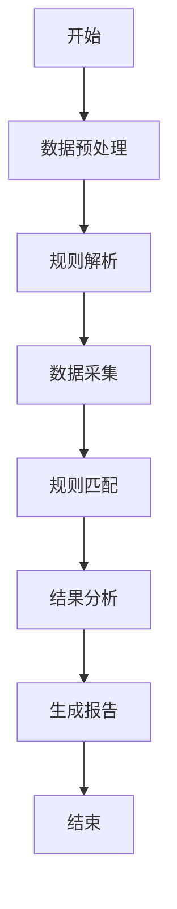
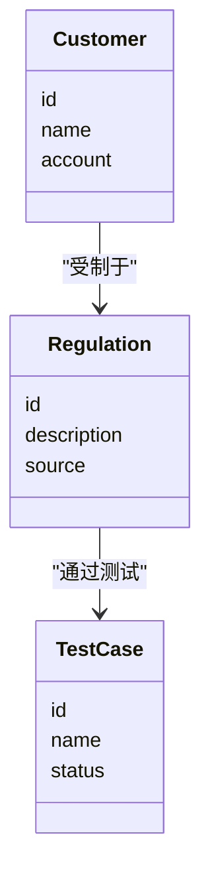
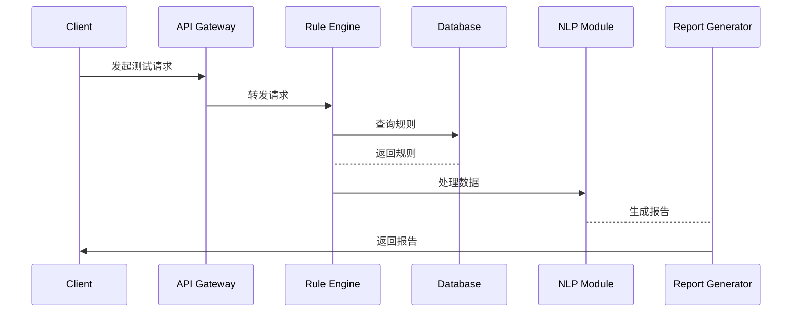

                 


# 《金融监管合规自动化测试平台》

> 关键词：金融监管，自动化测试，合规规则，规则引擎，自然语言处理，系统架构

> 摘要：本文详细探讨了金融监管合规自动化测试平台的设计与实现，从背景介绍到系统架构，从算法原理到项目实战，系统性地分析了该平台的核心技术与应用。文章内容涵盖了平台的必要性、核心概念、算法实现、系统设计、项目实践及最佳实践，为金融行业技术人员提供了深度的技术指导与实践参考。

---

## 第1章: 金融监管合规自动化测试平台概述

### 1.1 问题背景与需求分析
#### 1.1.1 金融监管的重要性
金融监管是保障金融市场稳定运行的核心机制，确保金融机构合规经营，保护投资者利益，维护金融体系的健康与安全。传统金融监管依赖人工检查，效率低、成本高且容易出错。

#### 1.1.2 传统金融监管的痛点
- 人工检查耗时长，效率低。
- 监管规则繁多，难以快速响应。
- 数据量大，难以处理结构化与非结构化数据。
- 缺乏统一的测试标准和自动化工具。

#### 1.1.3 自动化测试的需求
- 提高监管效率，降低人工成本。
- 快速响应监管规则的变化。
- 处理复杂数据，确保全面合规。

### 1.2 平台目标与核心功能
#### 1.2.1 平台的目标
构建一个智能化、自动化的金融监管测试平台，实现对金融机构的业务流程、数据合规性、系统操作的自动化检查与报告。

#### 1.2.2 核心功能模块
- **规则引擎模块**：解析和执行监管规则。
- **数据采集模块**：采集金融机构的业务数据。
- **自然语言处理模块**：处理非结构化数据（如文档、报告）。
- **测试执行模块**：自动化执行测试用例。
- **结果分析模块**：生成合规报告，提供改进建议。

#### 1.2.3 平台的价值
- 提高监管效率，降低合规成本。
- 实现监管规则的快速迭代与适应。
- 帮助金融机构提前发现合规问题，规避风险。

### 1.3 平台的边界与外延
#### 1.3.1 平台的边界
- 仅关注金融机构的内部合规性，不涉及外部市场行为。
- 不直接参与金融机构的业务操作，仅提供测试与评估服务。

#### 1.3.2 平台的外延
- 可扩展至其他行业的合规自动化测试。
- 支持多种监管规则和数据格式的扩展。

#### 1.3.3 平台与相关系统的区别
- 与金融机构的业务系统分离，仅作为外部测试工具。
- 与监管机构的管理系统对接，提供合规数据支持。

### 1.4 平台的核心要素
#### 1.4.1 核心要素组成
- **规则库**：包含所有监管规则的数据库。
- **测试引擎**：自动化执行测试用例的引擎。
- **数据接口**：与金融机构数据系统对接的接口。
- **报告系统**：生成和管理合规报告的模块。

#### 1.4.2 各要素之间的关系
- 规则库为测试引擎提供规则依据。
- 数据接口为测试引擎提供输入数据。
- 报告系统整合测试结果，输出合规报告。

#### 1.4.3 核心要素的详细说明
- **规则库**：需要涵盖所有相关监管法规，支持动态更新。
- **测试引擎**：支持多种测试场景，包括数据验证、流程模拟等。
- **数据接口**：支持多种数据格式，确保数据采集的准确性和完整性。
- **报告系统**：生成结构化报告，支持可视化展示。

---

## 第2章: 核心概念与联系

### 2.1 核心概念原理
#### 2.1.1 金融监管的定义与属性
- 定义：金融监管是指对金融机构的经营行为、市场运作和风险进行监督和管理。
- 属性：强制性、系统性、动态性。

#### 2.1.2 自动化测试的原理与特点
- 原理：通过预定义的测试用例和规则，自动化执行测试并生成结果。
- 特点：高效性、准确性、可扩展性。

#### 2.1.3 合规规则的制定与执行
- 制定：基于法律法规和行业标准，制定具体的监管规则。
- 执行：通过自动化测试平台，确保规则的严格执行。

### 2.2 核心概念对比表
| 核心概念 | 传统监管 | 自动化测试 |
|----------|----------|------------|
| 执行主体 | 人工检查 | 自动化系统 |
| 执行效率 | 低效 | 高效 |
| 成本 | 高 | 低 |
| 准确性 | 易出错 | 高 |

### 2.3 ER实体关系图
```mermaid
erDiagram
    customer[CUSTOMER] {
        id CustomerId
        name CustomerName
        account AccountNumber
    }
    rule[REGULATION] {
        id RuleId
        description RuleDescription
        source RuleSource
    }
    test[TEST_CASE] {
        id TestCaseId
        name TestCaseName
        status TestCaseStatus
    }
    CUSTOMER -> REGULATION : "受制于"
    REGULATION -> TEST_CASE : "通过测试"
```

---

## 第3章: 算法原理与实现

### 3.1 算法原理
#### 3.1.1 规则引擎的原理
- 通过预定义规则，解析输入数据，判断是否符合监管要求。
- 支持条件判断、逻辑运算和优先级规则。

#### 3.1.2 自然语言处理的原理
- 使用NLP技术（如分词、句法分析、实体识别）处理非结构化数据。
- 通过关键词匹配和语义分析，提取关键信息。

#### 3.1.3 数据分析与挖掘的原理
- 使用统计学方法和机器学习算法，分析数据中的模式和趋势。
- 支持异常检测和预测分析。

### 3.2 算法流程图


### 3.3 算法实现代码
#### 3.3.1 规则引擎的实现代码
```python
def rule_engine(data, rules):
    for rule in rules:
        if eval(rule.condition, data):
            return rule.action(data)
    return None
```

#### 3.3.2 自然语言处理的实现代码
```python
from nltk.tokenize import word_tokenize

def process_document(text):
    tokens = word_tokenize(text)
    return tokens
```

#### 3.3.3 数据分析与挖掘的实现代码
```python
import numpy as np
from sklearn import linear_model

def linear_regression(X, y):
    model = linear_model.LinearRegression()
    model.fit(X, y)
    return model
```

---

## 第4章: 系统分析与架构设计

### 4.1 项目背景
#### 4.1.1 项目目标
构建一个高效、可靠的金融监管合规自动化测试平台。

#### 4.1.2 项目范围
- 支持多种金融机构的监管需求。
- 支持多种数据格式和接口。

### 4.2 系统功能设计
#### 4.2.1 领域模型设计


#### 4.2.2 系统功能模块
- 用户界面模块：提供可视化操作界面。
- 数据管理模块：管理规则库和测试用例。
- 测试执行模块：自动化执行测试并生成结果。

### 4.3 系统架构设计
#### 4.3.1 架构风格选择
采用微服务架构，支持高可用性和可扩展性。

#### 4.3.2 架构设计图


#### 4.3.3 系统接口设计
- API接口：提供RESTful API，支持JSON格式数据。
- 接口交互：通过序列图描述接口调用流程。

### 4.4 系统交互设计


---

## 第5章: 项目实战

### 5.1 环境安装
- 安装Python和必要的库（如scikit-learn、nltk、flask）。
- 安装数据库（如MySQL）和开发工具（如IDE、版本控制工具）。

### 5.2 核心代码实现
#### 5.2.1 规则引擎的实现
```python
def rule_engine(data, rules):
    for rule in rules:
        if eval(rule.condition, data):
            return rule.action(data)
    return None
```

#### 5.2.2 自然语言处理的实现
```python
from nltk.tokenize import word_tokenize

def process_document(text):
    tokens = word_tokenize(text)
    return tokens
```

#### 5.2.3 数据分析与挖掘的实现
```python
import numpy as np
from sklearn import linear_model

def linear_regression(X, y):
    model = linear_model.LinearRegression()
    model.fit(X, y)
    return model
```

### 5.3 代码解读与分析
- **规则引擎**：通过循环遍历规则库，判断是否满足条件，执行相应的操作。
- **自然语言处理**：使用NLP库对文本进行分词处理，提取关键信息。
- **数据分析与挖掘**：使用机器学习算法对数据进行建模，预测潜在风险。

### 5.4 案例分析
- **案例背景**：某银行的客户数据合规性测试。
- **测试用例**：检查客户账户余额是否符合监管要求。
- **测试结果**：生成合规报告，指出不符合规则的账户。

### 5.5 项目小结
通过实际案例，验证了平台的有效性和可行性，为后续优化提供了数据支持。

---

## 第6章: 最佳实践与总结

### 6.1 开发中的注意事项
- 数据隐私保护：确保数据的安全性和合规性。
- 性能优化：优化算法和系统架构，提高处理效率。
- 错误处理：设计完善的错误捕捉和日志记录机制。

### 6.2 小结
金融监管合规自动化测试平台的实现，不仅提高了监管效率，还降低了合规成本，为金融机构提供了强有力的技术支持。

### 6.3 注意事项
- 定期更新规则库，确保平台的合规性。
- 提供用户友好的界面，方便操作和管理。
- 建立完善的监控机制，及时发现和解决问题。

### 6.4 拓展阅读
- 推荐阅读《金融监管与技术应用》和《自动化测试框架设计》。

---

## 附录

### 附录A: 工具安装指南
- Python安装与环境配置。
- 库的安装与使用（如scikit-learn、nltk）。

### 附录B: 常用API接口文档
- API接口定义。
- 接口使用说明。

### 附录C: 术语表
- 解释文中涉及的专业术语。

---

通过以上内容，我们系统性地介绍了金融监管合规自动化测试平台的设计与实现，从理论到实践，为读者提供了全面的技术指导与实践参考。

