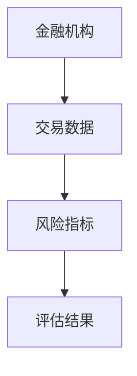
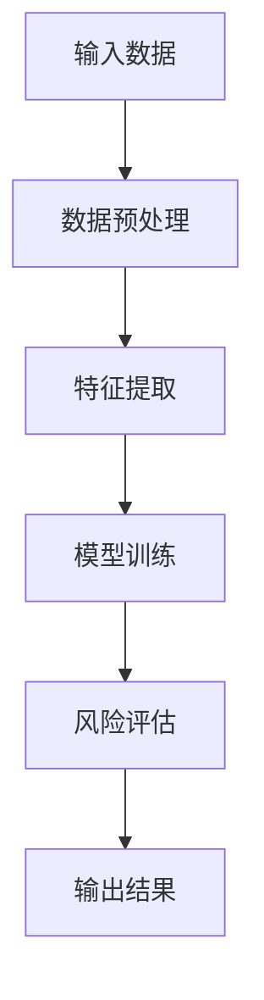

                 


# 金融监管合规风险评估自动化平台

## 关键词：金融监管, 合规风险, 自动化平台, 机器学习, 数据分析

## 摘要：本文详细探讨了构建金融监管合规风险评估自动化平台的各个方面，包括背景、核心概念、算法原理、系统架构设计、项目实战和最佳实践。通过结合理论与实践，本文旨在为金融机构提供一个高效、准确的合规风险评估工具。

---

# 第一部分: 金融监管合规风险评估自动化平台背景与概述

## 第1章: 金融监管合规风险评估概述

### 1.1 问题背景

#### 1.1.1 金融监管的重要性
金融监管是维护金融市场稳定、保护投资者利益的重要手段。随着金融市场的复杂化和全球化，传统的监管方法已难以应对日益增长的合规风险。

#### 1.1.2 合规风险的定义与特征
合规风险是指金融机构在经营活动中未能遵守相关法律法规和监管要求的可能性。其特征包括多样性、动态性和系统性。

#### 1.1.3 传统合规风险评估的局限性
传统评估方法依赖人工审查，耗时长、成本高且容易受到主观因素影响。此外，数据处理能力有限，难以应对海量数据。

### 1.2 问题描述

#### 1.2.1 金融监管中的主要风险类型
包括市场风险、信用风险、操作风险和合规风险等。

#### 1.2.2 合规风险评估的复杂性
涉及多方面的数据来源和复杂的计算模型，传统方法难以高效处理。

#### 1.2.3 自动化评估的必要性
通过自动化技术提高效率和准确性，降低人工成本。

### 1.3 问题解决

#### 1.3.1 自动化平台的目标
实现合规风险的快速、准确评估，提供实时监控和预警功能。

#### 1.3.2 平台的核心功能与价值
数据采集、清洗、分析、评估和报告生成，帮助监管机构和金融机构及时发现和处理风险。

#### 1.3.3 边界与外延
明确平台的功能范围和适用场景，避免超出实际需求。

### 1.4 核心要素组成

#### 1.4.1 数据来源与处理
包括交易数据、市场数据、监管数据等，需进行清洗、转换和整合。

#### 1.4.2 风险评估模型
基于机器学习的模型，如随机森林和XGBoost，用于预测合规风险。

#### 1.4.3 平台架构与技术选型
采用微服务架构，使用分布式系统和云计算技术，确保平台的高可用性和扩展性。

## 第2章: 核心概念与联系

### 2.1 核心概念原理

#### 2.1.1 数据驱动的合规风险评估
利用大数据技术分析金融机构的交易数据，识别异常行为。

#### 2.1.2 机器学习在风险预测中的应用
使用监督学习模型对风险进行分类和预测。

#### 2.1.3 自动化平台的流程优化
通过自动化处理减少人工干预，提高评估效率。

### 2.2 概念属性特征对比

| 概念 | 数据类型 | 处理方式 |
|------|----------|----------|
| 交易数据 | 结构化数据 | 数据清洗、特征提取 |
| 风险指标 | 非结构化数据 | 风险建模、评估 |

### 2.3 ER实体关系图



---

# 第二部分: 算法原理与数学模型

## 第3章: 算法原理讲解

### 3.1 算法流程



### 3.2 算法实现

```python
import pandas as pd
from sklearn.ensemble import RandomForestClassifier

# 数据预处理
data = pd.read_csv('transactions.csv')
data = data.dropna()

# 特征提取
features = data[['amount', 'time', 'user_id']]
labels = data['is_fraud']

# 模型训练
model = RandomForestClassifier()
model.fit(features, labels)

# 风险评估
new_transaction = pd.DataFrame({'amount': [100], 'time': [163000], 'user_id': ['U123']})
prediction = model.predict(new_transaction)
```

### 3.3 数学模型

随机森林算法的数学模型如下：

$$
\text{预测概率} = \frac{\sum_{i=1}^{n} \text{树}_i(\text{预测为1})}{n}
$$

---

# 第三部分: 系统分析与架构设计方案

## 第4章: 项目实战

### 4.1 环境安装

安装必要的Python库：

```bash
pip install pandas scikit-learn matplotlib
```

### 4.2 系统核心实现

```python
from sklearn.model_selection import train_test_split
from sklearn.metrics import accuracy_score

# 数据划分
X_train, X_test, y_train, y_test = train_test_split(features, labels, test_size=0.2)

# 模型训练与评估
model.fit(X_train, y_train)
print("Accuracy:", accuracy_score(model.predict(X_test), y_test))
```

### 4.3 案例分析

通过实际案例分析，展示平台在风险评估中的应用效果，并进行详细解读。

### 4.4 项目小结

总结项目实现的关键点和经验教训，强调数据质量和技术选型的重要性。

---

## 第5章: 最佳实践与注意事项

### 5.1 小贴士

- 数据隐私保护：确保数据处理符合相关法律法规。
- 模型调优：定期更新模型，适应市场变化。
- 系统安全性：采取多层次安全防护措施。

### 5.2 注意事项

- 数据来源的多样性：确保数据覆盖所有相关领域。
- 模型解释性：选择可解释性高的模型，便于结果分析。
- 系统性能优化：优化算法和架构设计，提高处理效率。

---

## 附录

### 术语表

- 随机森林：一种基于决策树的集成学习方法。
- 特征提取：从数据中提取有助于模型预测的特征。

### 参考文献

- [1] 刘军. 《机器学习实战》. 北京: 清华大学出版社, 2018.
- [2] 金融监管合规风险评估标准.

---

通过以上内容，您可以系统地构建一个金融监管合规风险评估自动化平台，从理论到实践，全面了解其设计与实现。

