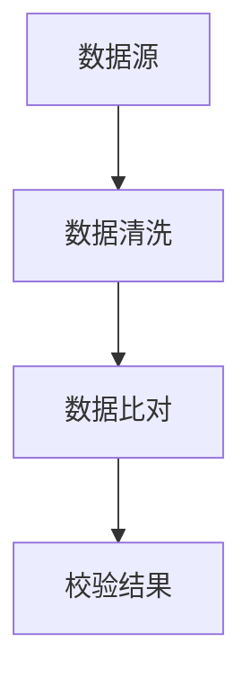
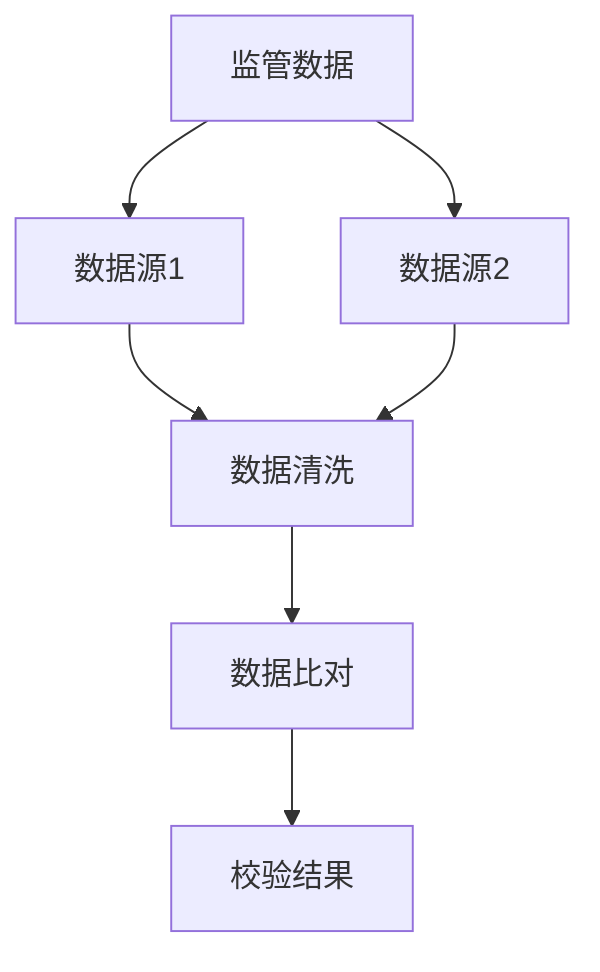
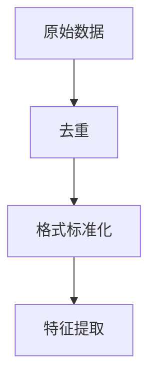
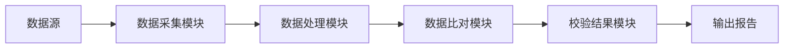

                 


# 《金融监管报告数据一致性自动校验》

## 关键词：
- 金融监管
- 数据一致性
- 自动校验
- 校验算法
- 系统架构
- Python实现

## 摘要：
随着金融行业对数据准确性要求的不断提高，数据一致性校验成为确保金融监管报告质量的关键环节。本文详细探讨了金融监管报告数据一致性校验的核心概念、算法原理、系统架构设计以及实际项目实现。通过理论分析与实践结合，展示了如何利用数据清洗、特征提取、相似度计算等技术实现自动校验，并通过Python代码示例和系统架构图帮助读者更好地理解和应用相关技术。

---

# 第一部分：背景与核心概念

## 第1章：问题背景与目标

### 1.1 数据一致性校验的背景
#### 1.1.1 金融监管的重要性
金融监管是保障金融市场稳定运行的核心机制，其准确性直接关系到金融系统的健康与风险防控。监管报告中的数据一致性问题，如重复、缺失或格式不统一，可能导致监管决策失误。

#### 1.1.2 数据一致性问题的提出
在金融监管中，数据来源多样（如银行、证券公司、保险公司等），不同机构的数据格式、标准和采集方式可能存在差异，导致数据不一致。例如，同一笔交易在不同机构的记录可能因时间、金额格式或参与者名称的不同而产生差异。

#### 1.1.3 自动化校验的必要性
传统的手动校验效率低、成本高，且容易出错。自动化校验技术可以提高数据处理效率，降低人工错误率，同时支持大规模数据处理，是金融监管数字化转型的必然要求。

### 1.2 问题描述与目标
#### 1.2.1 数据一致性问题的具体表现
- 数据格式不一致：例如金额字段在不同机构中可能使用“元”或“分”为单位。
- 数据内容不一致：例如同一笔交易在不同机构中记录的时间可能相差一秒。
- 数据缺失：某些字段在某些机构中未记录。

#### 1.2.2 校验目标的设定
- 确保监管报告中各数据源的一致性。
- 自动识别和标记数据不一致的记录。
- 提供校验结果的可视化报告，便于监管人员快速定位问题。

#### 1.2.3 边界与外延
- **边界**：仅关注结构化数据的一致性校验，不涉及非结构化数据（如文本描述）。
- **外延**：可扩展至跨机构、跨系统的数据一致性校验。

### 1.3 核心概念与关键要素
#### 1.3.1 数据一致性校验的定义
数据一致性校验是指通过算法和规则，对比不同数据源中的数据，识别和标记数据不一致的过程。

#### 1.3.2 核心要素组成
- 数据源：需要校验的多个数据源。
- 数据清洗：对数据进行标准化处理，消除格式差异。
- 数据比对：通过算法识别数据差异。
- 校验结果：输出数据一致性报告。

#### 1.3.3 概念结构与关系
通过下图可以清晰理解数据一致性校验的核心要素及其关系：


---

## 第2章：核心概念与联系

### 2.1 数据一致性校验的核心原理
#### 2.1.1 数据清洗与标准化
数据清洗是校验的前提，包括去除重复数据、填补缺失值、统一数据格式等。例如，将不同机构的金额单位统一为“元”。

#### 2.1.2 数据特征提取
通过特征提取，将数据转化为适合比对的形式。例如，将交易时间转换为统一的UNIX时间戳。

#### 2.1.3 数据比对与校验
使用预定义规则或算法，对数据进行比对，识别差异并标记。

### 2.2 核心概念属性对比
下表对比了常见的数据一致性校验方法及其优缺点：
| 方法       | 描述                                                                 | 优缺点                              | 适用场景               |
|------------|----------------------------------------------------------------------|------------------------------------|------------------------|
| 基于规则   | 根据预定义规则进行校验，例如：金额字段必须为数值型，交易时间必须在合理范围内 | 易实现，规则简单，但规则复杂度高    | 简单场景               |
| 基于相似度 | 使用相似度算法（如余弦相似度）进行校验，适用于文本类数据的比对           | 高效，但准确性依赖算法选择           | 复杂场景               |
| 基于哈希    | 通过哈希函数生成数据指纹，进行快速比对                                   | 高效，但依赖哈希函数的选择           | 快速校验               |

### 2.3 实体关系图
下图展示了数据一致性校验的实体关系：


---

## 第3章：数据一致性校验算法原理

### 3.1 算法概述
#### 3.1.1 数据清洗与预处理
- 去重：通过唯一标识字段（如交易流水号）去除重复数据。
- 格式标准化：将不同机构的日期格式统一为ISO标准格式。

#### 3.1.2 特征提取方法
- 文本特征提取：使用TF-IDF或Word2Vec提取文本字段的特征向量。
- 数值特征提取：将数值字段归一化处理。

#### 3.1.3 比对算法选择
- 精准比对：适用于结构化数据，直接比较字段值。
- 模糊比对：适用于文本类数据，使用相似度算法进行比对。

### 3.2 数据清洗流程


---

## 第4章：系统分析与架构设计

### 4.1 问题场景介绍
金融监管报告数据一致性校验系统需要处理来自多个金融机构的海量数据，数据格式多样，且需要实时或准实时校验。

### 4.2 系统功能设计
#### 4.2.1 数据采集模块
- 支持多种数据源接入，如数据库、文件等。
- 数据采集频率可配置。

#### 4.2.2 数据处理模块
- 数据清洗：去除重复数据，填补缺失值。
- 数据标准化：统一字段格式。

#### 4.2.3 数据比对模块
- 精准比对：直接比较字段值。
- 模糊比对：使用相似度算法。

### 4.3 系统架构设计


---

## 第5章：项目实战

### 5.1 环境安装
- Python 3.8+
- 数据处理库：pandas、numpy
- 数据可视化库：matplotlib、seaborn
- 依赖管理工具：pip install pandas numpy matplotlib seaborn

### 5.2 核心实现代码
```python
import pandas as pd
from difflib import SequenceMatcher

def data_cleaning(df):
    # 去除重复数据
    df.drop_duplicates(inplace=True)
    # 格式标准化
    df['交易时间'] = pd.to_datetime(df['交易时间'])
    return df

def data_matching(df1, df2):
    # 模糊比对
    df = pd.merge(df1, df2, on='交易流水号', how='outer', indicator=True)
    # 标记差异
    df['是否一致'] = df['_merge'].apply(lambda x: '否' if x == 'left_only' or x == 'right_only' else '是')
    return df

# 示例代码
if __name__ == "__main__":
    df1 = pd.read_csv('data1.csv')
    df2 = pd.read_csv('data2.csv')
    df_cleaned1 = data_cleaning(df1)
    df_cleaned2 = data_cleaning(df2)
    result = data_matching(df_cleaned1, df_cleaned2)
    print(result.head())
```

### 5.3 案例分析
假设我们有两份交易数据，分别来自银行A和银行B：
- 银行A的交易记录：交易流水号为12345，交易时间为2023-10-01 10:00:00，金额为1000元。
- 银行B的交易记录：交易流水号为12345，交易时间为2023-10-01 10:00:01，金额为1000.00元。

通过数据清洗和比对，发现交易时间相差1秒，金额格式不同，但实质相同。系统将标记为“不一致”，并提示可能需要进一步人工审核。

---

## 第6章：结论与展望

### 6.1 小结
本文详细探讨了金融监管报告数据一致性校验的核心概念、算法原理和系统架构设计，并通过Python代码示例展示了实际项目实现。数据一致性校验是金融监管系统中的重要环节，自动化校验技术可以显著提高数据处理效率和准确性。

### 6.2 注意事项
- 数据清洗阶段需要谨慎处理，避免误删或误改数据。
- 相似度算法的选择会影响校验结果的准确性，需根据具体场景选择合适的方法。

### 6.3 拓展阅读
- 《数据清洗实战：金融数据分析中的挑战与解决方案》
- 《Python机器学习：基于Scikit-learn和TensorFlow》

---

通过本文的学习，读者可以全面理解金融监管报告数据一致性校验的技术要点，并能够将其应用于实际项目中。

