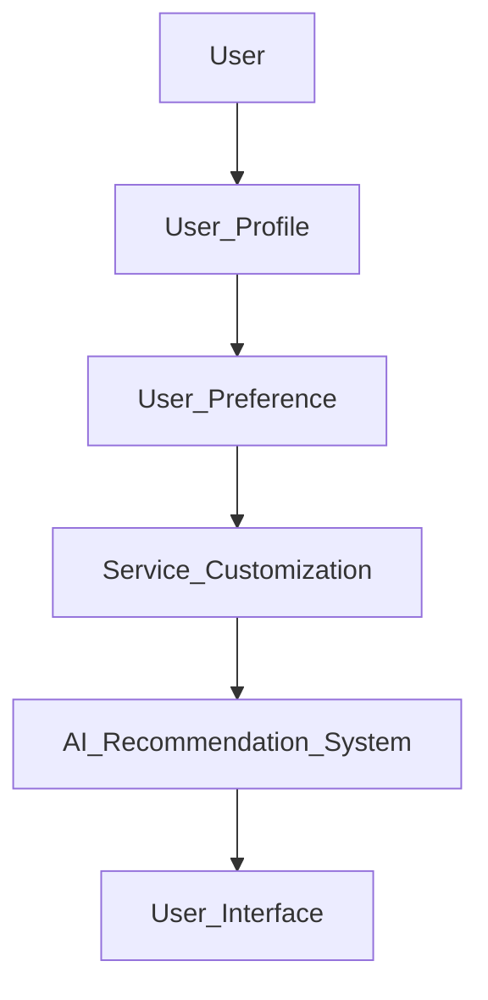
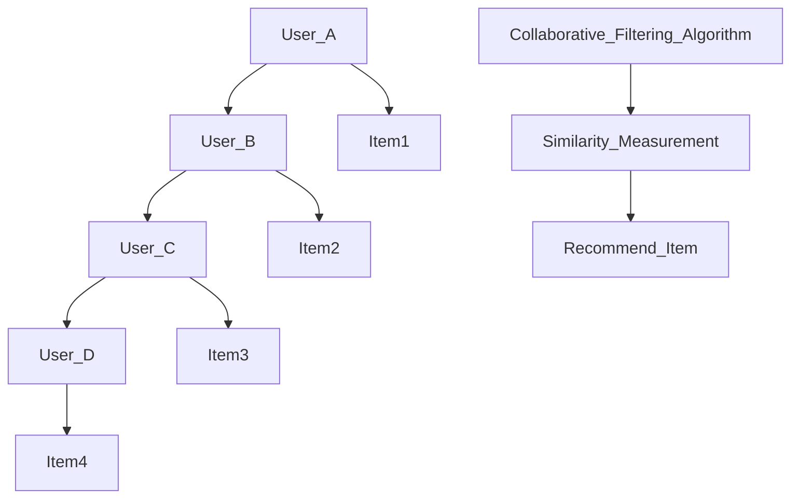
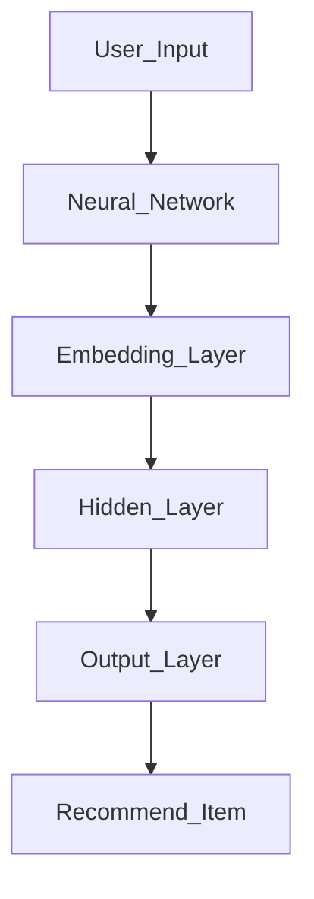
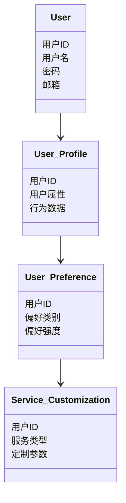
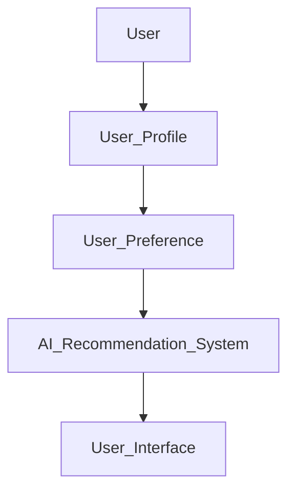
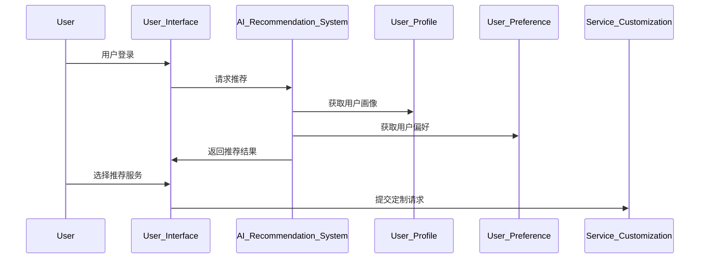

                 


# 《金融科技用户体验优化与个性化定制平台》

> 关键词：金融科技，用户体验优化，个性化定制平台，机器学习，推荐系统，系统架构设计

> 摘要：本文围绕金融科技领域的用户体验优化与个性化定制平台展开深入探讨。通过分析当前金融科技的发展现状，阐述用户体验优化的重要性，提出构建个性化定制平台的必要性与目标。结合实际案例，详细讲解了基于机器学习的推荐算法、系统架构设计与实现、以及如何通过数据驱动的方法实现用户行为分析与需求挖掘。本文旨在为金融科技从业者提供一套系统化的用户体验优化与个性化服务定制的方法论，助力金融机构在数字化转型中实现以用户为中心的业务模式创新。

---

# 第1章: 金融科技与用户体验优化概述

## 1.1 金融科技的发展现状

### 1.1.1 金融科技的定义与特点
金融科技（FinTech）是指通过技术手段优化或替代传统金融服务模式的新兴领域。其核心在于利用大数据、人工智能、区块链、云计算等技术，提升金融服务的效率、安全性和用户体验。金融科技的特点包括技术创新性、服务普惠性、场景化和数据驱动。

### 1.1.2 金融科技的核心技术与应用领域
- **核心技术**：大数据分析、人工智能、区块链、云计算、物联网等。
- **应用领域**：支付结算、信贷融资、投资管理、保险服务、供应链金融等。

### 1.1.3 用户体验在金融科技中的重要性
随着市场竞争加剧，用户体验已成为金融科技产品成功与否的关键因素。良好的用户体验能够提升用户粘性、降低用户流失率，同时增强品牌形象。

---

## 1.2 用户体验优化的背景与意义

### 1.2.1 用户体验优化的定义
用户体验优化是指通过设计和改进产品或服务的交互流程，提升用户在使用过程中的满意度和使用效率。

### 1.2.2 金融科技中用户体验问题的现状
- 传统金融服务流程复杂，用户操作繁琐。
- 缺乏个性化的服务推荐，用户需求得不到精准满足。
- 数据安全性问题导致用户信任度下降。

### 1.2.3 用户体验优化对金融机构的价值
- 提升用户满意度和忠诚度。
- 降低用户获取与留存成本。
- 提高业务转化率和收入。

---

## 1.3 个性化定制平台的概念与目标

### 1.3.1 个性化定制平台的定义
个性化定制平台是指通过大数据分析和人工智能技术，根据用户的个性化需求，提供定制化金融产品和服务的平台。

### 1.3.2 平台的核心目标与功能
- **目标**：实现金融服务的个性化推荐、自动化服务流程、实时反馈与调整。
- **功能**：用户画像构建、需求挖掘、个性化推荐、动态调整、用户反馈收集等。

### 1.3.3 平台与传统金融服务的区别
| 特性 | 传统金融服务 | 个性化定制平台 |
|------|----------------|------------------|
| 服务模式 | 标准化、一刀切 | 个性化、定制化 |
| 交互方式 | 线下为主，线上为辅 | 全渠道、实时交互 |
| 数据利用 | 有限，基于经验 | 数据驱动，精准分析 |

---

## 1.4 本章小结
本章从金融科技的发展现状出发，分析了用户体验优化的背景与意义，并提出了个性化定制平台的概念与目标。通过对比传统金融服务与个性化定制平台的差异，明确了个性化定制平台在金融科技领域的重要性。

---

# 第2章: 金融科技用户体验优化的核心概念

## 2.1 用户体验优化的关键要素

### 2.1.1 用户需求分析
用户需求分析是用户体验优化的基础，包括显性需求和隐性需求。显性需求可以通过问卷调查、访谈等方式获取，隐性需求则需要通过用户行为数据分析挖掘。

### 2.1.2 用户行为分析
用户行为分析是通过收集用户在使用产品或服务时的行为数据，分析用户的偏好、习惯和痛点。常用的方法包括路径分析、漏斗分析、热力图分析等。

### 2.1.3 用户情感与认知体验
用户体验不仅仅是功能的实现，还包括用户的情感体验和认知体验。情感体验通过界面设计、交互流程优化实现，认知体验则通过信息架构设计优化实现。

---

## 2.2 个性化定制平台的系统架构

### 2.2.1 系统模块划分
个性化定制平台的系统架构可以划分为以下几个模块：
1. 用户画像模块：负责收集和分析用户数据，构建用户画像。
2. 需求挖掘模块：基于用户画像，挖掘用户的个性化需求。
3. 个性化推荐模块：根据需求，生成个性化的产品或服务推荐。
4. 动态调整模块：根据用户反馈，实时调整推荐策略。

### 2.2.2 平台功能模块介绍
- **用户画像模块**：通过收集用户的基本信息、行为数据、交易记录等，构建用户画像。
- **需求挖掘模块**：利用机器学习算法，分析用户的潜在需求。
- **个性化推荐模块**：基于用户画像和需求挖掘结果，生成个性化推荐。
- **动态调整模块**：根据用户反馈，实时优化推荐策略。

### 2.2.3 系统的可扩展性与灵活性
个性化定制平台需要具备较强的可扩展性和灵活性，以适应不同用户群体和不同业务场景的需求。

---

## 2.3 金融科技与用户体验优化的关系

### 2.3.1 技术如何影响用户体验
技术的进步为用户体验优化提供了更多可能性，例如人工智能技术可以实现更精准的用户需求预测和个性化推荐。

### 2.3.2 用户体验如何推动技术创新
用户体验优化需要技术创新的支持，例如通过大数据分析优化推荐算法，通过区块链技术提升数据安全性。

### 2.3.3 两者的协同发展
金融科技与用户体验优化是相辅相成的关系，技术推动用户体验优化，而用户体验优化又反过来推动技术的创新与应用。

---

## 2.4 核心概念对比表

| 概念 | 定义 | 特点 | 应用场景 |
|------|------|------|----------|
| 用户体验优化 | 提升用户在使用产品或服务过程中的满意度 | 数据驱动、个性化、动态调整 | 金融产品推荐、流程优化 |
| 个性化定制平台 | 根据用户需求提供定制化服务的平台 | 数据驱动、实时反馈、动态调整 | 金融服务推荐、自动化服务 |

---

## 2.5 ER实体关系图

```mermaid
erd
    id User "用户" {
        用户ID
        用户名
        密码
        邮箱
        手机号
    }

    id User_Profile "用户画像" {
        用户ID
        用户属性（年龄、性别、职业等）
        行为数据（浏览记录、点击记录等）
    }

    id User_Preference "用户偏好" {
        用户ID
        偏好类别（投资偏好、风险偏好等）
        偏好强度
    }

    id Service_Customization "服务定制" {
        用户ID
        服务类型
        定制参数
        定制时间
    }

    User --> User_Profile
    User_Profile --> User_Preference
    User_Preference --> Service_Customization
```

---

## 2.5 系统架构图



---

## 2.6 本章小结
本章详细介绍了金融科技用户体验优化的核心概念，包括用户需求分析、用户行为分析、用户情感与认知体验，以及个性化定制平台的系统架构。通过对比和图表的展示，明确了各核心概念之间的关系与作用。

---

# 第3章: 金融科技用户体验优化的算法原理与实现

## 3.1 基于机器学习的推荐算法

### 3.1.1 协同过滤推荐系统
协同过滤推荐系统是一种基于用户相似性或物品相似性的推荐算法。常用的方法包括基于用户的协同过滤和基于物品的协同过滤。

#### 基于用户的协同过滤推荐算法流程


#### 协同过滤算法实现步骤
1. 收集用户行为数据。
2. 计算用户之间的相似度。
3. 基于相似用户的偏好，推荐相似的物品。

#### 协同过滤算法的优缺点
- 优点：推荐结果与用户兴趣高度相关。
- 缺点：计算复杂度高，冷启动问题。

### 3.1.2 基于深度学习的推荐算法
基于深度学习的推荐算法通过构建神经网络模型，学习用户和物品的深度特征，从而实现更精准的推荐。

#### 基于深度学习的推荐算法流程


#### 基于深度学习的推荐算法实现步骤
1. 数据预处理：对用户行为数据进行归一化处理。
2. 构建神经网络模型：包括输入层、嵌入层、隐藏层和输出层。
3. 模型训练：通过反向传播算法优化模型参数。
4. 推荐生成：基于训练好的模型生成推荐结果。

---

## 3.2 基于数学模型的推荐系统

### 3.2.1 矩阵分解模型
矩阵分解模型是一种常用推荐算法，通过将用户-物品交互矩阵分解为用户特征矩阵和物品特征矩阵，实现推荐。

#### 矩阵分解模型公式
$$
R = P \times Q^T
$$
其中，$R$ 是用户-物品交互矩阵，$P$ 是用户特征矩阵，$Q$ 是物品特征矩阵。

### 3.2.2 基于概率模型的推荐系统
基于概率模型的推荐系统通过概率分布来建模用户行为，从而实现推荐。

#### 概率模型公式
$$
P(y | x) = \frac{P(x, y)}{P(x)}
$$
其中，$y$ 是推荐的物品，$x$ 是用户的特征。

---

## 3.3 算法实现的代码示例

### 3.3.1 协同过滤推荐算法实现
```python
import numpy as np

# 用户-物品评分矩阵
ratings = np.array([
    [4, 3, 0, 0],
    [3, 2, 4, 0],
    [0, 4, 3, 2],
    [0, 2, 4, 3]
])

# 计算相似度
def cosine_similarity(ratings):
    similarity = np.zeros(ratings.shape)
    for i in range(ratings.shape[0]):
        for j in range(ratings.shape[0]):
            if i != j:
                similarity[i][j] = np.dot(ratings[i], ratings[j]) / (np.linalg.norm(ratings[i]) * np.linalg.norm(ratings[j]))
    return similarity

similarity = cosine_similarity(ratings)

# 协同过滤推荐
def collaborative_filtering_recommend(user_id, ratings, similarity, k=2):
    user_ratings = ratings[user_id]
    sorted_users = np.argsort(-similarity[user_id])
    recommend = []
    for user in sorted_users[:k]:
        recommend.extend([item for item in range(len(user_ratings)) if user_ratings[item] == 0])
    return list(set(recommend))

recommend = collaborative_filtering_recommend(0, ratings, similarity)
print("推荐结果:", recommend)
```

---

## 3.4 本章小结
本章详细介绍了金融科技用户体验优化中常用的推荐算法，包括协同过滤推荐算法和基于深度学习的推荐算法。通过数学模型和代码实现，展示了这些算法的具体实现步骤和应用场景。

---

# 第4章: 金融科技用户体验优化的系统分析与架构设计

## 4.1 系统分析

### 4.1.1 问题场景介绍
在金融科技领域，用户通常需要通过复杂的流程才能完成一项金融交易。用户体验优化的目标是通过简化流程、提供个性化服务，提升用户体验。

### 4.1.2 项目介绍
本项目旨在构建一个基于机器学习的个性化定制平台，实现用户需求的精准挖掘和个性化推荐。

---

## 4.2 系统功能设计

### 4.2.1 领域模型


### 4.2.2 系统架构设计


---

## 4.3 系统接口设计

### 4.3.1 接口描述
1. 用户注册接口：`POST /api/users`
2. 用户登录接口：`POST /api/auth`
3. 用户画像构建接口：`POST /api/profile`
4. 个性化推荐接口：`GET /api/recommend`

---

## 4.4 系统交互设计



---

## 4.5 本章小结
本章通过系统分析与架构设计，明确了个性化定制平台的功能模块、系统架构和接口设计。通过领域模型和系统架构图，展示了系统各模块之间的关系与交互流程。

---

# 第5章: 金融科技用户体验优化的项目实战

## 5.1 环境安装与配置

### 5.1.1 Python环境安装
- 安装Python：`python --version`
- 安装pip：`python get-pip.py`
- 安装依赖库：`pip install numpy scikit-learn`

### 5.1.2 数据库安装与配置
- 安装MySQL：`sudo apt-get install mysql-server`
- 配置数据库连接：`pip install mysql-connector-python`

---

## 5.2 系统核心实现

### 5.2.1 数据预处理
```python
import pandas as pd
import numpy as np

data = pd.read_csv('user_data.csv')
data.dropna(inplace=True)
```

### 5.2.2 用户画像构建
```python
from sklearn.preprocessing import StandardScaler

scaler = StandardScaler()
scaled_data = scaler.fit_transform(data[['age', 'income', 'score']])
```

### 5.2.3 个性化推荐实现
```python
from sklearn.cluster import KMeans

kmeans = KMeans(n_clusters=3)
kmeans.fit(scaled_data)
clusters = kmeans.predict(scaled_data)
```

---

## 5.3 项目案例分析与实现

### 5.3.1 案例背景
某银行希望通过个性化推荐系统，为用户提供定制化的理财产品推荐。

### 5.3.2 数据分析与处理
```python
import pandas as pd
import numpy as np

data = pd.read_csv('理财产品.csv')
data.dropna(inplace=True)
```

### 5.3.3 推荐系统实现
```python
from sklearn.metrics.pairwise import cosine_similarity

similarity = cosine_similarity(data)
```

### 5.3.4 推荐结果展示
```python
def recommend理财产品(user_id, similarity, data):
    recommend_ids = np.argsort(-similarity[user_id])[:3]
    return data.iloc[recommend_ids]

recommend = recommend理财产品(0, similarity, data)
print("推荐理财产品:", recommend['理财产品名称'])
```

---

## 5.4 本章小结
本章通过一个实际项目案例，详细讲解了金融科技用户体验优化的实现过程，包括环境安装、数据预处理、用户画像构建、个性化推荐实现等步骤。通过案例分析，展示了如何将理论应用于实践。

---

# 第6章: 金融科技用户体验优化的最佳实践与注意事项

## 6.1 最佳实践

### 6.1.1 数据安全与隐私保护
在处理用户数据时，必须遵守相关法律法规，确保用户数据的安全与隐私。

### 6.1.2 系统性能优化
通过缓存技术、分布式架构等手段，提升系统的响应速度和处理能力。

### 6.1.3 用户反馈机制
建立完善的用户反馈机制，及时收集用户意见，不断优化用户体验。

---

## 6.2 注意事项

### 6.2.1 数据质量
数据质量是用户体验优化的基础，必须确保数据的准确性和完整性。

### 6.2.2 算法选择
根据具体场景选择合适的算法，避免盲目追求复杂算法。

### 6.2.3 系统可扩展性
在设计系统时，充分考虑系统的可扩展性，以应对未来业务需求的变化。

---

## 6.3 拓展阅读
推荐阅读以下书籍和文章，深入了解金融科技与用户体验优化的相关知识：
1. 《FinTech: Disrupting the Financial World》
2. 《User Experience Design for Digital Products》
3. 《Machine Learning for推荐系统》

---

# 结语

通过本文的系统介绍，读者可以全面了解金融科技用户体验优化与个性化定制平台的核心概念、算法原理、系统设计与实现方法。希望本文能够为金融科技从业者提供有价值的参考，助力金融机构在数字化转型中实现以用户为中心的业务模式创新。

--- 

感谢您的阅读！如果对本文内容有任何疑问或建议，欢迎在评论区留言讨论。

