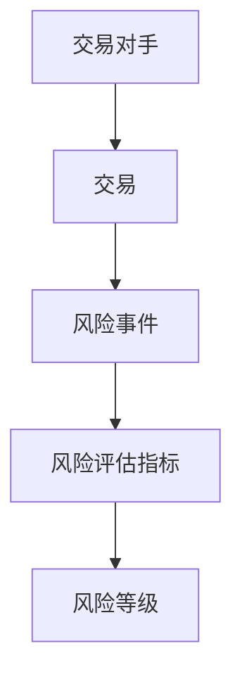
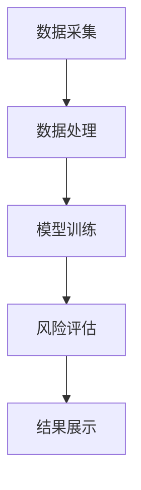
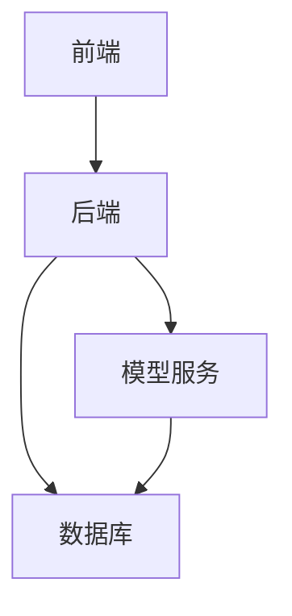
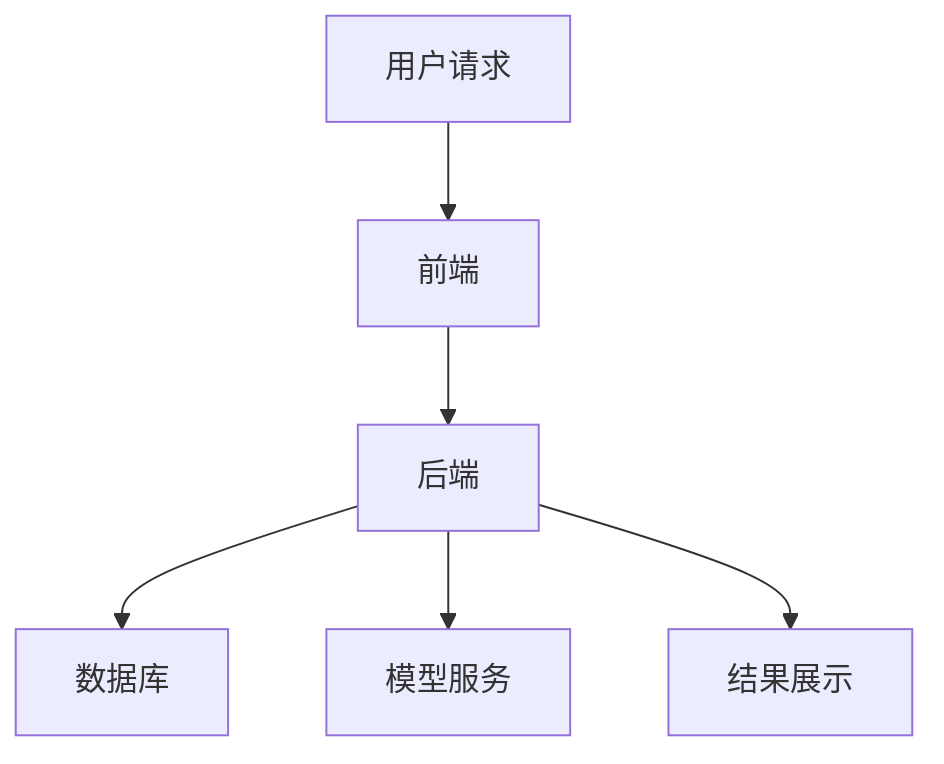

                 


# 《金融衍生品交易对手风险评估模型》

## 关键词
金融衍生品、交易对手风险、信用风险、VaR模型、信用评分、风险管理

## 摘要
金融衍生品交易中的交易对手风险是金融市场中最复杂且关键的风险之一。随着金融市场的全球化和复杂化，准确评估交易对手风险变得尤为重要。本文将系统地介绍交易对手风险的基本概念、核心理论、算法原理以及实际应用。通过构建交易对手风险评估模型，结合数学建模、数据处理和算法实现，为金融衍生品交易提供科学的风险管理工具。本文将深入分析交易对手风险的分类、量化方法、模型构建过程，并结合实际案例，展示如何利用信用评分模型、VaR模型等工具进行交易对手风险评估，帮助读者全面理解和掌握交易对手风险评估的核心方法和技术。

---

# 第一部分: 交易对手风险的基础理论

## 第1章: 交易对手风险的基本概念

### 1.1 交易对手风险的定义与分类

#### 1.1.1 交易对手风险的定义
交易对手风险是指在金融衍生品交易中，交易对手方因信用状况恶化、财务困境或恶意行为而无法履行合约义务，导致交易损失的风险。

#### 1.1.2 交易对手风险的分类
交易对手风险可以分为以下几类：
1. **信用风险**：交易对手因信用问题无法履行合约义务的风险。
2. **市场风险**：因市场价格波动导致交易对手的财务状况恶化而引发的风险。
3. **操作风险**：因交易过程中的操作失误或欺诈行为导致的风险。

### 1.2 金融衍生品的特性与交易对手风险

#### 1.2.1 金融衍生品的定义与分类
金融衍生品是指从原生资产（如股票、债券、商品等）派生出来的金融工具，其价格依赖于原生资产的价格变动。常见的金融衍生品包括：
- 期货
- 期权
- 远期合约
- 互换

#### 1.2.2 金融衍生品的风险特征
1. **杠杆效应**：衍生品通常具有杠杆效应，小的市场波动可能导致较大的损失。
2. **复杂性**：衍生品的定价和风险管理涉及复杂的数学模型。
3. **期限错配**：衍生品的期限可能与资产负债表上的其他资产不匹配，导致流动性风险。

#### 1.2.3 交易对手风险在金融衍生品中的具体表现
1. **违约风险**：交易对手在合约到期时无法履行支付义务。
2. **价格波动风险**：市场价格波动可能导致交易对手的财务状况恶化。
3. **法律风险**：因法律法规变化或合同纠纷导致的交易风险。

---

## 第2章: 交易对手风险评估模型的构建背景

### 2.1 金融市场的风险环境分析

#### 2.1.1 金融市场中的主要风险类型
1. **市场风险**：因市场价格波动导致的投资损失。
2. **信用风险**：因交易对手违约导致的损失。
3. **流动性风险**：因市场流动性不足导致的无法及时变现的风险。
4. **操作风险**：因内部操作失误或欺诈行为导致的损失。

#### 2.1.2 交易对手风险的产生原因
1. **经济周期波动**：经济下行可能导致交易对手的信用状况恶化。
2. **市场流动性不足**：市场流动性不足时，交易对手可能难以变现资产以履行合约。
3. **信息不对称**：交易双方可能掌握的信息不一致，导致风险无法准确评估。

#### 2.1.3 交易对手风险对金融衍生品交易的影响
1. **影响交易成本**：交易对手风险的存在可能导致交易成本增加。
2. **影响市场参与度**：高风险可能导致市场参与者减少，降低市场流动性。
3. **影响市场价格**：交易对手风险会影响衍生品的定价和市场波动。

### 2.2 交易对手风险评估模型的必要性

#### 2.2.1 传统风险管理方法的局限性
传统的风险管理方法主要依赖于历史数据和简单的统计分析，难以捕捉复杂金融衍生品交易中的潜在风险。

#### 2.2.2 金融衍生品交易中交易对手风险的特殊性
1. **复杂性**：衍生品的风险评估涉及复杂的数学模型和假设。
2. **动态性**：市场环境和交易对手的信用状况可能随时变化。
3. **系统性风险**：交易对手风险可能通过金融市场传导，引发系统性风险。

#### 2.2.3 构建交易对手风险评估模型的意义
1. **提高风险管理效率**：通过模型化的方法，快速、准确地评估交易对手风险。
2. **降低交易成本**：通过模型优化交易策略，降低因风险暴露带来的成本。
3. **增强市场稳定性**：通过科学的风险评估，减少系统性风险的发生。

---

## 第3章: 交易对手风险评估模型的核心概念与联系

### 3.1 核心概念原理

#### 3.1.1 交易对手信用风险的评估指标
1. **信用评分**：通过信用评分模型对交易对手的信用状况进行量化评估。
2. **违约概率（PD）**：交易对手在未来一定时期内违约的概率。
3. **违约损失率（LGD）**：在交易对手违约的情况下，损失的金额占违约金额的比例。

#### 3.1.2 交易对手风险的量化方法
1. **VaR（Value at Risk）模型**：衡量在一定置信水平下，资产组合的最大可能损失。
2. **信用VaR（CVaR）模型**：在信用风险领域的VaR扩展。
3. **信用评分模型**：通过逻辑回归、决策树等方法对交易对手的信用状况进行分类。

#### 3.1.3 交易对手风险与市场风险的关系
交易对手风险与市场风险密切相关。市场波动可能会影响交易对手的信用状况，进而影响交易对手风险。例如，股市下跌可能导致企业违约概率上升。

### 3.2 概念属性特征对比表格

| 风险类型 | 定义 | 评估指标 | 评估方法 | 关键因素 |
|----------|------|----------|----------|----------|
| 信用风险 | 债务人违约的可能性 | 信用评分、违约概率 | 信用评分模型、VaR模型 | 偿债能力、历史信用记录 |
| 市场风险 | 资产价格波动对投资组合的影响 | 波动率、beta系数 | VaR、CVaR | 市场波动、资产相关性 |
| 操作风险 | 操作失误或欺诈导致的损失 | 操作风险资本、损失概率 | 操作风险评估模型 | 内部控制、员工培训 |

### 3.3 ER实体关系图



---

## 第4章: 交易对手风险评估模型的算法原理

### 4.1 算法原理概述

#### 4.1.1 信用评分模型

##### 4.1.1.1 信用评分模型的定义
信用评分模型通过对交易对手的信用历史、财务状况、市场表现等多方面进行评估，给出一个信用评分，反映交易对手的信用风险。

##### 4.1.1.2 信用评分模型的实现步骤
1. **数据收集**：收集交易对手的历史交易数据、财务报表、信用记录等。
2. **特征提取**：提取影响信用风险的关键特征，如违约历史、财务杠杆等。
3. **模型训练**：使用逻辑回归、决策树等机器学习算法训练信用评分模型。
4. **信用评分计算**：根据模型输出交易对手的信用评分。

##### 4.1.1.3 信用评分模型的优缺点
- **优点**：能够量化交易对手的信用风险，便于比较不同交易对手的风险水平。
- **缺点**：模型的准确性依赖于数据质量和模型假设，可能存在过拟合问题。

#### 4.1.2 VaR模型

##### 4.1.2.1 VaR模型的定义
VaR（Value at Risk）是一种衡量资产组合在一定置信水平下的最大可能损失的方法。

##### 4.1.2.2 VaR模型的实现步骤
1. **数据收集**：收集资产组合的历史价格数据。
2. **假设选择**：选择合适的概率分布模型，如正态分布、t分布等。
3. **计算VaR值**：根据选择的分布模型计算在给定置信水平下的VaR值。

##### 4.1.2.3 VaR模型的优缺点
- **优点**：计算简单，易于解释。
- **缺点**：假设市场数据服从特定分布，可能与实际情况不符。

#### 4.1.3 信用VaR模型

##### 4.1.3.1 信用VaR模型的定义
信用VaR模型是VaR模型在信用风险领域的扩展，用于衡量信用资产组合在一定置信水平下的最大可能损失。

##### 4.1.3.2 信用VaR模型的实现步骤
1. **数据收集**：收集信用资产组合的历史违约数据。
2. **模型选择**：选择合适的信用风险模型，如Merton模型。
3. **计算信用VaR值**：根据模型计算信用VaR值。

##### 4.1.3.3 信用VaR模型的优缺点
- **优点**：能够量化信用资产组合的风险。
- **缺点**：依赖于模型假设，可能与实际情况不符。

### 4.2 算法实现步骤

#### 4.2.1 信用评分模型的实现

```python
import pandas as pd
from sklearn.linear_model import LogisticRegression

# 数据加载
data = pd.read_csv('credit_data.csv')

# 特征提取
X = data[['年收入', '信用历史', '债务负担']]
y = data['违约标记']

# 模型训练
model = LogisticRegression()
model.fit(X, y)

# 预测信用评分
predicted_prob = model.predict_proba(X)[:, 1]
data['信用评分'] = predicted_prob
```

#### 4.2.2 VaR模型的实现

```python
import numpy as np
import pandas as pd

# 数据加载
data = pd.read_csv('market_data.csv')

# 计算收益
returns = data['收盘价'].pct_change().dropna()

# 计算VaR
alpha = 0.05
returns_sorted = np.sort(returns)
var = returns_sorted[int(alpha * len(returns_sorted))]
```

### 4.3 数学模型与公式

#### 4.3.1 信用评分模型的数学公式

##### 逻辑回归模型
$$ P(\text{违约}) = \frac{1}{1 + e^{-(\beta_0 + \beta_1 x_1 + \beta_2 x_2 + \dots + \beta_n x_n)}} $$

##### 决策树模型
决策树模型通过特征分裂来预测违约概率，具体公式较为复杂，通常用树状图表示。

#### 4.3.2 VaR模型的数学公式

$$ \text{VaR}(\alpha) = \text{最小值} \{ L | P(L \leq L_{\alpha}) \geq \alpha \} $$

其中，$\alpha$ 是置信水平，$L$ 是损失金额。

#### 4.3.3 信用VaR模型的数学公式

信用VaR模型通常基于Merton模型，假设违约概率服从某种分布，具体公式如下：

$$ \text{信用VaR} = \text{违约概率} \times \text{平均损失率} \times \text{资产敞口} $$

---

## 第5章: 交易对手风险评估模型的系统分析与架构设计

### 5.1 问题场景介绍

#### 5.1.1 系统应用场景
交易对手风险评估模型主要用于金融机构在金融衍生品交易中的风险评估，帮助机构识别和管理交易对手风险。

#### 5.1.2 系统目标
1. 实时监控交易对手的信用状况。
2. 提供交易对手风险的量化评估。
3. 支持决策者制定风险管理策略。

### 5.2 系统功能设计

#### 5.2.1 功能模块
1. **数据采集模块**：采集交易对手的信用数据、市场数据等。
2. **风险评估模块**：基于信用评分模型和VaR模型进行风险评估。
3. **结果展示模块**：以可视化的方式展示风险评估结果。

#### 5.2.2 功能流程



### 5.3 系统架构设计

#### 5.3.1 系统架构图



#### 5.3.2 系统接口设计

1. **数据接口**：提供数据采集和存储的接口。
2. **模型接口**：提供信用评分和VaR计算的接口。
3. **展示接口**：提供风险评估结果的展示接口。

#### 5.3.3 系统交互流程



---

## 第6章: 交易对手风险评估模型的项目实战

### 6.1 环境安装

#### 6.1.1 安装Python
```bash
python --version
pip install --upgrade pip
```

#### 6.1.2 安装相关库
```bash
pip install pandas numpy scikit-learn matplotlib
```

### 6.2 系统核心实现

#### 6.2.1 信用评分模型实现

```python
import pandas as pd
from sklearn.linear_model import LogisticRegression

# 数据加载
data = pd.read_csv('credit_data.csv')

# 特征提取
X = data[['年收入', '信用历史', '债务负担']]
y = data['违约标记']

# 模型训练
model = LogisticRegression()
model.fit(X, y)

# 预测信用评分
predicted_prob = model.predict_proba(X)[:, 1]
data['信用评分'] = predicted_prob

# 保存结果
data.to_csv('credit_score.csv', index=False)
```

#### 6.2.2 VaR模型实现

```python
import numpy as np
import pandas as pd

# 数据加载
data = pd.read_csv('market_data.csv')

# 计算收益
returns = data['收盘价'].pct_change().dropna()

# 计算VaR
alpha = 0.05
returns_sorted = np.sort(returns)
var = returns_sorted[int(alpha * len(returns_sorted))]

print(f"VaR在{alpha}置信水平下的值为：{var}")
```

### 6.3 代码应用解读与分析

#### 6.3.1 信用评分模型代码解读
1. **数据加载**：读取信用数据 CSV 文件。
2. **特征提取**：选择影响信用评分的关键特征。
3. **模型训练**：使用逻辑回归模型训练信用评分模型。
4. **预测信用评分**：根据模型输出交易对手的信用评分。

#### 6.3.2 VaR模型代码解读
1. **数据加载**：读取市场数据 CSV 文件。
2. **计算收益**：计算资产价格的收益率变化。
3. **计算VaR值**：基于排序法计算VaR值。

### 6.4 实际案例分析

#### 6.4.1 案例背景
假设我们有一个包含交易对手信用数据和市场数据的数据集，需要评估交易对手的信用风险。

#### 6.4.2 案例分析步骤
1. **数据预处理**：清洗数据，处理缺失值和异常值。
2. **特征工程**：提取影响信用风险的关键特征。
3. **模型训练**：使用逻辑回归模型训练信用评分模型。
4. **风险评估**：计算交易对手的信用评分和VaR值。
5. **结果展示**：以可视化的方式展示风险评估结果。

### 6.5 项目小结

#### 6.5.1 核心代码总结
1. 信用评分模型代码：
   ```python
   model = LogisticRegression()
   model.fit(X, y)
   predicted_prob = model.predict_proba(X)[:, 1]
   data['信用评分'] = predicted_prob
   ```

2. VaR模型代码：
   ```python
   returns_sorted = np.sort(returns)
   var = returns_sorted[int(alpha * len(returns_sorted))]
   ```

#### 6.5.2 项目总结
通过本项目，我们实现了交易对手风险评估模型的核心功能，包括信用评分模型和VaR模型的实现。模型能够有效地量化交易对手的信用风险，为金融机构的风险管理提供科学依据。

---

## 第7章: 交易对手风险评估模型的最佳实践与注意事项

### 7.1 最佳实践

#### 7.1.1 数据质量管理
1. 确保数据的完整性和准确性。
2. 处理缺失值和异常值，保证数据质量。

#### 7.1.2 模型可解释性
1. 选择可解释性较强的模型，便于分析和优化。
2. 对模型的假设和参数进行详细说明，确保模型的透明性。

#### 7.1.3 压力测试
1. 对模型进行压力测试，检验模型在极端情况下的表现。
2. 根据测试结果优化模型，提高模型的鲁棒性。

### 7.2 注意事项

#### 7.2.1 模型假设的局限性
1. 模型假设可能与实际情况不符，需要定期更新和优化。
2. 数据分布的变化可能影响模型的准确性，需要动态调整模型参数。

#### 7.2.2 模型的风险敞口
1. 交易对手风险模型主要关注信用风险，但还需要结合市场风险和操作风险进行综合评估。
2. 模型的输出结果仅供参考，实际决策需要结合其他因素。

### 7.3 拓展阅读

#### 7.3.1 相关书籍
1. 《金融风险管理》
2. 《信用评分模型的构建与应用》

#### 7.3.2 相关工具
1. Python的机器学习库（如scikit-learn、xgboost）。
2. 数据可视化工具（如Matplotlib、Seaborn）。

---

## 第8章: 总结与展望

### 8.1 总结
本文系统地介绍了交易对手风险的基本概念、核心理论、算法原理和实际应用。通过构建交易对手风险评估模型，结合信用评分模型和VaR模型，为金融衍生品交易提供了科学的风险管理工具。模型能够有效地量化交易对手的信用风险，帮助金融机构降低交易对手风险，提高风险管理效率。

### 8.2 展望
未来，随着人工智能和大数据技术的发展，交易对手风险评估模型将更加智能化和精准化。可以通过引入机器学习算法（如深度学习、强化学习）进一步优化模型，提高风险评估的准确性和效率。同时，还需要加强对模型的监管和规范，确保模型的科学性和合理性。

---

通过本文的系统介绍和详细讲解，读者可以全面理解和掌握交易对手风险评估模型的核心方法和技术，为金融衍生品交易的风险管理提供有力支持。

