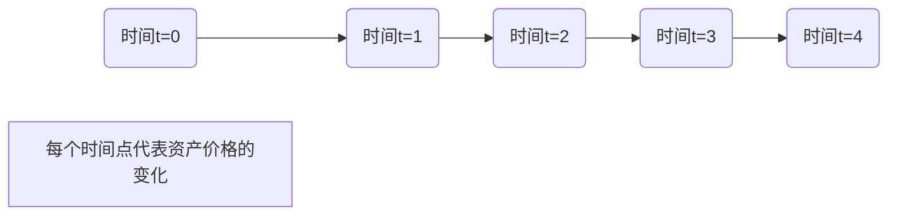
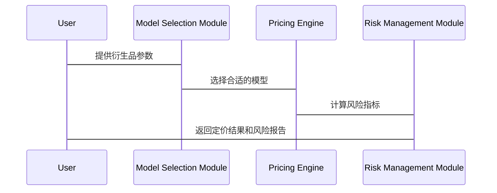

                 


# 《金融衍生品定价模型比较与选择框架》

## 关键词：金融衍生品、定价模型、比较分析、选择框架、风险管理

## 摘要：本文旨在通过对多种金融衍生品定价模型的深入分析，探讨其优缺点及适用场景，为读者提供一个系统化的选择框架。通过比较Black-Scholes、蒙特卡洛模拟和二叉树模型等主要定价模型，本文将帮助读者根据具体需求选择最合适的模型，以优化金融衍生品的定价和风险管理。

---

# 第1章: 金融衍生品概述

## 1.1 金融衍生品的定义与分类

### 1.1.1 金融衍生品的定义

金融衍生品（Financial Derivatives）是基于基础资产（如股票、债券、商品等）的金融合约，其价值来源于基础资产的价格波动。常见的衍生品包括期权、期货、互换和掉期等。

### 1.1.2 金融衍生品的主要分类

| 分类标准 | 衍生品类型 |
|----------|------------|
| 合约类型 | 期权、期货、互换 |
| 标的资产 | 股票、债券、商品、外汇 |
| 行使方式 | 看涨期权、看跌期权 |
| 成交场所 | 场内交易、场外交易 |

### 1.1.3 衍生品市场的基本结构

金融衍生品市场的参与者包括交易商、投资者、机构和个人。市场的基本结构涉及买方、卖方、交易所和清算机构。

```mermaid
graph TD
    A[交易者] --> B[经纪商]
    B --> C[交易所]
    C --> D[清算机构]
    D --> E[监管机构]
```

---

## 1.2 金融衍生品定价的重要性

### 1.2.1 定价模型在金融衍生品中的作用

定价模型用于确定衍生品的公允价值，帮助交易者做出决策。例如，Black-Scholes模型用于期权定价。

### 1.2.2 定价模型对风险管理的影响

准确的定价模型有助于机构进行风险管理和资本分配。例如，蒙特卡洛模拟常用于评估投资组合的风险。

### 1.2.3 定价模型在交易策略中的应用

定价模型为交易策略提供依据，帮助交易者发现套利机会和市场异常。

---

## 1.3 金融衍生品定价模型的发展史

### 1.3.1 早期定价模型的局限性

早期模型通常过于简化，无法捕捉复杂的市场动态。例如，早期期权定价模型忽略了波动率的变动。

### 1.3.2 Black-Scholes模型的提出与影响

1973年，Black和Scholes提出了著名的Black-Scholes公式，为现代衍生品定价奠定了基础。

### 1.3.3 现代定价模型的发展趋势

随着计算能力的提升，复杂模型（如蒙特卡洛模拟）逐渐取代传统模型，以应对更复杂的金融环境。

---

# 第2章: 定价模型的核心概念与原理

## 2.1 随机过程与金融市场的建模

### 2.1.1 随机过程的基本概念

随机过程描述了资产价格的随机波动。常见的随机过程包括布朗运动和马尔可夫过程。

### 2.1.2 布朗运动与几何布朗运动

布朗运动是随机过程的基础，几何布朗运动常用于描述资产价格的随机变化。



### 2.1.3 马尔可夫过程与跳跃过程

马尔可夫过程描述了当前状态仅依赖于前一状态，常用于简化模型。跳跃过程则考虑了资产价格的突然变化。

---

## 2.2 无套利定价原理

### 2.2.1 无套利原则的定义

无套利定价假设在无摩擦市场中，资产的公允价值可以通过套利机会消除。

### 2.2.2 无套利定价的应用场景

无套利定价广泛应用于期权定价，确保模型在无套利情况下的合理性。

### 2.2.3 无套利定价与市场均衡的关系

无套利定价确保了市场均衡，避免了套利机会，使定价更加合理。

---

## 2.3 金融衍生品定价的核心要素

### 2.3.1 时间价值与内在价值

时间价值是期权等衍生品的价值组成部分，内在价值取决于标的资产的价格。

### 2.3.2 波动率与风险中性定价

波动率影响衍生品的价格，风险中性定价假设市场参与者对风险持中性态度。

### 2.3.3 利率与货币时间价值

利率和货币时间价值通过贴现率影响衍生品的现值计算。

---

## 2.4 数学模型与公式

### 2.4.1 Black-Scholes公式的推导

Black-Scholes公式用于欧式期权定价：

$$ C = S_0 N(d_1) - K e^{-rT} N(d_2) $$

其中：
- \( S_0 \) 是标的资产价格
- \( K \) 是执行价格
- \( r \) 是无风险利率
- \( T \) 是到期时间
- \( N(d) \) 是标准正态分布的累积分布函数

### 2.4.2 二叉树模型的数学基础

二叉树模型通过构建资产价格的二叉树路径来计算期权价值。

### 2.4.3 蒙特卡洛模拟的基本原理

蒙特卡洛模拟通过大量随机抽样计算衍生品的期望值。

---

## 2.5 金融衍生品定价模型的优缺点比较

| 模型       | 优点                     | 缺点                     |
|------------|--------------------------|--------------------------|
| Black-Scholes | 计算简单，适用于欧式期权 | 未考虑波动率变化和股息  |
| 二叉树模型 | 简单直观，适合美式期权   | 计算复杂度高             |
| 蒙特卡洛模拟 | 适用于高维问题，灵活性高  | 计算时间长               |

---

## 2.6 选择定价模型的关键因素

选择定价模型时，需考虑以下因素：

1. **标的资产的类型**：股票、商品等不同资产适合不同的模型。
2. **期权的类型**：欧式、美式期权适用不同的定价模型。
3. **市场的波动性**：波动率高的市场可能需要更复杂的模型。
4. **计算资源**：蒙特卡洛模拟需要大量计算资源，而Black-Scholes相对简单。
5. **模型的准确性**：需要考虑模型是否能准确反映市场价格动态。

---

## 2.7 定价模型在实际应用中的注意事项

1. **模型假设的合理性**：确保模型假设与实际情况相符。
2. **参数的选择**：合理选择波动率、利率等参数。
3. **模型的验证**：通过历史数据验证模型的准确性。
4. **风险管理**：即使模型准确，也需要进行风险控制。

---

## 2.8 本章小结

本章详细介绍了金融衍生品定价的核心概念与原理，包括随机过程、无套利定价和定价模型的基本要素。通过对比不同模型的优缺点，帮助读者理解如何选择合适的定价模型。

---

# 第3章: 金融衍生品定价模型的选择框架

## 3.1 问题场景介绍

某金融机构需要为不同类型的金融衍生品选择合适的定价模型。以下是具体的项目需求：

### 3.1.1 项目背景

该机构主要交易股票期权和债券期权，市场波动率较高，交易规模大，需要高效的定价模型。

### 3.1.2 项目目标

选择适合的定价模型，优化定价效率和准确性，降低风险。

### 3.1.3 项目范围

包括期权、期货等多种衍生品的定价。

### 3.1.4 项目约束

计算资源有限，需选择计算效率高的模型。

### 3.1.5 项目需求

提供一个可扩展的定价模型选择框架。

---

## 3.2 系统功能设计

### 3.2.1 领域模型（Mermaid 类图）

```mermaid
classDiagram
    class Derivative {
        type: String
        expiryDate: Date
        strikePrice: Double
        underlyingAsset: Asset
    }
    class Asset {
        price: Double
        volatility: Double
        dividendYield: Double
    }
    class Model {
        name: String
        parameters: List
        computePrice(): Double
    }
    class BlackScholesModel < Model {
        computeOptionPrice()
    }
    class MonteCarloModel < Model {
        simulatePaths()
    }
    Derivative o Model
    Model o Asset
```

### 3.2.2 系统架构设计（Mermaid 架构图）

```mermaid
container 衍生品定价系统 {
    Model Selection Module
    Pricing Engine
    Risk Management Module
}
actor User
User --> Model Selection Module
Model Selection Module --> Pricing Engine
Pricing Engine --> Risk Management Module
```

### 3.2.3 系统接口设计

- **输入接口**：接收衍生品类型、参数等。
- **输出接口**：返回定价结果和风险指标。

### 3.2.4 系统交互流程（Mermaid 序列图）



---

## 3.3 项目实战

### 3.3.1 环境安装

安装必要的Python库，如NumPy、Pandas、SciPy。

### 3.3.2 核心代码实现

以下是Black-Scholes模型的Python实现：

```python
import numpy as np
from scipy.stats import norm

def black_scholes(S, K, r, T, sigma):
    d1 = (np.log(S/K) + (r + 0.5*sigma**2)*T) / (sigma*np.sqrt(T))
    d2 = d1 - sigma*np.sqrt(T)
    C = S * norm.cdf(d1) - K * np.exp(-r*T) * norm.cdf(d2)
    return C

# 示例计算
S = 100
K = 105
r = 0.05
T = 1
sigma = 0.2
print(black_scholes(S, K, r, T, sigma))
```

### 3.3.3 实际案例分析

以股票期权为例，使用Black-Scholes模型计算其公允价值。

### 3.3.4 代码应用解读与分析

上述代码展示了如何利用Black-Scholes公式计算期权价格，适用于欧式期权。

---

## 3.4 小结

本章通过实际案例展示了如何选择合适的定价模型，并提供了系统架构设计和代码实现。通过对比分析，帮助读者理解不同模型的适用场景和实现方法。

---

## 总结与展望

本文通过详细分析金融衍生品定价模型的优缺点，为读者提供了一个系统化的选择框架。通过对比Black-Scholes、蒙特卡洛模拟和二叉树模型等主要模型，帮助读者根据具体需求选择最合适的模型。未来，随着金融市场的复杂化，更复杂的模型和算法将被开发，以满足多样化的定价需求。

---

**注意事项**：在实际应用中，需结合市场环境和交易策略选择合适的模型，同时注意模型假设和参数的合理性。

**拓展阅读**：推荐学习随机过程、数值计算和金融数学的相关知识，以深入理解定价模型的原理和应用。

--- 

感谢您的耐心阅读，希望本文对您在金融衍生品定价模型的选择和应用中有所帮助！

