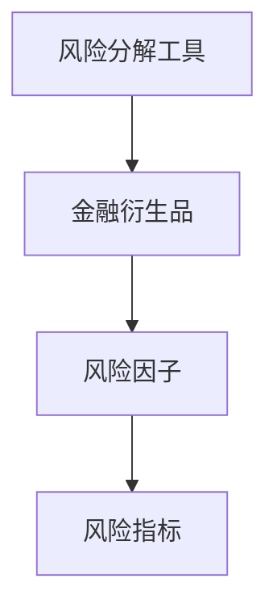
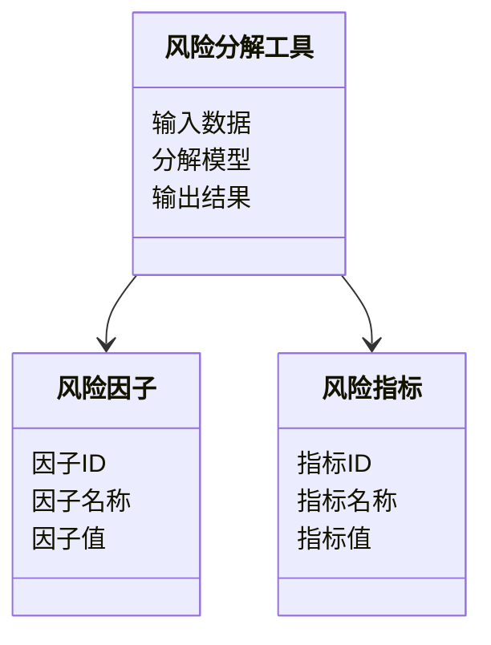
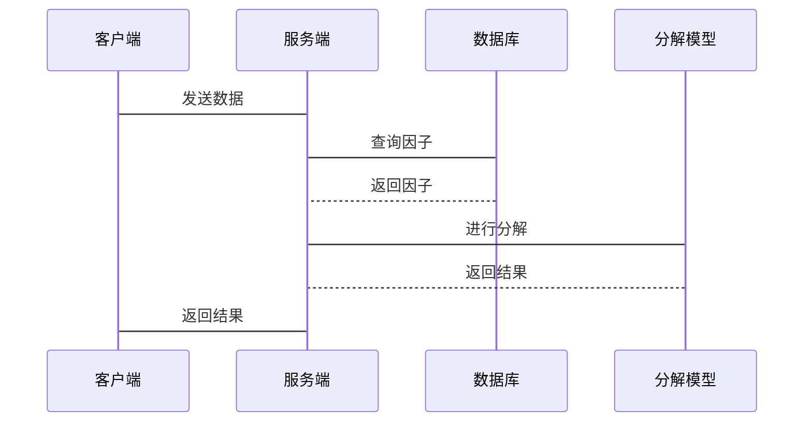

                 


# 金融衍生品组合风险分解工具

> 关键词：金融衍生品，风险分解，风险管理，数学模型，系统架构，风险因子

> 摘要：本文深入探讨了金融衍生品组合风险分解工具的核心原理、数学模型、系统架构及其在实际风险管理中的应用。通过详细讲解风险分解的算法、工具实现和项目实战，本文为金融从业者和研究人员提供了一套完整的解决方案，帮助他们更好地理解和应对金融衍生品组合中的风险。

---

# 第一部分: 金融衍生品组合风险分解工具概述

---

## 第1章: 金融衍生品与风险分解概述

### 1.1 金融衍生品的基本概念

#### 1.1.1 金融衍生品的定义与分类

金融衍生品（Financial Derivatives）是基于基础资产（如股票、债券、商品等）或其价格波动的派生金融工具。常见的金融衍生品包括期货、期权、掉期和互换等。根据其特性，金融衍生品可以分为以下几类：

1. **场内交易衍生品**：如期货和期权，交易在交易所进行，具有标准化合约。
2. **场外交易衍生品**：由金融机构私下协商定制，如定制期权和信用违约互换（CDO）。
3. **利率衍生品**：如利率期货和掉期，主要用于对冲利率风险。
4. **信用衍生品**：如信用违约互换（CDS），用于转移信用风险。

#### 1.1.2 金融衍生品的市场与应用

金融衍生品市场是全球金融市场的重要组成部分。它们被广泛用于以下场景：

- **风险对冲**：通过衍生品对冲价格波动风险。
- **投机交易**：投资者利用衍生品进行价格波动的投机。
- **套利机会**：通过不同市场或资产之间的价格差异进行套利。

#### 1.1.3 金融衍生品的风险特征

金融衍生品的风险主要体现在以下几个方面：

1. **价格波动风险**：衍生品的价值受基础资产价格波动影响较大。
2. **信用风险**：交易对手可能无法履行合约。
3. **流动性风险**：某些衍生品可能难以迅速变现。
4. **操作风险**：交易和结算过程中的错误或欺诈行为。

### 1.2 风险分解的基本概念

#### 1.2.1 风险分解的定义

风险分解是指将复杂金融组合的风险因素分解为多个可管理的子风险的过程。通过分解，可以更清晰地识别和量化每个风险源的影响。

#### 1.2.2 风险分解的必要性

在复杂的金融衍生品组合中，直接评估整体风险往往难以操作。通过风险分解，可以将复杂的风险结构拆解为多个简单的风险因子，便于管理和对冲。

#### 1.2.3 风险分解的边界与外延

风险分解的边界是指分解的范围和深度。例如，可以将一个组合分解为利率风险、信用风险和市场风险等多个部分。其外延则包括如何将分解后的风险重新组合，以评估整体风险。

### 1.3 金融衍生品组合风险分解工具的背景与意义

#### 1.3.1 金融衍生品组合风险的复杂性

随着金融市场的全球化和复杂化，金融衍生品的组合日益复杂。传统的风险管理方法难以应对这种复杂性，因此需要更 sophisticated的工具。

#### 1.3.2 风险分解工具的开发背景

为了应对金融衍生品组合风险的复杂性，风险管理工具逐渐从简单的线性模型向更复杂的非线性模型发展。风险分解工具的开发正是这种需求的产物。

#### 1.3.3 工具在金融风险管理中的作用

风险分解工具能够帮助金融机构：

- **量化风险**：通过分解将整体风险量化为可管理的部分。
- **优化对冲策略**：根据分解结果制定更精准的对冲策略。
- **提高决策效率**：快速评估不同组合的风险，支持决策。

### 1.4 本章小结

本章介绍了金融衍生品的基本概念及其风险特征，并重点阐述了风险分解的必要性和工具的开发背景。通过这些内容，读者可以理解风险分解工具在金融风险管理中的重要性。

---

## 第2章: 金融衍生品组合风险分解的核心概念与联系

### 2.1 风险分解的核心原理

#### 2.1.1 风险分解的数学模型

风险分解通常基于统计学和数学模型。常见的模型包括线性回归模型和主成分分析模型。

- **线性回归模型**：将整体风险分解为若干个风险因子的线性组合。
- **主成分分析模型**：通过降维技术提取主要的风险因子。

#### 2.1.2 风险分解的属性特征对比

以下是几种常见风险分解方法的对比：

| 方法       | 优点                           | 缺点                           |
|------------|--------------------------------|--------------------------------|
| 线性回归    | 计算简单，易于解释             | 无法捕捉非线性关系             |
| 主成分分析  | 能提取主要风险因子             | 解释性较差                     |
| 非线性模型  | 能捕捉复杂关系                 | 计算复杂，解释性较差           |

#### 2.1.3 实体关系图架构

以下是风险分解的实体关系图：



### 2.2 风险分解与金融衍生品的关系

#### 2.2.1 风险因子的识别

风险因子是影响金融衍生品价格的主要因素。例如，利率、汇率和市场波动率都是常见的风险因子。

#### 2.2.2 风险分解的实现步骤

风险分解的实现通常包括以下步骤：

1. **数据收集**：收集相关金融衍生品的价格数据。
2. **因子识别**：识别影响组合风险的主要因子。
3. **模型选择**：选择适合的分解模型。
4. **分解实施**：将组合风险分解为多个因子的风险。
5. **结果验证**：验证分解结果的准确性。

### 2.3 本章小结

本章详细阐述了风险分解的核心原理及其与金融衍生品的关系。通过对比不同分解方法的优缺点，读者可以更好地理解如何选择合适的分解模型。

---

## 第3章: 金融衍生品组合风险分解工具的数学模型与算法

### 3.1 线性分解模型

#### 3.1.1 线性分解的基本原理

线性分解假设整体风险是若干个风险因子的线性组合。其数学表达式为：

$$ y = \beta_1x_1 + \beta_2x_2 + \cdots + \beta_nx_n + \epsilon $$

其中，$y$ 是整体风险，$x_i$ 是风险因子，$\beta_i$ 是对应的系数，$\epsilon$ 是误差项。

#### 3.1.2 线性分解的实现步骤

1. **数据准备**：收集金融衍生品的价格数据和相关风险因子。
2. **因子选择**：选择影响风险的主要因子。
3. **模型训练**：使用线性回归模型进行训练，得到各因子的系数。
4. **模型验证**：验证模型的准确性。

#### 3.1.3 线性分解的优缺点

- **优点**：计算简单，易于解释。
- **缺点**：无法捕捉非线性关系。

### 3.2 非线性分解模型

#### 3.2.1 非线性分解的基本原理

非线性分解模型能够捕捉复杂的因子关系。常用的非线性模型包括支持向量回归（SVR）和随机森林。

#### 3.2.2 非线性分解的数学公式

以支持向量回归为例，其数学表达式为：

$$ y = \sum_{i=1}^n \alpha_i y_i x_i \cdot x + \beta $$

其中，$\alpha_i$ 是拉格朗日乘子，$y_i$ 是训练数据的标签，$x_i$ 是训练数据的特征。

#### 3.2.3 非线性分解的实现步骤

1. **数据准备**：收集和清洗数据。
2. **因子选择**：选择影响风险的主要因子。
3. **模型选择**：选择适合的非线性模型。
4. **模型训练**：使用训练数据训练模型。
5. **模型验证**：验证模型的准确性。

#### 3.2.4 非线性分解的优缺点

- **优点**：能够捕捉复杂的因子关系。
- **缺点**：计算复杂，解释性较差。

### 3.3 混合分解模型

#### 3.3.1 混合分解的基本原理

混合分解模型结合了线性分解和非线性分解的优点，适用于复杂的金融环境。

#### 3.3.2 混合分解的数学公式

混合分解模型可以表示为：

$$ y = \beta_1x_1 + \beta_2x_2 + \cdots + \beta_nx_n + f(x) $$

其中，$f(x)$ 是非线性函数。

#### 3.3.3 混合分解的实现步骤

1. **数据准备**：收集和清洗数据。
2. **因子选择**：选择影响风险的主要因子。
3. **模型选择**：选择适合的混合模型。
4. **模型训练**：使用训练数据训练模型。
5. **模型验证**：验证模型的准确性。

---

## 第4章: 金融衍生品组合风险分解工具的系统架构与实现

### 4.1 系统功能设计

#### 4.1.1 领域模型

以下是领域模型的Mermaid类图：



#### 4.1.2 系统架构设计

以下是系统架构的Mermaid架构图：


#### 4.1.3 接口设计

以下是接口设计的Mermaid序列图：



### 4.2 系统实现

#### 4.2.1 环境安装

以下是环境安装的步骤：

1. **安装Python**：确保安装了Python 3.8或更高版本。
2. **安装依赖库**：使用以下命令安装所需的依赖库：

```bash
pip install numpy pandas scikit-learn
```

#### 4.2.2 核心代码实现

以下是风险分解工具的核心代码：

```python
import numpy as np
from sklearn.linear_model import LinearRegression
from sklearn.svm import SVR

# 线性分解模型
class LinearDecomposer:
    def __init__(self):
        self.model = LinearRegression()

    def fit(self, X, y):
        self.model.fit(X, y)

    def predict(self, X):
        return self.model.predict(X)

# 非线性分解模型
class NonlinearDecomposer:
    def __init__(self):
        self.model = SVR()

    def fit(self, X, y):
        self.model.fit(X, y)

    def predict(self, X):
        return self.model.predict(X)

# 混合分解模型
class HybridDecomposer:
    def __init__(self):
        self.linear_model = LinearRegression()
        self.nonlinear_model = SVR()

    def fit(self, X, y):
        self.linear_model.fit(X, y)
        self.nonlinear_model.fit(X, y)

    def predict(self, X):
        linear_pred = self.linear_model.predict(X)
        nonlinear_pred = self.nonlinear_model.predict(X)
        return (linear_pred + nonlinear_pred) / 2
```

#### 4.2.3 代码解读

1. **线性分解模型**：使用 `LinearRegression` 类实现线性回归模型。
2. **非线性分解模型**：使用 `SVR` 类实现支持向量回归模型。
3. **混合分解模型**：结合线性回归和支持向量回归，通过平均的方式进行预测。

### 4.3 项目实战

#### 4.3.1 实际案例分析

假设我们有一个包含三个金融衍生品的组合，我们需要将其风险分解为利率风险、汇率风险和市场风险。

#### 4.3.2 数据准备

收集三个金融衍生品的历史价格数据和相关风险因子。

#### 4.3.3 分解实施

使用混合分解模型进行风险分解。

#### 4.3.4 结果解读

通过分解结果，我们可以识别出各个风险因子对整体风险的贡献程度。

---

## 第5章: 金融衍生品组合风险分解工具的优化与展望

### 5.1 工具优化方向

1. **模型优化**：探索更高效的分解算法，如深度学习模型。
2. **数据优化**：引入更多风险因子，提高分解的准确性。
3. **性能优化**：优化代码性能，提高处理速度。

### 5.2 未来展望

随着人工智能和大数据技术的发展，金融衍生品组合风险分解工具将更加智能化和精准化。未来的研究方向包括：

- **多因子风险分解**：结合多个风险因子进行更精准的分解。
- **实时风险监控**：实现实时风险分解和监控。
- **智能对冲策略**：基于分解结果自动制定对冲策略。

---

## 第6章: 结语

金融衍生品组合风险分解工具是金融风险管理的重要工具。通过本文的介绍，读者可以了解其核心原理、数学模型和系统架构。未来，随着技术的进步，风险分解工具将更加智能化和精准化，为金融风险管理提供更强大的支持。

---

**注**：以上内容为文章的详细目录大纲，具体内容可根据实际需求进行扩展和补充。

