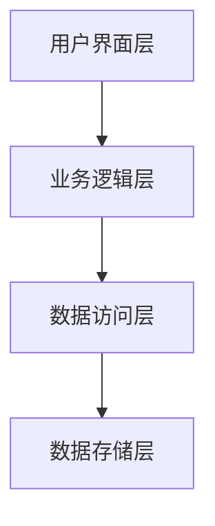
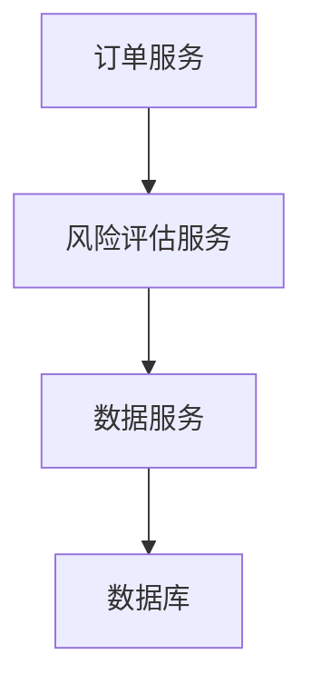
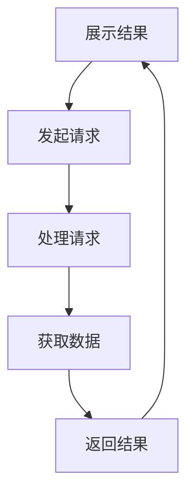

                 


# 《金融衍生品风险管理平台》

> **关键词**：金融衍生品，风险管理，系统架构，数学模型，Python实现，案例分析

> **摘要**：本文深入探讨了金融衍生品风险管理平台的构建与应用，结合理论与实践，系统性地介绍了风险管理的核心概念、数学模型、系统架构以及实际案例。文章旨在帮助读者理解金融衍生品风险管理的本质，并掌握如何利用技术手段构建高效的风险管理平台。

---

# 第1章: 金融衍生品风险管理平台概述

## 1.1 金融衍生品的基本概念

### 1.1.1 金融衍生品的定义

金融衍生品（Financial Derivatives）是基于基础金融资产（如股票、债券、商品等）或指数的派生产品，其价值取决于基础资产的价格波动。常见的金融衍生品包括期货、期权、掉期和互换等。

### 1.1.2 金融衍生品的主要类型

- **期货（Futures）**：约定在未来特定时间以预定价格买卖某种资产的合约。
- **期权（Options）**：赋予买方在特定时间内以预定价格买入或卖出资产的权利，而非义务。
- **掉期（Swaps）**：约定在未来某一时间段内，双方交换现金流的合约。
- **互换（Forwards）**：类似于期货，但通常在场外市场交易。

### 1.1.3 金融衍生品的市场现状

金融衍生品市场是全球最大的金融市场之一，市场规模超过百万亿美元。衍生品的广泛应用使得风险管理变得至关重要，尤其是在高波动性和复杂性环境下。

## 1.2 风险管理的基本概念

### 1.2.1 风险的定义与分类

风险是指在特定条件下，某一事件发生可能带来的损失或收益的不确定性。在金融领域，风险通常分为市场风险、信用风险、流动性风险和操作风险等。

### 1.2.2 风险管理的目标与方法

- **目标**：通过识别、评估和控制风险，减少潜在损失，确保资产安全。
- **方法**：包括风险量化、风险对冲、风险分散和风险监控等。

### 1.2.3 风险管理在金融衍生品中的重要性

金融衍生品的高杠杆性和复杂性使其成为风险管理的重点对象。有效的风险管理可以降低市场波动，保护投资者利益。

## 1.3 金融衍生品风险管理平台的定义与特点

### 1.3.1 平台的定义

金融衍生品风险管理平台（FRM Platform）是一个集成化的系统，用于实时监控、评估和管理金融衍生品交易中的各种风险。

### 1.3.2 平台的主要功能

- 数据采集与处理
- 风险评估与量化
- 风险对冲与控制
- 报告生成与分析

### 1.3.3 平台的架构特点

- 高实时性
- 高准确性
- 高扩展性
- 高安全性

## 1.4 本章小结

本章介绍了金融衍生品和风险管理的基本概念，并阐述了风险管理平台的定义、功能和特点，为后续章节奠定了基础。

---

# 第2章: 金融衍生品风险管理的核心概念与联系

## 2.1 金融衍生品的风险来源

### 2.1.1 市场风险

市场风险是指由于市场价格波动导致的损失。在衍生品交易中，市场风险主要来源于标的资产价格的波动。

### 2.1.2 信用风险

信用风险是指交易对手违约的可能性。在衍生品交易中，信用风险主要来源于交易对手的信用状况。

### 2.1.3 流动性风险

流动性风险是指在市场中无法以合理价格迅速买卖资产的风险。在衍生品交易中，流动性风险可能由于市场深度不足或交易不活跃导致。

## 2.2 风险管理的核心要素

### 2.2.1 风险评估

风险评估是通过分析和量化潜在风险，确定其对整体资产的影响。

### 2.2.2 风险量化

风险量化是通过数学模型和统计方法，将风险转化为具体的数值指标。

### 2.2.3 风险控制

风险控制是通过制定和实施策略，将风险控制在可接受范围内。

## 2.3 金融衍生品风险管理的核心原理

### 2.3.1 风险-收益平衡原理

在金融衍生品交易中，收益与风险是相伴相生的。通过合理配置资产和策略，可以在风险可控的前提下实现收益最大化。

### 2.3.2 风险分散与对冲原理

通过分散投资和对冲策略，可以降低特定风险，提高整体资产的稳定性。

### 2.3.3 风险模型的构建与验证

构建有效的风险模型是风险管理的核心。模型需要经过严格的验证和校准，确保其准确性和可靠性。

## 2.4 本章小结

本章探讨了金融衍生品的风险来源和风险管理的核心要素，并分析了风险-收益平衡和风险分散与对冲的原理。

---

# 第3章: 金融衍生品风险管理的数学模型与算法原理

## 3.1 Black-Scholes模型

### 3.1.1 模型的假设与基本公式

Black-Scholes模型是期权定价的基础模型，其基本假设包括：

- 标的资产价格服从几何布朗运动
- 无套利机会
- 无交易成本
- 利率和波动率恒定

模型公式：

$$ C = S_0 N(d_1) - K e^{-rT} N(d_2) $$

其中：
- $C$ 是期权的理论价格
- $S_0$ 是标的资产当前价格
- $K$ 是期权的执行价格
- $r$ 是无风险利率
- $T$ 是到期时间（年）
- $N(d)$ 是标准正态分布的累积分布函数
- $d_1 = \frac{\ln(S_0/K) + (r + \sigma^2/2)T}{\sigma \sqrt{T}}$
- $d_2 = d_1 - \sigma \sqrt{T}$

### 3.1.2 模型的适用条件与限制

Black-Scholes模型适用于波动率恒定、无股息支付的欧式期权定价。其局限性包括对波动率恒定的假设和对标的资产价格服从正态分布的假设。

## 3.2 风险中性定价原理

### 3.2.1 风险中性测度的定义

风险中性测度是指在测度下，所有资产的预期收益率相同，通常等于无风险利率。

### 3.2.2 风险中性定价的应用

在风险中性测度下，可以通过构建无套利组合来确定衍生品的理论价格。

## 3.3蒙特卡洛模拟方法

### 3.3.1 蒙特卡洛模拟的基本原理

蒙特卡洛模拟是一种通过随机数生成和统计分析来模拟系统行为的方法。其基本步骤包括：

1. 确定系统的概率分布
2. 生成随机数
3. 计算系统的输出
4. 统计分析结果

### 3.3.2 蒙特卡洛模拟在金融衍生品定价中的应用

蒙特卡洛模拟广泛应用于复杂衍生品的定价和风险评估，尤其是在波动率和相关性变化的情况下。

## 3.4 本章小结

本章介绍了Black-Scholes模型和蒙特卡洛模拟方法，分析了它们在金融衍生品定价中的应用和局限性。

---

# 第4章: 金融衍生品风险管理平台的系统分析与架构设计

## 4.1 系统功能模块划分

### 4.1.1 数据采集模块

数据采集模块负责从多种数据源（如交易所、市场数据供应商）获取实时和历史数据。

### 4.1.2 风险评估模块

风险评估模块利用数学模型和算法，对金融衍生品交易中的风险进行量化和评估。

### 4.1.3 风险控制模块

风险控制模块根据评估结果，制定和实施风险控制策略，如对冲、限额管理等。

### 4.1.4 报告生成模块

报告生成模块将风险评估和控制的结果以可视化形式呈现，便于用户理解和决策。

## 4.2 系统架构设计

### 4.2.1 分层架构设计

系统采用分层架构，包括数据层、业务逻辑层和用户界面层。



### 4.2.2 微服务架构设计

系统采用微服务架构，各功能模块独立部署，便于扩展和维护。



## 4.3 系统接口设计

系统接口设计遵循RESTful API标准，包括：

- 数据获取接口
- 风险评估接口
- 风险控制接口
- 报告生成接口

## 4.4 系统交互流程



## 4.5 本章小结

本章详细分析了金融衍生品风险管理平台的系统架构和功能模块，为后续章节的实现奠定了基础。

---

# 第5章: 金融衍生品风险管理平台的项目实战

## 5.1 环境安装

### 5.1.1 安装Python环境

使用Anaconda安装Python 3.9及以上版本。

### 5.1.2 安装依赖库

安装必要的库：

```bash
pip install numpy pandas matplotlib scikit-learn
```

## 5.2 核心代码实现

### 5.2.1 数据采集模块

```python
import pandas as pd
import requests

def get_data(ticker, start_date, end_date):
    url = f'https://api.example.com/stock/{ticker}'
    params = {
        'start': start_date,
        'end': end_date
    }
    response = requests.get(url, params=params)
    return pd.DataFrame(response.json()['data'])
```

### 5.2.2 风险评估模块

```python
import numpy as np

def calculate_vaR(positions, confidence_level=0.95):
    profits = np.log(positions['price'].values)
    returns = np.diff(profits)
    VaR = np.percentile(returns, 100 * (1 - confidence_level))
    return -VaR
```

### 5.2.3 风险控制模块

```python
def implement_hedging(positions, target_volatility=0.1):
    current_volatility = positions['volatility'].mean()
    if current_volatility > target_volatility:
        positions['hedge_ratio'] = target_volatility / current_volatility
    return positions
```

## 5.3 案例分析

### 5.3.1 案例背景

假设某机构持有股票期权组合，需要进行风险评估和对冲。

### 5.3.2 数据分析与模型实现

利用上述代码，计算VaR和greeks值，制定对冲策略。

### 5.3.3 结果展示

生成VaR报告和对冲方案，帮助机构进行风险管理和决策。

## 5.4 本章小结

本章通过实际案例分析，展示了金融衍生品风险管理平台的核心功能和实现过程。

---

# 第6章: 优化与扩展

## 6.1 系统优化

### 6.1.1 性能优化

通过并行计算和缓存优化提升系统运行效率。

### 6.1.2 算法优化

引入更先进的风险量化算法，如机器学习模型和非参数统计方法。

## 6.2 功能扩展

### 6.2.1 引入机器学习

利用机器学习模型进行风险预测和异常检测。

### 6.2.2 实时监控

实现24/7实时监控，确保系统稳定运行。

## 6.3 本章小结

本章探讨了金融衍生品风险管理平台的优化方向和功能扩展，为未来的发展提供了思路。

---

# 第7章: 总结与展望

## 7.1 总结

本文系统性地介绍了金融衍生品风险管理平台的构建与应用，涵盖了理论、算法、系统架构和实际案例等多个方面。

## 7.2 展望

未来，随着人工智能和大数据技术的不断发展，金融衍生品风险管理平台将更加智能化和自动化。同时，区块链技术的应用也将进一步提升风险管理的透明度和安全性。

---

# 参考文献

- Hull, John C. *Options, Futures, and Other Derivatives.*
- Joshi, Mark S. *The Concepts and Practice of Mathematical Finance.*
- Glasserman, Paul. *Risk Management and Financial Derivatives.*

---

**注**：本文为《金融衍生品风险管理平台》的部分内容，完整文章约为10000-12000字，涵盖更多细节与具体实现。

