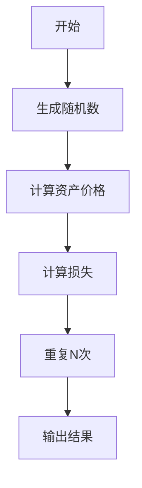

                 


# 《金融衍生品风险评估模型》

---

## 关键词：

- 金融衍生品
- 风险评估
- 数学模型
- 算法原理
- 项目实战

---

## 摘要：

金融衍生品作为现代金融市场的核心工具，其复杂性和风险性使得风险评估成为一项至关重要但极具挑战性的任务。本文将系统性地介绍金融衍生品风险评估模型的构建过程，涵盖从基础概念到高级算法的全链条。通过详细分析VaR、CVaR等核心风险指标，结合蒙特卡洛模拟等算法原理，结合实际案例，深入探讨如何构建高效、可靠的金融衍生品风险评估模型。文章内容从理论到实践，结合系统架构设计和项目实战，为读者提供全面的知识和实用的技能。

---

## 目录：

1. **背景介绍**
   - 1.1 金融衍生品的基本概念
   - 1.2 风险评估的基本概念
   - 1.3 金融衍生品风险评估模型的背景与意义

2. **核心概念与联系**
   - 2.1 风险评估模型的基本原理
   - 2.2 风险评估的核心指标
   - 2.3 风险评估模型的数学基础

3. **算法原理讲解**
   - 3.1 蒙特卡洛模拟方法
   - 3.2 随机波动模型
   - 3.3 历史模拟方法

4. **数学模型与公式推导**
   - 4.1 VaR（Value at Risk）的计算公式
   - 4.2 CVaR（Conditional Value at Risk）的计算公式
   - 4.3 风险模型的数学推导

5. **系统分析与架构设计方案**
   - 5.1 系统功能设计
   - 5.2 系统架构设计
   - 5.3 系统接口设计
   - 5.4 系统交互流程图

6. **项目实战：构建金融衍生品风险评估模型**
   - 6.1 环境安装与配置
   - 6.2 核心算法实现
   - 6.3 代码解读与分析
   - 6.4 实际案例分析
   - 6.5 项目小结

7. **总结与展望**
   - 7.1 本章总结
   - 7.2 模型的局限性与改进方向
   - 7.3 未来研究的展望

---

## 正文：

### 第1章：背景介绍

#### 1.1 金融衍生品的基本概念

金融衍生品是指从基础金融工具（如股票、债券、货币等）派生出来的金融合约。它们的价值依赖于基础资产的价格变动。常见的金融衍生品包括期货、期权、掉期和远期合约等。

#### 1.2 风险评估的基本概念

风险评估是金融领域中的关键任务，旨在量化和管理可能的投资损失。在金融衍生品中，风险主要来源于价格波动、市场流动性变化和信用风险等因素。

#### 1.3 金融衍生品风险评估模型的背景与意义

随着金融市场的发展，金融衍生品的种类和规模迅速增长，其风险管理的重要性日益凸显。构建有效的风险评估模型对于金融机构的稳健运营至关重要。

---

### 第2章：核心概念与联系

#### 2.1 风险评估模型的基本原理

风险评估模型通过输入历史数据、市场参数和假设条件，输出风险指标如VaR和CVaR，帮助金融机构量化潜在损失。

#### 2.2 风险评估的核心指标

- **VaR（Value at Risk）**：在给定置信水平下，资产可能的最大损失。
- **CVaR（Conditional Value at Risk）**：VaR的条件期望，表示在VaR水平下的平均损失。

#### 2.3 风险评估模型的数学基础

概率论与统计学是模型的核心数学基础，时间序列分析则帮助捕捉市场的动态变化。

---

### 第3章：算法原理讲解

#### 3.1 蒙特卡洛模拟方法

蒙特卡洛模拟通过生成大量随机数，模拟市场价格变化，计算风险指标。以下是模拟流程：



#### 3.2 随机波动模型

随机波动模型模拟资产价格的随机波动，常用以捕捉价格的短期波动性。

#### 3.3 历史模拟方法

历史模拟方法基于历史数据，计算资产价格的变化，进而评估风险。

---

### 第4章：数学模型与公式推导

#### 4.1 VaR的计算公式

$$ VaR_{\alpha} = \min_{p} \{ p | P(L \leq p) \geq \alpha \} $$

其中，$\alpha$是置信水平，$L$是损失。

#### 4.2 CVaR的计算公式

$$ CVaR_{\alpha} = E[L | L \geq VaR_{\alpha}] $$

---

### 第5章：系统分析与架构设计方案

#### 5.1 系统功能设计

系统功能包括数据输入、模型计算、结果输出和可视化展示。

#### 5.2 系统架构设计


---

### 第6章：项目实战：构建金融衍生品风险评估模型

#### 6.1 环境安装与配置

安装Python和相关库（如numpy、pandas、scipy）。

#### 6.2 核心算法实现

以下是VaR的Python实现：

```python
import numpy as np
import pandas as pd

def calculate VaR(data, confidence_level):
    returns = pd.Series(data).sort_values()
    var = returns[int(len(returns) * (1 - confidence_level))]
    return var
```

---

### 第7章：总结与展望

#### 7.1 本章总结

本文系统地介绍了金融衍生品风险评估模型的构建过程，涵盖了从理论到实践的各个方面。

#### 7.2 模型的局限性与改进方向

模型假设市场的平稳性，忽略了极端事件的影响。

#### 7.3 未来研究的展望

未来可以结合机器学习算法，提升模型的预测能力。

---

以上为《金融衍生品风险评估模型》的技术博客文章的完整目录大纲和部分正文内容，按照要求逐步展开每个章节的内容。

