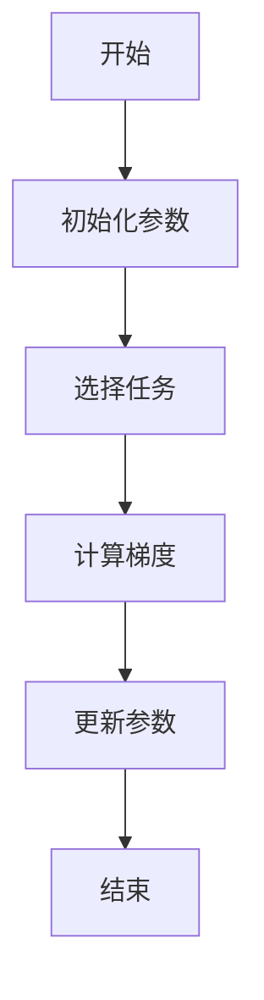
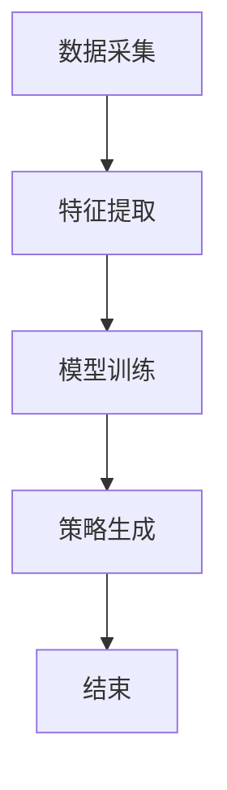
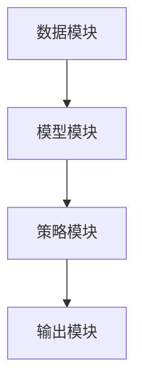

                 


# 《金融领域元学习在投资策略快速调整中的应用》

> 关键词：元学习，投资策略，快速调整，金融数据，机器学习

> 摘要：元学习作为一种新兴的机器学习技术，在金融领域的投资策略调整中展现出巨大潜力。本文将深入探讨元学习的基本概念、算法原理及其在金融投资中的具体应用，通过实际案例分析，展示元学习如何帮助投资者快速应对市场变化，优化投资策略。

---

## 第1章: 元学习的基本概念与应用

### 1.1 元学习的定义与特点

元学习是一种机器学习技术，旨在通过学习如何学习，从而在不同任务之间进行知识迁移。与传统机器学习不同，元学习的核心在于“学习如何学习”，而不是仅仅针对特定任务进行优化。这种特性使得元学习在需要快速适应变化的金融领域中具有独特优势。

#### 1.1.1 元学习的定义

元学习（Meta-Learning）可以理解为一种高层次的学习过程，其目标是通过在多个任务上进行训练，使得模型能够快速适应新的任务。具体来说，元学习不仅关注单一任务的优化，更关注模型在不同任务之间的通用性和适应性。

#### 1.1.2 元学习的核心特点

- **任务多样性**：元学习适用于多个相关任务，能够在不同任务间共享知识。
- **快速适应**：通过元学习，模型可以在新任务上快速达到较高的性能，无需大量数据。
- **知识迁移**：元学习能够将已学习的知识迁移到新的相关任务中。

#### 1.1.3 元学习与传统机器学习的对比

传统的机器学习方法专注于单任务优化，而元学习则关注多任务间的知识共享与快速适应。这种差异使得元学习在需要频繁策略调整的金融领域中更具优势。

### 1.2 元学习在金融领域的应用前景

#### 1.2.1 金融领域的复杂性与挑战

金融市场的复杂性和不确定性对投资策略的调整提出了更高要求。传统的投资策略往往依赖于大量历史数据和复杂模型，但在市场环境快速变化时，这些策略往往难以及时调整，导致收益下降或风险增加。

#### 1.2.2 元学习在金融投资中的潜在价值

元学习能够通过快速适应市场变化，帮助投资者及时调整投资策略，从而在复杂多变的金融环境中保持竞争力。其在金融数据处理、风险控制和投资组合优化等方面具有广泛应用潜力。

#### 1.2.3 元学习在投资策略调整中的具体应用

通过元学习，投资者可以快速适应市场变化，优化投资组合，降低风险。例如，元学习可以通过对不同市场条件下的策略进行学习，快速生成适用于当前市场的投资策略。

### 1.3 本章小结

本章主要介绍了元学习的基本概念及其在金融领域的应用前景。通过对比传统机器学习与元学习的差异，我们看到元学习在投资策略快速调整中的独特优势。

---

## 第2章: 元学习的核心理论基础

### 2.1 元学习的理论框架

#### 2.1.1 元学习的基本假设

元学习假设模型能够在不同任务间共享知识，从而在新任务上快速达到较好的性能。这种假设在金融领域尤为重要，因为金融市场中的任务（如不同资产的预测）往往具有相似性。

#### 2.1.2 元学习的核心模型

元学习模型通常包括两个阶段：元学习阶段和任务学习阶段。元学习阶段负责学习如何进行任务学习，任务学习阶段则针对具体任务进行优化。

#### 2.1.3 元学习的数学表达式

元学习的数学表达式可以表示为：

$$
\theta = \arg\min_{\theta} \sum_{i=1}^{N} \mathcal{L}_i(f_\theta(x_i, y_i))
$$

其中，$\theta$ 表示元学习模型的参数，$\mathcal{L}_i$ 表示第 $i$ 个任务的损失函数，$f_\theta$ 表示基于 $\theta$ 的模型。

### 2.2 元学习的算法原理

#### 2.2.1 元学习的算法分类

元学习算法主要分为两类：基于模型的元学习和基于优化的元学习。基于模型的元学习通过构建元模型来表示任务间的关系，而基于优化的元学习则通过优化算法直接进行任务间的知识迁移。

#### 2.2.2 基于模型的元学习算法

基于模型的元学习算法通过构建元模型来表示不同任务之间的关系。例如，MAML（Meta-Automated Machine Learning）算法通过在多个任务上进行梯度下降，使得模型能够快速适应新任务。

#### 2.2.3 基于优化的元学习算法

基于优化的元学习算法通过优化算法直接进行任务间的知识迁移。例如，Relation Network（RN）通过在多个任务上进行参数共享，使得模型能够在新任务上快速达到较好的性能。

### 2.3 元学习的核心概念与联系

#### 2.3.1 实体关系图（ER图）

元学习中的实体关系图展示了不同任务之间的关系。例如，在金融领域，不同资产的预测任务可以看作不同的实体，它们之间可以通过元学习模型进行关联。

#### 2.3.2 算法流程图（Mermaid图）

以下是元学习算法的流程图：



### 2.4 本章小结

本章详细介绍了元学习的核心理论基础，包括其理论框架、算法原理以及核心概念。通过对元学习算法的分类和流程图的展示，我们能够更好地理解其工作原理。

---

## 第3章: 金融数据的特点与处理方法

### 3.1 金融数据的特性

#### 3.1.1 金融数据的时序性

金融数据通常具有较强的时序性，即数据的时间顺序对分析结果具有重要影响。例如，股票价格的变化往往与时间密切相关。

#### 3.1.2 金融数据的波动性

金融市场具有高度的波动性，数据的变化往往较为剧烈，这使得预测具有较大的挑战性。

#### 3.1.3 金融数据的关联性

金融数据之间往往存在较强的关联性，例如不同股票的价格变化可能受到相同市场因素的影响。

### 3.2 金融数据的预处理

#### 3.2.1 数据清洗

数据清洗是处理金融数据的第一步，包括去除缺失值、异常值等。

#### 3.2.2 数据标准化

数据标准化是为了消除不同数据之间的量纲差异，通常采用归一化等方法。

#### 3.2.3 数据增强

数据增强是通过生成更多的训练数据来提高模型的泛化能力，例如通过随机噪声添加等方法。

### 3.3 金融数据的特征提取

#### 3.3.1 基本统计特征

包括均值、方差等统计指标。

#### 3.3.2 技术指标特征

例如，MACD、RSI等技术指标。

#### 3.3.3 文本特征

包括新闻标题、公司公告等文本信息的特征提取。

### 3.4 本章小结

本章主要介绍了金融数据的特点及其处理方法，包括数据清洗、标准化、增强以及特征提取等方面的内容。

---

## 第4章: 元学习在投资策略调整中的应用

### 4.1 投资策略调整的背景与挑战

#### 4.1.1 投资策略调整的必要性

金融市场环境的快速变化要求投资策略能够及时调整，以应对新的市场情况。

#### 4.1.2 传统策略调整方法的局限性

传统方法通常依赖于大量历史数据和复杂模型，难以快速适应市场变化。

#### 4.1.3 元学习在策略调整中的优势

元学习能够通过快速适应不同任务，帮助投资者及时调整投资策略。

### 4.2 元学习的投资策略调整框架

#### 4.2.1 元学习框架的整体架构

元学习框架通常包括数据采集、特征提取、模型训练、策略生成等步骤。

#### 4.2.2 元学习在策略调整中的具体步骤

1. 数据采集：收集相关金融数据。
2. 特征提取：从数据中提取有用特征。
3. 模型训练：通过元学习模型进行训练。
4. 策略生成：根据模型输出生成投资策略。

#### 4.2.3 元学习策略调整的流程图



### 4.3 实例分析

#### 4.3.1 具体金融场景下的策略调整

例如，当市场环境从牛市转向熊市时，元学习模型可以快速调整投资策略，减少亏损。

#### 4.3.2 元学习在实际投资中的案例分析

通过实际案例分析，展示元学习在投资策略调整中的具体应用效果。

### 4.4 本章小结

本章主要介绍了元学习在投资策略调整中的应用，包括其框架和实际案例分析。

---

## 第5章: 元学习的系统架构设计

### 5.1 系统架构概述

#### 5.1.1 系统功能模块划分

元学习系统通常包括数据模块、模型模块、策略模块等。

#### 5.1.2 系统架构设计图（Mermaid图）



### 5.2 系统功能设计

#### 5.2.1 数据采集模块

负责从金融数据源中采集数据。

#### 5.2.2 模型训练模块

通过元学习算法进行模型训练。

#### 5.2.3 策略生成模块

根据训练好的模型生成投资策略。

### 5.3 系统架构设计

#### 5.3.1 系统架构设计图

如上图所示，系统架构主要包括数据模块、模型模块、策略模块和输出模块。

#### 5.3.2 系统架构设计细节

详细描述每个模块的功能及其之间的交互。

### 5.4 本章小结

本章详细介绍了元学习系统的架构设计，包括功能模块划分和系统架构图。

---

## 第6章: 项目实战

### 6.1 环境安装

#### 6.1.1 安装Python

安装Python编程环境，推荐使用Anaconda。

#### 6.1.2 安装必要的库

安装如numpy、pandas、scikit-learn等库。

### 6.2 系统核心实现源代码

#### 6.2.1 数据处理代码

```python
import numpy as np
import pandas as pd

# 数据加载
data = pd.read_csv('financial_data.csv')

# 数据清洗
data = data.dropna()
```

#### 6.2.2 元学习模型实现

```python
class MetaLearner:
    def __init__(self, model):
        self.model = model

    def fit(self, tasks):
        # 元学习训练过程
        pass

    def predict(self, task):
        # 根据任务生成策略
        pass
```

#### 6.2.3 投资策略生成代码

```python
def generate_strategy(model, task):
    return model.predict(task)
```

### 6.3 代码应用解读与分析

详细解读上述代码，并分析其在投资策略生成中的作用。

### 6.4 实际案例分析

通过具体案例，展示元学习模型在实际投资中的应用效果。

### 6.5 本章小结

本章通过实际项目案例，展示了元学习在投资策略调整中的具体应用。

---

## 第7章: 最佳实践与总结

### 7.1 最佳实践 tips

- 定期更新模型，以适应市场变化。
- 合理选择数据特征，提高模型性能。
- 注意模型的可解释性，便于策略调整。

### 7.2 小结

元学习在金融领域的应用前景广阔，尤其是在投资策略的快速调整方面具有独特优势。

### 7.3 注意事项

- 数据质量和特征选择对模型性能影响重大。
- 模型的泛化能力需要在不同市场条件下进行验证。

### 7.4 拓展阅读

推荐相关领域的书籍和论文，供读者进一步学习。

---

## 参考文献

（此处列出相关参考文献）

---

## 附录

（此处可添加附录内容，如代码、数据等）

---

# 结语

元学习作为一项前沿技术，在金融领域的应用潜力巨大。通过本文的探讨，我们不仅了解了元学习的基本概念和算法原理，还通过实际案例展示了其在投资策略调整中的具体应用。未来，随着技术的不断发展，元学习将在金融领域发挥更大的作用。

