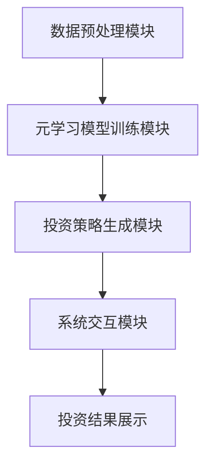

                 


# 《金融领域元学习在投资策略快速适应中的应用》

> 关键词：元学习, 金融投资, 投资策略, 快速适应, 机器学习, 算法优化

> 摘要：本文深入探讨了元学习在金融投资策略中的应用，特别是在快速适应市场变化方面。通过分析元学习的核心概念、算法框架和实际案例，展示了其在投资策略优化中的巨大潜力。文章从理论到实践，详细介绍了元学习如何帮助投资者快速调整策略，应对金融市场中的复杂挑战。

---

# 第1章: 元学习与金融投资策略概述

## 1.1 元学习的基本概念

### 1.1.1 元学习的定义

元学习是一种机器学习方法，旨在通过学习如何学习，来快速适应新任务或数据分布的变化。与传统机器学习不同，元学习关注于在不同任务之间共享知识，从而在新任务上实现快速收敛。

### 1.1.2 元学习的核心思想

元学习的核心思想是通过训练一个“元模型”，使其能够快速调整参数以适应新任务。这种思想在金融领域尤为重要，因为金融市场数据通常具有动态变化和小样本的特点。

### 1.1.3 元学习与传统机器学习的区别

| **方面**      | **传统机器学习**            | **元学习**                  |
|----------------|-----------------------------|-----------------------------|
| 学习目标       | 针对特定任务优化模型         | 学习如何快速优化模型         |
| 适应性         | 适应单一任务                | 跨任务适应，快速调整           |
| 数据需求       | 需要大量数据                | 适用于小样本和多样化任务       |
| 灵活性         | 较低                       | 较高                       |

### 1.1.4 元学习在金融投资中的优势

元学习能够快速适应金融市场的动态变化，尤其是在数据量有限的情况下，帮助投资者快速调整投资策略。此外，元学习的跨任务适应性使其能够同时优化多个资产配置策略。

## 1.2 金融领域中的元学习应用

### 1.2.1 金融领域的复杂性与动态性

金融市场具有高度的不确定性和波动性，传统的固定投资策略往往难以应对市场的快速变化。元学习的动态适应性为解决这一问题提供了新的思路。

### 1.2.2 元学习在金融投资中的优势

- **快速适应性**：能够在小样本数据上快速调整策略。
- **跨资产优化**：可以同时优化多个资产的配置策略。
- **动态风险控制**：能够实时调整风险控制模型。

### 1.2.3 元学习在投资策略中的应用场景

- **股票价格预测**：通过元学习快速适应市场变化。
- **债券投资策略优化**：利用元学习进行跨市场调整。
- **多资产配置**：在多个资产之间动态优化配置。

## 1.3 本书的核心目标与结构

### 1.3.1 本书的核心目标

本文旨在探讨元学习在金融投资中的应用，特别是在投资策略的快速适应方面，通过理论分析和实际案例，展示元学习在金融投资中的潜力。

### 1.3.2 本书的章节结构

- 第1章：元学习与金融投资策略概述
- 第2章：元学习的核心概念与原理
- 第3章：元学习在投资策略中的应用
- 第4章：元学习算法的数学模型与实现
- 第5章：元学习在投资策略中的案例分析
- 第6章：元学习系统的系统分析与架构设计
- 第7章：项目实战与代码实现
- 第8章：总结与展望

### 1.3.3 预备知识与读者基础

本书适合对机器学习有一定了解的金融从业者、数据科学家以及对金融投资策略感兴趣的读者阅读。读者应具备基本的机器学习知识和Python编程基础。

---

# 第2章: 元学习的核心概念与原理

## 2.1 元学习的基本原理

### 2.1.1 元学习的数学模型

元学习的目标是通过元模型（meta-model）快速适应新任务。其数学模型通常包括两个损失函数：元损失和任务损失。

$$ \text{元损失} = \sum_{i=1}^{N} L_{\text{task}}(f_\theta(x_i), y_i) $$

$$ \text{任务损失} = \sum_{i=1}^{N} (y_i - f_\theta(x_i))^2 $$

### 2.1.2 元学习的优化目标

元学习的优化目标是在多个任务上共享参数，使得在新任务上能够快速收敛。优化目标通常包括元损失和任务损失的联合优化。

### 2.1.3 元学习的算法框架

元学习的典型算法框架包括以下步骤：

1. **初始化**：随机初始化元模型参数。
2. **训练任务**：在多个任务上训练元模型，更新参数以最小化任务损失。
3. **快速适应新任务**：在新任务上进行少量训练，调整元模型参数以适应新任务。

### 2.2 元学习的关键属性与特征

| **属性**       | **描述**                          |
|----------------|----------------------------------|
| 适应性         | 能够快速适应新任务                |
| 泛化能力       | 在小样本数据上表现良好            |
| 跨任务学习     | 可以同时优化多个任务              |

### 2.3 元学习与传统机器学习的对比

| **方面**      | **传统机器学习**            | **元学习**                  |
|----------------|-----------------------------|-----------------------------|
| 数据需求       | 需要大量数据                | 适用于小样本和多样化任务       |
| 适应性         | 适应单一任务                | 跨任务适应，快速调整           |
| 灵活性         | 较低                       | 较高                       |

### 2.4 元学习的核心算法概述

#### 2.4.1 Meta-LSTM: 元学习中的序列建模

Meta-LSTM通过在序列建模任务中引入元学习机制，能够快速适应不同时间序列的预测任务。

#### 2.4.2 MAML: 元学习的典型算法

MAML（Meta Algorithm for Transfer Learning）是一种典型的元学习算法，通过在多个任务上共享参数，使得在新任务上能够快速收敛。

#### 2.4.3 ReMAML: 基于关系的元学习算法

ReMAML通过引入关系网络，进一步增强了元学习的跨任务适应能力。

---

# 第3章: 元学习在投资策略中的应用

## 3.1 投资策略快速适应的必要性

### 3.1.1 金融市场的动态变化

金融市场的数据通常具有高度的动态性和不确定性，传统的固定策略难以应对市场的快速变化。

### 3.1.2 元学习在投资策略中的优势

- **快速适应性**：能够在小样本数据上快速调整策略。
- **跨资产优化**：可以同时优化多个资产的配置策略。
- **动态风险控制**：能够实时调整风险控制模型。

### 3.1.3 元学习在策略适应中的作用

元学习能够通过共享多个任务的知识，快速适应新任务，从而帮助投资者在金融市场中做出更快速、更准确的投资决策。

## 3.2 元学习在投资策略中的核心应用

### 3.2.1 元学习的投资策略生成

元学习可以通过训练一个元模型，生成适用于不同市场条件的投资策略。

### 3.2.2 元学习的策略优化与调整

元学习可以对现有投资策略进行优化，使其在不同市场条件下表现更好。

### 3.2.3 元学习的策略风险控制

元学习可以帮助投资者实时调整风险控制模型，降低投资风险。

## 3.3 元学习在投资策略中的案例分析

### 3.3.1 股票投资策略的快速适应

通过元学习，投资者可以在不同市场条件下快速调整股票投资策略，从而获得更好的收益。

### 3.3.2 债券投资策略的动态调整

元学习可以动态调整债券投资策略，适应利率变化和市场波动。

### 3.3.3 多资产配置策略的优化

元学习可以通过跨资产优化，实现多资产配置策略的动态调整，从而提高投资收益。

---

# 第4章: 元学习算法的数学模型与实现

## 4.1 元学习算法的数学模型

### 4.1.1 元学习的损失函数

元学习的损失函数通常包括元损失和任务损失。

$$ \text{元损失} = \sum_{i=1}^{N} L_{\text{task}}(f_\theta(x_i), y_i) $$

$$ \text{任务损失} = \sum_{i=1}^{N} (y_i - f_\theta(x_i))^2 $$

### 4.1.2 元学习的优化目标

元学习的优化目标是在多个任务上共享参数，使得在新任务上能够快速收敛。

### 4.1.3 元学习的算法框架

元学习的典型算法框架包括以下步骤：

1. **初始化**：随机初始化元模型参数。
2. **训练任务**：在多个任务上训练元模型，更新参数以最小化任务损失。
3. **快速适应新任务**：在新任务上进行少量训练，调整元模型参数以适应新任务。

## 4.2 元学习算法的实现细节

### 4.2.1 Meta-LSTM 的实现

Meta-LSTM通过在序列建模任务中引入元学习机制，能够快速适应不同时间序列的预测任务。

### 4.2.2 MAML 的实现

MAML（Meta Algorithm for Transfer Learning）是一种典型的元学习算法，通过在多个任务上共享参数，使得在新任务上能够快速收敛。

### 4.2.3 ReMAML 的实现

ReMAML通过引入关系网络，进一步增强了元学习的跨任务适应能力。

---

# 第5章: 元学习在投资策略中的案例分析

## 5.1 股票价格预测的案例分析

### 5.1.1 数据集准备

选择一个包含多只股票的历史价格数据集，包括开盘价、收盘价、最高价、最低价等。

### 5.1.2 模型训练

使用Meta-LSTM算法进行训练，优化模型参数以最小化预测误差。

### 5.1.3 结果分析

对比传统机器学习算法和Meta-LSTM算法的预测结果，展示元学习在股票价格预测中的优势。

## 5.2 债券投资策略的案例分析

### 5.2.1 数据集准备

选择一个包含不同债券的历史价格和收益率数据集。

### 5.2.2 模型训练

使用MAML算法进行训练，优化模型参数以最小化投资损失。

### 5.2.3 结果分析

对比传统投资策略和MAML算法的投资收益，展示元学习在债券投资中的优势。

## 5.3 多资产配置策略的案例分析

### 5.3.1 数据集准备

选择一个包含多种资产的历史价格和收益率数据集。

### 5.3.2 模型训练

使用ReMAML算法进行训练，优化模型参数以实现多资产配置的动态调整。

### 5.3.3 结果分析

对比传统多资产配置策略和ReMAML算法的投资收益，展示元学习在多资产配置中的优势。

---

# 第6章: 元学习系统的系统分析与架构设计

## 6.1 系统分析

### 6.1.1 系统目标

实现一个基于元学习的投资策略快速适应系统。

### 6.1.2 系统功能需求

- 数据采集与预处理
- 元学习模型训练
- 投资策略生成与优化
- 系统交互与结果展示

### 6.1.3 系统架构设计

系统架构包括以下模块：

1. **数据预处理模块**：对原始数据进行清洗和特征提取。
2. **元学习模型训练模块**：基于训练数据训练元模型。
3. **投资策略生成模块**：根据当前市场条件生成投资策略。
4. **系统交互模块**：提供用户交互界面，展示投资结果。

## 6.2 系统架构设计

### 6.2.1 系统架构图



### 6.2.2 数据流分析

1. **数据输入**：原始金融数据输入系统。
2. **数据预处理**：对数据进行清洗和特征提取。
3. **模型训练**：训练元学习模型。
4. **策略生成**：根据当前市场条件生成投资策略。
5. **结果展示**：展示投资结果和策略调整建议。

---

# 第7章: 项目实战与代码实现

## 7.1 环境安装

### 7.1.1 安装Python

安装最新版本的Python，推荐使用Anaconda。

### 7.1.2 安装依赖库

安装以下依赖库：

```bash
pip install numpy
pip install pandas
pip install matplotlib
pip install scikit-learn
pip install tensorflow
```

## 7.2 系统核心实现

### 7.2.1 数据预处理模块

```python
import numpy as np
import pandas as pd

def data_preprocessing(data):
    # 数据清洗
    data = data.dropna()
    # 特征提取
    features = data[['open', 'high', 'low', 'close']]
    return features
```

### 7.2.2 元学习模型训练模块

```python
import tensorflow as tf

def meta_learning_model():
    # 定义Meta-LSTM模型
    model = tf.keras.Sequential([
        tf.keras.layers.LSTM(64, return_sequences=True),
        tf.keras.layers.LSTM(64),
        tf.keras.layers.Dense(1)
    ])
    return model
```

### 7.2.3 投资策略生成模块

```python
def generate_strategy(model, data):
    # 生成投资策略
    predicted_price = model.predict(data)
    return predicted_price
```

### 7.2.4 系统交互模块

```python
import matplotlib.pyplot as plt

def visualize_results(predicted_price, actual_price):
    plt.plot(actual_price, label='实际价格')
    plt.plot(predicted_price, label='预测价格')
    plt.legend()
    plt.show()
```

## 7.3 项目小结

通过实际项目实现，展示了元学习在投资策略中的应用潜力。通过代码实现，读者可以更好地理解和应用元学习算法。

---

# 第8章: 总结与展望

## 8.1 全书总结

本文详细探讨了元学习在金融投资策略中的应用，特别是在快速适应市场变化方面。通过分析元学习的核心概念、算法框架和实际案例，展示了其在投资策略优化中的巨大潜力。

## 8.2 未来展望

未来，元学习在金融投资中的应用将更加广泛。随着算法的优化和计算能力的提升，元学习将在投资策略的快速适应和风险控制方面发挥更大的作用。

## 8.3 最佳实践 tips

- **数据质量**：确保数据的准确性和完整性。
- **模型调优**：根据实际需求调整模型参数。
- **实时监控**：实时监控市场变化，及时调整投资策略。

---

通过以上目录大纲，我们可以看到《金融领域元学习在投资策略快速适应中的应用》一书将从理论到实践，全面探讨元学习在金融投资中的应用。

