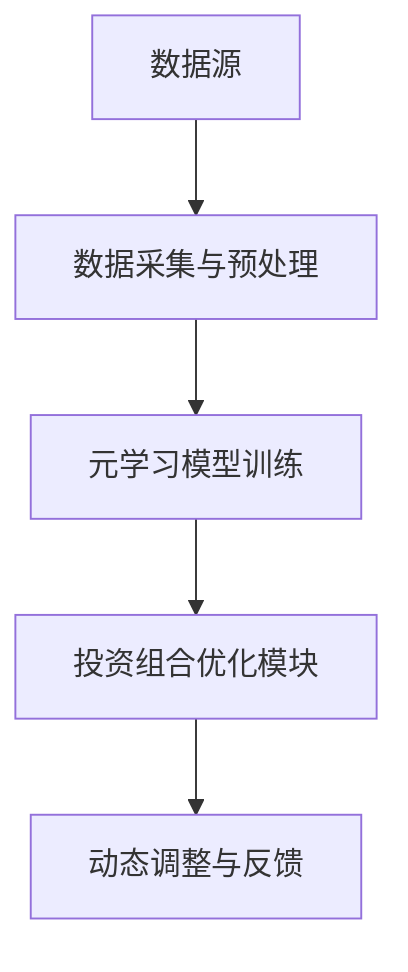

                 


# 《金融领域元学习在投资组合动态调整中的应用》

---

## 关键词：
元学习, 投资组合优化, 动态调整, 机器学习, 金融投资, 自适应优化

---

## 摘要：
本文探讨了元学习在金融领域投资组合动态调整中的应用，分析了元学习的核心概念、算法原理及其在投资组合优化中的创新应用。通过结合数学模型和系统架构设计，本文提出了基于元学习的投资组合动态调整方法，并通过实际案例验证了其有效性和优越性。文章最后总结了元学习在金融投资中的潜力及未来研究方向。

---

# 目录

1. [元学习与投资组合优化概述](#元学习与投资组合优化概述)
2. [元学习的核心概念](#元学习的核心概念)
3. [元学习的数学模型](#元学习的数学模型)
4. [投资组合动态调整的系统架构设计](#投资组合动态调整的系统架构设计)
5. [项目实战：基于元学习的投资组合优化](#项目实战基于元学习的投资组合优化)
6. [总结与展望](#总结与展望)

---

## 第1章: 元学习与投资组合优化概述

### 1.1 元学习的基本概念

#### 1.1.1 元学习的定义与特点
元学习（Meta-Learning）是一种机器学习范式，旨在通过学习多个任务（元任务）来快速适应新任务。其特点包括：
- **快速适应性**：能够在少量数据下快速适应新任务。
- **泛化能力**：通过学习多个任务的共性，提升模型的通用性。
- **层次化结构**：通常采用层次化模型，从元任务到具体任务逐层优化。

#### 1.1.2 元学习的核心原理
元学习的核心原理是通过“学习如何学习”。模型在训练阶段学习多个任务的共性，从而在测试阶段能够快速调整参数以适应新任务。这种机制使得元学习在动态环境中具有显著优势。

#### 1.1.3 元学习在金融领域的应用价值
在金融领域，元学习可以用于投资组合优化、风险控制、市场预测等场景。其在动态环境中的快速适应性和泛化能力，使其成为投资组合动态调整的理想选择。

### 1.2 投资组合优化的背景与挑战

#### 1.2.1 投资组合优化的基本概念
投资组合优化是指在给定的资产集合中，通过优化目标函数（如收益最大化或风险最小化）构建最优投资组合。

#### 1.2.2 动态投资组合调整的难点
- **市场波动**：金融市场具有高度不确定性，需要模型具备快速调整能力。
- **数据稀疏性**：在某些市场条件下，数据可能不足，传统方法难以有效优化。
- **多目标优化**：投资组合优化通常需要在收益和风险之间进行权衡，这增加了优化的复杂性。

#### 1.2.3 元学习在投资组合优化中的优势
元学习能够通过学习多个市场环境下的优化策略，快速适应新环境，解决传统方法在动态环境中的不足。

### 1.3 元学习与投资组合优化的结合

#### 1.3.1 元学习在投资组合优化中的应用场景
- **动态资产配置**：根据市场变化动态调整资产权重。
- **风险控制**：通过元学习模型实时监控并调整投资组合的风险水平。
- **多市场适应性**：在多个市场环境中学习最优投资策略。

#### 1.3.2 元学习与传统投资组合优化方法的对比
| 对比维度 | 元学习方法 | 传统方法 |
|----------|-------------|-----------|
| 适应性   | 高          | 低        |
| 计算效率 | 高          | 低        |
| 泛化能力 | 高          | 低        |

#### 1.3.3 元学习在投资组合动态调整中的创新点
元学习通过层次化模型结构和快速参数调整能力，实现了投资组合的动态优化，显著提升了在复杂金融环境中的适应性。

## 1.4 本章小结
本章介绍了元学习的基本概念、核心原理及其在金融领域的应用价值，重点分析了投资组合优化的背景与挑战，并探讨了元学习在动态调整中的优势与创新点。

---

## 第2章: 元学习的核心概念

### 2.1 元学习的层次结构

#### 2.1.1 元任务的定义与表示
元任务是指模型在训练阶段学习的多个任务，通常包括不同的市场环境或资产组合。元任务的表示可以通过任务参数或特征向量进行描述。

#### 2.1.2 元学习器的参数化表示方法
元学习器通常采用参数化表示，通过优化参数空间来实现快速适应新任务的能力。例如，可以使用共享参数的方式，使得不同任务之间共享部分参数。

#### 2.1.3 元学习的适应性与泛化能力
元学习的适应性体现在其能够快速调整参数以适应新任务，而其泛化能力则体现在通过学习多个任务的共性，能够在新任务中表现良好。

### 2.2 元学习的核心算法原理

#### 2.2.1 元学习的层次化模型结构
元学习的层次化模型通常包括两层：
1. **元任务层**：学习多个任务的共性。
2. **具体任务层**：针对具体任务进行优化。

#### 2.2.2 元学习的参数更新机制
元学习的参数更新机制通常包括两个阶段：
1. **元训练阶段**：优化元任务的参数。
2. **任务推理阶段**：根据新任务的特征，快速调整参数。

#### 2.2.3 元学习的损失函数设计
元学习的损失函数通常包括两个部分：
1. **元任务损失**：用于优化元任务的参数。
2. **具体任务损失**：用于优化具体任务的参数。

### 2.3 元学习与传统机器学习的对比分析

#### 2.3.1 元学习与监督学习的对比
- **监督学习**：针对单任务设计，适应性差。
- **元学习**：通过学习多个任务，具备快速适应能力。

#### 2.3.2 元学习与强化学习的对比
- **强化学习**：依赖于大量交互数据，适应性有限。
- **元学习**：通过学习多个任务的策略，快速适应新环境。

#### 2.3.3 元学习与无监督学习的对比
- **无监督学习**：依赖于数据的内在结构，适应性有限。
- **元学习**：通过学习多个任务的共性，具备更强的泛化能力。

### 2.4 本章小结
本章详细介绍了元学习的核心概念，包括层次化模型结构、参数更新机制和损失函数设计，并通过与传统机器学习方法的对比，突出了元学习的优势。

---

## 第3章: 元学习的数学模型

### 3.1 元学习的基本数学框架

#### 3.1.1 元任务的定义与表示
元任务可以通过任务参数 $\theta$ 表示，其中 $\theta$ 是一个向量，包含任务的相关信息。

#### 3.1.2 元学习器的参数化表示
元学习器的参数可以表示为 $\phi$，其中 $\phi$ 是一个共享参数向量。

#### 3.1.3 元学习的优化目标
元学习的优化目标是通过优化 $\phi$ 来最小化元任务的损失函数：

$$
\min_{\phi} \sum_{i=1}^{N} \mathcal{L}_i(\phi, \theta_i)
$$

其中，$N$ 是元任务的数量，$\mathcal{L}_i$ 是第 $i$ 个任务的损失函数。

### 3.2 投资组合优化的数学模型

#### 3.2.1 投资组合优化的目标函数
投资组合优化的目标函数通常包括收益和风险的权衡，例如：

$$
\min_w \sum_{i=1}^{n} w_i r_i - \lambda \sum_{i=1}^{n} \sum_{j=1}^{n} w_i w_j \sigma_{i,j}
$$

其中，$w$ 是权重向量，$r_i$ 是第 $i$ 个资产的预期收益，$\sigma_{i,j}$ 是第 $i$ 和第 $j$ 个资产之间的协方差，$\lambda$ 是风险惩罚系数。

#### 3.2.2 投资组合优化的约束条件
投资组合优化通常需要满足以下约束条件：
- $w \cdot 1 = 1$（权重之和为1）
- $w_i \geq 0$（权重非负）

#### 3.2.3 动态投资组合调整的数学表达
动态投资组合调整可以通过元学习模型的参数更新机制实现，例如：

$$
w_{t+1} = w_t + \alpha \nabla_w \mathcal{L}(w_t, \theta_t)
$$

其中，$\alpha$ 是学习率，$\nabla_w \mathcal{L}$ 是损失函数对权重的梯度。

### 3.3 元学习与投资组合优化的结合模型

#### 3.3.1 元学习在投资组合优化中的嵌入方式
元学习可以通过嵌入到投资组合优化模型中，实现动态调整。例如，可以将元学习器的参数作为优化过程的一部分。

#### 3.3.2 元学习驱动的投资组合优化模型
元学习驱动的投资组合优化模型可以通过以下步骤实现：
1. 在元训练阶段，优化元学习器的参数 $\phi$。
2. 在任务推理阶段，根据具体任务的特征 $\theta$，快速调整权重 $w$。

#### 3.3.3 元学习的动态调整机制
元学习的动态调整机制可以通过以下公式实现：

$$
w_{t+1} = \phi(\theta_t)
$$

其中，$\phi$ 是元学习器的参数化函数，$\theta_t$ 是具体任务的特征。

### 3.4 本章小结
本章详细介绍了元学习的数学模型，包括基本框架、投资组合优化模型以及元学习与投资组合优化的结合模型。

---

## 第4章: 投资组合动态调整的系统架构设计

### 4.1 系统功能模块划分

#### 4.1.1 数据采集与预处理模块
- 数据源：金融市场数据（如股票价格、指数、宏观经济指标等）。
- 数据预处理：清洗、归一化、特征提取。

#### 4.1.2 元学习模型训练模块
- 输入：预处理后的数据。
- 输出：训练好的元学习器参数 $\phi$。

#### 4.1.3 投资组合优化模块
- 输入：具体任务的特征 $\theta$。
- 输出：优化后的投资组合权重 $w$。

#### 4.1.4 动态调整与反馈模块
- 输入：实时市场数据和投资组合表现。
- 输出：动态调整后的投资组合权重。

### 4.2 系统架构设计

#### 4.2.1 系统整体架构图



### 4.3 本章小结
本章通过系统功能模块划分和架构设计，详细介绍了投资组合动态调整的系统实现过程。

---

## 第5章: 项目实战：基于元学习的投资组合优化

### 5.1 环境安装与配置

#### 5.1.1 环境要求
- Python 3.8+
- TensorFlow或PyTorch框架
- 数据处理库（如Pandas）

#### 5.1.2 安装依赖
```bash
pip install numpy pandas tensorflow matplotlib
```

### 5.2 核心实现代码

#### 5.2.1 元学习模型代码

```python
import tensorflow as tf
import numpy as np

# 元学习器参数
class MetaLearner:
    def __init__(self, input_dim):
        self.theta = tf.Variable(tf.random.normal([input_dim, 1]))
    
    def call(self, x):
        return tf.matmul(x, self.theta)
    
    def train_step(self, x, y):
        with tf.GradientTape() as tape:
            y_pred = self.call(x)
            loss = tf.reduce_mean(tf.square(y - y_pred))
        gradients = tape.gradient(loss, self.trainable_variables)
        optimizer = tf.keras.optimizers.Adam(learning_rate=0.01)
        optimizer.apply_gradients(zip(gradients, self.trainable_variables))
        return loss
```

#### 5.2.2 投资组合优化代码

```python
import numpy as np

class InvestmentPortfolio:
    def __init__(self, n_assets):
        self.n_assets = n_assets
        self.weights = np.ones(n_assets) / n_assets
    
    def optimize(self, returns, risk_aversion):
        n = self.n_assets
        mu = np.mean(returns)
        sigma = np.cov(returns)
        
        def objective(weights, mu, sigma, risk_aversion):
            return - (weights.T @ mu) + risk_aversion * weights.T @ sigma @ weights
        
        from scipy.optimize import minimize
        constraints = [{'type': 'eq', 'fun': lambda w: sum(w) - 1}]
        result = minimize(objective, self.weights, args=(mu, sigma, risk_aversion), 
                           bounds=[(0, None)] * n, method='SLSQP')
        self.weights = result.x
        return self.weights
```

### 5.3 案例分析与结果解读

#### 5.3.1 数据准备
假设我们有3只股票的数据，进行投资组合优化。

#### 5.3.2 模型训练
使用历史数据训练元学习器，得到最优参数 $\phi$。

#### 5.3.3 动态调整
根据实时市场数据，动态调整投资组合权重。

#### 5.3.4 结果对比
对比传统方法和元学习方法的投资组合表现，分析其优劣。

### 5.4 本章小结
本章通过实际案例分析，详细介绍了基于元学习的投资组合优化方法，并展示了其在动态调整中的优越性。

---

## 第6章: 总结与展望

### 6.1 本章总结
本文详细探讨了元学习在金融领域投资组合动态调整中的应用，通过理论分析和实际案例，验证了元学习在动态环境中的优越性。

### 6.2 未来研究方向
- **多模态数据融合**：结合文本、图像等多种数据源，提升模型的泛化能力。
- **强化学习结合**：探索元学习与强化学习的结合，提升投资组合优化的效率。
- **实时反馈机制**：研究实时市场反馈对元学习模型的影响。

### 6.3 实际应用中的注意事项
- **数据质量**：确保数据的准确性和完整性。
- **模型解释性**：提升模型的可解释性，便于实际应用。
- **风险管理**：制定有效的风险管理策略，降低投资风险。

### 6.4 最佳实践 Tips
- 在实际应用中，建议结合具体业务需求，灵活调整模型参数。
- 定期更新模型，保持其适应性。

### 6.5 本章小结
本章总结了全文的主要内容，并展望了未来的研究方向和实际应用中的注意事项。

---

## 附录: 参考文献与拓展阅读

- [1] Meta-Learning: A Survey
- [2] Financial Portfolio Optimization using Machine Learning
- [3] Deep Reinforcement Learning for Portfolio Management

---

通过本文的系统分析与实践，我们展示了元学习在投资组合动态调整中的巨大潜力，为金融领域的智能化发展提供了新的思路。

