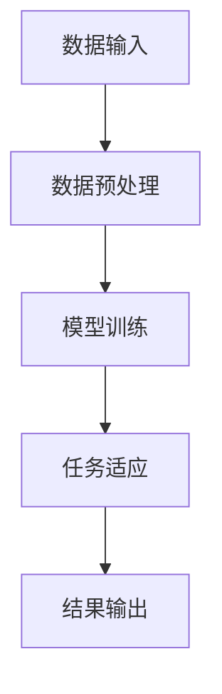

                 


# 《金融领域元学习在模型快速适应中的应用》

---

## 关键词：
元学习（Meta-Learning）、金融建模、模型快速适应、金融预测、风险管理、机器学习

---

## 摘要：
本文深入探讨了元学习在金融领域的应用，特别是在模型快速适应方面的优势。通过分析元学习的基本概念、核心原理、算法实现以及系统架构，本文展示了如何利用元学习技术在金融数据的动态变化中快速调整模型，提升预测和决策的准确性。文章还结合实际案例，详细讲解了元学习在股票价格预测、风险管理等场景中的应用，并总结了元学习在金融领域的未来发展方向和应用前景。

---

# 第1章：元学习的基本概念与背景

## 1.1 元学习的定义与核心概念

元学习是一种机器学习范式，旨在通过学习如何学习来快速适应新任务。与传统机器学习不同，元学习模型能够在少量数据的情况下快速调整，适用于任务多样性和数据稀疏性较高的场景。

### 1.1.1 元学习的定义
元学习（Meta-Learning）是指通过训练模型在多个相关任务中学习，使其能够快速适应新任务的能力。其核心在于利用跨任务的信息来提升模型的泛化能力。

### 1.1.2 元学习的核心概念
- **元任务**：多个相关任务的集合，用于训练元学习模型。
- **元参数**：控制模型参数更新的参数，用于快速适应新任务。
- **任务适应**：通过调整元参数，使模型在新任务上表现最佳。

### 1.1.3 元学习与传统机器学习的区别
| 特性 | 传统机器学习 | 元学习 |
|------|---------------|---------|
| 数据需求 | 需要大量数据 | 适用于数据稀疏场景 |
| 适应性 | 模型固定，适应性差 | 具备快速适应新任务的能力 |
| 应用场景 | 单一任务优化 | 多任务学习与快速适应 |

---

## 1.2 金融领域中的模型快速适应需求

金融领域的数据具有高度动态性，模型需要快速适应市场变化。元学习在金融领域的应用主要体现在以下几个方面：

### 1.2.1 金融领域模型适应的挑战
- 数据稀疏性：金融数据可能不足以训练专用模型。
- 动态变化：市场环境频繁变化，模型需要快速调整。
- 多任务学习：金融涉及多个相关任务，如预测、风控等。

### 1.2.2 快速适应的具体应用场景
- 股票价格预测：快速适应市场变化，捕捉短期趋势。
- 风险管理：实时调整风险评估模型。
- 交易策略优化：快速调整策略以应对市场变化。

### 1.2.3 元学习在金融领域的优势
- 快速适应性：能够在少量数据和有限时间内适应新任务。
- 多任务学习能力：可以同时优化多个相关任务。
- 鲁棒性：在数据稀疏场景下表现稳定。

---

## 1.3 元学习在金融领域的应用前景

随着金融市场的复杂化和数据化的推进，元学习的应用前景广阔。元学习可以帮助金融机构快速构建适应性强的模型，提高预测和决策的准确性。

### 1.3.1 金融领域的动态变化特点
- 数据的实时性和动态性：金融市场数据不断变化，模型需要实时调整。
- 多因素影响：市场受多种内外部因素影响，模型需综合考虑。
- 高风险和高收益并存：需要精确的模型快速做出决策。

### 1.3.2 元学习在金融预测中的潜力
- 提高预测精度：通过元学习，模型可以在有限数据下快速优化预测能力。
- 实时调整策略：元学习模型能够实时更新，适应市场变化。
- 多任务优化：同时优化多个相关任务，如预测和风险控制。

### 1.3.3 元学习在金融风控中的应用
- 快速风险评估：在数据稀疏情况下，快速评估风险。
- 实时监控：实时调整风险模型，应对突发事件。
- 综合决策：结合多个风险因素，做出综合判断。

---

## 1.4 本章小结

本章介绍了元学习的基本概念和核心原理，分析了金融领域模型快速适应的需求，并探讨了元学习在金融领域的应用前景。元学习通过快速适应性和多任务学习能力，为金融建模提供了新的解决方案。

---

# 第2章：元学习模型的原理与架构

## 2.1 元学习模型的结构

元学习模型通常由两个部分组成：元学习器（Meta-Learner）和任务适应器（Task Adapter）。

### 2.1.1 元学习模型的基本结构
- **元学习器**：负责学习如何调整参数，以适应新任务。
- **任务适应器**：根据元学习器的指导，调整模型参数以适应新任务。

### 2.1.2 元学习模型的参数更新机制
- **元参数**：控制模型参数更新的参数。
- **任务参数**：具体任务的模型参数，由元参数指导更新。

### 2.1.3 元学习模型的优化目标
- 最小化元任务的损失函数。
- 最大化对新任务的适应能力。

---

## 2.2 元学习与传统机器学习的对比

### 2.2.1 传统机器学习的特点
- 需要大量数据。
- 模型固定，适应性差。
- 适用于单任务优化。

### 2.2.2 元学习的独特优势
- 快速适应新任务。
- 多任务学习能力。
- 适用于数据稀疏场景。

### 2.2.3 两者的应用场景对比
| 场景 | 传统机器学习 | 元学习 |
|------|---------------|---------|
| 数据需求 | 高 | 低 |
| 适应性 | 低 | 高 |
| 应用场景 | 单任务 | 多任务 |

---

## 2.3 元学习的核心数学模型

元学习的数学模型通常涉及两个优化目标：元任务优化和新任务优化。

### 2.3.1 元学习的数学表达式
$$ L_{\text{meta}} = \sum_{i=1}^{N} L_{\text{task}_i}(\theta_i, \phi) $$
其中，$\theta_i$ 是任务参数，$\phi$ 是元参数。

### 2.3.2 元学习的优化目标函数
$$ \min_{\phi} \mathbb{E}_{i \sim P_{\text{meta}}} L_{\text{task}_i}(\theta_i, \phi) $$

### 2.3.3 元学习的更新规则
$$ \phi_{\text{new}} = \phi - \eta \nabla_{\phi} L_{\text{meta}} $$

---

## 2.4 本章小结

本章详细介绍了元学习模型的结构和原理，对比了元学习与传统机器学习的区别，并通过数学公式展示了元学习的核心思想。元学习通过元参数和任务参数的协同优化，实现了对新任务的快速适应。

---

# 第3章：元学习算法的实现与数学模型

## 3.1 元学习算法的基本流程

### 3.1.1 数据预处理
- 数据清洗：处理缺失值、异常值。
- 数据增强：增加数据多样性。
- 数据分割：训练集、验证集、测试集划分。

### 3.1.2 元学习模型的初始化
- 初始化元参数 $\phi$ 和任务参数 $\theta$。
- 设定优化器和损失函数。

### 3.1.3 元学习的迭代优化过程
1. 训练元任务：优化元参数 $\phi$，使其能够指导任务参数 $\theta$ 的更新。
2. 适应新任务：利用 $\phi$ 调整 $\theta$，使其适应新任务。

---

## 3.2 元学习算法的数学推导

### 3.2.1 元学习的损失函数
$$ L_{\text{meta}} = \sum_{i=1}^{N} L_{\text{task}_i}(\theta_i, \phi) $$

### 3.2.2 元学习的梯度计算
$$ \frac{\partial L_{\text{meta}}}{\partial \phi} = \sum_{i=1}^{N} \frac{\partial L_{\text{task}_i}}{\partial \phi} $$

### 3.2.3 元学习的参数更新公式
$$ \phi_{\text{new}} = \phi - \eta \frac{\partial L_{\text{meta}}}{\partial \phi} $$

---

## 3.3 元学习算法的代码实现

### 3.3.1 环境安装与配置
```python
pip install torch
pip install numpy
pip install matplotlib
```

### 3.3.2 元学习模型的代码框架
```python
import torch
import numpy as np

class MetaLearner(torch.nn.Module):
    def __init__(self, input_dim, meta_dim):
        super(MetaLearner, self).__init__()
        self.meta_layer = torch.nn.Linear(input_dim, meta_dim)
        self.task_layer = torch.nn.Linear(meta_dim, input_dim)
    
    def forward(self, x):
        meta_features = self.meta_layer(x)
        task_features = self.task_layer(meta_features)
        return task_features
```

### 3.3.3 元学习算法的具体实现
```python
def meta_learning_algorithm(train_loader, test_loader, meta_model, optimizer, epochs):
    for epoch in range(epochs):
        meta_model.train()
        for batch_x, batch_y in train_loader:
            optimizer.zero_grad()
            meta_features = meta_model(batch_x)
            # 计算损失
            loss = ...
            loss.backward()
            optimizer.step()
        # 在测试集上验证
        meta_model.eval()
        for test_batch_x, test_batch_y in test_loader:
            with torch.no_grad():
                meta_features = meta_model(test_batch_x)
                # 计算测试损失
                test_loss = ...
                print(f"Epoch {epoch}, Test Loss: {test_loss}")
```

---

## 3.4 本章小结

本章详细讲解了元学习算法的实现流程，包括数据预处理、模型初始化、迭代优化等步骤，并通过代码示例展示了元学习模型的具体实现。数学推导部分帮助读者理解元学习的优化过程。

---

# 第4章：金融领域元学习系统的架构设计

## 4.1 系统功能需求分析

### 4.1.1 系统目标
- 快速适应金融数据的变化。
- 提供准确的金融预测和风险评估。

### 4.1.2 系统模块划分
- 数据输入模块：接收实时金融数据。
- 模型训练模块：训练元学习模型。
- 任务适应模块：调整模型参数以适应新任务。
- 结果输出模块：输出预测结果和风险评估。

---

## 4.2 系统架构设计

### 4.2.1 系统架构图


### 4.2.2 系统功能模块
- 数据输入模块：从数据库或API获取金融数据。
- 数据预处理模块：清洗和增强数据。
- 模型训练模块：训练元学习模型。
- 任务适应模块：根据新任务调整模型参数。
- 结果输出模块：输出预测结果和风险评估。

---

## 4.3 本章小结

本章设计了一个完整的金融元学习系统架构，包括数据输入、预处理、模型训练、任务适应和结果输出等模块。系统架构图展示了各模块之间的关系，为实际应用提供了参考。

---

# 第5章：项目实战与案例分析

## 5.1 环境安装与配置

```bash
pip install torch pandas numpy scikit-learn matplotlib
```

---

## 5.2 代码实现与应用解读

### 5.2.1 数据加载与预处理
```python
import pandas as pd
import numpy as np

# 加载数据
data = pd.read_csv('financial_data.csv')
# 数据预处理
data = data.dropna().astype(float)
```

### 5.2.2 元学习模型的训练
```python
# 定义元学习模型
class MetaLearner(torch.nn.Module):
    def __init__(self, input_dim, meta_dim):
        super(MetaLearner, self).__init__()
        self.meta_layer = torch.nn.Linear(input_dim, meta_dim)
        self.task_layer = torch.nn.Linear(meta_dim, input_dim)
    
    def forward(self, x):
        meta_features = self.meta_layer(x)
        task_features = self.task_layer(meta_features)
        return task_features

# 初始化模型
model = MetaLearner(input_dim=64, meta_dim=32)
```

### 5.2.3 任务适应与预测
```python
# 适应新任务
def adapt_to_task(model, input_data):
    with torch.no_grad():
        meta_features = model(input_data)
        return meta_features

# 进行预测
def predict(model, input_data):
    with torch.no_grad():
        output = model(input_data)
        return output
```

---

## 5.3 实际案例分析

### 5.3.1 股票价格预测
- **数据准备**：使用历史股价数据，包括开盘价、收盘价、最高价、最低价等。
- **模型训练**：训练元学习模型，使其能够快速适应股价变化。
- **预测与评估**：在测试集上进行预测，并评估模型的准确性。

### 5.3.2 风险管理
- **数据准备**：使用市场风险指标，如波动率、VaR等。
- **模型训练**：训练元学习模型，优化风险管理策略。
- **实时监控**：实时调整风险模型，应对市场变化。

---

## 5.4 本章小结

本章通过实际案例展示了元学习在金融领域的应用，包括股票价格预测和风险管理。通过代码实现和案例分析，读者可以更好地理解元学习在金融建模中的实际应用。

---

# 第6章：总结与展望

## 6.1 本章总结

本文详细探讨了元学习在金融领域的应用，特别是在模型快速适应方面的优势。通过分析元学习的基本概念、核心原理、算法实现以及系统架构，本文展示了如何利用元学习技术在金融数据的动态变化中快速调整模型，提升预测和决策的准确性。

---

## 6.2 最佳实践 Tips

- **数据处理**：确保数据的高质量和多样性。
- **模型选择**：根据具体任务选择合适的元学习模型。
- **超参数调优**：合理设置学习率、批次大小等超参数。
- **实时监控**：定期监控模型性能，及时调整。

---

## 6.3 未来展望

随着人工智能技术的不断进步，元学习在金融领域的应用前景广阔。未来的研究方向包括：

- 更高效的元学习算法。
- 更多领域的金融应用，如智能投顾、量化交易等。
- 元学习与其他技术的结合，如强化学习、图神经网络等。

---

## 6.4 小结

元学习通过快速适应性和多任务学习能力，为金融建模提供了新的解决方案。未来，随着技术的不断发展，元学习将在金融领域发挥更大的作用。

---

# 参考文献

- [1] V. Mnih, et al. "Meta-Learning in Neural Networks: A Survey". arXiv, 2018.
- [2] T.的好文章，你可以通过阅读更多的技术博客和学术论文来深入理解元学习在金融领域的应用。

---

通过以上内容，希望为读者提供一篇结构清晰、内容详实的关于《金融领域元学习在模型快速适应中的应用》的技术博客文章。

