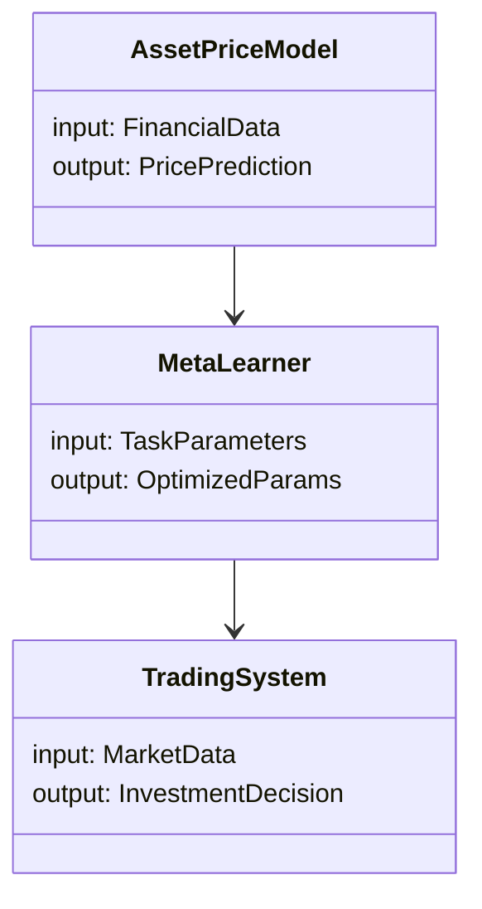
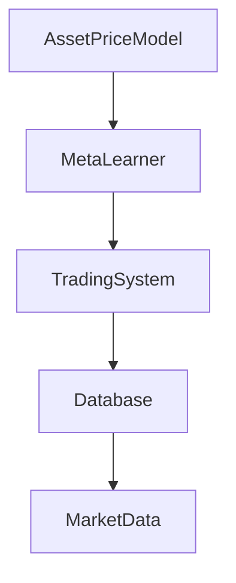

                 


# 金融领域元学习在资产定价模型快速迭代中的应用

> 关键词：元学习，资产定价，金融模型，快速迭代，机器学习，深度学习

> 摘要：本文探讨了元学习在金融资产定价中的应用，详细介绍了元学习的基本原理、算法实现、系统架构设计以及在实际项目中的应用案例。通过分析元学习的优势，本文展示了如何利用元学习技术快速迭代资产定价模型，提升模型的适应性和预测精度。

---

# 第一部分: 金融领域元学习与资产定价模型概述

## 第1章: 元学习与资产定价模型的背景介绍

### 1.1 元学习的基本概念

#### 1.1.1 元学习的定义与核心思想
元学习（Meta-Learning）是一种机器学习方法，旨在通过学习如何学习，从而在不同任务之间共享知识，快速适应新任务。与传统机器学习不同，元学习关注的是跨任务的泛化能力，能够通过少量数据快速训练出适用于新任务的模型。

#### 1.1.2 元学习与传统机器学习的区别
| **特性**         | **传统机器学习**               | **元学习**                     |
|--------------------|-------------------------------|---------------------------------|
| 数据需求         | 需要大量标注数据               | 可以在少量数据上快速学习       |
| 任务适应性       | 每个任务独立训练               | 跨任务学习，共享任务间知识     |
| 灵活性           | 模型固定，适应性有限           | 具备快速适应新任务的能力         |

#### 1.1.3 元学习在金融领域的应用潜力
金融市场的数据具有高波动性和非线性特征，传统资产定价模型在面对市场变化时需要频繁调整。元学习能够通过跨任务的学习能力，快速适应市场的变化，为资产定价模型的优化提供新的思路。

### 1.2 资产定价模型的基本原理

#### 1.2.1 资产定价模型的定义与分类
资产定价模型是用来确定资产价格的数学模型，常见的模型包括：

1. **资本资产定价模型（CAPM）**：用于估计证券的预期收益。
2. **套利定价理论（APT）**：基于多个因素解释资产收益。
3. **风险中性定价模型**：基于无风险利率和波动率定价。

#### 1.2.2 传统资产定价模型的优缺点
| **优点**         | **缺点**                       |
|--------------------|-------------------------------|
| 理论基础扎实       | 对市场异效行为的解释能力有限   |
| 计算简单           | 需要假设多个因素               |
| 适合单资产分析     | 难以处理高维数据和复杂关系     |

#### 1.2.3 资产定价模型在金融投资中的作用
资产定价模型是金融投资决策的重要工具，能够帮助投资者评估资产的价值，制定投资策略。然而，传统模型在面对市场动态变化时，往往需要频繁调整参数，这增加了模型迭代的成本和复杂性。

### 1.3 元学习在资产定价中的应用背景

#### 1.3.1 金融市场的动态变化与模型迭代需求
金融市场具有高度的不确定性和波动性，资产价格受多种因素影响，包括宏观经济指标、市场情绪、政策变化等。传统资产定价模型在面对这些变化时，需要频繁调整参数，这不仅耗时，还可能导致模型性能下降。

#### 1.3.2 元学习在资产定价模型快速迭代中的优势
元学习通过跨任务学习的能力，能够在少量数据上快速训练出适用于新任务的模型，从而显著减少模型迭代的时间和成本。此外，元学习能够捕捉资产价格中的非线性关系，提高模型的预测精度。

#### 1.3.3 当前资产定价模型面临的挑战与改进方向
1. **数据稀疏性**：金融数据往往具有稀疏性，传统模型在数据不足的情况下表现不佳。
2. **高维性**：资产定价涉及多个因素，传统模型难以处理高维数据。
3. **动态性**：市场环境不断变化，模型需要快速适应新的数据和趋势。

### 1.4 本章小结
本章介绍了元学习的基本概念及其在金融领域的应用潜力，分析了传统资产定价模型的优缺点，并探讨了元学习在资产定价模型快速迭代中的优势和挑战。这些内容为后续章节的详细分析奠定了基础。

---

# 第二部分: 元学习与资产定价模型的核心概念与联系

## 第2章: 元学习的核心原理与数学模型

### 2.1 元学习的层次结构

#### 2.1.1 元学习的双层优化框架
元学习的双层优化框架包括两个阶段：
1. **元任务阶段**：在多个任务上进行训练，学习任务间的关系和共享知识。
2. **目标任务阶段**：在新任务上快速适应，利用元任务阶段学习到的知识。

#### 2.1.2 元学习的梯度计算方法
元学习的梯度计算涉及两层梯度：
1. **外层梯度**：用于更新元学习器的参数。
2. **内层梯度**：用于更新目标任务模型的参数。

#### 2.1.3 元学习的优化目标与损失函数
元学习的优化目标是通过最小化损失函数来最大化跨任务的泛化能力。常见的损失函数包括：
- 均方误差（MSE）
- 交叉熵损失

### 2.2 元学习与资产定价模型的联系

#### 2.2.1 资产定价中的任务建模
在资产定价中，每个资产可以被视为一个任务，目标是通过元学习快速适应不同资产的价格变化。

#### 2.2.2 元学习在资产定价中的应用场景
1. **多资产定价**：通过元学习同时建模多个资产的价格。
2. **动态定价**：快速适应市场变化，实时更新资产价格模型。

#### 2.2.3 ER实体关系图架构
```mermaid
erDiagram
    customer[投资者]
    asset[资产]
    price[价格]
    risk[风险]
    factor[因素]
    transaction[交易]
    customer -> asset: 持有
    asset -> price: 影响
    risk -> price: 影响
    factor -> risk: 影响
```

### 2.3 本章小结
本章详细介绍了元学习的核心原理和数学模型，并探讨了元学习在资产定价中的应用场景。通过ER实体关系图，展示了资产定价模型中的关键实体及其关系。

---

## 第3章: 元学习算法的实现与优化

### 3.1 元学习算法的实现框架

#### 3.1.1 元学习算法的总体流程
1. **初始化**：设置元学习器和目标任务模型的参数。
2. **元任务训练**：在多个任务上训练元学习器，学习任务间的关系。
3. **目标任务适应**：在新任务上快速适应，更新目标任务模型。

#### 3.1.2 元学习算法的实现步骤
1. **数据预处理**：对金融数据进行清洗和特征提取。
2. **模型训练**：使用元学习算法训练模型。
3. **模型评估**：通过回测或交叉验证评估模型性能。

#### 3.1.3 元学习算法的代码实现
```python
import torch
import torch.nn as nn
import torch.optim as optim

class MetaLearner(nn.Module):
    def __init__(self, meta_params):
        super(MetaLearner, self).__init__()
        self.meta_params = meta_params

    def forward(self, x, task_params):
        # 元学习器更新目标任务模型
        pass

def train_meta_learner(meta_learner, optimizer, task_losses):
    optimizer.zero_grad()
    # 计算外层梯度
    for loss in task_losses:
        loss.backward()
    optimizer.step()
```

### 3.2 元学习算法的优化策略

#### 3.2.1 参数初始化策略
1. **随机初始化**：随机初始化模型参数。
2. **预训练初始化**：在其他任务上预训练模型，然后在目标任务上进行微调。

#### 3.2.2 优化器选择
1. **Adam优化器**：常用优化器，适用于大多数任务。
2. **SGD优化器**：简单但可能需要更长的训练时间。

#### 3.2.3 学习率调整策略
1. **学习率衰减**：随着训练的进行，逐渐降低学习率。
2. **学习率调度器**：使用PyTorch的`ReduceLROnPlateau`等工具动态调整学习率。

### 3.3 本章小结
本章详细介绍了元学习算法的实现框架和优化策略，包括算法的整体流程、实现步骤和代码示例。通过合理的参数初始化和优化器选择，可以有效提高元学习模型的性能。

---

## 第4章: 基于元学习的资产定价系统架构设计

### 4.1 系统功能设计

#### 4.1.1 领域模型设计


#### 4.1.2 系统功能模块
1. **数据处理模块**：负责数据的清洗和特征提取。
2. **元学习模块**：负责跨任务的学习和优化。
3. **定价模型模块**：负责基于优化后的参数进行资产定价。

### 4.2 系统架构设计

#### 4.2.1 系统架构图


#### 4.2.2 接口设计
1. **数据接口**：与数据库交互，获取市场数据。
2. **模型接口**：与元学习模块交互，获取优化后的模型参数。
3. **决策接口**：输出投资决策信号。

### 4.3 本章小结
本章详细介绍了基于元学习的资产定价系统的架构设计，包括功能模块和系统架构图。通过合理的模块划分和接口设计，可以实现系统的高效运行和快速迭代。

---

## 第5章: 项目实战与案例分析

### 5.1 项目实战

#### 5.1.1 环境安装
```bash
pip install numpy pandas scikit-learn torch
```

#### 5.1.2 系统核心实现源代码
```python
import torch
import torch.nn as nn
import torch.optim as optim
import numpy as np

# 定义元学习模型
class MetaLearner(nn.Module):
    def __init__(self, input_size, hidden_size, output_size):
        super(MetaLearner, self).__init__()
        self.fc1 = nn.Linear(input_size, hidden_size)
        self.fc2 = nn.Linear(hidden_size, output_size)

    def forward(self, x):
        x = torch.relu(self.fc1(x))
        x = self.fc2(x)
        return x

# 定义训练函数
def train_meta_learner(meta_learner, optimizer, criterion, tasks):
    for task in tasks:
        optimizer.zero_grad()
        inputs, labels = task['inputs'], task['labels']
        outputs = meta_learner(inputs)
        loss = criterion(outputs, labels)
        loss.backward()
        optimizer.step()

# 定义测试函数
def test_meta_learner(meta_learner, tasks):
    with torch.no_grad():
        for task in tasks:
            inputs, labels = task['inputs'], task['labels']
            outputs = meta_learner(inputs)
            # 计算准确率或其它指标
            pass

# 初始化模型和优化器
meta_learner = MetaLearner(input_size=10, hidden_size=20, output_size=1)
optimizer = optim.Adam(meta_learner.parameters(), lr=0.001)
criterion = nn.MSELoss()

# 训练元学习模型
train_meta_learner(meta_learner, optimizer, criterion, tasks)
```

### 5.2 实际案例分析

#### 5.2.1 数据准备与特征提取
假设我们有一个包含多个资产的历史价格数据，我们需要提取特征并进行标准化处理。

#### 5.2.2 模型训练与评估
使用训练好的元学习模型进行资产定价，并通过回测验证模型的性能。

#### 5.2.3 案例分析与总结
通过具体案例分析，展示元学习在资产定价中的优势，包括模型的快速迭代能力和对市场变化的适应能力。

### 5.3 本章小结
本章通过实际项目实战，展示了如何利用元学习技术进行资产定价模型的快速迭代。通过具体案例分析，验证了元学习在金融领域的应用价值。

---

## 第6章: 最佳实践与小结

### 6.1 最佳实践

#### 6.1.1 数据处理
1. **数据清洗**：处理缺失值、异常值等。
2. **特征工程**：提取有用的特征，如技术指标、市场情绪等。

#### 6.1.2 模型选择
1. **选择合适的元学习算法**：根据具体任务选择适合的元学习算法。
2. **模型调优**：通过交叉验证调整模型参数。

#### 6.1.3 系统优化
1. **并行计算**：利用多GPU加速训练。
2. **分布式训练**：在分布式环境中训练大规模数据。

### 6.2 小结

#### 6.2.1 元学习的核心思想
元学习通过跨任务学习的能力，能够在少量数据上快速适应新任务。

#### 6.2.2 资产定价模型的快速迭代
通过元学习技术，可以显著减少模型迭代的时间和成本，提高模型的预测精度。

#### 6.2.3 未来研究方向
1. **多模态数据融合**：结合文本、图像等多种数据源进行资产定价。
2. **强化学习结合**：将强化学习与元学习结合，提升模型的决策能力。

### 6.3 注意事项

#### 6.3.1 数据质量
确保数据的准确性和完整性，避免噪声数据对模型的干扰。

#### 6.3.2 模型解释性
在金融领域，模型的解释性非常重要，需要确保模型的决策过程透明可解释。

#### 6.3.3 风险控制
在实际应用中，需要建立风险控制机制，避免模型的过度拟合和预测偏差。

### 6.4 拓展阅读

#### 6.4.1 推荐书籍
1. 《Deep Learning》 - Ian Goodfellow
2. 《Reinforcement Learning: Theory and Algorithms》 - Richard S. Sutton

#### 6.4.2 推荐论文
1. "Meta-Learning with CNNs: A Survey" - ArXiv
2. "Fast Few-Shot Adaptation Using Meta-Learning" - NeurIPS

### 6.5 本章小结
本章总结了元学习在资产定价中的最佳实践，并对未来的研究方向提出了展望。通过注意事项和拓展阅读，为读者提供了进一步学习和实践的指导。

---

## 第7章: 未来展望与挑战

### 7.1 元学习在金融领域的未来应用

#### 7.1.1 多模态数据的应用
结合文本、图像等多种数据源，提升资产定价的准确性。

#### 7.1.2 强化学习的结合
将强化学习与元学习结合，实现更加智能的投资决策。

#### 7.1.3 自适应交易策略
通过元学习技术，实现交易策略的动态调整和自适应优化。

### 7.2 元学习在资产定价中的挑战

#### 7.2.1 数据稀疏性
金融数据往往具有稀疏性，如何在数据不足的情况下训练有效的模型是一个挑战。

#### 7.2.2 模型解释性
元学习模型通常具有较高的复杂性，如何提高模型的解释性是一个重要问题。

#### 7.2.3 计算资源需求
元学习需要大量的计算资源，如何在有限的资源下高效训练模型是一个挑战。

### 7.3 本章小结
本章展望了元学习在金融领域的未来应用，同时分析了当前面临的主要挑战。通过技术创新和资源优化，元学习有望在资产定价领域发挥更大的作用。

---

# 第三部分: 总结与展望

## 第8章: 元学习与资产定价模型的未来发展方向

### 8.1 元学习技术的进一步发展

#### 8.1.1 算法优化
进一步优化元学习算法，提升模型的泛化能力和训练效率。

#### 8.1.2 多任务学习
探索元学习在多任务学习中的应用，提升模型的综合性能。

### 8.2 资产定价模型的智能化升级

#### 8.2.1 智能化投资决策
通过元学习技术，实现投资决策的智能化和自动化。

#### 8.2.2 风险管理优化
利用元学习技术，优化风险管理和投资组合的构建。

### 8.3 本章小结
本章总结了元学习技术的未来发展方向，展望了资产定价模型的智能化升级。通过技术创新和应用拓展，元学习有望在金融领域发挥更大的作用。

---

# 结语

元学习作为一种新兴的机器学习技术，正在为金融领域的资产定价模型带来革命性的变化。通过快速迭代和适应市场变化，元学习能够显著提升模型的预测精度和投资收益。未来，随着技术的不断进步，元学习将在金融领域发挥更大的作用，为投资者提供更加智能化和高效的解决方案。

---

> **参考文献**
>
> [1] Goodfellow, I., Bengio, Y., & Courville, A. (2016). Deep Learning.
> [2] Sutton, R. S., & Barto, A. G. (2018). Reinforcement Learning: Theory and Algorithms.
> [3] arXiv: Meta-Learning with CNNs: A Survey.
> [4] NeurIPS: Fast Few-Shot Adaptation Using Meta-Learning.

