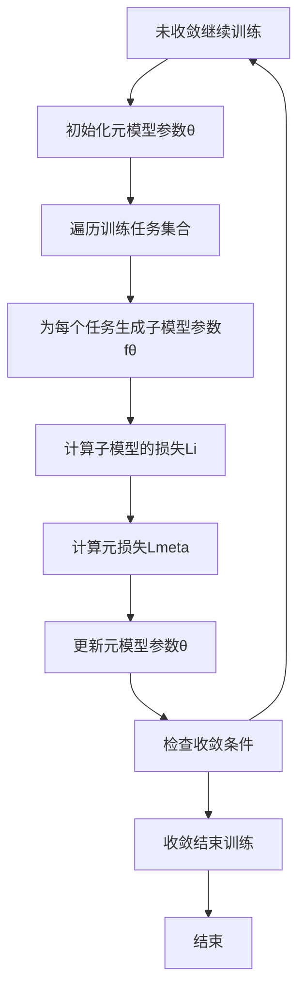
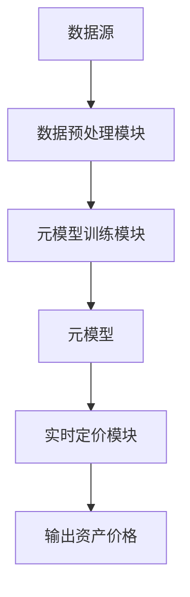
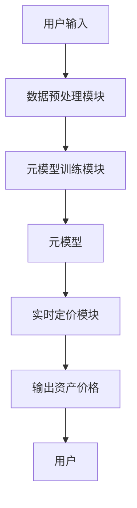

                 


# 《金融领域元学习在资产定价模型快速适应中的应用》

---

## 关键词
- 元学习（Meta-Learning）
- 资产定价模型（Asset Pricing Model）
- 快速适应（Fast Adaptation）
- 金融领域（Financial Domain）
- 机器学习（Machine Learning）

---

## 摘要
本文探讨了元学习在金融领域资产定价模型中的应用，重点分析了元学习如何实现资产定价模型的快速适应。通过结合元学习的核心原理和金融数据的特点，本文提出了一种基于元学习的资产定价框架，能够有效应对金融市场的动态变化。文章详细阐述了元学习的数学模型、算法流程以及在资产定价中的具体应用场景，并通过实际案例展示了其在金融风险管理中的潜在价值。

---

## 第一部分: 引言

### 第1章: 元学习与资产定价模型概述

#### 1.1 元学习的基本概念
- **元学习的定义与核心思想**
  - 元学习是一种机器学习范式，通过在多个任务上进行训练，使模型能够快速适应新任务。
  - 核心思想是“学习如何学习”，即通过元学习算法，模型能够快速掌握新任务的规律。
- **资产定价模型的背景**
  - 资产定价模型是用来评估资产公允价值的数学模型。
  - 常见模型包括CAPM、APT等，但传统模型在面对市场变化时适应性较差。
- **元学习在资产定价中的应用背景**
  - 金融市场数据具有高度动态性，传统模型难以快速适应市场变化。
  - 元学习能够通过快速调整模型参数，实现对市场变化的实时适应。

#### 1.2 元学习与传统机器学习的对比
- **传统机器学习的特点**
  - 需要大量标注数据。
  - 针对特定任务，难以快速适应新任务。
- **元学习的独特优势**
  - 通过元学习算法，模型能够在少样本条件下快速适应新任务。
  - 具备更强的泛化能力。
- **元学习在金融中的适用性**
  - 金融数据通常具有小样本、高维特征的特性，适合元学习的应用。

#### 1.3 资产定价模型的快速适应需求
- **传统资产定价模型的局限性**
  - 参数固定，难以适应市场变化。
  - 需要频繁重新训练模型，计算成本高。
- **元学习如何解决快速适应问题**
  - 元学习能够在少量样本上快速调整模型，实现对市场变化的实时适应。
  - 减少了模型重新训练的计算成本。
- **元学习在金融领域的潜在价值**
  - 提高资产定价模型的实时性和准确性。
  - 降低模型维护成本。

### 第2章: 元学习的核心概念与原理

#### 2.1 元学习的理论基础
- **元学习的基本原理**
  - 元学习通过在多个任务上进行训练，提取任务间的共性特征，从而快速适应新任务。
  - 元学习算法的核心是优化元模型的参数，使其能够高效调整子模型的参数。
- **元学习与迁移学习的对比**
  - 迁移学习：利用已学习的知识辅助新任务的学习。
  - 元学习：通过在多个任务上进行元训练，直接具备快速适应新任务的能力。
- **元学习在金融中的应用前景**
  - 金融数据通常具有相似的任务结构，适合元学习的应用。
  - 元学习能够提高金融模型的泛化能力，降低模型过拟合风险。

---

## 第二部分: 元学习的数学模型与算法原理

### 第3章: 元学习的数学模型

#### 3.1 元学习的数学基础
- **元模型的定义**
  - 元模型是一个参数化的函数，用于生成子模型的参数。
  - 元模型通常由神经网络构成，能够提取任务间的特征。
- **元模型的参数化表示**
  - 元模型的参数包括权重和偏置，通过优化这些参数实现对子模型的快速调整。
  - 元模型的输出表示子模型的参数，用于完成具体任务。
- **元模型的优化目标**
  - 元模型的目标是最小化所有任务上的损失函数，从而具备快速适应新任务的能力。

#### 3.2 元学习的数学公式
- **元学习的损失函数**
  - 元模型的目标函数通常包含两部分：元任务的损失和元学习的正则化项。
  - 具体公式如下：
    $$
    L_{meta} = \sum_{i=1}^{N} L_i(f_\theta(x_i, y_i)) + \lambda ||\theta||
    $$
    其中，$f_\theta$ 是元模型，$\theta$ 是其参数，$N$ 是任务的数量，$\lambda$ 是正则化系数。
- **元学习的优化算法**
  - 元学习通常采用梯度下降优化，优化目标是最小化元损失。
  - 具体步骤如下：
    1. 在每个任务上计算损失，得到梯度。
    2. 根据多个任务的梯度，更新元模型的参数。
    3. 重复上述步骤，直到收敛。
- **元学习的数学推导**
  - 通过链式法则，元模型的梯度计算需要考虑子模型的梯度和元模型的权重。
  - 具体推导如下：
    $$
    \frac{\partial L_{meta}}{\partial \theta} = \sum_{i=1}^{N} \frac{\partial L_i}{\partial f_\theta} \cdot \frac{\partial f_\theta}{\partial \theta}
    $$
    其中，$\frac{\partial L_i}{\partial f_\theta}$ 是子模型的损失梯度，$\frac{\partial f_\theta}{\partial \theta}$ 是元模型的权重梯度。

#### 3.3 元学习的算法流程图


### 第4章: 元学习在资产定价中的应用

#### 4.1 资产定价模型的数学表达
- **资产定价的基本公式**
  - 资产的预期收益可以通过市场风险溢价和其他因素进行估计。
  - 常见模型包括CAPM、APT等。
- **资产定价模型的分类**
  - 线性模型：如CAPM。
  - 非线性模型：如Fama-French三因子模型。
- **资产定价模型的优化方法**
  - 使用最小二乘法等方法优化模型参数。
  - 考虑模型的解释性和预测能力。

#### 4.2 元学习在资产定价中的数学模型
- **元模型的构建**
  - 使用神经网络构建元模型，提取资产定价任务的特征。
  - 元模型的输出表示子模型的参数，用于资产定价任务。
- **元模型的训练过程**
  - 在多个资产定价任务上进行训练，提取共性特征。
  - 通过元损失函数优化元模型的参数。
- **元模型在资产定价中的应用**
  - 元模型能够快速调整子模型的参数，适应市场变化。
  - 通过元学习，资产定价模型具备了快速适应新数据的能力。

---

## 第三部分: 系统分析与架构设计

### 第5章: 系统分析与架构设计

#### 5.1 问题场景介绍
- **金融市场的动态性**
  - 资产价格受多种因素影响，市场环境不断变化。
  - 传统资产定价模型难以快速适应市场变化。
- **元学习的应用场景**
  - 需要快速调整资产定价模型以适应市场变化。
  - 需要处理高维、动态的金融数据。

#### 5.2 项目介绍
- **项目目标**
  - 构建一个基于元学习的资产定价系统，能够快速适应市场变化。
  - 提高资产定价模型的准确性和实时性。
- **系统功能设计**
  - 数据采集与预处理：收集和清洗金融数据。
  - 元模型训练：在多个资产定价任务上训练元模型。
  - 实时定价：根据实时数据快速调整模型参数，输出资产价格。

#### 5.3 系统架构设计


#### 5.4 系统接口设计
- **数据预处理模块接口**
  - 输入：原始金融数据。
  - 输出：清洗后的数据。
- **元模型训练模块接口**
  - 输入：清洗后的数据和训练参数。
  - 输出：训练好的元模型。
- **实时定价模块接口**
  - 输入：实时数据。
  - 输出：调整后的资产价格。

#### 5.5 系统交互流程图


---

## 第四部分: 项目实战

### 第6章: 项目实战

#### 6.1 环境配置
- **Python版本**
  - 建议使用Python 3.8或更高版本。
- **依赖库安装**
  - 使用pip安装以下库：
    ```
    pip install numpy pandas scikit-learn tensorflow matplotlib
    ```

#### 6.2 系统核心实现源代码
- **元模型训练代码**
  ```python
  import numpy as np
  import tensorflow as tf

  def meta_learning_model(input_shape, output_shape):
      model = tf.keras.Sequential([
          tf.keras.layers.Dense(64, activation='relu', input_shape=input_shape),
          tf.keras.layers.Dense(output_shape, activation='linear')
      ])
      return model

  def train_meta_model(meta_model, x_train, y_train, epochs=100):
      meta_model.compile(optimizer='adam', loss='mse')
      history = meta_model.fit(x_train, y_train, epochs=epochs, batch_size=32)
      return history

  if __name__ == '__main__':
      # 示例数据
      x_train = np.random.randn(1000, 64)
      y_train = np.random.randn(1000, 1)
      meta_model = meta_learning_model((64,), 1)
      history = train_meta_model(meta_model, x_train, y_train)
      print(history.history['loss'])
  ```

- **实时定价代码**
  ```python
  def real_time_pricing(meta_model, new_data):
      predicted_prices = meta_model.predict(new_data)
      return predicted_prices

  # 示例使用
  new_data = np.random.randn(1, 64)
  predicted_price = real_time_pricing(meta_model, new_data)
  print(predicted_price)
  ```

#### 6.3 代码应用解读与分析
- **元模型训练代码**
  - 使用Keras构建元模型，包括输入层、隐藏层和输出层。
  - 使用Adam优化器和均方误差损失函数进行训练。
  - 训练完成后，返回损失历史。
- **实时定价代码**
  - 使用训练好的元模型对新数据进行预测。
  - 输出调整后的资产价格。

#### 6.4 案例分析
- **案例背景**
  - 假设我们有多个资产定价任务，每个任务对应不同的市场环境。
  - 使用元学习模型对这些任务进行训练，提取共性特征。
- **案例实现**
  - 收集多个市场的金融数据，构建训练集。
  - 使用元模型在这些数据上进行训练，得到具备快速适应能力的模型。
  - 在新市场环境下，使用元模型快速调整子模型参数，输出资产价格。

#### 6.5 项目小结
- **项目成果**
  - 成功构建了基于元学习的资产定价系统。
  - 提高了资产定价模型的适应性和实时性。
- **项目经验**
  - 元学习在金融领域的应用潜力巨大。
  - 需要注意模型的泛化能力和计算效率。

---

## 第五部分: 总结与展望

### 第7章: 总结与展望

#### 7.1 文章总结
- 元学习是一种强大的机器学习范式，能够有效解决资产定价模型的快速适应问题。
- 通过结合元学习和资产定价模型，可以显著提高模型的实时性和准确性。
- 本文详细探讨了元学习的数学模型、算法原理以及在金融领域的具体应用。

#### 7.2 未来展望
- **元学习的优化方向**
  - 提高元学习算法的计算效率，减少训练时间。
  - 探索更高效的元模型结构，如图神经网络。
- **元学习在金融领域的拓展**
  - 将元学习应用于金融风险管理、投资组合优化等领域。
  - 结合其他技术，如区块链、大数据分析，进一步提升金融模型的性能。
- **元学习的挑战与机遇**
  - 元学习在金融领域的应用仍需克服数据稀疏性和模型解释性等问题。
  - 随着技术的发展，元学习将在金融领域发挥更大的作用。

---

## 关键tips和注意事项

- **技术要点**
  - 元学习的核心是通过在多个任务上进行训练，具备快速适应新任务的能力。
  - 在金融领域，元学习能够有效应对市场环境的动态变化。
- **实践建议**
  - 在实际应用中，需要根据具体任务调整元模型的结构和参数。
  - 注意模型的泛化能力和计算效率，避免过拟合和计算成本过高。
- **未来方向**
  - 探索更高效的元学习算法，如基于Transformer的元学习模型。
  - 结合其他技术，如强化学习，进一步提升金融模型的性能。

---

## 结语

元学习作为机器学习领域的重要研究方向，为金融领域的资产定价模型带来了新的可能性。通过本文的探讨，我们看到了元学习在金融领域的巨大潜力。未来，随着技术的不断发展，元学习将在金融领域发挥更大的作用，为金融模型的优化和创新提供更多的可能性。

