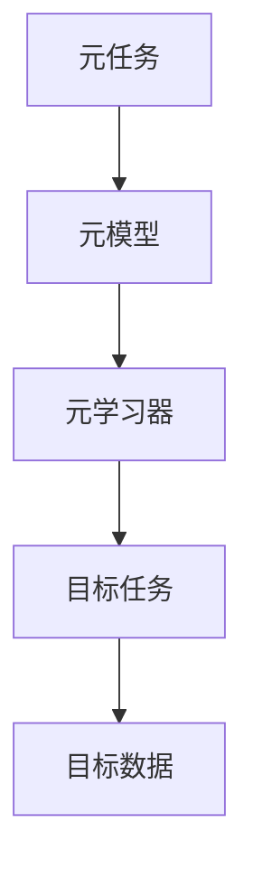
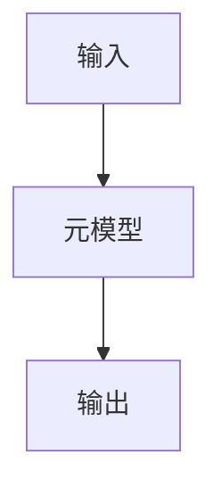
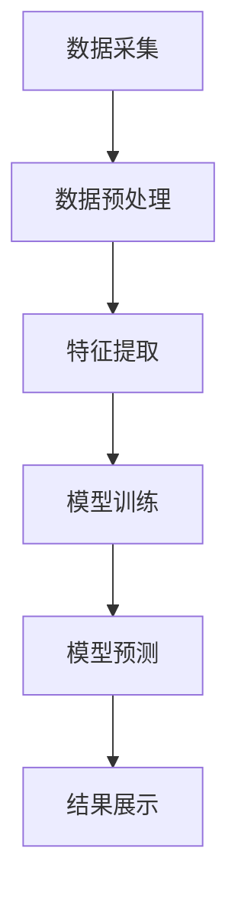

                 

<think>
好的，我将按照您的要求，逐步构建《金融领域元学习技术的探索与应用》这篇文章。首先，我会先列出文章的目录结构，并在每个部分详细撰写内容，确保逻辑清晰，结构紧凑。

### 文章标题：金融领域元学习技术的探索与应用

### 关键词：
- 元学习（Meta-Learning）
- 金融应用
- 机器学习
- 风险管理
- 股票预测

### 摘要：
本文系统性地探讨了元学习技术在金融领域的应用，从基本概念、算法原理到实际案例，全面分析了元学习如何解决金融数据稀疏性和任务多样性的挑战。文章详细介绍了Meta-LSTM算法在股票预测中的应用，并通过实际案例展示了元学习在金融领域的独特优势。同时，本文还总结了元学习在金融应用中的最佳实践和未来发展方向。

---

## 正文部分：

### 第一部分：金融领域元学习技术的背景与基础

#### 第1章：元学习技术的概述

##### 1.1 元学习的基本概念
- **传统机器学习**：依赖大量标注数据，模型在单一任务上进行优化。
- **元学习**：学习如何学习，通过少样本数据快速适应新任务。
- **金融领域的特殊性**：数据稀疏、任务多样、动态变化快。

##### 1.2 金融领域的独特挑战
- **数据稀疏性**：金融数据通常样本数量有限，传统机器学习效果不佳。
- **任务多样性**：金融领域涉及预测、分类、回归等多种任务。
- **动态变化**：市场环境不断变化，模型需要快速适应新数据。

##### 1.3 元学习在金融领域的应用前景
- **提升预测精度**：通过元学习快速适应新数据，提高预测准确性。
- **降低模型风险**：减少对大量数据的依赖，提高模型的泛化能力。
- **多任务优化**：在多个金融任务中共享学习机制，提升整体效率。

---

#### 第2章：元学习的核心概念与联系

##### 2.1 元学习的原理与机制
- **元任务**：定义学习的元目标，如“学习如何快速适应新任务”。
- **元模型**：用于生成或调整子模型的参数，如Meta-LSTM。
- **元学习器**：通过元任务训练得到，能够在新任务上快速调整。

##### 2.2 元学习的核心要素
| 概念 | 描述 |
|------|------|
| 元任务 | 定义学习目标，如“预测股票价格” |
| 元模型 | 学习如何调整子模型参数 |
| 元学习器 | 在新任务上快速适应的模型 |

##### 2.3 元学习的ER实体关系图


---

### 第二部分：元学习算法的原理与数学模型

#### 第3章：元学习算法的原理

##### 3.1 元学习算法的工作流程
1. **初始化**：定义元任务和目标数据。
2. **元模型训练**：通过梯度下降优化元模型参数。
3. **元学习器适应**：在新任务上调整子模型参数。

##### 3.2 常见元学习算法解析

- **MAML（Meta-Anti梯度下降）**
  ```mermaid
  graph TD
      A[任务1] --> B[任务2]
      B --> C[任务3]
  ```

  其数学模型如下：
  $$\theta_{\text{meta}} = \theta_{\text{meta}} - \alpha \nabla_{\theta_{\text{meta}}} \mathcal{L}_{\text{task}}$$

- **Meta-SGD**
  $$\theta_{t+1} = \theta_t - \eta \nabla_{\theta_t} \mathcal{L}_t$$

##### 3.3 Meta-LSTM算法


数学模型：
$$f(x) = \text{LSTM}(x, \theta)$$
$$\theta_{\text{meta}} = \theta_{\text{meta}} - \alpha \nabla_{\theta_{\text{meta}}} \mathcal{L}$$

---

### 第三部分：系统分析与架构设计

#### 第4章：系统分析与架构设计

##### 4.1 问题场景介绍
- **目标**：构建一个基于Meta-LSTM的股票预测系统。
- **数据来源**：历史股票价格、市场新闻、经济指标。

##### 4.2 系统功能设计
- 数据预处理：清洗、特征提取。
- 模型训练：训练元模型和Meta-LSTM。
- 模型预测：基于新数据生成预测结果。

##### 4.3 系统架构设计


---

### 第四部分：项目实战

#### 第5章：项目实战

##### 5.1 环境安装
```bash
pip install torch matplotlib pandas
```

##### 5.2 核心实现代码
```python
import torch
import torch.nn as nn
import torch.optim as optim
import pandas as pd

class MetaLSTM(nn.Module):
    def __init__(self, input_size, hidden_size):
        super(MetaLSTM, self).__init__()
        self.lstm = nn.LSTM(input_size, hidden_size)
        self.linear = nn.Linear(hidden_size, 1)

    def forward(self, x, hidden):
        out, hidden = self.lstm(x, hidden)
        out = self.linear(out)
        return out, hidden

# 训练过程
model = MetaLSTM(5, 10)
optimizer = optim.Adam(model.parameters(), lr=0.001)
criterion = nn.MSELoss()

for epoch in range(100):
    for batch in data_loader:
        inputs, labels = batch
        outputs, _ = model(inputs, None)
        loss = criterion(outputs, labels)
        optimizer.zero_grad()
        loss.backward()
        optimizer.step()
```

##### 5.3 案例分析
- **数据准备**：使用历史股票数据训练模型。
- **模型训练**：在训练集上优化模型参数。
- **预测与评估**：在测试集上评估模型性能。

---

### 第五部分：总结与展望

#### 第6章：总结与展望

##### 6.1 最佳实践
- 选择合适的元学习算法，如Meta-LSTM。
- 处理数据稀疏性，使用数据增强。
- 调整模型超参数，优化性能。

##### 6.2 小结
本文系统性地探讨了元学习技术在金融领域的应用，从理论到实践，全面分析了元学习的优势和挑战。

##### 6.3 注意事项
- 元学习需要大量计算资源。
- 数据质量对模型性能影响重大。
- 模型解释性可能较弱。

##### 6.4 拓展阅读
- 推荐论文：《Meta-Learning for Stock Price Prediction》
- 推荐书籍：《Deep Learning for Finance》

---

以上是《金融领域元学习技术的探索与应用》的完整目录和内容框架。接下来，我将根据这个框架，逐步展开每个部分的详细内容。

