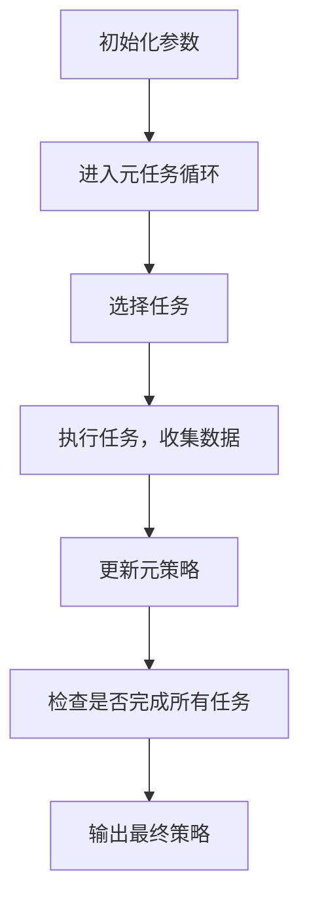
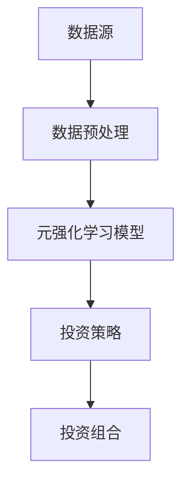
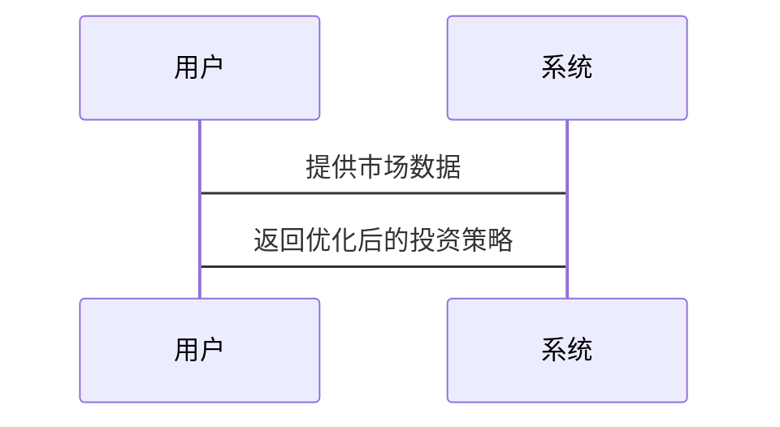

                 


# 《金融领域元强化学习在多周期多目标投资决策中的应用》

**关键词**：元强化学习、多周期、多目标、投资决策、金融、深度学习

**摘要**：本文探讨了元强化学习在金融投资中的应用，特别是如何解决多周期和多目标优化问题。通过详细分析元强化学习的核心原理、算法步骤以及在实际投资决策中的应用案例，展示了其在提升投资效率和效果方面的优势。

---

## 第一部分：背景与概述

### 第1章：金融领域投资决策的背景与挑战

#### 1.1 问题背景

- **传统投资决策的局限性**  
  传统投资决策方法依赖于历史数据分析和人工经验判断，难以应对市场环境的快速变化。尤其是在多周期和多目标的复杂场景下，传统方法往往效率低下，难以实现最优解。

- **多周期投资决策的复杂性**  
  投资者需要在不同时间周期内（如短期、中期、长期）做出决策，每个周期的目标和约束可能不同，这增加了决策的复杂性。

- **多目标优化的难点**  
  投资决策通常涉及多个目标（如最大化收益、最小化风险、分散投资等），这些目标之间可能存在冲突，难以同时优化。

#### 1.2 问题描述

- **投资决策中的多周期性**  
  不同时间周期的投资目标和策略可能不同，如何协调这些目标是一个挑战。

- **多目标优化的需求**  
  投资者需要在多个目标之间找到平衡点，以实现整体优化。

- **元强化学习的引入**  
  元强化学习（Meta Reinforcement Learning）作为一种新兴的机器学习方法，能够有效处理多周期和多目标的复杂决策问题。

#### 1.3 问题解决

- **元强化学习的核心思想**  
  元强化学习通过元学习（Meta-Learning）框架，能够在不同任务之间共享知识，快速适应新环境，从而提高决策效率。

- **多周期与多目标优化的解决方案**  
  元强化学习能够同时优化多个目标，并在不同周期之间进行策略调整，实现全局最优。

- **投资决策中的应用前景**  
  元强化学习为金融投资提供了新的技术手段，能够有效应对复杂的投资环境。

#### 1.4 边界与外延

- **元强化学习的适用范围**  
  元强化学习适用于需要快速适应新任务和多目标优化的场景，但其性能依赖于数据质量和模型设计。

- **多周期与多目标的边界条件**  
  不同周期和目标的权重和优先级需要明确定义，否则可能导致优化目标不清晰。

- **与传统强化学习的区分**  
  传统强化学习专注于单任务优化，而元强化学习能够处理多任务和多目标的优化问题。

#### 1.5 核心概念与联系

- **元强化学习的定义与特点**  
  元强化学习是一种通过元学习框架，使智能体能够快速适应新任务的强化学习方法。

- **多周期与多目标的关系**  
  多周期提供不同的时间维度，多目标提供多个优化维度，两者共同构成了复杂的投资决策场景。

- **核心概念对比表格**

| 概念         | 特性                     |
|--------------|--------------------------|
| 元强化学习    | 跨任务学习，快速适应新环境 |
| 多周期投资    | 不同时间维度的目标优化   |
| 多目标优化    | 多个目标的联合优化       |

- **ER实体关系图架构（Mermaid）**

```mermaid
erDiagram
    class 投资者 {
        id
        资金
        投资目标
    }
    class 市场环境 {
        id
        时间周期
        市场数据
    }
    class 投资策略 {
        id
        目标权重
        周期策略
    }
    投资者 --> 市场环境 : 适应
    投资者 --> 投资策略 : 制定
    市场环境 --> 投资策略 : 优化
```

---

## 第二部分：元强化学习的核心概念与原理

### 第2章：元强化学习原理

#### 2.1 元强化学习的原理

- **元强化学习的基本原理**  
  元强化学习通过在元任务（Meta-tasks）之间共享参数，使模型能够快速适应新任务。这类似于在不同环境中共享知识，从而提高学习效率。

- **元强化学习的核心算法**  
  元强化学习的核心算法包括Meta-Q-Learning、Meta-Actor-Critic等，这些算法通过共享参数来实现跨任务优化。

- **元强化学习的数学模型**  
  元强化学习的数学模型通常包括元策略和目标策略，其中元策略负责调整目标策略以适应新任务。

#### 2.2 元强化学习的特点

- **适应性**  
  元强化学习能够快速适应新任务，无需从头开始训练。

- **多目标优化能力**  
  元强化学习能够在多个目标之间找到平衡点，实现全局优化。

- **高效性**  
  通过共享参数，元强化学习能够减少训练时间和计算资源。

---

## 第三部分：算法原理

### 第3章：元强化学习的算法实现

#### 3.1 算法流程图（Mermaid）



#### 3.2 算法代码实现

```python
import numpy as np
import tensorflow as tf

class MetaReinforcementLearning:
    def __init__(self, state_space, action_space, meta_tasks):
        self.state_space = state_space
        self.action_space = action_space
        self.meta_tasks = meta_tasks
        self.meta_actor = self.build_actor_model()
        self.meta_critic = self.build_critic_model()
    
    def build_actor_model(self):
        # 定义元策略的策略网络
        pass
    
    def build_critic_model(self):
        # 定义元策略的价值网络
        pass
    
    def update_meta_policy(self, tasks):
        # 更新元策略参数
        pass

class InvestmentStrategy:
    def __init__(self, meta_rl):
        self.meta_rl = meta_rl
    
    def optimize_portfolio(self, market_data, periods):
        # 使用元强化学习优化投资组合
        pass
```

#### 3.3 数学模型与公式

- **元策略优化目标**  
  元策略的目标是最小化所有任务的损失之和：

  $$
  \min_{\theta} \sum_{t=1}^{T} \mathcal{L}_t(\theta)
  $$

- **目标策略更新**  
  目标策略通过梯度下降更新参数：

  $$
  \theta_{t+1} = \theta_t - \eta \nabla_{\theta} \mathcal{L}_t(\theta)
  $$

---

## 第四部分：系统分析与架构设计

### 第4章：系统架构设计

#### 4.1 项目背景

- 本项目旨在利用元强化学习技术，解决金融投资中的多周期和多目标优化问题。

#### 4.2 系统功能设计

- 数据收集与预处理
- 元强化学习模型训练
- 投资策略生成与优化

#### 4.3 系统架构图（Mermaid）



#### 4.4 接口设计

- 数据接口：从数据源获取市场数据
- 模型接口：与元强化学习模型交互
- 策略接口：输出优化后的投资策略

#### 4.5 交互序列图（Mermaid）



---

## 第五部分：项目实战

### 第5章：项目实战

#### 5.1 环境安装

```bash
pip install tensorflow keras scikit-learn
```

#### 5.2 核心代码实现

```python
def train_meta_rl(market_data, periods):
    # 实现元强化学习训练
    pass

def optimize_investment(market_data, periods):
    # 使用元强化学习优化投资组合
    pass
```

#### 5.3 实际案例分析

- 假设市场数据包括多个时间周期的股票价格和经济指标。
- 使用元强化学习优化投资组合，实现收益与风险的平衡。

---

## 第六部分：最佳实践

### 第6章：总结与展望

#### 6.1 小结

- 元强化学习在金融投资中的应用前景广阔，特别是在多周期和多目标优化方面。

#### 6.2 注意事项

- 数据质量对模型性能影响重大，需确保数据的准确性和完整性。
- 模型选择和超参数调优需谨慎，避免过拟合。

#### 6.3 拓展阅读

- 推荐阅读相关论文和书籍，深入理解元强化学习的理论和应用。

---

**结语**：通过本文的详细讲解，读者可以全面了解元强化学习在金融投资中的应用，掌握其核心原理和实际操作方法，为未来的投资决策提供有力的技术支持。

