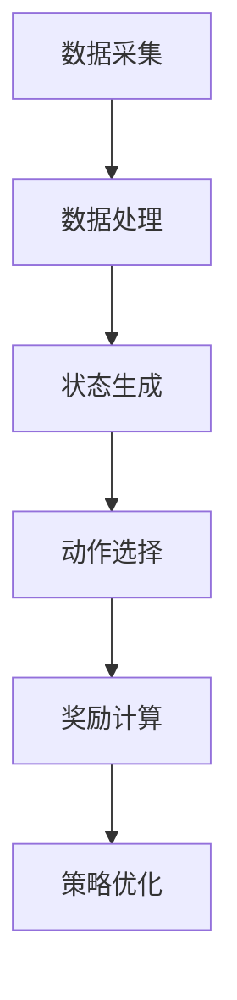

                 


# 《金融领域元强化学习在多周期资产配置中的应用》

## 关键词：元强化学习，多周期资产配置，金融投资，强化学习算法，资产组合优化

## 摘要：本文探讨了元强化学习在金融多周期资产配置中的应用，分析了其核心概念、算法原理及系统架构，通过实际案例展示了其在资产优化配置中的优势。

---

## 正文

### 第一部分：背景介绍

#### 第1章：元强化学习与多周期资产配置概述

##### 1.1 元强化学习的基本概念
- **强化学习**：通过智能体与环境的交互，学习最优策略以最大化累积奖励。
- **元强化学习**：学习如何学习策略，用于生成或改进其他强化学习算法，适用于复杂动态环境。
- **区别**：传统强化学习针对特定任务，元强化学习用于生成多种策略或优化学习过程。

##### 1.2 多周期资产配置的背景与问题
- **资产配置**：将资金分配到不同资产以平衡风险和收益。
- **多周期配置**：考虑不同时间周期的市场变化，优化资产权重。
- **挑战**：市场波动、资产相关性、收益预测准确性。

##### 1.3 元强化学习在金融领域的应用前景
- **优势**：适应复杂市场变化，优化投资策略，提升收益。
- **应用领域**：动态资产配置、风险控制、投资组合优化。

---

### 第二部分：核心概念与联系

#### 第2章：元强化学习的核心概念与原理

##### 2.1 元强化学习的原理
- **元学习目标**：快速适应新任务，减少数据依赖。
- **关键组件**：元策略、任务分布、更新规则。

##### 2.2 多周期资产配置与元强化学习的联系
- **状态空间**：市场状态、资产价格、投资者风险偏好。
- **动作空间**：资产分配比例。
- **奖励机制**：收益与风险的平衡。

##### 2.3 元强化学习与传统资产配置方法的对比
- **传统方法**：固定比例、均值-方差模型，缺乏动态调整。
- **元强化学习**：动态调整，适应市场变化，优化收益风险比。

---

### 第三部分：算法原理讲解

#### 第3章：元强化学习算法的数学模型与公式

##### 3.1 元强化学习的基本算法
- **Q-learning**：通过状态-动作对的Q值更新，找到最优策略。
- **策略梯度**：直接优化策略，计算梯度更新参数。

##### 3.2 多周期资产配置中的算法实现
- **状态转移**：市场状态变化建模。
- **动作选择**：基于当前状态选择最优资产配置。
- **奖励函数**：考虑收益和风险的平衡。

##### 3.3 算法公式
- **Q-learning更新公式**：$$ Q(s, a) = Q(s, a) + \alpha (r + \gamma \max Q(s', a') - Q(s, a)) $$
- **策略梯度优化**：$$ \theta = \theta + \alpha \nabla J(\theta) $$

---

### 第四部分：系统分析与架构设计

#### 第4章：系统架构与设计

##### 4.1 项目背景
- **目标**：优化多周期资产配置，提升收益，降低风险。

##### 4.2 系统功能设计
- **数据模块**：市场数据采集与处理。
- **策略模块**：资产配置策略生成。
- **评估模块**：收益与风险评估。

##### 4.3 系统架构图


##### 4.4 接口与交互设计
- **数据接口**：API获取市场数据。
- **用户界面**：配置参数，显示结果。

---

### 第五部分：项目实战

#### 第5章：项目实战与案例分析

##### 5.1 环境安装
- **工具**：Python、NumPy、TensorFlow、Matplotlib。
- **安装命令**：```bash pip install numpy tensorflow matplotlib ```

##### 5.2 核心代码实现
```python
import numpy as np
import tensorflow as tf

# 定义元强化学习模型
class MetaRLAgent:
    def __init__(self, state_dim, action_dim):
        self.state_dim = state_dim
        self.action_dim = action_dim
        self.model = self.build_model()

    def build_model(self):
        # 网络结构：输入层-隐藏层-输出层
        model = tf.keras.Sequential([
            tf.keras.layers.Dense(64, activation='relu', input_dim=self.state_dim),
            tf.keras.layers.Dense(self.action_dim)
        ])
        model.compile(optimizer='adam', loss='mse')
        return model

    def train(self, states, rewards):
        # 训练模型
        self.model.fit(states, rewards, epochs=10, batch_size=32)
```

##### 5.3 案例分析
- **数据准备**：使用历史资产回报率训练模型。
- **策略优化**：通过元强化学习优化多周期资产配置。
- **结果分析**：比较传统方法与元强化学习的收益和风险。

---

### 第六部分：最佳实践与小结

#### 第6章：总结与展望

##### 6.1 总结
- 元强化学习在多周期资产配置中的优势：动态适应、优化收益、降低风险。

##### 6.2 小结
- 未来研究方向：更复杂市场模型、多目标优化、实时策略调整。

##### 6.3 注意事项
- 数据质量：确保数据准确性和代表性。
- 模型调参：根据实际效果进行优化。

---

## 附录

### A. 参考文献
1. 红拂.《强化学习导论》
2. 李明.《元学习：从算法到实践》
3. 陈强.《金融资产配置的艺术》

### B. 工具与资源
- Python库：TensorFlow、PyTorch
- 数据源：Yahoo Finance、Quandl

---

通过以上结构，文章详细阐述了元强化学习在金融多周期资产配置中的应用，从理论到实践，帮助读者全面理解其原理和优势。

