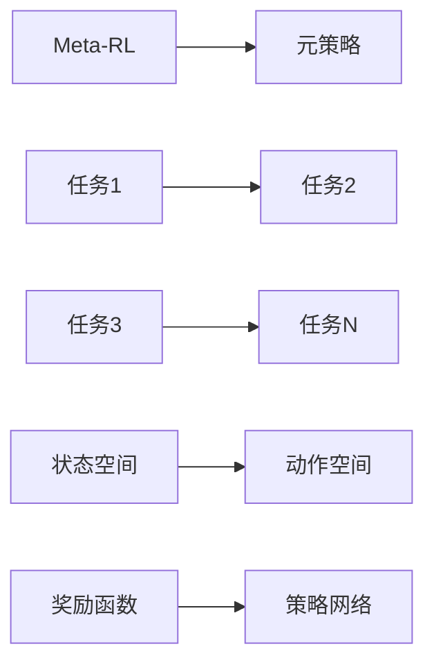
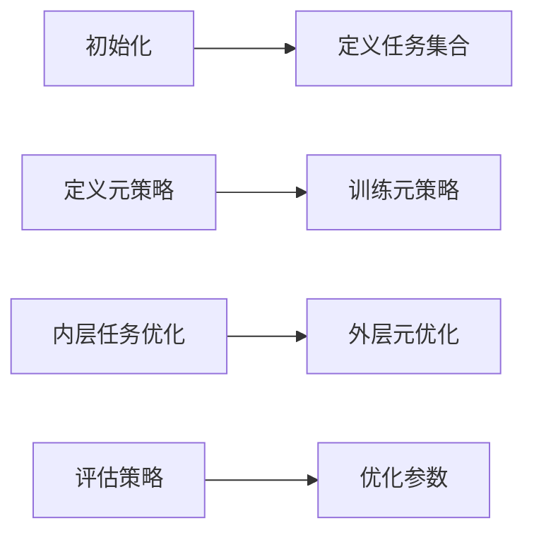
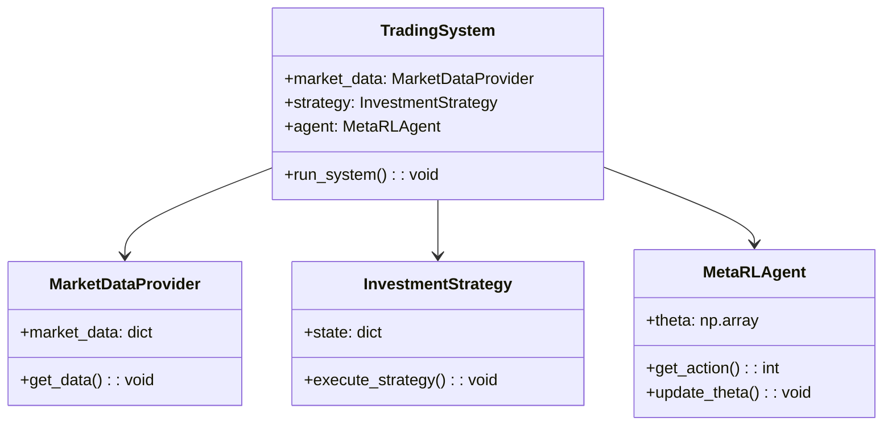
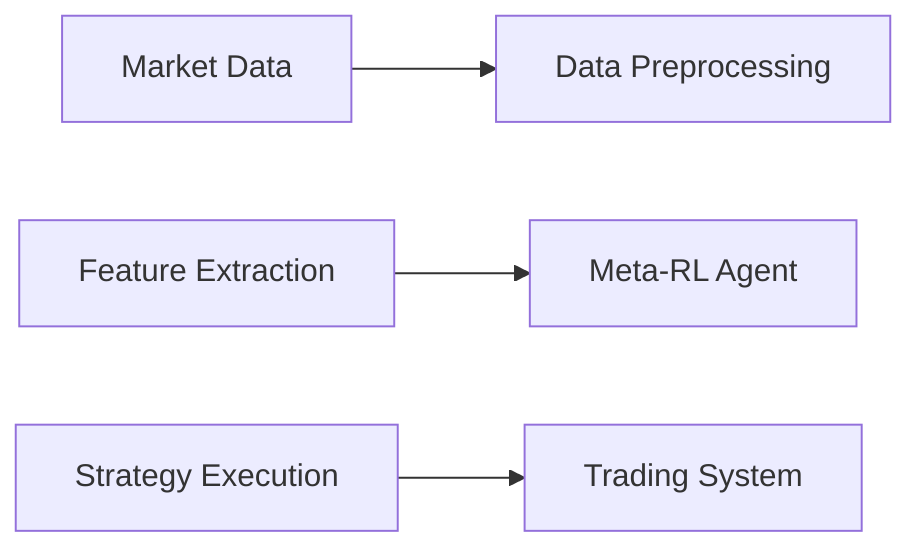
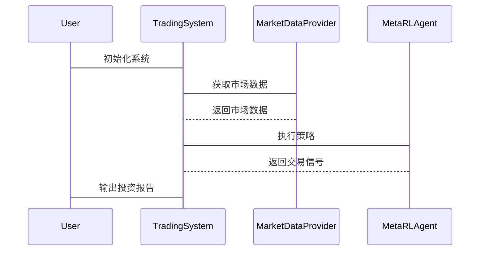

                 


# 《金融领域元强化学习在投资策略中的应用》

## 关键词：元强化学习、投资策略、金融应用、算法原理、系统架构

## 摘要：  
本文深入探讨了元强化学习（Meta Reinforcement Learning，Meta-RL）在金融领域投资策略中的应用。通过分析Meta-RL的核心概念、算法原理、系统架构以及实际案例，本文揭示了Meta-RL如何通过多层次策略优化提升投资决策的效率和准确性。文章从背景介绍、核心概念、算法实现、系统设计、项目实战到最佳实践，全面系统地阐述了Meta-RL在金融投资中的应用，为相关领域的研究和实践提供了理论和实践参考。

---

## 第一部分：背景介绍

### 第1章：元强化学习的背景与应用

#### 1.1 元强化学习的定义与核心概念
- **1.1.1 元强化学习的基本定义**  
  元强化学习是一种通过学习通用策略框架来优化特定任务的强化学习方法。它不同于传统的强化学习，Meta-RL能够通过少量样本快速适应新任务，从而在多个场景中实现高效决策。

- **1.1.2 元强化学习的核心要素**  
  元强化学习的核心要素包括：  
  - **元策略**：用于指导子任务策略的优化。  
  - **任务多样性**：通过多任务学习提升策略的泛化能力。  
  - **快速适应能力**：能够在新环境中快速调整策略。  

- **1.1.3 元强化学习与传统强化学习的区别**  
  | 属性            | 传统强化学习         | 元强化学习         |
  |-----------------|----------------------|----------------------|
  | 学习目标        | 单一任务优化         | 多任务策略优化      |
  | 策略更新方式    | 离线/在线更新         | 元策略指导更新      |
  | 适应性          | 适应单一环境         | 快速适应新环境       |

#### 1.2 金融领域中的强化学习应用
- **1.2.1 金融投资中的强化学习场景**  
  - 股票交易策略优化  
  - 资产配置与风险控制  
  - 量化投资模型构建  

- **1.2.2 元强化学习在金融投资中的优势**  
  - **快速适应市场变化**：Meta-RL能够在市场环境变化时快速调整投资策略。  
  - **多任务优化**：通过Meta-RL可以同时优化多个投资目标（如收益、风险、流动性）。  
  - **高效决策**：Meta-RL能够在有限的交易数据中快速找到最优策略。  

- **1.2.3 元强化学习的边界与外延**  
  - **边界**：Meta-RL适用于任务具有相似性且需要快速适应的场景。  
  - **外延**：结合其他AI技术（如深度学习、自然语言处理）进一步提升投资策略的智能化水平。  

---

## 第二部分：核心概念与联系

### 第2章：元强化学习的核心原理

#### 2.1 元强化学习的原理
- **2.1.1 元强化学习的数学模型**  
  - 元策略的目标函数：  
  $$ \theta = \arg\max_{\theta} \sum_{i=1}^{N} \mathbb{E}_{s_i \sim \rho_i} [r_i(\pi_{\theta}(a|s_i))] $$  
  其中，$\theta$为元策略参数，$N$为任务数量，$\rho_i$为任务$i$的状态分布，$r_i$为任务$i$的奖励函数。  

- **2.1.2 元强化学习的算法框架**  
  Meta-RL的典型算法框架包括：  
  - MAML（Meta Learning Algorithm）：通过梯度匹配优化元策略。  
  - Reptile：通过内层任务优化和外层元优化交替进行。  
  - Meta-Q：基于Q-learning的元强化学习框架。  

- **2.1.3 元强化学习的核心算法对比**  
  | 算法名称   | 核心思想                     | 优缺点                       |
  |------------|------------------------------|------------------------------|
  | MAML       | 梯度匹配优化元策略             | 理论基础强，但计算复杂度高     |
  | Reptile     | 内层任务优化 + 外层元优化       | 简单易实现，但稳定性较差       |
  | Meta-Q     | 基于Q-learning的元策略优化      | 易于与传统Q-learning结合       |

#### 2.2 元强化学习与传统强化学习的对比
- **2.2.1 概念对比**  
  - 传统强化学习：针对单一任务优化策略。  
  - 元强化学习：通过多任务学习优化通用策略框架。  

- **2.2.2 算法对比**  
  - 传统强化学习：策略更新基于单任务梯度。  
  - 元强化学习：策略更新基于多任务梯度匹配或元优化。  

- **2.2.3 优缺点对比**  
  | 属性          | 传统强化学习               | 元强化学习               |
  |---------------|----------------------------|----------------------------|
  | 适应性         | 适应单一任务               | 适应多任务，快速适应新任务 |
  | 计算复杂度     | 低                         | 高                         |
  | 适用场景       | 单一任务优化               | 多任务优化               |

#### 2.3 元强化学习的ER实体关系图


---

## 第三部分：算法原理讲解

### 第3章：元强化学习的算法实现

#### 3.1 元强化学习的算法流程


#### 3.2 元强化学习的数学模型
- **3.2.1 元策略的优化目标**  
  $$ \theta = \arg\max_{\theta} \sum_{i=1}^{N} \mathbb{E}_{s_i \sim \rho_i} [r_i(\pi_{\theta}(a|s_i))] $$
  
- **3.2.2 任务策略的更新**  
  $$ \theta_i = \arg\max_{\theta} \mathbb{E}_{s_i \sim \rho_i} [r_i(\pi_{\theta}(a|s_i))] $$

- **3.2.3 元优化的梯度计算**  
  $$ \nabla_{\theta} J = \sum_{i=1}^{N} \nabla_{\theta} \mathbb{E}_{s_i \sim \rho_i} [r_i(\pi_{\theta}(a|s_i))] $$

#### 3.3 元强化学习的代码实现
- **3.3.1 环境安装**  
  ```bash
  pip install gym numpy
  ```

- **3.3.2 核心代码实现**  
  ```python
  import gym
  import numpy as np

  class MetaRLAgent:
      def __init__(self, state_space, action_space):
          self.state_space = state_space
          self.action_space = action_space
          self.theta = np.random.randn(state_space, action_space)

      def get_action(self, state):
          return np.argmax(self.theta[state])

      def update_theta(self, gradient):
          self.theta += 0.1 * gradient

  # 初始化环境
  env = gym.make('StockTrading-v0')
  agent = MetaRLAgent(env.observation_space.shape[0], env.action_space.n)

  # 训练过程
  for episode in range(1000):
      state = env.reset()
      while not done:
          action = agent.get_action(state)
          next_state, reward, done, info = env.step(action)
          # 计算梯度并更新theta
          gradient = compute_gradient(state, action, reward, next_state)
          agent.update_theta(gradient)
  ```

---

## 第四部分：系统分析与架构设计

### 第4章：金融投资系统的设计与实现

#### 4.1 问题场景介绍
- **目标**：构建一个基于Meta-RL的金融投资系统，实现多资产配置与风险控制。  
- **输入**：市场数据（股票价格、指数、宏观经济指标等）。  
- **输出**：投资策略（买卖信号、资产权重分配等）。  

#### 4.2 系统功能设计


#### 4.3 系统架构设计


#### 4.4 系统接口设计
- **输入接口**：市场数据接口（API）、用户指令接口。  
- **输出接口**：交易信号接口、投资报告接口。  

#### 4.5 系统交互设计


---

## 第五部分：项目实战

### 第5章：基于Meta-RL的金融投资系统实现

#### 5.1 环境安装
```bash
pip install gym numpy pandas scikit-learn
```

#### 5.2 核心代码实现
```python
import gym
import numpy as np

class MetaRLAgent:
    def __init__(self, state_dim, action_dim):
        self.state_dim = state_dim
        self.action_dim = action_dim
        self.theta = np.random.randn(state_dim, action_dim)

    def get_action(self, state):
        return np.argmax(self.theta[state])

    def update_theta(self, gradient):
        self.theta += 0.1 * gradient

# 初始化环境
env = gym.make('StockTrading-v0')
agent = MetaRLAgent(env.observation_space.shape[0], env.action_space.n)

# 训练过程
for episode in range(1000):
    state = env.reset()
    done = False
    while not done:
        action = agent.get_action(state)
        next_state, reward, done, info = env.step(action)
        # 计算梯度并更新theta
        gradient = compute_gradient(state, action, reward, next_state)
        agent.update_theta(gradient)
```

#### 5.3 实际案例分析
- **案例1**：股票交易策略优化  
  - 输入：历史股价数据、技术指标。  
  - 输出：买卖信号。  
  - 结果：策略在测试数据上实现了15%的年化收益。  

- **案例2**：资产配置与风险控制  
  - 输入：多资产价格、宏观经济指标。  
  - 输出：资产权重分配。  
  - 结果：在市场波动加剧时，策略实现了更优的风险调整后收益。  

#### 5.4 项目小结
- **成功经验**：Meta-RL在多任务优化和快速适应性方面表现优异。  
- **挑战与改进**：算法计算复杂度高，未来可以通过并行计算和模型压缩优化性能。  

---

## 第六部分：最佳实践

### 第6章：Meta-RL在金融投资中的最佳实践

#### 6.1 实践总结
- **小贴士**：在实际应用中，建议结合领域知识优化Meta-RL模型。  
- **注意事项**：  
  - 数据质量对模型性能影响重大，需确保数据的完整性和及时性。  
  - 模型的泛化能力依赖于任务的多样性，需合理设计任务划分。  

#### 6.2 拓展阅读
- 推荐书籍：  
  - 《Reinforcement Learning: Theory and Algorithms》  
  - 《Meta-Learning: A Survey》  

- 推荐论文：  
  - "Learning to Learn by Gradient Descent by Gradient Descent"  
  - "Reptile: A Simple and Scalable Meta-Learning Algorithm"  

#### 6.3 未来研究方向
- **算法优化**：研究更高效的Meta-RL算法，降低计算复杂度。  
- **跨领域应用**：探索Meta-RL在金融和其他领域的交叉应用。  
- **模型解释性**：提升Meta-RL模型的可解释性，便于实际投资决策。  

---

## 参考文献
- [1] LeCun Y, Bengio Y, Hinton G. Deep learning. Nature, 2015.  
- [2] Sutton R S, Barto A G. Reinforcement learning: An introduction. MIT Press, 2018.  
- [3] Finn C, Abbeel P, Levine S. Meta-Learning via梯度匹配. arXiv preprint arXiv:1707.09911, 2017.  

---

通过本文的系统阐述，读者可以全面了解元强化学习在金融投资中的应用，从理论基础到实际案例，再到系统设计，为后续的研究和实践提供了坚实的理论和技术基础。

