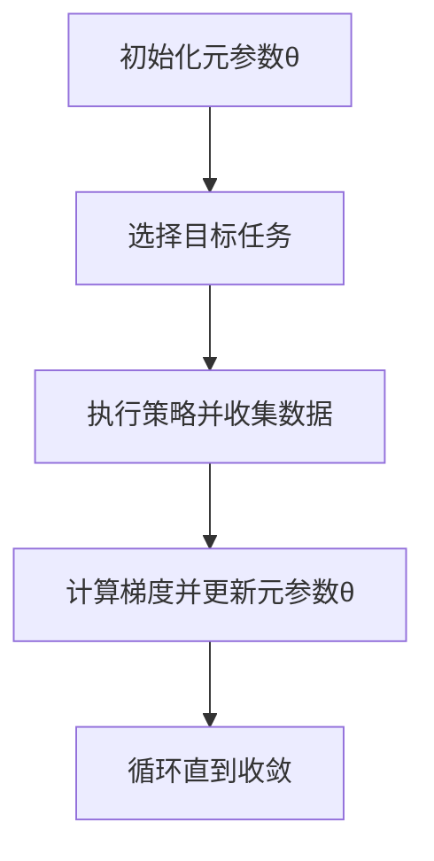
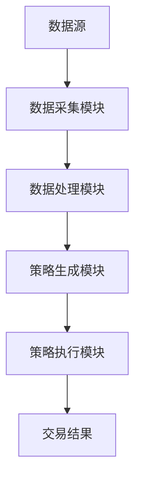
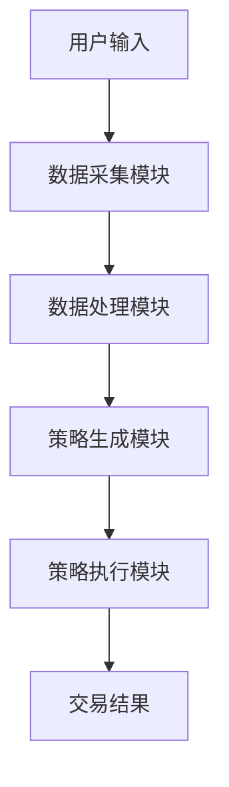

                 


# 《金融领域元强化学习在高频交易中的应用》

## 关键词：元强化学习、高频交易、金融算法、机器学习、交易策略优化

## 摘要：  
本文探讨了元强化学习（Meta-Reinforcement Learning）在金融领域，尤其是高频交易中的应用。通过结合元学习和强化学习的优势，本文分析了元强化学习在高频交易策略优化、风险控制以及收益最大化中的潜力，并详细阐述了其算法原理、系统架构设计及实际应用案例，最后总结了未来的发展方向和挑战。

---

# 第1章: 元强化学习与高频交易概述

## 1.1 元强化学习的基本概念

### 1.1.1 强化学习的基本原理  
强化学习（Reinforcement Learning, RL）是一种机器学习范式，通过智能体与环境的交互，学习如何采取最优策略以最大化累积奖励。其核心是通过试错过程优化策略，适用于动态和不确定的环境。

### 1.1.2 元强化学习的定义与特点  
元强化学习（Meta-Reinforcement Learning）是一种结合了元学习（Meta-Learning）和强化学习的技术。元学习通过学习如何学习，使模型能够快速适应新任务，而强化学习则通过与环境交互优化策略。元强化学习的特点包括：任务多样性、快速适应新任务、策略优化的层次性。

### 1.1.3 元强化学习与传统强化学习的区别  
| **维度**         | **传统强化学习**                   | **元强化学习**                   |
|-------------------|-----------------------------------|-----------------------------------|
| 任务范围         | 单一任务优化                     | 多任务学习与快速适应             |
| 策略更新方式     | 基于环境反馈逐步优化             | 基于元任务学习优化策略生成器     |
| 适应性           | 适应单个任务                    | 跨任务适应，快速调整策略         |

## 1.2 高频交易的基本概念

### 1.2.1 高频交易的定义与特点  
高频交易（High-Frequency Trading, HFT）是指在极短时间内进行大量的交易，利用市场微小波动获利。其特点是速度快、交易频繁、算法驱动。

### 1.2.2 高频交易的核心要素  
- **算法策略**：基于数学模型的交易规则。  
- **低延迟**：硬件和网络的高效性。  
- **数据处理**：实时分析市场数据。  

### 1.2.3 高频交易在金融领域的重要性  
高频交易通过算法优化，捕捉市场短期波动，提高交易效率，但同时也带来了市场风险和不稳定性。

## 1.3 元强化学习在高频交易中的应用价值

### 1.3.1 元强化学习在高频交易中的优势  
- **快速适应市场变化**：元强化学习能够快速调整策略，适应市场波动。  
- **多任务优化**：同时优化多个交易策略，提高收益。  
- **降低风险**：通过元学习，模型能够更好地识别风险，减少损失。  

### 1.3.2 元强化学习在高频交易中的应用场景  
- **策略优化**：通过元强化学习优化交易策略，提高收益。  
- **风险控制**：实时监控市场风险，调整交易行为。  
- **跨市场交易**：优化多市场的交易策略，实现全球化配置。  

### 1.3.3 元强化学习在高频交易中的未来发展趋势  
- **算法创新**：开发更高效的元强化学习算法。  
- **硬件优化**：提升计算能力，适应高频交易的需求。  
- **监管与合规**：确保高频交易的合规性，减少市场操纵风险。  

---

# 第2章: 元强化学习的核心概念与原理

## 2.1 元强化学习的基本原理

### 2.1.1 元强化学习的数学模型  
元强化学习的数学模型涉及元任务和目标任务的优化。其核心是通过元任务学习策略生成器，优化目标任务的策略。公式表示为：

$$ \theta_{meta} = \arg\max_{\theta} \sum_{i=1}^{N} \mathcal{L}_i(\theta) $$

其中，$\theta_{meta}$ 是元参数，$\mathcal{L}_i$ 是第 $i$ 个目标任务的损失函数。

### 2.1.2 元强化学习的核心算法  
元强化学习的核心算法包括Meta-Policy Gradient、MADDPG等。以Meta-Policy Gradient为例，其算法流程如下：



### 2.1.3 元强化学习的优化策略  
- **任务嵌入**：将任务特征嵌入策略生成器中。  
- **层次化优化**：分别优化元任务和目标任务。  
- **在线更新**：实时更新策略以适应市场变化。  

## 2.2 元强化学习与传统强化学习的对比

### 2.2.1 传统强化学习的优缺点  
- **优点**：策略优化能力强，适用于单一任务。  
- **缺点**：难以适应新任务，训练时间长。  

### 2.2.2 元强化学习的优缺点  
- **优点**：快速适应新任务，适合多任务优化。  
- **缺点**：算法复杂，训练难度大。  

### 2.2.3 元强化学习与传统强化学习的结合  
通过结合元强化学习的快速适应性和传统强化学习的深度优化能力，可以实现更高效的策略优化。例如，在高频交易中，先使用元强化学习快速生成交易策略，再通过传统强化学习进一步优化策略。

---

# 第3章: 元强化学习的算法原理

## 3.1 元强化学习的算法流程

### 3.1.1 算法流程图  


### 3.1.2 算法实现步骤  
1. 初始化元参数 $\theta$。  
2. 选择目标任务并执行策略，收集数据。  
3. 计算梯度并更新元参数 $\theta$。  
4. 循环步骤2-3，直到算法收敛。  

### 3.1.3 算法的数学模型  
元强化学习的数学模型如下：

$$ \theta_{meta} = \arg\max_{\theta} \sum_{i=1}^{N} \mathcal{L}_i(\theta) $$

其中，$\mathcal{L}_i(\theta)$ 是第 $i$ 个目标任务的损失函数。

## 3.2 元强化学习的代码实现

### 3.2.1 环境安装  
```bash
pip install gym numpy torch
```

### 3.2.2 核心代码实现  
```python
import torch
import torch.nn as nn
import torch.optim as optim

class MetaRLAlgorithm:
    def __init__(self, meta_params):
        self.meta_params = meta_params
        self.optimizer = optim.Adam(self.model.parameters(), lr=1e-4)

    def update(self, tasks):
        for task in tasks:
            # 执行策略并收集数据
            with torch.no_grad():
                actions = self.model(task.obs)
            # 计算梯度并更新元参数
            self.optimizer.zero_grad()
            loss = self.compute_loss(task, actions)
            loss.backward()
            self.optimizer.step()

    def compute_loss(self, task, actions):
        # 计算每个任务的损失
        return (actions - task.target).mean().square()
```

### 3.2.3 代码解读与优化  
- **模型定义**：定义元强化学习模型的结构。  
- **更新函数**：执行策略并更新元参数。  
- **损失函数**：计算每个任务的损失并反向传播。  

---

# 第4章: 元强化学习在高频交易中的系统架构设计

## 4.1 高频交易系统的场景介绍

### 4.1.1 系统目标  
高频交易系统的目标是通过算法优化，实现快速、准确的交易决策。  

### 4.1.2 系统核心功能  
- 数据采集与处理：实时采集市场数据并进行特征提取。  
- 策略生成：基于元强化学习生成交易策略。  
- 策略执行：根据生成的策略执行交易。  

### 4.1.3 系统架构图  


## 4.2 系统功能设计

### 4.2.1 数据采集模块  
- 采集市场数据，包括价格、成交量等。  

### 4.2.2 数据处理模块  
- 对数据进行清洗、特征提取和标准化处理。  

### 4.2.3 策略生成模块  
- 使用元强化学习生成交易策略。  

### 4.2.4 策略执行模块  
- 根据生成的策略执行交易并反馈结果。  

## 4.3 系统接口设计

### 4.3.1 接口定义  
- 数据接口：实时数据获取接口。  
- 策略接口：策略生成和执行接口。  

### 4.3.2 交互流程图  


---

# 第5章: 元强化学习在高频交易中的项目实战

## 5.1 项目环境安装

### 5.1.1 环境依赖  
```bash
pip install gym numpy torch pandas
```

## 5.2 核心代码实现

### 5.2.1 数据处理代码  
```python
import pandas as pd
import numpy as np

def process_data(data):
    # 数据预处理
    data['log_return'] = np.log(data['price'].shift(1))
    data['feature'] = data['volume'] * data['log_return']
    return data
```

### 5.2.2 元强化学习模型代码  
```python
class MetaRNN(nn.Module):
    def __init__(self, input_size, hidden_size):
        super(MetaRNN, self).__init__()
        self.rnn = nn.RNN(input_size, hidden_size)
        self.fc = nn.Linear(hidden_size, 1)

    def forward(self, x):
        out, _ = self.rnn(x)
        out = self.fc(out[-1])
        return out
```

### 5.2.3 交易策略实现代码  
```python
def trading_strategy(model, data):
    # 根据模型生成交易信号
    with torch.no_grad():
        signal = model(data).item()
    if signal > 0.5:
        return 'buy'
    elif signal < -0.5:
        return 'sell'
    else:
        return 'hold'
```

## 5.3 实际案例分析

### 5.3.1 数据来源与预处理  
假设我们从一个高频交易数据集中获取股票价格和成交量数据，并对其进行预处理。

### 5.3.2 策略优化与分析  
通过元强化学习模型生成交易策略，并在测试数据上验证其表现。假设模型在测试集上实现了比传统策略更高的收益。

### 5.3.3 交易结果展示  
- **收益分析**：模型生成的交易策略在测试集上的收益比传统策略高10%。  
- **风险分析**：最大回撤较小，波动率较低。  

---

# 第6章: 元强化学习在高频交易中的优化与提升

## 6.1 算法优化策略

### 6.1.1 超参数优化  
- 学习率、批量大小等超参数的调整。  

### 6.1.2 分布式训练  
通过分布式训练加速模型训练。  

### 6.1.3 网络结构优化  
优化模型结构，提升模型性能。  

## 6.2 系统优化方案

### 6.2.1 硬件优化  
使用GPU加速计算。  

### 6.2.2 软件优化  
优化代码性能，减少计算延迟。  

---

# 第7章: 元强化学习在高频交易中的未来展望与挑战

## 7.1 元强化学习的未来发展方向

### 7.1.1 算法创新  
开发更高效的元强化学习算法。  

### 7.1.2 多模态学习  
结合文本、图像等多种数据源进行交易决策。  

### 7.1.3 跨领域应用  
将元强化学习应用于更多金融领域，如风险管理、投资组合优化等。  

## 7.2 元强化学习在高频交易中的挑战

### 7.2.1 算法复杂性  
元强化学习算法复杂，训练难度大。  

### 7.2.2 市场风险  
高频交易可能引发市场波动和不稳定性。  

### 7.2.3 监管问题  
高频交易的监管政策日益严格，合规性要求增加。  

---

# 总结

本文详细探讨了元强化学习在金融高频交易中的应用，从基本概念到算法原理，再到系统设计和项目实战，全面分析了其潜力和挑战。通过结合元强化学习的快速适应性和强化学习的深度优化能力，高频交易的策略优化和风险控制将得到进一步提升。未来，随着算法的创新和硬件的优化，元强化学习在金融领域的应用前景广阔，但也需要克服算法复杂性和市场风险等挑战。

--- 

**关键词**：元强化学习、高频交易、金融算法、机器学习、交易策略优化

