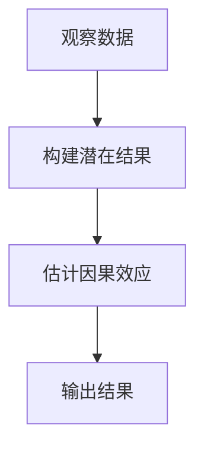
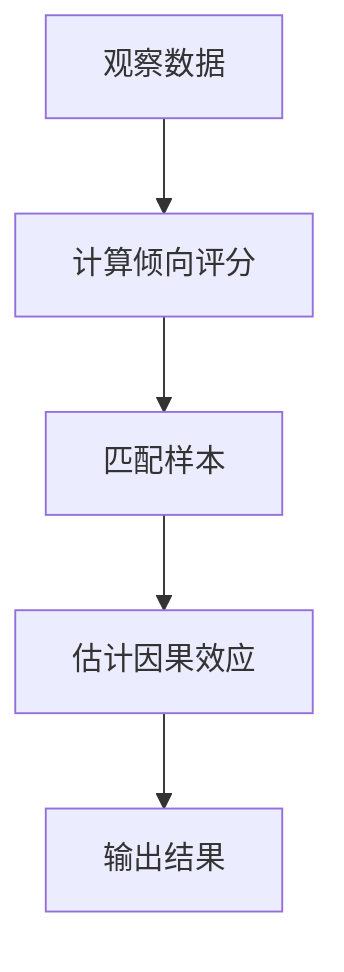
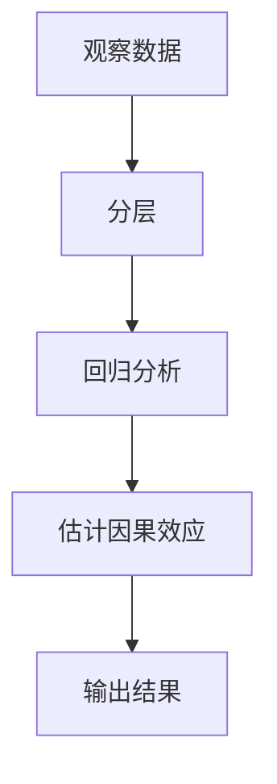
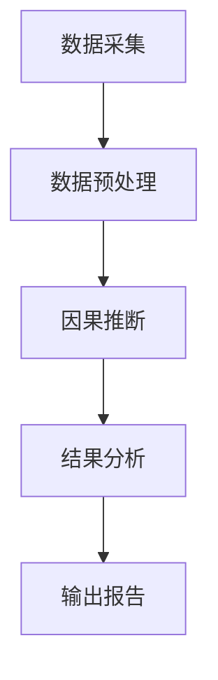
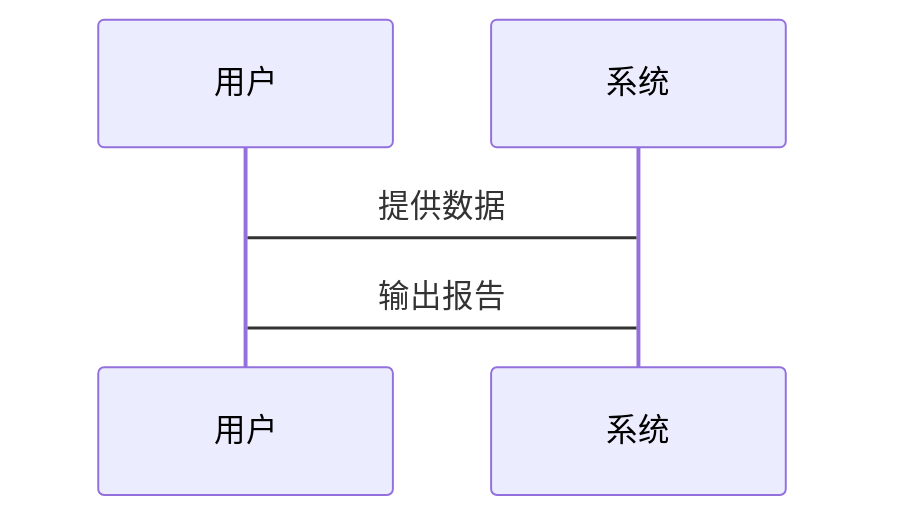

                 


# 《金融领域因果推断在政策评估中的应用》

---

## 关键词：因果推断、政策评估、金融建模、经济分析、数据科学

---

## 摘要：  
本文系统探讨了因果推断在金融政策评估中的应用，从基本概念、数学模型到实际应用，层层展开，结合金融领域的特点，分析了因果推断在政策评估中的优势与挑战。通过具体案例，展示了如何利用因果推断方法解决金融政策评估中的核心问题，并对未来研究方向进行了展望。

---

## 第一部分: 金融领域因果推断的背景与基础

---

### # 第1章: 问题背景与核心概念

#### ## 1.1 问题背景

##### ### 1.1.1 金融政策评估的挑战与局限性  
在金融领域，政策评估的核心目标是理解某一政策（如货币政策、财政政策或监管政策）对金融市场（如股市、债市、汇率等）的影响。传统的统计方法（如回归分析）往往只能识别相关关系，而无法准确估计因果关系。这导致政策评估结果可能存在偏差或误导性。例如，单纯通过相关关系分析，可能会误将市场波动归因于政策，而实际上可能是其他因素在起作用。

##### ### 1.1.2 因果推断的基本概念与重要性  
因果推断是一种统计方法，旨在识别变量之间的因果关系，而非仅仅是相关关系。在金融政策评估中，因果推断可以帮助我们回答以下关键问题：  
1. 政策是否真正导致了某种市场反应？  
2. 政策的效果在不同市场参与者（如机构投资者、个人投资者）中是否一致？  
3. 政策的长期影响是什么？  

##### ### 1.1.3 金融领域因果推断的核心问题  
金融市场的复杂性（如异质性、非线性关系、噪声干扰等）使得因果推断在金融政策评估中面临诸多挑战。例如，如何在数据中识别出真正的因果关系，如何处理潜在的混杂变量（confounding variables）等。

---

#### ## 1.2 问题描述与解决路径

##### ### 1.2.1 金融政策评估的基本问题  
金融政策评估的核心问题在于如何在观测数据中识别政策的因果效应。由于金融市场数据的复杂性，传统的回归分析往往难以满足因果推断的要求。  

##### ### 1.2.2 因果推断在政策评估中的作用  
因果推断通过引入潜在结果框架（Potential Outcome Framework），可以帮助我们更准确地估计政策的因果效应。具体来说，因果推断可以通过以下方式解决金融政策评估中的问题：  
- 通过倾向评分匹配（Propensity Score Matching）等方法，控制混杂变量，减少偏差。  
- 通过双重稳健估计（Doubly Robust Estimation）等方法，提高估计的准确性和可靠性。  

##### ### 1.2.3 解决问题的主要方法与工具  
在金融领域，因果推断的主要方法包括：  
1. **潜在结果框架**：通过构建潜在结果（Potential Outcomes）来估计因果效应。  
2. **倾向评分匹配**：通过匹配具有相似特征的样本，消除混杂变量的影响。  
3. **分层回归分析**：通过分层分析，减少变量之间的非线性关系对结果的影响。  

---

#### ## 1.3 问题解决的边界与外延

##### ### 1.3.1 因果推断的适用范围与限制  
因果推断适用于需要识别变量之间因果关系的场景，但在以下情况下可能受限：  
- 数据质量：因果推断需要高质量的数据，否则可能导致估计偏差。  
- 混杂变量：如果存在未观测的混杂变量，因果推断可能无法准确识别因果关系。  

##### ### 1.3.2 金融领域因果推断的特殊性  
金融市场的数据具有高度的异质性和复杂性，这使得因果推断在金融领域面临更大的挑战。例如，金融市场的数据往往具有高度的噪声，且变量之间的关系往往是非线性的。

##### ### 1.3.3 与其他统计方法的区别与联系  
因果推断与其他统计方法（如回归分析）的主要区别在于，因果推断关注的是因果关系，而不仅仅是相关关系。然而，因果推断也可以通过回归分析等工具来实现。

---

### # 第2章: 因果推断的核心概念与联系

#### ## 2.1 因果推断的原理与方法

##### ### 2.1.1 因果关系的定义与特征  
因果关系是指一个变量的变化会导致另一个变量的变化。在金融政策评估中，因果关系可以帮助我们理解政策对市场的影响。

##### ### 2.1.2 因果推断的核心方法  
因果推断的核心方法包括：  
- **潜在结果框架**：通过构建潜在结果（Potential Outcomes）来估计因果效应。  
- **倾向评分匹配**：通过匹配具有相似特征的样本，消除混杂变量的影响。  
- **分层回归分析**：通过分层分析，减少变量之间的非线性关系对结果的影响。  

##### ### 2.1.3 金融领域因果推断的独特性  
金融领域的因果推断具有以下独特性：  
- 数据的复杂性：金融数据通常具有高度的异质性和复杂性。  
- 市场参与者的异质性：不同市场参与者的行为可能对政策的反应不同。  
- 市场的动态性：金融市场是一个动态系统，因果关系可能随时间变化。

---

#### ## 2.2 核心概念的属性特征对比

##### ### 2.2.1 因果关系与相关关系的对比  
因果关系与相关关系的主要区别在于，因果关系关注的是变量之间的因果关系，而相关关系关注的是变量之间的关联关系。

##### ### 2.2.2 不同因果推断方法的特征分析  
不同因果推断方法的特征如下：  
- **潜在结果框架**：关注潜在结果，通过反事实推理（Counterfactual Reasoning）来估计因果效应。  
- **倾向评分匹配**：通过匹配样本，消除混杂变量的影响。  
- **分层回归分析**：通过分层分析，减少变量之间的非线性关系对结果的影响。  

##### ### 2.2.3 金融领域因果关系的特殊属性  
金融领域因果关系的特殊属性包括：  
- 市场的动态性：因果关系可能随时间变化。  
- 参与者的异质性：不同参与者的行为可能对政策的反应不同。  
- 数据的复杂性：金融数据通常具有高度的异质性和复杂性。

---

#### ## 2.3 ER实体关系图架构

##### ### 2.3.1 实体关系图的构建方法  
实体关系图（ER图）是一种用于描述数据库中实体及其关系的工具。在金融领域因果推断中，可以通过构建ER图来描述政策、市场参与者、市场行为等实体之间的关系。

##### ### 2.3.2 金融领域因果关系的实体关系图  
以下是一个简单的ER图，展示了金融领域因果关系的实体关系：  
```mermaid
erDiagram
    actor MarketParticipant {
        +id int
        +Behavior string
        +MarketImpact string
    }
    actor PolicyMaker {
        +id int
        +Policy string
        +PolicyEffect string
    }
    MarketParticipant --> PolicyMaker : "受政策影响"
    PolicyMaker --> MarketParticipant : "制定政策"
```

##### ### 2.3.3 实体关系图的分析与应用  
通过ER图，我们可以更清晰地理解政策与市场参与者之间的关系，从而更好地进行因果推断。

---

### # 第3章: 金融领域因果推断的数学模型与算法原理

#### ## 3.1 因果推断的数学基础

##### ### 3.1.1 概率论基础  
概率论是因果推断的数学基础之一。在因果推断中，我们通常需要计算潜在结果的概率分布。

##### ### 3.1.2 图论与因果图的构建  
图论是因果推断的另一个重要数学基础。因果图（Causal Graph）是一种用于描述因果关系的工具，可以通过构建因果图来识别因果关系。

##### ### 3.1.3 金融数据的因果关系建模  
在金融领域，因果关系建模需要考虑市场的动态性、参与者的异质性等因素。

---

#### ## 3.2 因果推断的核心算法

##### ### 3.2.1 潜在结果框架  
潜在结果框架（Potential Outcome Framework）是因果推断的核心方法之一。通过构建潜在结果，我们可以估计因果效应。

##### ### 3.2.2 倾向评分匹配  
倾向评分匹配（Propensity Score Matching）是一种通过匹配具有相似特征的样本来消除混杂变量影响的方法。

##### ### 3.2.3 阶层回归分析  
分层回归分析（Stratified Regression Analysis）是一种通过分层分析来减少变量之间非线性关系影响的方法。

---

#### ## 3.3 算法流程图

##### ### 3.3.1 潜在结果框架的流程图  
以下是一个潜在结果框架的流程图：  


##### ### 3.3.2 倾向评分匹配的流程图  
以下是一个倾向评分匹配的流程图：  


##### ### 3.3.3 阶层回归分析的流程图  
以下是一个分层回归分析的流程图：  


---

## 第二部分: 金融领域因果推断的核心概念与联系

---

### # 第4章: 金融领域因果推断的核心概念与联系

#### ## 4.1 因果关系的属性特征对比

##### ### 4.1.1 因果关系与相关关系的对比  
因果关系与相关关系的主要区别在于，因果关系关注的是变量之间的因果关系，而相关关系关注的是变量之间的关联关系。

##### ### 4.1.2 不同因果推断方法的特征分析  
不同因果推断方法的特征如下：  
- **潜在结果框架**：关注潜在结果，通过反事实推理来估计因果效应。  
- **倾向评分匹配**：通过匹配样本，消除混杂变量的影响。  
- **分层回归分析**：通过分层分析，减少变量之间的非线性关系对结果的影响。  

##### ### 4.1.3 金融领域因果关系的特殊属性  
金融领域因果关系的特殊属性包括：  
- 市场的动态性：因果关系可能随时间变化。  
- 参与者的异质性：不同参与者的行为可能对政策的反应不同。  
- 数据的复杂性：金融数据通常具有高度的异质性和复杂性。

---

#### ## 4.2 ER实体关系图架构

##### ### 4.2.1 实体关系图的构建方法  
实体关系图（ER图）是一种用于描述数据库中实体及其关系的工具。在金融领域因果推断中，可以通过构建ER图来描述政策、市场参与者、市场行为等实体之间的关系。

##### ### 4.2.2 金融领域因果关系的实体关系图  
以下是一个简单的ER图，展示了金融领域因果关系的实体关系：  
```mermaid
erDiagram
    actor MarketParticipant {
        +id int
        +Behavior string
        +MarketImpact string
    }
    actor PolicyMaker {
        +id int
        +Policy string
        +PolicyEffect string
    }
    MarketParticipant --> PolicyMaker : "受政策影响"
    PolicyMaker --> MarketParticipant : "制定政策"
```

##### ### 4.2.3 实体关系图的分析与应用  
通过ER图，我们可以更清晰地理解政策与市场参与者之间的关系，从而更好地进行因果推断。

---

## 第三部分: 金融领域因果推断的数学模型与算法原理

---

### # 第5章: 金融领域因果推断的数学模型与算法原理

#### ## 5.1 因果推断的数学基础

##### ### 5.1.1 概率论基础  
概率论是因果推断的数学基础之一。在因果推断中，我们通常需要计算潜在结果的概率分布。

##### ### 5.1.2 图论与因果图的构建  
图论是因果推断的另一个重要数学基础。因果图（Causal Graph）是一种用于描述因果关系的工具，可以通过构建因果图来识别因果关系。

##### ### 5.1.3 金融数据的因果关系建模  
在金融领域，因果关系建模需要考虑市场的动态性、参与者的异质性等因素。

---

#### ## 5.2 因果推断的核心算法

##### ### 5.2.1 潜在结果框架  
潜在结果框架（Potential Outcome Framework）是因果推断的核心方法之一。通过构建潜在结果，我们可以估计因果效应。

##### ### 5.2.2 倾向评分匹配  
倾向评分匹配（Propensity Score Matching）是一种通过匹配具有相似特征的样本来消除混杂变量影响的方法。

##### ### 5.2.3 阶层回归分析  
分层回归分析（Stratified Regression Analysis）是一种通过分层分析来减少变量之间非线性关系影响的方法。

---

#### ## 5.3 算法流程图

##### ### 5.3.1 潜在结果框架的流程图  
以下是一个潜在结果框架的流程图：  


##### ### 5.3.2 倾向评分匹配的流程图  
以下是一个倾向评分匹配的流程图：  


##### ### 5.3.3 阶层回归分析的流程图  
以下是一个分层回归分析的流程图：  


---

## 第四部分: 金融领域因果推断的系统分析与架构设计

---

### # 第6章: 金融领域因果推断的系统分析与架构设计

#### ## 6.1 问题场景介绍

##### ### 6.1.1 金融政策评估的典型场景  
金融政策评估的典型场景包括货币政策评估、财政政策评估、监管政策评估等。

##### ### 6.1.2 系统目标与功能需求  
系统的目标是通过因果推断方法，准确估计政策的因果效应。功能需求包括数据采集、数据预处理、因果推断、结果分析等。

##### ### 6.1.3 系统输入与输出  
系统输入包括金融市场数据、政策信息等，系统输出包括政策的因果效应估计、政策效果分析报告等。

---

#### ## 6.2 系统功能设计

##### ### 6.2.1 系统功能模块划分  
系统功能模块包括数据采集模块、数据预处理模块、因果推断模块、结果分析模块等。

##### ### 6.2.2 功能流程图  
以下是一个功能流程图：  


##### ### 6.2.3 功能模块详细设计  
- **数据采集模块**：负责采集金融市场数据、政策信息等。  
- **数据预处理模块**：对数据进行清洗、转换等预处理操作。  
- **因果推断模块**：通过因果推断方法，估计政策的因果效应。  
- **结果分析模块**：对因果效应估计结果进行分析，生成报告。

---

#### ## 6.3 系统架构设计

##### ### 6.3.1 系统架构图  
以下是一个系统架构图：  


##### ### 6.3.2 系统接口设计  
系统接口包括数据输入接口、数据输出接口等。

##### ### 6.3.3 系统交互图  
以下是一个系统交互图：  


---

## 第五部分: 项目实战

---

### # 第7章: 项目实战

#### ## 7.1 环境安装与配置

##### ### 7.1.1 环境要求  
需要安装Python、R等编程语言，以及相关的库（如pandas、numpy、scikit-learn等）。

##### ### 7.1.2 安装步骤  
- 安装Python  
- 安装必要的库（如pandas、numpy、scikit-learn等）  

---

#### ## 7.2 系统核心代码实现

##### ### 7.2.1 数据采集模块  
```python
import pandas as pd

def collect_data():
    # 从数据库中采集数据
    data = pd.read_sql("SELECT * FROM financial_data", conn)
    return data
```

##### ### 7.2.2 数据预处理模块  
```python
def preprocess_data(data):
    # 数据清洗
    data = data.dropna()
    # 数据转换
    data['date'] = pd.to_datetime(data['date'])
    return data
```

##### ### 7.2.3 因果推断模块  
```python
def causal_inference(data):
    # 假设我们使用倾向评分匹配
    from sklearn.linear_model import LogisticRegression
    from sklearn.metrics import accuracy_score
    # 构建倾向评分模型
    model = LogisticRegression()
    model.fit(data[['feature1', 'feature2']], data['treatment'])
    # 计算倾向评分
    ps = model.predict_proba(data[['feature1', 'feature2']])[:, 1]
    # 匹配样本
    matched_data = data.sort_values(ps)
    return matched_data
```

##### ### 7.2.4 结果分析模块  
```python
def analyze_results(matched_data):
    # 估计因果效应
    from sklearn.linear_model import LinearRegression
    model = LinearRegression()
    model.fit(matched_data[['feature1', 'feature2']], matched_data['outcome'])
    # 输出结果
    print("因果效应:", model.coef_)
```

---

#### ## 7.3 案例分析与详细解读

##### ### 7.3.1 数据采集与预处理  
假设我们有一个金融数据集，包含以下字段：  
- `date`: 日期  
- `feature1`: 特征1  
- `feature2`: 特征2  
- `treatment`: 政策变量（1表示政策实施，0表示未实施）  
- `outcome`: 结果变量  

我们首先需要采集数据，并进行预处理。

##### ### 7.3.2 因果推断与结果分析  
通过倾向评分匹配，我们可以匹配具有相似特征的样本，消除混杂变量的影响。然后，通过回归分析，我们可以估计政策的因果效应。

---

## 第六部分: 总结与展望

---

### # 第8章: 总结与展望

#### ## 8.1 最佳实践 tips  
- 在金融政策评估中，因果推断是一种强大的工具，可以帮助我们更准确地估计政策的因果效应。  
- 在实际应用中，需要结合具体场景选择合适的方法，并注意数据的质量和特征。  

#### ## 8.2 小结  
本文系统探讨了因果推断在金融政策评估中的应用，从基本概念、数学模型到实际应用，层层展开，结合金融领域的特点，分析了因果推断在政策评估中的优势与挑战。

#### ## 8.3 注意事项  
- 因果推断需要高质量的数据，否则可能导致估计偏差。  
- 如果存在未观测的混杂变量，因果推断可能无法准确识别因果关系。  

#### ## 8.4 拓展阅读  
- 建议进一步阅读相关文献，了解因果推断在其他领域的应用。  

---

## 结语  
因果推断在金融政策评估中的应用具有重要的理论意义和实践价值。随着数据科学的不断发展，因果推断在金融领域的应用将更加广泛和深入。

