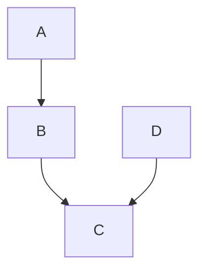
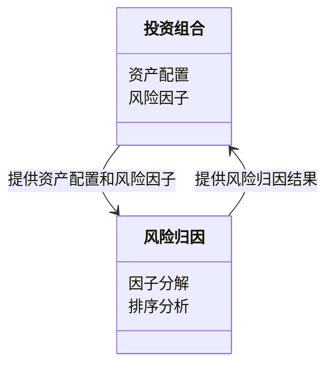
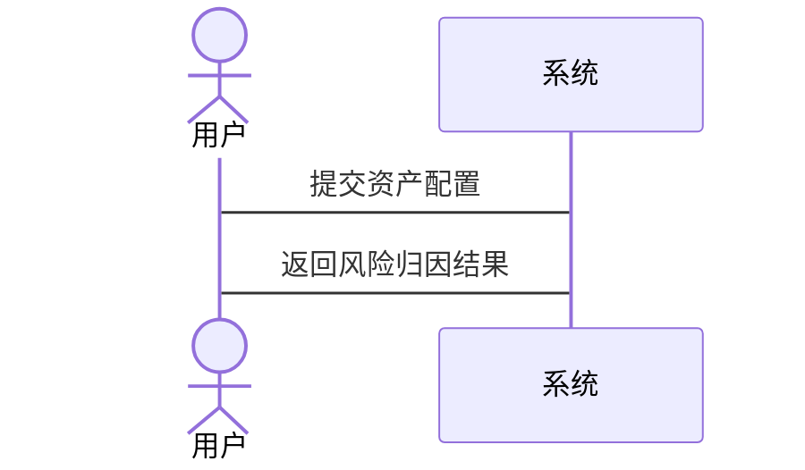

                 


# 《金融领域因果推理在投资组合风险归因中的应用》

> 关键词：因果推理、投资组合风险归因、金融领域、因果图模型、风险分析、Python实现

> 摘要：本文深入探讨了因果推理在金融领域投资组合风险归因中的应用。通过分析因果关系的数学模型、因果图的构建方法，以及基于反事实推理的风险归因算法，结合实际案例，展示了如何利用因果推理技术实现投资组合风险的精准分析与优化。

---

# 第一章：金融领域因果推理概述

## 1.1 因果推理的基本概念

### 1.1.1 因果关系的定义与特点
因果关系是事件之间的一种联系，表现为“如果A发生，那么B也会发生”。其特点包括时间顺序性、可干预性、可传递性和可逆性。

### 1.1.2 因果推理与相关概念的区别
- **相关关系**：只关注变量之间的关联，不考虑因果关系。
- **因果关系**：关注变量之间的“原因-结果”关系。
- **条件概率**：在给定条件下变量的概率分布。

### 1.1.3 金融领域因果推理的应用场景
- 股票价格波动分析
- 投资组合风险归因
- 信用风险评估
- 资产配置优化

## 1.2 投资组合风险归因的基本原理

### 1.2.1 投资组合风险的定义
投资组合风险是指投资组合收益的波动性，通常通过标准差或VaR（Value at Risk）衡量。

### 1.2.2 风险归因的定义与目的
风险归因是将投资组合的整体风险分解为各个资产或风险因子的贡献。

### 1.2.3 风险归因的常见方法
- **因子分解法**：基于因子模型（如CAPM）分解风险。
- **排序法**：通过排序分析资产对风险的贡献。
- **极端风险事件分析**：分析极端事件对投资组合的影响。

---

# 第二章：因果推理的核心概念与联系

## 2.1 因果关系的数学模型

### 2.1.1 概率论基础
- **条件概率**：$P(B|A)$ 表示在A发生的条件下，B发生的概率。
- **联合概率**：$P(A,B)$ 表示A和B同时发生的概率。

### 2.1.2 因果图模型
因果图模型通过有向图表示变量之间的因果关系。

### 2.1.3 马尔可夫假设与干预
马尔可夫假设认为，一个变量只与其最近的过去有关，而不依赖更早的事件。

## 2.2 因果关系的属性特征对比

| 属性 | 相关关系 | 因果关系 |
|------|----------|----------|
| 时间顺序性 | 无要求 | 有要求 |
| 可干预性 | 不可干预 | 可干预 |
| 可传递性 | 可传递 | 可传递 |
| 可逆性 | 不可逆 | 可逆 |

## 2.3 ER实体关系图架构

```mermaid
erDiagram
    actor 投资者 {
        string 资产
        string 风险因子
    }
    actor 风险管理 {
        string 风险评估
        string 对策建议
    }
    投资者 --> 风险管理 : 提供资产和风险因子
    风险管理 --> 投资者 : 提供风险评估和对策建议
```

---

# 第三章：因果推理算法原理

## 3.1 因果图模型的构建

### 3.1.1 贝叶斯网络与因果图
贝叶斯网络是一种有向无环图，表示变量之间的概率关系。

### 3.1.2 结构学习算法
- **KPC（Kernel-based）算法**：基于核方法学习因果图。
- **PC（Predictive Correctness）算法**：通过条件独立性测试构建因果图。

### 3.1.3 参数学习与推断
通过最大似然估计或贝叶斯推断学习因果图的参数。

## 3.2 因果推理的数学公式

### 3.2.1 干预公式
$$ P(y | do(x)) = \sum_{z} P(y | x, z) P(z | do(x')) $$

### 3.2.2 反事实推理公式
$$ P(y | do(x), x') = P(y | x, x') $$

### 3.2.3 路径分析公式
$$ \text{总效应} = \sum_{m} \text{直接效应} \times \text{间接效应} $$

## 3.3 算法实现与代码示例

### 3.3.1 Python代码实现
```python
def causal_graph():
    import networkx as nx
    G = nx.DiGraph()
    G.add_edges_from([('A', 'B'), ('B', 'C'), ('D', 'C')])
    return G

def main():
    graph = causal_graph()
    print(graph.nodes())
    print(graph.edges())

if __name__ == "__main__":
    main()
```

### 3.3.2 算法流程图


---

# 第四章：投资组合风险归因的系统分析

## 4.1 系统功能设计

### 4.1.1 领域模型


### 4.1.2 系统功能模块划分
- 数据输入模块
- 模型计算模块
- 结果展示模块

## 4.2 系统架构设计

### 4.2.1 分层架构


### 4.2.2 接口设计与交互流程


---

# 第五章：项目实战

## 5.1 投资组合风险归因的实现

### 5.1.1 环境安装
- Python 3.8+
- NetworkX、Scikit-learn

### 5.1.2 核心代码实现
```python
import numpy as np
import pandas as pd
from sklearn.metrics import r2_score

def portfolio_risk Attribution():
    # 数据预处理
    returns = pd.read_csv('returns.csv')
    factors = pd.read_csv('factors.csv')
    
    # 因子分解法
    model = factor_model(factors)
    risk_contribution = model.predict(returns)
    
    return risk_contribution

def main():
    risk_contribution = portfolio_risk_Attribution()
    print(risk_contribution)

if __name__ == "__main__":
    main()
```

### 5.1.3 代码应用解读
通过因子分解法，将投资组合的整体风险分解为各个风险因子的贡献。

---

# 第六章：总结与展望

## 6.1 总结
本文详细探讨了因果推理在金融领域投资组合风险归因中的应用，通过构建因果图模型和反事实推理算法，实现了风险的精准分析与优化。

## 6.2 未来展望
未来的研究可以进一步结合强化学习和深度学习技术，提升因果推理的准确性和效率。

---

# 参考文献
1. Pearl, J. (2009). Causal Inference in Statistics: A Journey into the Causal Model. Springer.
2. Bishop, C. M. (2006). Pattern Recognition and Machine Learning. Springer.
3. Goodrich, B. (2016). Financial Risk Management with Python. Packt Publishing.

