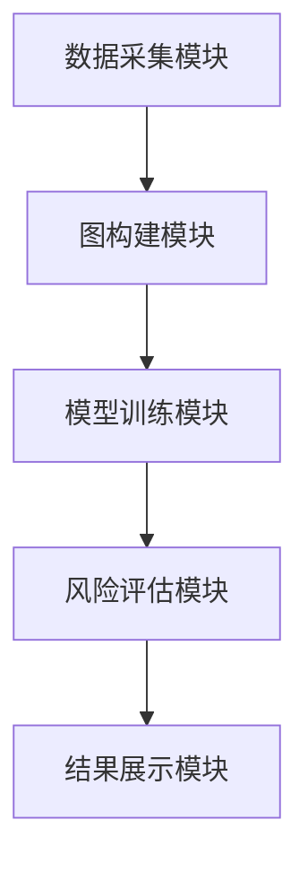

                 


# 《金融领域图卷积网络在全球金融网络风险评估中的应用》

## 关键词：金融网络、图卷积网络、风险评估、深度学习、图神经网络、系统架构、项目实战

## 摘要：  
随着金融市场日益复杂化，传统的金融风险评估方法逐渐暴露出其局限性。图卷积网络（Graph Convolutional Networks, GCN）作为一种新兴的图神经网络技术，能够有效地处理复杂的金融网络结构，为金融风险评估提供了新的解决方案。本文将从图卷积网络的基本原理出发，结合金融网络的特性，详细探讨其在金融风险评估中的应用。通过对算法原理、系统架构设计和项目实战的深入分析，本文旨在为读者提供一个全面理解图卷积网络在金融领域应用的框架，并展示其在实际金融风险评估中的巨大潜力。

---

# 第一部分: 金融领域图卷积网络概述

## 第1章: 金融网络风险评估的背景与挑战

### 1.1 金融网络风险评估的重要性  
金融网络是由多个金融机构（如银行、保险公司、投资机构等）及其之间的交互关系构成的复杂系统。在全球化和金融化的背景下，金融机构之间的关联性日益增强，单一机构的风险可能迅速蔓延到整个金融系统，导致系统性风险的出现。因此，准确评估金融网络中的风险，对于维护金融稳定具有重要意义。  

#### 1.1.1 金融网络的复杂性与风险传播  
金融网络的复杂性主要体现在以下几个方面：
- **非线性关系**：金融机构之间的风险传播通常是非线性的，传统的线性回归模型难以捕捉这种复杂关系。
- **多层次结构**：金融网络往往具有多层次的结构，例如从单个机构到整个金融系统，风险可能在不同层次之间传播。
- **动态性**：金融网络中的关系和风险因素会随着时间的推移而变化，静态模型难以应对这种动态性。

#### 1.1.2 传统金融风险评估方法的局限性  
传统的金融风险评估方法主要包括回归分析、时间序列分析和马尔可夫链模型等。然而，这些方法在面对金融网络的复杂性时，存在以下局限性：
- **忽略网络结构**：传统方法通常将金融机构视为独立的个体，忽略了它们之间的相互关联。
- **难以捕捉非线性关系**：传统方法在处理复杂的非线性关系时表现不佳。
- **计算复杂度高**：当金融网络规模较大时，传统的计算方法可能会面临计算复杂度过高的问题。

#### 1.1.3 图卷积网络在金融领域的应用潜力  
图卷积网络（GCN）作为一种基于图结构的深度学习技术，具有以下优势：
- **捕捉复杂关系**：GCN能够有效地捕捉金融网络中复杂的关联关系，尤其是在处理大规模金融网络时表现优异。
- **非线性特征提取**：GCN通过多层的图卷积操作，能够自动提取金融网络中的非线性特征。
- **全局视角**：GCN能够从全局角度对金融网络进行建模，从而更好地识别系统性风险。

### 1.2 图卷积网络的核心概念  

#### 1.2.1 图论基础与图数据结构  
在图论中，图由节点（vertex）和边（edge）组成。在金融网络中，节点可以代表金融机构，边可以代表金融机构之间的关联关系。图的表示可以通过邻接矩阵或邻接列表来实现。  

图的邻接矩阵表示如下：
$$
A = \begin{bmatrix}
0 & 1 & 0 \\
1 & 0 & 1 \\
0 & 1 & 0
\end{bmatrix}
$$  
其中，$A_{i,j} = 1$ 表示节点$i$和节点$j$之间存在边，$A_{i,j} = 0$ 表示不存在边。

#### 1.2.2 图卷积网络的基本原理  
图卷积网络是一种在图结构上进行卷积操作的深度学习模型。其核心思想是将节点的特征通过图的结构信息进行传播和聚合，从而生成新的节点特征。  

图卷积网络的前向传播过程可以用以下公式表示：
$$
h_i^{(l+1)} = \sigma\left( \sum_{j \in \mathcal{N}(i)} \frac{1}{d_j} W h_j^{(l)} \right)
$$  
其中，$h_i^{(l)}$ 表示节点$i$在第$l$层的特征向量，$\mathcal{N}(i)$ 表示节点$i$的邻居节点集合，$d_j$ 表示节点$j$的度数，$W$ 是卷积核参数，$\sigma$ 是激活函数。

#### 1.2.3 图卷积网络与传统卷积网络的对比  
与传统卷积网络相比，图卷积网络具有以下特点：
- **全局视角**：图卷积网络能够捕捉全局的网络结构信息，而传统卷积网络通常只关注局部区域。
- **动态边关系**：图卷积网络能够处理动态的边关系，而传统卷积网络则无法应对这种动态性。
- **自适应性**：图卷积网络能够自适应地调整特征提取的方式，以应对不同的网络结构。

---

## 第2章: 图卷积网络在金融网络中的应用  

### 2.1 金融网络的图表示  

#### 2.1.1 金融机构之间的关系建模  
在金融网络中，金融机构之间的关系可以通过图的边来表示。例如，银行A向银行B提供贷款，可以表示为银行A和银行B之间有一条有向边。  

#### 2.1.2 金融市场数据的图结构化  
金融市场的数据可以包括股票价格、交易量、公司新闻等多种信息。通过将这些信息转化为图的结构，可以更好地捕捉市场中的复杂关系。  

#### 2.1.3 图数据的特征提取与表示  
图数据的特征提取可以通过以下步骤进行：
1. **节点特征提取**：从每个节点中提取初始特征，例如公司的财务数据、市场表现等。
2. **边特征提取**：从边中提取特征，例如交易金额、交易频率等。
3. **图特征提取**：通过图卷积操作，将节点和边的特征进行聚合，生成图级别的特征。

### 2.2 图卷积网络的优势与适用场景  

#### 2.2.1 图卷积网络在金融网络中的优势  
- **捕捉复杂关系**：图卷积网络能够捕捉金融网络中的复杂关系，例如金融机构之间的相互依赖关系。
- **全局视角**：图卷积网络能够从全局视角对金融网络进行建模，从而更好地识别系统性风险。
- **非线性特征提取**：图卷积网络能够自动提取金融网络中的非线性特征，从而提高风险评估的准确性。

#### 2.2.2 图卷积网络在风险评估中的适用场景  
- **信用风险评估**：通过分析金融机构之间的关联关系，评估单一机构的信用风险。
- **系统性风险评估**：通过分析金融网络的全局结构，识别可能引发系统性风险的关键机构。
- **市场风险评估**：通过分析金融市场的动态关系，评估市场风险。

#### 2.2.3 图卷积网络与其他图神经网络模型的对比  
图卷积网络与其他图神经网络模型（如GraphSAGE、GAT）相比，具有以下优势：
- **计算效率高**：图卷积网络的计算效率较高，适用于大规模金融网络的建模。
- **易于实现**：图卷积网络的实现相对简单，便于金融领域的从业者上手。

---

# 第二部分: 图卷积网络的算法原理  

## 第3章: 图卷积网络的数学模型与算法  

### 3.1 图卷积网络的数学基础  

#### 3.1.1 图论中的矩阵表示  
图的邻接矩阵和度数矩阵是图卷积网络的基础。邻接矩阵$A$表示节点之间的连接关系，度数矩阵$D$表示节点的度数。图的拉普拉斯矩阵可以表示为：
$$
L = D - A
$$  

#### 3.1.2 稀疏矩阵与图拉普拉斯矩阵  
稀疏矩阵在图卷积网络中具有重要意义。稀疏矩阵的计算可以提高图卷积操作的效率。拉普拉斯矩阵在图卷积网络中用于计算节点的特征表示。

#### 3.1.3 图卷积的数学推导  
图卷积操作的数学推导如下：
$$
h_i^{(l+1)} = \sigma\left( \sum_{j \in \mathcal{N}(i)} \frac{1}{d_j} W h_j^{(l)} \right)
$$  
其中，$\sigma$ 是激活函数，$W$ 是卷积核参数。

### 3.2 图卷积网络的算法实现  

#### 3.2.1 GCN的前向传播过程  
GCN的前向传播过程可以通过以下步骤进行：
1. **输入特征提取**：提取每个节点的初始特征。
2. **图卷积操作**：通过图卷积操作生成新的节点特征。
3. **激活函数**：对生成的特征进行激活处理。
4. **池化操作**：对特征进行池化处理，降低计算复杂度。

#### 3.2.2 图卷积层的参数更新  
图卷积层的参数更新可以通过以下公式进行：
$$
W_{new} = W_{old} - \eta \frac{\partial L}{\partial W}
$$  
其中，$\eta$ 是学习率，$L$ 是损失函数。

#### 3.2.3 模型的训练与优化  
模型的训练与优化可以通过以下步骤进行：
1. **损失函数计算**：计算模型的损失函数。
2. **反向传播**：通过反向传播计算模型的梯度。
3. **参数更新**：根据梯度更新模型的参数。

---

## 第4章: 图卷积网络的训练与优化  

### 4.1 图卷积网络的训练流程  

#### 4.1.1 数据预处理与图构建  
数据预处理包括数据清洗和特征提取。图的构建可以通过邻接矩阵或邻接列表来实现。  

#### 4.1.2 模型初始化与参数设置  
模型初始化包括卷积核参数和激活函数的初始化。参数设置包括学习率、批量大小和 epochs。

#### 4.1.3 模型训练与损失函数优化  
模型训练可以通过批量训练或在线训练进行。损失函数优化可以通过随机梯度下降（SGD）或Adam优化器进行。

### 4.2 图卷积网络的优化策略  

#### 4.2.1 参数调节与超参数优化  
参数调节包括学习率调整和动量调整。超参数优化可以通过网格搜索或随机搜索进行。

#### 4.2.2 模型的正则化与防止过拟合  
模型的正则化可以通过L2正则化或Dropout进行。防止过拟合可以通过早停（Early Stopping）进行。

#### 4.2.3 并行计算与加速训练  
并行计算可以通过多线程或分布式计算进行。加速训练可以通过优化算法和优化器选择进行。

---

# 第三部分: 图卷积网络在金融网络风险评估中的系统设计  

## 第5章: 金融网络风险评估系统的设计与实现  

### 5.1 系统架构设计  

#### 5.1.1 系统模块划分  
金融网络风险评估系统可以划分为以下几个模块：
1. **数据采集模块**：负责采集金融网络数据。
2. **图构建模块**：负责将金融网络数据转化为图结构。
3. **模型训练模块**：负责训练图卷积网络模型。
4. **风险评估模块**：负责对金融网络中的风险进行评估。
5. **结果展示模块**：负责展示风险评估结果。

#### 5.1.2 系统功能设计  
系统的功能设计包括数据采集、图构建、模型训练、风险评估和结果展示。

#### 5.1.3 系统架构图（Mermaid）  


### 5.2 系统接口设计  

#### 5.2.1 数据接口设计  
数据接口包括数据输入接口和数据输出接口。

#### 5.2.2 模型接口设计  
模型接口包括模型输入接口和模型输出接口。

#### 5.2.3 用户接口设计  
用户接口包括用户输入接口和用户输出接口。

---

## 第6章: 系统实现与项目实战  

### 6.1 环境搭建与数据准备  

#### 6.1.1 开发环境安装与配置  
开发环境包括Python、TensorFlow、Keras和网络分析工具。

#### 6.1.2 数据集获取与预处理  
数据集可以通过公开数据源或金融数据库获取。数据预处理包括数据清洗和特征提取。

#### 6.1.3 图数据构建与存储  
图数据构建可以通过邻接矩阵或邻接列表进行。图数据可以通过文件或数据库进行存储。

### 6.2 模型实现与代码解读  

#### 6.2.1 图卷积网络模型实现  
图卷积网络模型的实现可以通过以下代码进行：
```python
import tensorflow as tf
from tensorflow.keras import layers

class GCN(tf.keras.Model):
    def __init__(self, input_dim, output_dim):
        super(GCN, self).__init__()
        self.gcn_layer = layers.GCN(input_dim, output_dim)
        self.relu = layers.ReLU()
        self.dropout = layers.Dropout(0.5)

    def call(self, inputs):
        x = self.gcn_layer(inputs)
        x = self.relu(x)
        x = self.dropout(x)
        return x
```

#### 6.2.2 系统功能模块实现  
系统功能模块的实现可以通过以下代码进行：
```python
import pandas as pd
import numpy as np

def load_data(file_path):
    data = pd.read_csv(file_path)
    return data

def build_graph(data):
    # 构建邻接矩阵
    n = data.shape[0]
    adj = np.zeros((n, n))
    for i in range(n):
        for j in range(n):
            if data.iloc[i, j] > 0:
                adj[i, j] = 1
    return adj

def train_model(adj, features, labels):
    model = GCN(features.shape[-1], 1)
    optimizer = tf.keras.optimizers.Adam(learning_rate=0.01)
    model.compile(optimizer=optimizer, loss='binary_crossentropy')
    model.fit(adj, features, labels, epochs=100, batch_size=32)
    return model

def evaluate_model(model, adj, features):
    predictions = model.predict(adj, features)
    accuracy = np.sum(predictions == labels) / len(labels)
    return accuracy
```

#### 6.2.3 代码运行与结果  
运行代码可以得到金融网络风险评估的结果，包括每个金融机构的风险评分和整体风险评估。

### 6.3 实际案例分析与详细解读  

#### 6.3.1 案例背景介绍  
案例背景包括金融网络的规模、金融机构的类型和市场环境。

#### 6.3.2 数据分析与特征提取  
数据分析包括数据的清洗和特征提取。特征提取包括节点特征和边特征。

#### 6.3.3 模型训练与结果解读  
模型训练包括模型的训练和验证。结果解读包括风险评分的分布和整体风险评估。

### 6.4 项目小结  
项目小结包括项目的实现过程、结果分析和总结。

---

# 结语  
本文从金融网络风险评估的背景与挑战出发，详细探讨了图卷积网络在金融网络中的应用。通过对图卷积网络的算法原理、系统架构设计和项目实战的深入分析，本文为读者提供了一个全面理解图卷积网络在金融领域应用的框架。未来，随着图卷积网络技术的不断发展，其在金融网络风险评估中的应用前景将更加广阔。

