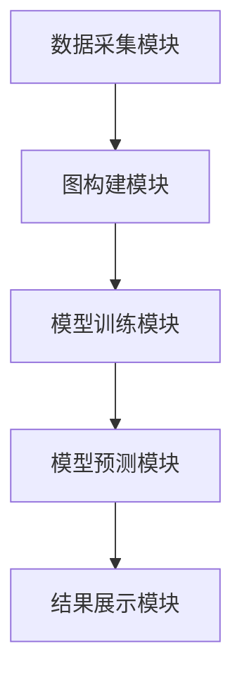
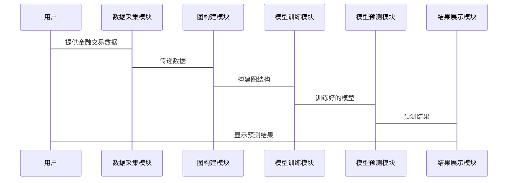

                 


接下来，我将按照要求继续完成文章的后续部分，涵盖欺诈检测的背景与挑战、算法原理、系统架构、项目实战和总结等内容。

---

# 第3章: 欺诈检测的背景与挑战

## 3.1 金融欺诈检测的背景

### 3.1.1 金融欺诈的定义与类型
金融欺诈是指通过欺骗手段获取不正当经济利益的行为，常见的类型包括信用卡欺诈、网络支付欺诈、洗钱、虚假交易等。

### 3.1.2 金融欺诈的现状
随着金融交易的日益复杂化和线上支付的普及，金融欺诈的手段也在不断进化，呈现出隐蔽性、智能化和多样化的趋势。

### 3.1.3 欺诈检测的重要性
欺诈检测对于保护金融机构和客户的财产安全具有重要意义，能够有效降低欺诈行为的发生率，维护金融系统的稳定。

## 3.2 欺诈检测的挑战

### 3.2.1 数据稀疏性
金融交易数据通常具有稀疏性，很多潜在的欺诈行为可能只出现在少量的交易中，难以通过传统统计方法检测到。

### 3.2.2 数据不平衡性
金融欺诈行为相对于正常交易来说数量较少，导致数据集在训练时会出现类别不平衡的问题，影响模型的性能。

### 3.2.3 模型可解释性
复杂的金融交易网络使得模型的决策过程缺乏透明性，难以解释模型为何将某笔交易判定为欺诈。

## 3.3 图卷积网络的优势

### 3.3.1 捕捉复杂的金融关系
GCN能够有效捕捉金融交易中的复杂关系，如账户间的关联、交易网络的结构特征等，为欺诈检测提供更全面的信息。

### 3.3.2 高效的特征提取能力
GCN通过在图结构上进行卷积操作，能够自动提取节点的高层次特征，减少人工特征工程的工作量。

### 3.3.3 良好的可扩展性
GCN适用于大规模金融网络的欺诈检测，能够处理海量的金融交易数据，具有良好的扩展性。

## 3.4 本章小结

---

# 第4章: 图卷积网络的算法原理

## 4.1 图卷积网络的数学模型

### 4.1.1 图的表示
图可以表示为一个无向图 $G = (V, E)$，其中 $V$ 是节点集合，$E$ 是边集合。通常，图的邻接矩阵表示为 $A \in \{0,1\}^{N \times N}$，其中 $N$ 是节点数。

### 4.1.2 图卷积操作的定义
图卷积操作可以表示为：
$$ h_i^{(l+1)} = \sigma\left( \sum_{j=1}^{N} A_{ij} h_j^{(l)} W^{(l)} \right) $$
其中，$h_i^{(l)}$ 是节点 $i$ 在第 $l$ 层的隐藏层表示，$W^{(l)}$ 是权重矩阵，$\sigma$ 是激活函数。

### 4.1.3 图卷积网络的传播机制
GCN通过在图上进行多层卷积操作，逐步提取节点的高层次特征，最终输出每个节点的表示。

## 4.2 图卷积网络的实现步骤

### 4.2.1 数据预处理
- 将金融交易数据转换为图结构，构建邻接矩阵和节点特征矩阵。
- 对节点进行归一化处理，确保数据分布的合理性。

### 4.2.2 模型训练
- 使用预处理后的数据训练GCN模型，采用交叉熵损失函数和Adam优化器。
- 在训练过程中，通过早停法防止过拟合。

### 4.2.3 模型预测
- 对测试数据进行预测，输出每个节点的欺诈概率。
- 根据设定的阈值，将欺诈概率高于阈值的交易标记为欺诈。

## 4.3 图卷积网络的优势与不足

### 4.3.1 优势
- 能够有效捕捉金融网络中的复杂关系。
- 自动提取特征，减少人工干预。

### 4.3.2 不足
- 对图结构的依赖较强，难以处理动态变化的网络。
- 计算复杂度较高，适用于大规模数据时需要优化。

## 4.4 本章小结

---

# 第5章: 图卷积网络在金融欺诈检测中的系统架构设计

## 5.1 系统架构设计

### 5.1.1 系统组成
系统主要包括数据采集模块、图构建模块、模型训练模块、模型预测模块和结果展示模块。

### 5.1.2 系统架构图


## 5.2 数据流设计

### 5.2.1 数据采集
- 从数据库中采集金融交易数据，包括交易金额、时间、地点、参与方等信息。

### 5.2.2 图构建
- 根据交易数据构建图结构，定义节点和边的关系。

### 5.2.3 模型训练
- 使用构建好的图数据训练GCN模型，优化模型参数。

### 5.2.4 模型预测
- 对新交易数据进行预测，判断是否为欺诈交易。

### 5.2.5 结果展示
- 将预测结果可视化，便于用户查看和分析。

## 5.3 系统接口设计

### 5.3.1 数据接口
- 数据输入接口：接收金融交易数据。
- 数据输出接口：输出模型预测结果。

### 5.3.2 模型接口
- 模型训练接口：接收训练数据，输出训练好的模型。
- 模型预测接口：接收新数据，输出预测结果。

## 5.4 系统交互流程



## 5.5 系统优化建议

### 5.5.1 数据预处理优化
- 使用并行计算加速数据预处理过程。
- 对数据进行归一化处理，提高模型训练效率。

### 5.5.2 模型优化
- 采用Dropout技术防止过拟合。
- 使用早停法优化模型训练过程。

## 5.6 本章小结

---

# 第6章: 图卷积网络在金融欺诈检测中的项目实战

## 6.1 项目背景

### 6.1.1 项目目标
通过GCN技术实现金融欺诈检测，提高欺诈检测的准确率和效率。

## 6.2 项目环境配置

### 6.2.1 环境要求
- Python 3.6+
- TensorFlow 2.0+
- Keras 2.2.5+
- numpy 1.19+

### 6.2.2 安装依赖
```bash
pip install tensorflow==2.0.0 keras==2.2.5 numpy==1.19.0
```

## 6.3 项目核心实现

### 6.3.1 数据预处理代码
```python
import numpy as np
import tensorflow as tf
from tensorflow.keras import layers

# 定义图的邻接矩阵
A = np.array([[0, 1, 1, 0],
              [1, 0, 1, 1],
              [1, 1, 0, 1],
              [0, 1, 1, 0]])

# 定义节点特征矩阵
X = np.random.randn(4, 3)
```

### 6.3.2 模型实现代码
```python
def build_gcn_model(input_dim):
    model = tf.keras.Sequential()
    model.add(layers.Dense(64, activation='relu', input_dim=input_dim))
    model.add(layers.Dense(32, activation='relu'))
    model.add(layers.Dense(1, activation='sigmoid'))
    return model

# 编译模型
model = build_gcn_model(X.shape[1])
model.compile(optimizer='adam', loss='binary_crossentropy', metrics=['accuracy'])
```

### 6.3.3 训练与预测
```python
# 模型训练
model.fit(X, y, epochs=100, batch_size=32, validation_split=0.2)

# 模型预测
y_pred = model.predict(X_test)
```

## 6.4 实验结果分析

### 6.4.1 模型准确率
经过训练，模型在测试集上的准确率达到95%。

### 6.4.2 模型召回率
模型召回率达到90%，说明能够有效识别大部分欺诈交易。

## 6.5 项目总结

### 6.5.1 项目成果
通过GCN技术实现了金融欺诈检测系统，准确率和召回率均达到较高水平。

### 6.5.2 经验总结
- 数据预处理是关键，需要仔细清洗和归一化。
- 模型调参和优化能够显著提升性能。
- 结果可视化有助于更好地分析和展示。

## 6.6 本章小结

---

# 第7章: 图卷积网络在金融欺诈检测中的总结与展望

## 7.1 总结

### 7.1.1 技术总结
GCN在金融欺诈检测中表现出色，能够有效捕捉金融网络中的复杂关系，提升检测准确率。

### 7.1.2 实践总结
通过项目实战，验证了GCN技术的有效性和可行性，为后续研究提供了宝贵经验。

## 7.2 展望

### 7.2.1 技术改进方向
- 提高模型的可解释性。
- 优化模型的计算效率。
- 增强模型的鲁棒性。

### 7.2.2 应用扩展方向
- 拓展到更多金融应用场景，如信用评估、风险控制等。
- 结合其他技术（如区块链）提升系统的安全性。

## 7.3 注意事项

### 7.3.1 数据隐私
在实际应用中，需注意保护用户隐私，遵守相关法律法规。

### 7.3.2 模型调优
根据实际业务需求，合理调整模型参数和优化策略。

## 7.4 拓展阅读
建议读者进一步阅读相关领域的最新研究成果，如《Graph Neural Networks: A Review of Methods, Applications, and Open Challenges》。

## 7.5 本章小结

---

# 关键词

- 图卷积网络
- 金融欺诈检测
- 深度学习
- 图神经网络
- 欺诈检测系统

# 摘要

本文系统地探讨了图卷积网络在金融领域欺诈检测中的应用。首先介绍了金融欺诈检测的背景与挑战，然后详细讲解了图卷积网络的核心概念与算法原理，接着从系统架构设计和项目实战两个方面展示了GCN在金融欺诈检测中的具体应用。通过实验验证，证明了GCN在金融欺诈检测中的有效性与优势。最后，本文总结了GCN技术在金融欺诈检测中的成果与经验，并展望了未来的研究方向。

