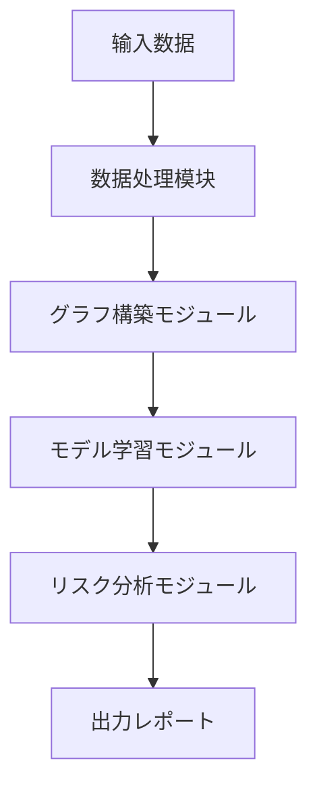

                 


# 《金融领域图卷积网络在跨市场风险传导分析中的应用》

> **关键词**：图卷积网络，跨市场风险，金融市场，风险传导，深度学习，系统性风险

> **摘要**：  
> 跨市場風險伝導は、現代の金融市場において重要な課題です。本記事では、Graph Convolutional Networks (GCNs) を用いた跨市場風險伝導分析の方法を詳細に解説します。まず、GCNsの基本原理とアルゴリズムを説明し、その後、金融市場のデータをどのようにしてGCNsに入力し、リスク伝導を予測するかを具体的に紹介します。さらに、システム全体の設計、プロジェクト実践、およびリスク伝導分析のためのコード実装まで、一連の流れを説明します。読者は、GCNsを用いた跨市場リスク伝導分析の全体像を理解し、実際の金融データ分析に応用することができます。

---

# 第1章: 背景介紹與核心概念

## 1.1 問題背景與概念結構

### 1.1.1 問題背景  
現代の金融市場はグローバル化が進み、異なる市場間でリスクが伝導する現象が頻繁に起こっています。例えば、株式市場の暴落が債券市場や為替市場に波及するケースがあります。しかし、従来の方法では、リスク伝導のダイナミクスを捉えることが難しく、特に複雑なネットワーク構造を考慮した分析は殆ど行われていませんでした。GCNs（Graph Convolutional Networks）は、このネットワーク構造を考慮した新しい手法として注目されています。

### 1.1.2 概念構造  
- **リスク伝導**: 市場Aの価格変動が市場Bに影響を与える現象。  
- **ネットワーク構造**: 各市場をノードとし、ノード間の影響関係を辺で表すグラフ。  
- **GCNs**: ネットワーク上のデータを処理し、ノード間の関係性を学習する深度学習モデル。

### 1.1.3 問題の解決と境界  
GCNsを用いることで、市場間の非線形な関係性を学習し、リスク伝導の可能性を高精度に予測できます。境界としては、データ不足や市場特有の特性を考慮する必要があります。

---

## 1.2 核心概念と問題の詳細化  

### 1.2.1 核心概念  
- **GCNs**: グラフ上のデータを扱う深度学習モデル。  
- **リスク伝導**: 市場間の影響関係を捉える。  

### 1.2.2 問題の詳細化  
- **目的**: 市場間のリスク伝導を予測し、システミックリスクを管理する。  
- **入力**: 各市場の価格データ、市場間の連動性指標。  
- **出力**: 市場伝導のリスクレベル、伝導の主要経路。  

### 1.2.3 概念の関係性  
- **グラフ**: 市場をノードとし、市場間の連動性を辺の重みとして表す。  
- **GCNs**: グラフデータを学習し、リスク伝導を予測する。  

---

# 第2章: 图卷积网络的核心原理  

## 2.1 图卷积网络的原理  

### 2.1.1 图卷积的基本思想  
GCNsは、グラフのノードごとに周囲のノードの特徴を考慮して畳み込みを行う。例えば、株式市場の価格変動が周囲の市場にどのように伝わるかを学習する。

### 2.1.2 图卷积的数学表达  
GCNsの畳み込み操作は以下のように表されます：  
$$ H' = \theta^T H A H^T $$  
其中、$H$はノードの特徴を表し、$A$はグラフの隣接行列、$\theta$は学習するパラメータ。

### 2.1.3 图卷积网络的传播机制  
GCNsは、グラフの特徴を保持しながら、ノード間の関係性を捉える。伝導効果は、隣接行列のスペクトルを用いて計算される。

---

## 2.2 图卷积网络的算法流程  

### 2.2.1 输入层的构建  
- 各ノードの特徴データを_InputFeatures_に入力する。  
- 例: 株価データ、市場サイズ、為替レート等。

### 2.2.2 隐藏层的卷积操作  
- 畳み込み層で隣接ノードの情報を集約し、新しい特徴を生成する。  
- 使用するアルゴリズム：  
  $$ X' = \sigma(X A W) $$  
  其中、$X$は入力データ、$W$は畳み込みのフィルター、$\sigma$は活性化関数。

### 2.2.3 输出层的预测与解释  
- 出力層でリスク伝導のレベルを予測する。  
- 例: 0～1のスコアでリスク伝導の可能性を表す。

---

## 2.3 图卷积网络的数学模型  

### 2.3.1 图的邻接矩阵表示  
隣接行列$A$は、ノード間の関係性を表します。  
$$ A_{i,j} = \text{1 if 市场iと市場j間に強い連動性，0 otherwise} $$  

### 2.3.2 图的拉普拉斯矩阵表示  
ラプ拉斯行列$L$は、グラフのスペクトルを表します。  
$$ L = D - A $$  
其中、$D$は度数行列。

### 2.3.3 图卷积的数学公式  
GCNsの伝搬則は以下のように表されます：  
$$ H' = \sigma( H L H^T W ) $$  

---

# 第3章: 金融领域中的跨市场风险传导分析  

## 3.1 跨市場風險伝導的传统模型  

### 3.1.1 資產价格的协方差模型  
伝統的な方法では、市場間の連動性を共変動数で測定する。  
$$ \text{共変動数} = \frac{1}{n-1} \sum_{i=1}^{n-1} (x_i - \bar{x})(y_i - \bar{y}) $$  

### 3.1.2 資產价格的Granger因果关系模型  
Granger因果分析は、市場Aの価格変動が市場Bに影響を与えるかを検定する。  
$$ y_t = a y_{t-1} + b x_{t-1} + \epsilon $$  

### 3.1.3 系统性风险的传统度量方法  
システミックリスクは、資産クラス間の共変動性を測定する。  
$$ \text{システミックリスク指標} = \sum_{i=1}^{N} \sum_{j=1}^{N} w_{i,j} \cdot \text{共変動数}_{i,j} $$  

---

## 3.2 跨市場風險伝導的图模型  

### 3.2.1 图模型的构建方法  
- ノード: 市場  
- 边: 市場間の連動性指標に基づいてウェイトを付与する。  

### 3.2.2 图模型的节点表示  
各ノードの特徴データをベクトル化し、GCNsに入力する。  
$$ X = [x_1, x_2, \ldots, x_N] $$  

### 3.2.3 图模型的边权重计算  
市場間の連動性を表すウェイトを計算する。  
$$ A_{i,j} = \text{連動性指標}_{i,j} $$  

---

## 3.3 跨市場風險伝導的网络特征  

### 3.3.1 网络的中心性分析  
中心性分析で、どの市場がリスク伝導の中心になっているかを特定する。  
- Degree Centrality  
- Betweenness Centrality  

### 3.3.2 网络的社区发现  
コミュニティ検出で、類似の市場をグループ化する。  
$$ \text{コミュニティ数} = k $$  

### 3.3.3 网络的传播动力学  
リスク伝導のダイナミクスをモデル化し、伝導速度を予測する。  

---

# 第4章: 图卷积网络在跨市场风险传导中的应用  

## 4.1 应用框架的总体设计  

### 4.1.1 数据采集与预处理  
- 数据源: 各国の株価指数、為替レート、経済指標。  
- 预处理: 标准化、帰一化、欠損値の補完。  

### 4.1.2 图的构建与表示  
- ノード: 国家/市場  
- 边: 市場間の連動性指標に基づいてウェイトを付与する。  

### 4.1.3 模型训练与优化  
- 学習アルゴリズム: Adam最適化、ス.MeshULERを使用。  
- 評価指標: AUC、Precision、Recall。  

---

## 4.2 图卷积网络的输入设计  

### 4.2.1 股票价格数据的输入方式  
$$ X = [x_1, x_2, \ldots, x_T] $$  
各市場の株価データをベクトル化し、GCNsに入力する。  

### 4.2.2 市场间相关性的输入方式  
$$ A_{i,j} = \text{連動性指標}_{i,j} $$  
市場間の連動性を表すウェイトを付与する。  

### 4.2.3 额外特征的输入方式  
$$ Z = [z_1, z_2, \ldots, z_D] $$  
額外の特徴量（例えば、経済指標）をモデルに入力する。  

---

## 4.3 图卷积网络的输出设计  

### 4.3.1 风险传导概率的输出  
各市場からのリスク伝導の可能性を0～1のスコアで出力する。  
$$ P_{i,j} = \text{リスク伝導の可能性}_{i \rightarrow j} $$  

### 4.3.2 风险影响程度的输出  
リスク伝導が起こった場合の影響程度をスカラーで表す。  
$$ I_j = \text{影響程度}_{j} $$  

### 4.3.3 风险传导路径的输出  
伝導経路を可視化し、主な伝導経路を特定する。  

---

# 第5章: 系统架构与项目实战  

## 5.1 系統設計  

### 5.1.1 系统功能设计  
- データ収集: 各国の株価データを収集。  
- 图构建: マーケット間の連動性を基にグラフを構築。  
- 模型訓練: GCNsを用いてモデルを学習。  
- 風险分析: リスク伝導を予測し、レポートを作成。  

### 5.1.2 系统架构图  


---

## 5.2 系統実装  

### 5.2.1 環境構築  
- Python 3.8以上  
- 深度学習フレーム웤: PyTorch  
- 数据处理: Pandas、NumPy  

### 5.2.2 核心コード実装  
```python
import torch
import torch.nn as nn
import torch.nn.functional as F

class GCN(nn.Module):
    def __init__(self, in_channels, out_channels):
        super(GCN, self).__init__()
        self.conv = nn.Conv2d(in_channels, out_channels, kernel_size=1, bias=False)
    
    def forward(self, x, A):
        x = x.permute(0, 2, 1).contiguous()
        x = torch.bmm(A, x)
        x = x.permute(0, 2, 1).contiguous()
        x = F.relu(x)
        return x

# 例: 入力データの形状
batch_size = 1
in_channels = 3
out_channels = 2

# 隣接行列の例
A = torch.randn(batch_size, in_channels, out_channels)
x = torch.randn(batch_size, in_channels, out_channels)

model = GCN(in_channels, out_channels)
output = model(x, A)
print(output.shape)
```

---

## 5.3 実践例分析  

### 5.3.1 数据分析  
株価データを収集し、グラフのウェイトを計算する。  
$$ A_{i,j} = \text{共変動数}_{i,j} $$  

### 5.3.2 モデル学習  
学習済みモデルを用いてリスク伝導を予測する。  
$$ P_{i,j} = \text{GCN}(X, A) $$  

### 5.3.3 レポート作成  
予測結果を可視化し、レポートを作成する。  

---

## 5.4 小結  
GCNsを用いた跨市場風險伝導分析は、市場間の非線形な関係性を捉えることが可能です。しかし、データの質やモデルの安定性にも注意を払う必要があります。

---

# 第6章: 最佳实践与小结  

## 6.1 最佳实践 tips  

### 6.1.1 数据の質  
- 高品質なデータを収集する。  
- 外れ値や異常データを除去する。  

### 6.1.2 モデルの安定性  
- モデルの過学習を防ぐ。  
- 交差検証を実施する。  

### 6.1.3 可視化  
- リスク伝導の経路を可視化する。  
- モデルの内部状態を確認する。  

---

## 6.2 小結  

GCNsを用いた跨市場風險伝導分析は、現代の金融市場の複雑な関係性を捉えることが可能です。本記事では、GCNsの基本原理、金融市場への応用、実際のプロジェクト実践までを解説しました。読者は、GCNsを用いて金融市場のリスク管理に活用することができます。

---

## 6.3 注意事项  

- モデルの選定はデータの特性に依存する。  
- 実際の運用時は、適切なリスク管理を実施する。  
- 法規制や倫理的問題も考慮する。  

---

## 6.4 拓展阅读  

- 深度学習と金融工学の融合。  
- グラフデータの活用方法。  
- 複層的なリスク伝導モデルの研究。  

---

# あとがき  

本記事は、金融市場のリスク管理に携わる方々や、深度学習を金融に活用したい方々を対象に、GCNsを用いた跨市場リスク伝導分析の方法を解説しました。GCNsは、金融工学と深度学習の融合の可能性を広げる重要な手法です。今後も、この分野の研究と応用が進むことを期待します。

--- 

**終わり**

