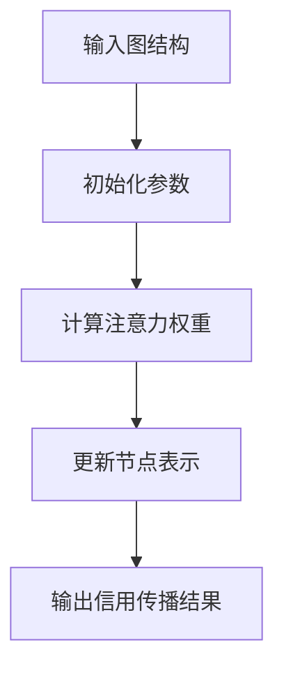

                 


# 《金融领域图注意力网络在信用传播分析中的应用》

---

## 关键词：  
图注意力网络、信用传播分析、金融领域、图神经网络、注意力机制

---

## 摘要：  
信用传播分析在金融领域中具有重要意义，传统方法在处理复杂信用关系时存在诸多局限性。本文将介绍图注意力网络（GAT）在金融信用传播分析中的应用，探讨其原理、算法实现及实际案例。通过图注意力机制，模型能够有效捕捉信用传播中的关键节点和关系，为金融风险评估和信用评分提供更精准的支持。本文将从理论到实践，详细讲解图注意力网络在信用传播分析中的优势和实现细节。

---

## 第一部分：背景介绍

### 第1章：信用传播分析的背景与挑战

#### 1.1 信用传播的基本概念  
- **信用传播**：指在金融网络中，信用信息通过节点之间的关系传播，影响整体信用评估的过程。  
- **信用传播的重要性**：信用传播直接影响金融市场的稳定性，尤其是在企业违约、贷款风险评估等场景中。  

#### 1.2 信用传播的挑战  
- **复杂性**：金融网络中存在大量非线性关系，传统线性模型难以捕捉复杂传播路径。  
- **数据稀疏性**：部分金融数据缺失或不完整，导致传统信用评估方法效果有限。  
- **实时性要求**：金融市场的动态变化要求信用传播分析具有实时性。  

#### 1.3 图注意力网络的优势  
- 图注意力网络能够通过注意力机制捕捉图结构中的关键节点和关系，适用于复杂的信用传播场景。  

---

### 第2章：图注意力网络的背景与优势

#### 2.1 图注意力网络的基本原理  
- 图注意力网络（Graph Attention Network, GAT）是一种基于图结构的神经网络模型，通过注意力机制对图中的节点关系进行建模。  

#### 2.2 图注意力网络在金融领域的应用  
- **信用风险评估**：通过图注意力网络分析企业间的信用关系，评估整体信用风险。  
- **信用传播路径分析**：识别信用传播的关键路径，帮助企业规避风险。  

---

## 第二部分：图注意力网络的核心概念与联系

### 第3章：图注意力网络的原理与模型

#### 3.1 图注意力网络的基本原理  
- 图注意力网络通过注意力机制对图中的节点关系进行加权，计算每个节点对整体信用传播的贡献。  

#### 3.2 图注意力网络的数学模型  
- **注意力权重计算**：  
  $$ \alpha_{ij} = \text{softmax}(e^{(a^T W h_j)}) $$  
  其中，$a$ 是可学习的参数，$W$ 是权重矩阵，$h_j$ 是节点 $j$ 的特征向量。  

- **节点表示更新**：  
  $$ h_i^{(l+1)} = \sum_{j} \alpha_{ij} h_j $$  

---

### 第4章：图注意力网络与信用传播的关系

#### 4.1 信用传播的图结构建模  
- **信用传播的图表示**：将企业、个人等信用主体作为图节点，将信用关系作为边。  

#### 4.2 图注意力网络在信用传播中的应用  
- **注意力机制的作用**：通过注意力权重，识别信用传播中的关键节点和路径。  

---

## 第三部分：算法原理讲解

### 第5章：图注意力网络的算法实现

#### 5.1 图注意力网络的算法流程  


#### 5.2 图注意力网络的代码实现  
```python
import torch
import torch.nn as nn
import torch.nn.functional as F

class GATLayer(nn.Module):
    def __init__(self, in_features, out_features):
        super(GATLayer, self).__init__()
        self.W = nn.Parameter(torch.randn(in_features, out_features))
        self.a = nn.Parameter(torch.randn(1, out_features))

    def forward(self, x, adj):
        # x: [N, in_features], adj: [N, N]
        h = x.mm(self.W)  # [N, out_features]
        attention = F.softmax((h.mm(self.a.t())), dim=1)  # [N, N]
        output = torch.bmm(attention.unsqueeze(1), h.unsqueeze(2)).squeeze(1)
        return output

# 示例用法
N = 5
D_in = 3
D_out = 2

x = torch.randn(N, D_in)
adj = torch.randn(N, N)
gat_layer = GATLayer(D_in, D_out)
output = gat_layer(x, adj)
print(output)
```

---

## 第四部分：系统分析与架构设计方案

### 第6章：系统功能设计

#### 6.1 系统功能模块  
- **数据输入模块**：读取金融信用数据，构建图结构。  
- **模型训练模块**：基于图注意力网络进行模型训练。  
- **结果输出模块**：输出信用传播分析结果。  

#### 6.2 系统架构设计  


---

## 第五部分：项目实战

### 第7章：信用传播分析的项目实现

#### 7.1 环境安装  
- 安装依赖：`pip install torch networkx`  

#### 7.2 核心代码实现  
```python
import torch
import torch.nn as nn
import torch.optim as optim
import networkx as nx

class GAT(nn.Module):
    def __init__(self, input_dim, hidden_dim):
        super(GAT, self).__init__()
        self.attention = nn.Parameter(torch.randn(input_dim, 1))
        self.fc = nn.Linear(input_dim, hidden_dim)

    def forward(self, x, adj):
        # x: [N, input_dim]
        # adj: [N, N]
        attention = F.softmax(x.mm(self.attention), dim=1)
        weighted_sum = torch.bmm(adj.unsqueeze(1), x.unsqueeze(2)).squeeze(2)
        output = self.fc(weighted_sum)
        return output

# 示例数据
N = 4
input_dim = 3
hidden_dim = 2

x = torch.randn(N, input_dim)
adj = torch.randn(N, N)

model = GAT(input_dim, hidden_dim)
criterion = nn.MSELoss()
optimizer = optim.Adam(model.parameters(), lr=0.01)

for epoch in range(100):
    output = model(x, adj)
    loss = criterion(output, x)
    loss.backward()
    optimizer.step()
    print(f"Epoch {epoch}: Loss = {loss.item()}")
```

---

## 第六部分：最佳实践与总结

### 第8章：最佳实践

#### 8.1 小结  
- 图注意力网络能够有效捕捉信用传播中的关键节点和关系。  

#### 8.2 注意事项  
- 数据质量对模型性能影响较大，需确保数据的完整性和准确性。  

#### 8.3 拓展阅读  
- 《Graph Attention Networks》（论文）  
- 《Financial Risk Management with Graph Neural Networks》  

---

## 结语  
图注意力网络在信用传播分析中的应用为金融领域提供了新的思路。通过本文的讲解，读者可以深入了解其原理和实现细节，并将其应用到实际场景中。

