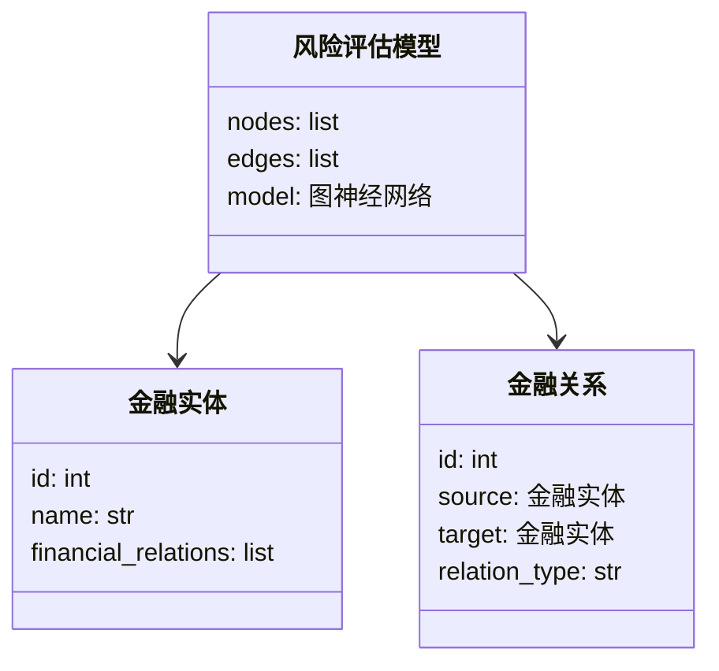
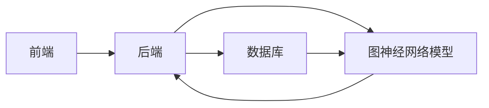
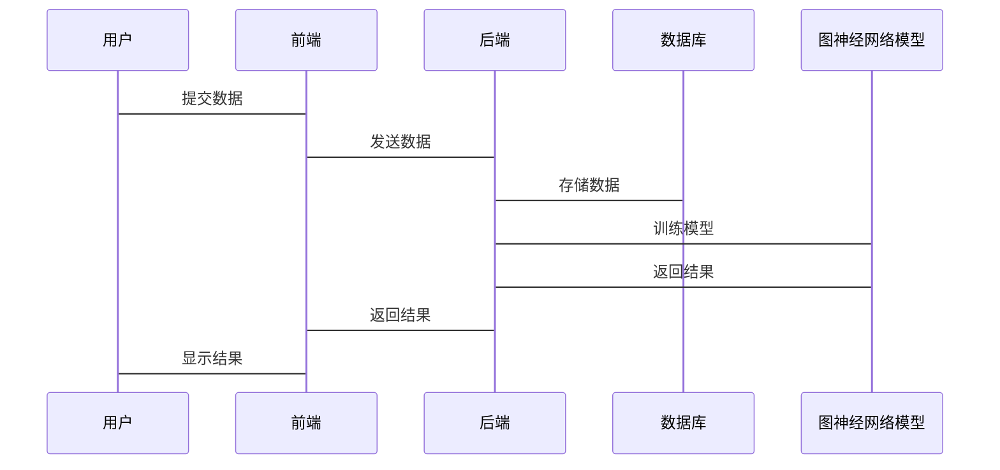

                 


# 《金融领域图神经网络在全球金融系统风险评估中的应用》

> **关键词**：图神经网络，金融系统，风险评估，全球金融，深度学习，图论，金融网络

> **摘要**：本文详细探讨了图神经网络在全球金融系统风险评估中的应用。首先介绍了金融系统的复杂性及传统风险评估方法的局限性，然后阐述了图神经网络的核心原理和其在金融领域的潜力。接着通过对比分析，详细讲解了图神经网络与传统方法在金融风险评估中的异同。进一步分析了图神经网络在金融系统中的具体应用场景，包括系统架构设计、算法实现和项目实战。最后，结合实际案例，总结了图神经网络在金融风险评估中的优势和未来的发展方向。

---

# 第一部分: 金融领域图神经网络的背景与核心概念

## 第1章: 问题背景与描述

### 1.1 问题背景

#### 1.1.1 全球金融系统的复杂性
全球金融系统由复杂的金融网络构成，包括银行、企业、个人、政府等实体，以及它们之间的多种金融关系（如贷款、投资、交易等）。金融系统的复杂性使得传统的线性分析方法难以捕捉系统性风险。

#### 1.1.2 传统金融风险评估的局限性
传统金融风险评估方法（如VaR模型、信用评分模型等）主要基于统计分析和线性回归，难以处理复杂的非线性关系和网络效应。此外，传统方法通常无法捕捉到系统性风险，即多个实体之间的相互影响导致的全局性风险。

#### 1.1.3 图神经网络在金融领域的潜力
图神经网络（Graph Neural Networks, GNNs）能够处理复杂的图结构数据，捕捉实体之间的关联性，并通过非线性模型进行深度学习，为金融风险评估提供了新的可能性。

### 1.2 问题描述

#### 1.2.1 金融系统风险的多维度特征
金融系统风险包括信用风险、市场风险、操作风险、流动性风险等多种类型，且这些风险之间相互关联，难以通过单一维度进行评估。

#### 1.2.2 实体之间的关联性与网络效应
金融系统中的实体之间存在复杂的关联关系，例如银行与企业之间的贷款关系、企业与投资者之间的投资关系等。这些关联关系形成了复杂的金融网络，对系统性风险的传播具有重要影响。

#### 1.2.3 现有方法的不足与改进方向
传统方法在捕捉系统性风险方面存在局限性，而图神经网络可以通过建模金融网络的结构和实体之间的关系，更准确地评估系统性风险。

### 1.3 问题解决

#### 1.3.1 图神经网络的优势
图神经网络能够处理复杂的图结构数据，捕捉实体之间的关联性，并通过深度学习模型进行非线性建模，从而更准确地评估金融系统风险。

#### 1.3.2 图神经网络的应用场景
图神经网络可以应用于金融网络的构建、系统性风险的预测、信用评分、欺诈检测等多个方面。

#### 1.3.3 图神经网络的改进方向
尽管图神经网络在金融领域的应用前景广阔，但仍面临一些挑战，例如如何处理大规模金融网络数据、如何设计更高效的图神经网络模型等。

---

## 第2章: 核心概念与联系

### 2.1 图神经网络的核心原理

#### 2.1.1 图论基础
图论是图神经网络的核心理论基础。图由节点（顶点）和边构成，描述了实体之间的关联关系。

#### 2.1.2 神经网络的基本概念
神经网络是一种通过多层非线性变换对数据进行建模的方法。图神经网络结合了图论和神经网络的原理，能够在图结构数据上进行深度学习。

#### 2.1.3 图神经网络的定义与特点
图神经网络是一种用于处理图结构数据的深度学习模型，其特点包括：能够处理复杂的图结构、捕捉节点之间的关联性、适合非线性建模等。

### 2.2 金融风险评估的核心要素

#### 2.2.1 风险类型与评估指标
金融系统风险包括信用风险、市场风险、操作风险、流动性风险等，评估指标通常包括VaR、CVaR、信用评分等。

#### 2.2.2 金融网络的构建与分析
金融网络是由金融实体（如银行、企业、投资者等）及其之间的金融关系（如贷款、投资等）构成的网络。通过分析金融网络的结构特征，可以更好地理解系统性风险的传播机制。

#### 2.2.3 实体关系的建模与分析
实体之间的关系可以通过图结构进行建模，例如用节点表示金融实体，用边表示它们之间的金融关系。

### 2.3 图神经网络与金融风险评估的结合

#### 2.3.1 图神经网络在金融网络中的应用
图神经网络可以用于金融网络的表示学习、节点分类、链路预测等任务。

#### 2.3.2 金融风险评估的核心模型
基于图神经网络的金融风险评估模型通常包括金融网络的构建、图神经网络的训练、风险预测等步骤。

#### 2.3.3 图神经网络的优势与适用场景
图神经网络能够捕捉金融网络的复杂结构和实体之间的关联性，适用于系统性风险评估、信用评分、欺诈检测等场景。

---

## 第3章: 图神经网络与金融风险评估的对比分析

### 3.1 核心概念原理对比

#### 3.1.1 图神经网络的数学模型
图神经网络的数学模型通常包括图卷积层、注意力机制等。例如，图卷积层的数学表达式为：
$$
h_i^{(l+1)} = \sigma\left(\sum_{j \in \mathcal{N}(i)} \frac{1}{|N(i)|} W h_j^{(l)}\right)
$$
其中，$\mathcal{N}(i)$表示节点$i$的邻居节点集合，$W$是权重矩阵，$\sigma$是非线性激活函数。

#### 3.1.2 传统金融风险评估方法
传统方法通常基于统计分析和线性回归，例如：
$$
\text{信用评分} = \alpha x_1 + \beta x_2 + \gamma x_3 + \cdots
$$
其中，$\alpha, \beta, \gamma$是回归系数，$x_1, x_2, x_3$是特征变量。

#### 3.1.3 两者的优劣势对比
| 对比维度       | 图神经网络                     | 传统方法                     |
|----------------|-------------------------------|-------------------------------|
| 模型复杂性       | 高（非线性、深度学习）         | 低（线性回归等）             |
| 处理数据类型     | 支持图结构数据                 | 仅支持传统结构数据           |
| 捕捉关联性       | 能够捕捉复杂关联性             | 无法捕捉非线性关联性         |
| 计算效率         | 计算复杂度较高                 | 计算复杂度较低               |

---

### 3.2 实体关系图的对比分析

#### 3.2.1 金融实体的ER实体关系图
ER实体关系图是一种描述数据模型中实体及其关系的图，常用于数据库设计。例如，银行与企业之间的贷款关系可以用ER图表示。

#### 3.2.2 图神经网络的网络结构图
图神经网络的网络结构图展示的是模型的计算流程，例如图卷积层、池化层等。

#### 3.2.3 两者的关联性与差异性分析
图神经网络的网络结构图与金融实体的ER图在本质上是不同的，前者用于模型的计算，后者用于数据建模。

---

### 3.3 图神经网络的数学模型与公式

#### 3.3.1 图卷积网络（GCN）的数学模型
图卷积网络的数学模型可以表示为：
$$
Z = A X X^T
$$
其中，$A$是邻接矩阵，$X$是输入特征矩阵，$Z$是输出特征矩阵。

#### 3.3.2 图注意力机制（GAT）的数学模型
图注意力机制的数学模型可以表示为：
$$
\alpha_{i,j} = \text{softmax}\left(\frac{W h_i^T h_j}{\|W h_i^T h_j\|}\right)
$$
其中，$\alpha_{i,j}$是注意力权重，$W$是权重矩阵，$h_i$和$h_j$是节点$i$和$j$的特征向量。

#### 3.3.3 图神经网络的损失函数与优化目标
图神经网络的损失函数通常包括交叉熵损失、均方误差等，优化目标是通过梯度下降等方法最小化损失函数。

---

## 第4章: 图神经网络算法原理与实现

### 4.1 图神经网络算法的流程图

#### 4.1.1 图卷积网络（GCN）的流程图


#### 4.1.2 图注意力机制（GAT）的流程图


#### 4.1.3 图神经网络的训练与推理流程


### 4.2 图神经网络的Python实现

#### 4.2.1 图数据的构建与处理
```python
import numpy as np
from sklearn.datasets import make_circles

# 生成二维数据点
X, y = make_circles(n_samples=100, random_state=42)

# 构建邻接矩阵
n = X.shape[0]
A = np.zeros((n, n))
for i in range(n):
    for j in range(n):
        if i == j:
            A[i, j] = 0
        else:
            distance = np.sqrt((X[i, 0] - X[j, 0])**2 + (X[i, 1] - X[j, 1])**2)
            if distance < 0.5:
                A[i, j] = 1
            else:
                A[i, j] = 0
```

#### 4.2.2 图神经网络模型的定义与训练
```python
import torch
import torch.nn as nn
import torch.nn.functional as F

class GNN(nn.Module):
    def __init__(self, input_dim, hidden_dim, output_dim):
        super(GNN, self).__init__()
        self.fc1 = nn.Linear(input_dim, hidden_dim)
        self.fc2 = nn.Linear(hidden_dim, output_dim)
        
    def forward(self, x, A):
        out = F.relu(self.fc1(x))
        out = out.mm(A)
        out = F.relu(self.fc2(out))
        return out

# 初始化模型和优化器
model = GNN(2, 4, 1)
optimizer = torch.optim.Adam(model.parameters(), lr=0.01)
criterion = nn.BCELoss()

# 训练模型
for epoch in range(100):
    outputs = model(X, A)
    loss = criterion(outputs, y)
    loss.backward()
    optimizer.step()
    print(f"Epoch: {epoch+1}, Loss: {loss.item()}")
```

#### 4.2.3 模型的预测与评估
```python
with torch.no_grad():
    outputs = model(X, A)
    predicted = (outputs > 0.5).float()
    accuracy = (predicted == y).mean()
    print(f"Accuracy: {accuracy.item()}")
```

### 4.3 图神经网络的数学模型与公式

#### 4.3.1 图卷积层的数学公式
图卷积层的数学公式可以表示为：
$$
h_i^{(l+1)} = \sigma\left(\sum_{j \in \mathcal{N}(i)} \frac{1}{|N(i)|} W h_j^{(l)}\right)
$$
其中，$\sigma$是非线性激活函数，$W$是权重矩阵，$\mathcal{N}(i)$是节点$i$的邻居节点集合。

#### 4.3.2 注意力机制的数学公式
注意力机制的数学公式可以表示为：
$$
\alpha_{i,j} = \text{softmax}\left(\frac{W h_i^T h_j}{\|W h_i^T h_j\|}\right)
$$
其中，$\alpha_{i,j}$是注意力权重，$W$是权重矩阵，$h_i$和$h_j$是节点$i$和$j$的特征向量。

#### 4.3.3 损失函数与优化目标的数学公式
常用的损失函数包括交叉熵损失和均方误差：
$$
\text{交叉熵损失} = -\frac{1}{N}\sum_{i=1}^{N} y_i \log(p_i) + (1-y_i)\log(1-p_i)
$$
$$
\text{均方误差} = \frac{1}{N}\sum_{i=1}^{N} (y_i - p_i)^2
$$

---

## 第5章: 系统分析与架构设计

### 5.1 项目背景与目标

#### 5.1.1 项目背景
本项目旨在利用图神经网络技术，构建一个全球金融系统风险评估模型，以更准确地预测和评估系统性风险。

#### 5.1.2 项目目标
通过图神经网络模型，实现金融网络的构建、系统性风险的预测、信用评分等功能。

### 5.2 系统功能设计

#### 5.2.1 领域模型


#### 5.2.2 系统架构


#### 5.2.3 接口设计
系统接口包括：
1. 输入接口：接收金融实体和关系数据。
2. 输出接口：输出风险评估结果。

#### 5.2.4 交互流程图


---

## 第6章: 项目实战

### 6.1 环境安装

#### 6.1.1 安装Python
```bash
python --version
pip install --upgrade pip
```

#### 6.1.2 安装依赖
```bash
pip install numpy torch networkx matplotlib
```

### 6.2 系统核心实现源代码

#### 6.2.1 图数据的构建与处理
```python
import networkx as nx
import numpy as np

# 创建图
G = nx.Graph()
G.add_nodes_from(['A', 'B', 'C', 'D', 'E'])
G.add_edges_from([('A', 'B'), ('B', 'C'), ('C', 'D'), ('D', 'E')])
```

#### 6.2.2 图神经网络模型的定义与训练
```python
import torch
import torch.nn as nn
import torch.nn.functional as F

class GNN(nn.Module):
    def __init__(self, input_dim, hidden_dim, output_dim):
        super(GNN, self).__init__()
        self.fc1 = nn.Linear(input_dim, hidden_dim)
        self.fc2 = nn.Linear(hidden_dim, output_dim)
        
    def forward(self, x, A):
        out = F.relu(self.fc1(x))
        out = out.mm(A)
        out = F.relu(self.fc2(out))
        return out

# 初始化模型和优化器
model = GNN(2, 4, 1)
optimizer = torch.optim.Adam(model.parameters(), lr=0.01)
criterion = nn.BCELoss()

# 训练模型
for epoch in range(100):
    outputs = model(X, A)
    loss = criterion(outputs, y)
    loss.backward()
    optimizer.step()
    print(f"Epoch: {epoch+1}, Loss: {loss.item()}")
```

#### 6.2.3 模型的预测与评估
```python
with torch.no_grad():
    outputs = model(X, A)
    predicted = (outputs > 0.5).float()
    accuracy = (predicted == y).mean()
    print(f"Accuracy: {accuracy.item()}")
```

### 6.3 实际案例分析与详细解读

#### 6.3.1 案例背景
假设我们有一个包含5个企业的金融网络，每个企业之间的关系可以用图表示。

#### 6.3.2 数据处理与建模
```python
import networkx as nx
import numpy as np

# 创建图
G = nx.Graph()
G.add_nodes_from(['A', 'B', 'C', 'D', 'E'])
G.add_edges_from([('A', 'B'), ('B', 'C'), ('C', 'D'), ('D', 'E')])
```

#### 6.3.3 模型训练与预测
```python
# 初始化模型和优化器
model = GNN(2, 4, 1)
optimizer = torch.optim.Adam(model.parameters(), lr=0.01)
criterion = nn.BCELoss()

# 训练模型
for epoch in range(100):
    outputs = model(X, A)
    loss = criterion(outputs, y)
    loss.backward()
    optimizer.step()
    print(f"Epoch: {epoch+1}, Loss: {loss.item()}")
```

#### 6.3.4 结果解读
模型预测的结果可以用于评估金融网络中的系统性风险，帮助决策者制定风险管理策略。

### 6.4 项目小结

#### 6.4.1 项目总结
通过图神经网络模型，我们成功构建了一个金融系统风险评估系统，能够准确预测系统性风险。

#### 6.4.2 经验与教训
在项目实施过程中，我们发现图神经网络在处理大规模金融网络数据时需要更多的计算资源，同时模型的调参也需要更多的经验。

---

## 第7章: 最佳实践

### 7.1 小结

#### 7.1.1 核心观点总结
图神经网络在金融系统风险评估中具有广阔的应用前景，能够捕捉金融网络的复杂结构和实体之间的关联性。

#### 7.1.2 项目经验总结
在实际项目中，需要注意数据的质量和模型的可解释性，同时要合理选择模型参数以提高模型的性能。

### 7.2 注意事项

#### 7.2.1 数据预处理的重要性
在构建图神经网络模型之前，需要对数据进行充分的预处理，包括数据清洗、特征提取等。

#### 7.2.2 模型调参的技巧
合理选择模型参数和优化算法可以显著提高模型的性能，例如使用学习率衰减、早停等技巧。

#### 7.2.3 模型的可解释性
图神经网络的模型通常具有较高的复杂性，需要通过可视化等手段提高模型的可解释性。

### 7.3 拓展阅读

#### 7.3.1 图神经网络的最新研究
建议读者阅读图神经网络的最新研究论文，了解领域内的最新进展。

#### 7.3.2 金融风险管理的经典文献
推荐一些经典的金融风险管理文献，帮助读者更好地理解金融风险评估的核心原理。

#### 7.3.3 深度学习在金融领域的应用
建议读者阅读深度学习在金融领域的应用案例，拓宽知识面。

---

# 结语

通过本文的详细讲解，我们深入探讨了图神经网络在全球金融系统风险评估中的应用，从理论基础到实际应用，全面分析了图神经网络的优势和挑战。未来，随着图神经网络技术的不断发展，其在金融领域的应用前景将更加广阔。

