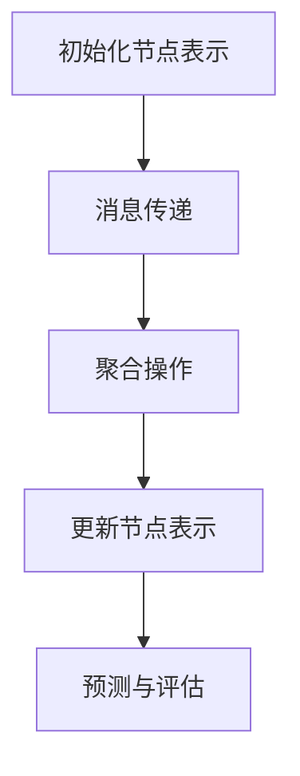
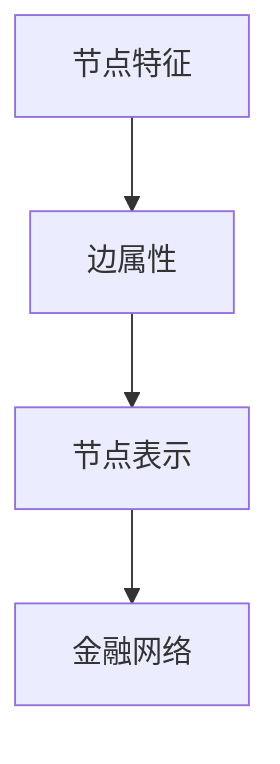
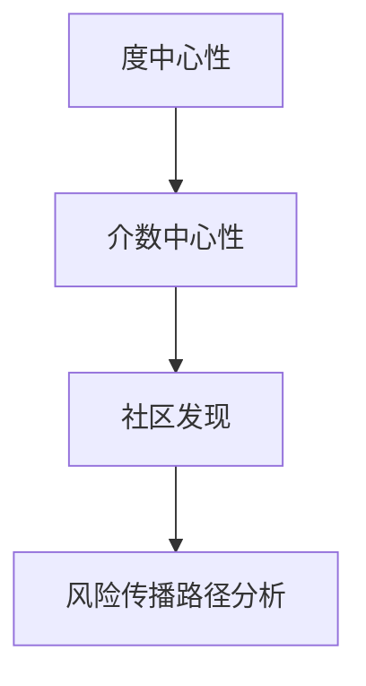

                 


# 金融领域图神经网络在系统性风险传导中的应用

## 关键词：
- 金融系统性风险，图神经网络，系统性风险传导，金融网络，系统性风险预警

## 摘要：
本文深入探讨了图神经网络在金融领域系统性风险传导中的应用。通过分析金融网络的结构特性，结合图神经网络的核心原理，提出了一种基于图表示学习的系统性风险监测方法。该方法能够有效识别金融体系中的风险传导路径和关键节点，为金融监管部门提供预警和决策支持。文章内容涵盖系统性风险的基本概念、图神经网络的原理、金融网络的构建、系统性风险传导的图模型设计、项目实战案例以及最佳实践等，为金融领域的技术实践者提供了理论依据和实践指导。

---

# 第一部分: 金融领域系统性风险与图神经网络概述

## 第1章: 系统性风险与金融网络概述

### 1.1 系统性风险的基本概念

系统性风险是指由于金融体系中的某些重大事件或结构性问题，可能导致整个金融体系发生系统性崩溃的风险。这种风险不仅影响单个金融机构，还可能波及整个金融市场的稳定。系统性风险的主要来源包括：

- **市场风险**：市场波动导致资产价格大幅下跌。
- **信用风险**：债务人违约导致债权人遭受损失。
- **流动性风险**：金融机构无法及时获得资金以应对支付需求。
- **操作风险**：由于内部操作失误或外部事件导致的损失。

系统性风险的传导机制可以通过金融网络中的关联关系来描述。金融网络中的各个节点（如银行、企业、投资者）通过复杂的金融工具和交易相互连接，形成一个高度互联的系统。当一个节点出现问题时，可能会通过网络传导给其他节点，最终引发系统性危机。

### 1.2 图神经网络的基本概念

图神经网络（Graph Neural Network，GNN）是一种结合了图数据结构和神经网络的深度学习模型。图数据结构由节点（Node）和边（Edge）组成，能够有效地表示复杂的关联关系。神经网络则通过非线性变换对数据进行特征提取和模式识别。

图神经网络的核心思想是通过在图结构上进行消息传递（Message Passing），将节点的特征信息传播到相邻节点，并最终生成节点或图级别的表示。与传统的卷积神经网络（CNN）不同，图神经网络能够处理非规则结构的数据，适用于社交网络、分子结构、金融网络等多种场景。

图神经网络的主要组成部分包括：

1. **节点表示**：通过神经网络提取节点的特征向量。
2. **边权重**：边权重反映了节点之间的关联强度。
3. **消息传递机制**：节点通过边将特征信息传递给相邻节点。
4. **聚合操作**：对相邻节点的特征进行聚合，生成新的节点表示。

### 1.3 系统性风险与图神经网络的结合

图神经网络在金融领域的应用潜力巨大，特别是在系统性风险的监测和预警方面。金融网络中的节点（如银行、企业、投资者）之间存在复杂的关联关系，这些关联关系可以通过图结构进行建模。通过图神经网络，可以分析金融网络中的风险传导路径和关键节点，从而实现系统性风险的早期预警。

图神经网络在系统性风险中的应用主要体现在以下几个方面：

1. **风险传导路径分析**：通过图神经网络，可以识别金融网络中的风险传导路径，评估不同节点之间的关联强度。
2. **关键节点识别**：通过图神经网络的节点表示和注意力机制，可以识别金融网络中的关键节点，这些节点可能对系统性风险的传播起到重要作用。
3. **系统性风险预警**：通过图神经网络对金融网络进行建模，可以实时监测金融体系中的风险信号，及时发出预警。

---

## 第2章: 图神经网络的核心原理

### 2.1 图神经网络的基本原理

图神经网络的核心思想是通过在图结构上进行消息传递，将节点的特征信息传播到相邻节点，并最终生成节点或图级别的表示。图神经网络的消息传递过程可以分为以下几个步骤：

1. **初始化节点表示**：为每个节点初始化一个特征向量。
2. **消息传递**：节点通过边将特征信息传递给相邻节点。
3. **聚合操作**：对相邻节点的特征进行聚合，生成新的节点表示。
4. **更新节点表示**：将聚合后的特征信息更新为节点的新表示。

图神经网络的消息传递过程可以用以下公式表示：

$$
h_i^{(l+1)} = \sigma\left(\sum_{j \in \mathcal{N}(i)} W_{ij} h_j^{(l)}\right)
$$

其中，$h_i^{(l)}$ 表示节点 $i$ 在第 $l$ 层的表示，$\mathcal{N}(i)$ 表示节点 $i$ 的邻居节点集合，$W_{ij}$ 表示边 $(i, j)$ 的权重，$\sigma$ 表示激活函数。

### 2.2 图神经网络的关键技术

图神经网络的关键技术包括节点表示、边权重计算和图注意力机制。

1. **节点表示**：节点表示是图神经网络的核心，反映了节点的特征信息。节点表示可以通过初始化、消息传递和聚合操作逐步生成。
2. **边权重计算**：边权重反映了节点之间的关联强度。边权重可以通过节点特征、边属性或其他外部信息进行计算。
3. **图注意力机制**：图注意力机制是一种用于图神经网络的注意力机制，能够根据节点之间的关联关系动态调整特征权重。

图注意力机制可以用以下公式表示：

$$
\alpha_{ij} = \frac{\exp(e_{ij})}{\sum_{k} \exp(e_{ik})}
$$

其中，$e_{ij}$ 表示节点 $i$ 和节点 $j$ 之间的注意力得分，$\alpha_{ij}$ 表示节点 $i$ 和节点 $j$ 之间的注意力权重。

### 2.3 图神经网络的算法流程

图神经网络的算法流程可以分为以下几个步骤：

1. **数据预处理**：对金融网络中的节点和边进行数据预处理，提取节点特征和边属性。
2. **初始化节点表示**：为每个节点初始化一个特征向量。
3. **消息传递**：节点通过边将特征信息传递给相邻节点。
4. **聚合操作**：对相邻节点的特征进行聚合，生成新的节点表示。
5. **更新节点表示**：将聚合后的特征信息更新为节点的新表示。
6. **预测与评估**：根据节点表示进行预测和评估。

图神经网络的算法流程可以用以下 mermaid 图表示：



---

## 第3章: 金融网络的构建与分析

### 3.1 金融网络的构建方法

金融网络的构建方法包括数据预处理、节点表示和边属性提取。

1. **数据预处理**：对金融网络中的节点和边进行数据预处理，提取节点特征和边属性。
2. **节点表示**：通过图神经网络对节点进行表示学习，生成节点的特征向量。
3. **边属性提取**：根据节点之间的关联关系，提取边属性，如边权重、边类型等。

金融网络的构建可以用以下 mermaid 图表示：



### 3.2 系统性风险传导的网络分析

系统性风险传导的网络分析包括中心性分析、社区发现和风险传播路径分析。

1. **中心性分析**：中心性分析用于识别金融网络中的关键节点，如度中心性和介数中心性。
2. **社区发现**：社区发现用于识别金融网络中的社区结构，如社区聚类和社区划分。
3. **风险传播路径分析**：风险传播路径分析用于识别金融网络中的风险传导路径，如路径遍历和路径评估。

中心性分析可以用以下 mermaid 图表示：



### 3.3 图模型在系统性风险中的应用

图模型在系统性风险中的应用包括风险预警、风险传导路径可视化和风险传播机制研究。

1. **风险预警**：通过图神经网络对金融网络进行建模，可以实时监测金融体系中的风险信号，及时发出预警。
2. **风险传导路径可视化**：通过图模型可以可视化金融网络中的风险传导路径，帮助金融监管部门识别关键节点和风险点。
3. **风险传播机制研究**：通过图模型可以研究金融网络中的风险传播机制，提出有效的风险管理策略。

---

## 第4章: 系统性风险传导的图模型设计

### 4.1 图模型设计目标

图模型设计目标包括准确反映金融网络的结构特性、有效识别系统性风险的传导路径和关键节点，以及提供实时的风险预警和决策支持。

### 4.2 图模型设计步骤

图模型设计步骤包括需求分析、数据准备、模型训练、模型评估和模型部署。

1. **需求分析**：明确图模型的应用目标和需求，如风险预警、风险传导路径分析等。
2. **数据准备**：收集和整理金融网络中的节点和边数据，提取节点特征和边属性。
3. **模型训练**：使用图神经网络对图模型进行训练，生成节点表示和边权重。
4. **模型评估**：对图模型进行评估，验证模型的准确性和有效性。
5. **模型部署**：将图模型部署到实际应用场景中，提供实时的风险预警和决策支持。

### 4.3 图模型设计案例

图模型设计案例包括股票网络、银行网络和债券网络的设计与分析。

1. **股票网络**：股票网络中的节点表示为股票的特征向量，边权重表示股票之间的关联强度。
2. **银行网络**：银行网络中的节点表示为银行的特征向量，边权重表示银行之间的关联强度。
3. **债券网络**：债券网络中的节点表示为债券的特征向量，边权重表示债券之间的关联强度。

---

## 第5章: 项目实战

### 5.1 环境配置与数据准备

环境配置包括安装必要的 Python 包，如 TensorFlow、Keras 和 NetworkX。数据准备包括收集和整理金融网络中的节点和边数据。

```python
import tensorflow as tf
import networkx as nx
import numpy as np
```

### 5.2 系统性风险监测模型的实现

系统性风险监测模型的实现包括数据预处理、模型训练和模型评估。

```python
# 数据预处理
def preprocess_data(data):
    # 提取节点特征
    node_features = data['node_features']
    # 提取边属性
    edge_attributes = data['edge_attributes']
    return node_features, edge_attributes

# 模型训练
def train_model(node_features, edge_attributes):
    # 初始化图神经网络模型
    model = GCN(input_dim=node_features.shape[1], output_dim=1)
    # 编译模型
    model.compile(optimizer='adam', loss='binary_crossentropy')
    # 训练模型
    model.fit(node_features, labels, epochs=100, batch_size=32)
    return model

# 模型评估
def evaluate_model(model, test_data):
    # 预测风险
    predictions = model.predict(test_data)
    # 计算准确率
    accuracy = accuracy_score(labels, predictions)
    return accuracy
```

### 5.3 实际案例分析

实际案例分析包括股票网络、银行网络和债券网络的分析与解读。

1. **股票网络分析**：通过图神经网络分析股票网络中的风险传导路径和关键节点，识别可能引发系统性风险的股票。
2. **银行网络分析**：通过图神经网络分析银行网络中的风险传导路径和关键节点，识别可能引发系统性风险的银行。
3. **债券网络分析**：通过图神经网络分析债券网络中的风险传导路径和关键节点，识别可能引发系统性风险的债券。

### 5.4 案例分析与详细讲解

案例分析与详细讲解包括风险传导路径的可视化、关键节点的识别和风险传播机制的分析。

1. **风险传导路径的可视化**：通过图模型可以可视化股票网络中的风险传导路径，帮助金融监管部门识别关键节点和风险点。
2. **关键节点的识别**：通过图模型可以识别股票网络中的关键节点，如具有高介数中心性的股票，这些股票可能对系统性风险的传播起到重要作用。
3. **风险传播机制的分析**：通过图模型可以分析股票网络中的风险传播机制，提出有效的风险管理策略。

---

## 第6章: 最佳实践与小结

### 6.1 最佳实践

最佳实践包括数据质量的保证、模型的可解释性、模型的实时性以及模型的可扩展性。

1. **数据质量的保证**：数据质量是图神经网络模型性能的关键因素，需要保证数据的准确性和完整性。
2. **模型的可解释性**：模型的可解释性是金融领域应用的重要要求，需要通过可解释性分析工具对模型进行解释。
3. **模型的实时性**：金融领域的系统性风险监测需要实时性，需要通过高效的计算和实时数据更新实现。
4. **模型的可扩展性**：金融网络的规模可能非常大，需要保证模型的可扩展性，能够处理大规模数据。

### 6.2 小结

本文深入探讨了图神经网络在金融领域系统性风险传导中的应用，通过分析金融网络的结构特性，结合图神经网络的核心原理，提出了一种基于图表示学习的系统性风险监测方法。该方法能够有效识别金融体系中的风险传导路径和关键节点，为金融监管部门提供预警和决策支持。

### 6.3 注意事项

注意事项包括数据隐私保护、模型的鲁棒性以及模型的合规性。

1. **数据隐私保护**：金融数据的隐私保护是金融领域应用的重要要求，需要遵守相关法律法规。
2. **模型的鲁棒性**：模型的鲁棒性是金融领域应用的重要要求，需要通过多种数据进行验证。
3. **模型的合规性**：模型的合规性是金融领域应用的重要要求，需要遵守相关金融监管政策。

### 6.4 拓展阅读

拓展阅读包括阅读相关领域的最新论文、参加相关领域的学术会议以及参加相关领域的技术交流活动。

1. **阅读相关领域的最新论文**：通过阅读相关领域的最新论文，了解图神经网络在金融领域的最新进展。
2. **参加相关领域的学术会议**：通过参加相关领域的学术会议，了解图神经网络在金融领域的最新研究。
3. **参加相关领域的技术交流活动**：通过参加相关领域的技术交流活动，了解图神经网络在金融领域的最新技术。

---

# 结语

通过本文的探讨，我们可以看到图神经网络在金融领域系统性风险传导中的应用潜力巨大。图神经网络能够有效地分析金融网络的结构特性，识别系统性风险的传导路径和关键节点，为金融监管部门提供预警和决策支持。未来，随着图神经网络技术的不断发展，其在金融领域的应用将更加广泛和深入。

