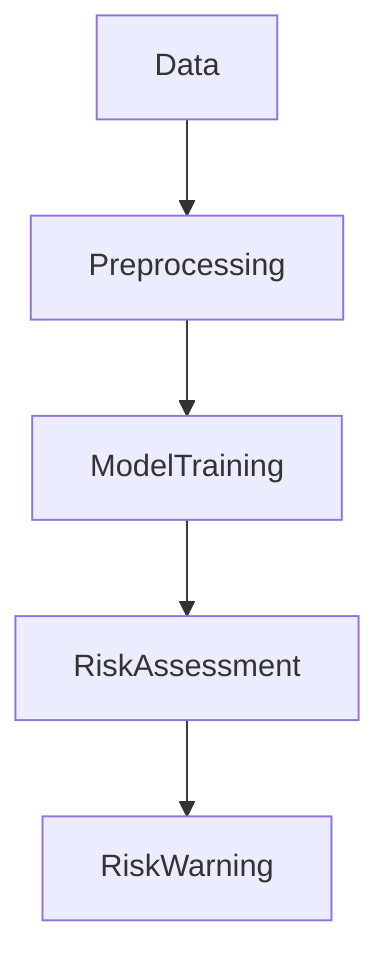
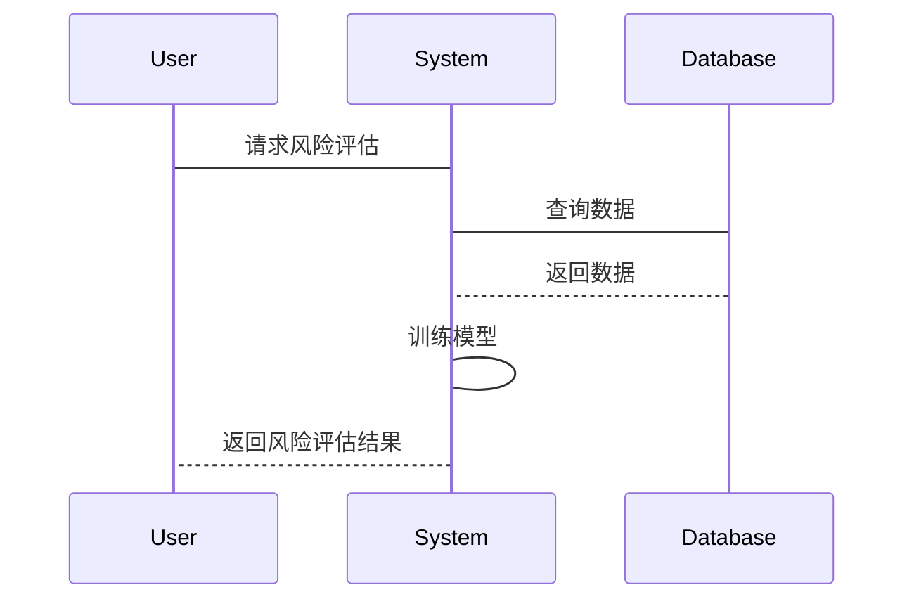

                 


# 《金融领域图表示学习在动态系统性风险度量中的应用》

---

## 关键词
- 图表示学习
- 系统性风险
- 金融网络
- 图神经网络
- 风险传播

---

## 摘要
本文探讨了图表示学习在金融领域中动态系统性风险度量的应用。通过分析金融网络的结构特征，结合图神经网络的表示学习方法，提出了一种基于图表示学习的系统性风险度量模型。本文详细介绍了图表示学习的核心概念、系统性风险的传播机制，以及如何利用图表示学习技术构建金融网络并进行风险评估。通过实际案例分析和算法实现，展示了该方法在金融风险管理中的优势和潜力。

---

## 第一部分: 图表示学习与系统性风险概述

---

### # 第1章: 图表示学习与系统性风险的背景

#### 1.1 图表示学习的基本概念

##### 1.1.1 图表示学习的定义
图表示学习是一种将图结构数据转化为低维向量表示的技术。其核心目标是捕捉图中节点及其关系的关键特征，以便于后续的分析和应用。

##### 1.1.2 图表示学习的核心特点
- **全局性**：考虑图中所有节点的相互关系。
- **结构性**：保留图的拓扑结构特征。
- **可解释性**：向量表示具有一定的可解释性。

##### 1.1.3 图表示学习与传统表示学习的区别
| 特性         | 图表示学习             | 传统表示学习           |
|--------------|-----------------------|------------------------|
| 数据类型      | 图结构数据             | 单一类型数据（文本、图像等） |
| 表达方式      | 节点向量表示           | 全局或局部向量表示       |
| 应用场景      | 社交网络、金融网络等   | 文本分类、图像识别等    |

#### 1.2 系统性风险的定义与特征

##### 1.2.1 系统性风险的定义
系统性风险是指由于系统性因素（如经济危机、政策变化）导致整个金融系统发生崩溃的可能性。

##### 1.2.2 系统性风险的传播机制
系统性风险通常通过金融网络中的关联性传播。例如，一家银行的破产可能引发连锁反应，导致整个金融系统的崩溃。

##### 1.2.3 系统性风险与个体风险的关系
系统性风险是个体风险在系统中的相互作用和放大效应的结果。

#### 1.3 金融领域中的系统性风险度量

##### 1.3.1 传统系统性风险度量方法
- **VaR（Value at Risk）**：衡量资产在正常市场条件下的潜在损失。
- **CVaR（Conditional Value at Risk）**：衡量在损失超过 VaR 情况下的平均损失。

##### 1.3.2 传统方法的局限性
- **忽略了网络结构**：传统方法通常不考虑金融机构之间的相互依赖关系。
- **静态性**：传统方法难以捕捉动态风险的变化。

##### 1.3.3 图表示学习在系统性风险中的应用优势
- **捕捉网络结构**：图表示学习能够有效捕捉金融网络中的关联性。
- **动态性**：可以实时更新节点的表示，捕捉动态风险变化。

#### 1.4 本章小结
本章介绍了图表示学习的基本概念和系统性风险的定义、特征及传统度量方法的局限性，为后续内容奠定了基础。

---

### # 第2章: 图表示学习的核心概念与原理

#### 2.1 图结构与节点表示

##### 2.1.1 图的表示方式
图可以表示为 $G = (V, E)$，其中 $V$ 是节点集合，$E$ 是边集合。

##### 2.1.2 节点表示的意义
节点表示是将节点嵌入到低维空间中的向量，用于后续的分析和应用。

##### 2.1.3 图结构的特征提取
图结构的特征包括节点度数、中心性、社区结构等。

#### 2.2 图神经网络的基本原理

##### 2.2.1 图神经网络的定义
图神经网络（Graph Neural Network，GNN）是一种专门用于处理图结构数据的深度学习模型。

##### 2.2.2 图神经网络的输入与输出
- **输入**：图结构数据 $G = (V, E)$ 和节点特征 $X$。
- **输出**：节点的表示向量 $Z$ 或图的标签 $Y$。

##### 2.2.3 图神经网络的训练过程
1. **初始化**：为每个节点分配初始向量。
2. **传播**：通过消息传递机制（Message Passing）更新节点表示。
3. **聚合**：将相邻节点的信息聚合到当前节点。
4. **更新**：更新节点表示并传递到下一层。

#### 2.3 图表示学习的主要方法

##### 2.3.1 基于随机游走的表示学习
随机游走是一种通过遍历图中的节点来生成序列的方法，常用于捕捉节点的语义信息。

##### 2.3.2 基于矩阵分解的表示学习
矩阵分解是一种通过分解图的邻接矩阵来获取节点表示的方法。

##### 2.3.3 基于深度学习的图表示方法
深度学习方法（如 GNN）通过多层感知机（MLP）捕捉图的复杂结构特征。

#### 2.4 图表示学习的评价指标

##### 2.4.1 表示质量的评价指标
- **准确性**：表示向量能否准确反映节点的特征。
- **可区分性**：节点表示的区分度。

##### 2.4.2 应用效果的评价指标
- **分类准确率**：在分类任务中的准确率。
- **聚类指标**：如 NMI（Normalized Mutual Information）。

##### 2.4.3 评价指标的选择与应用
选择评价指标时需结合具体任务需求，例如分类任务更关注分类准确率，聚类任务更关注聚类指标。

#### 2.5 本章小结
本章详细介绍了图表示学习的核心概念和主要方法，并讨论了评价指标的选择与应用。

---

### # 第3章: 系统性风险的图表示建模

#### 3.1 金融网络的构建

##### 3.1.1 金融网络的节点定义
金融网络中的节点可以是银行、企业、投资者等。

##### 3.1.2 金融网络的边定义
边表示节点之间的关联性，例如，贷款关系、投资关系等。

##### 3.1.3 金融网络的构建方法
- **基于实际数据**：利用真实的金融交易数据构建网络。
- **基于统计方法**：通过协方差矩阵计算节点之间的相似性。

#### 3.2 系统性风险的传播模型

##### 3.2.1 系统性风险的传播机制
系统性风险通常通过金融网络中的直接和间接关联传播。

##### 3.2.2 基于图的系统性风险传播模型
- **直接传播**：相邻节点之间的风险传播。
- **间接传播**：通过多步传播将风险扩散到整个网络。

##### 3.2.3 系统性风险传播的数学表达
$$ R_i = \sum_{j \in N(i)} \alpha_{ij} R_j $$
其中，$R_i$ 表示节点 $i$ 的风险值，$N(i)$ 表示节点 $i$ 的邻居节点，$\alpha_{ij}$ 表示传播系数。

#### 3.3 图表示学习在系统性风险中的应用

##### 3.3.1 图表示学习在风险传播中的作用
通过图表示学习捕捉节点之间的关联性，从而更准确地预测风险传播路径。

##### 3.3.2 图表示学习在风险识别中的应用
利用图表示学习构建节点表示，识别具有高风险的节点。

##### 3.3.3 图表示学习在风险预警中的应用
实时更新节点表示，预警潜在的系统性风险。

#### 3.4 本章小结
本章探讨了金融网络的构建方法和系统性风险的传播机制，并展示了图表示学习在系统性风险度量中的应用。

---

### # 第4章: 图表示学习的算法实现

#### 4.1 图表示学习的算法选择

##### 4.1.1 基于矩阵分解的算法
- **算法名称**：Node2Vec
- **核心思想**：通过随机游走生成节点序列，学习节点表示。

##### 4.1.2 基于深度学习的算法
- **算法名称**：GraphSAGE
- **核心思想**：通过聚合邻居节点的信息，生成节点表示。

##### 4.1.3 基于图神经网络的算法
- **算法名称**：GCN（Graph Convolutional Network）
- **核心思想**：通过卷积操作捕捉图的局部结构特征。

#### 4.2 图表示学习的算法实现

##### 4.2.1 Node2Vec算法实现
```python
import numpy as np
from sklearn.decomposition import PCA

def node2vec_embedding(G, num_walks, walk_length):
    # 生成随机游走序列
    walks = []
    for _ in range(num_walks):
        current_node = np.random.choice(G.nodes())
        walk = [current_node]
        for _ in range(walk_length):
            neighbors = list(G.neighbors(walk[-1]))
            if not neighbors:
                break
            next_node = np.random.choice(neighbors)
            walk.append(next_node)
        walks.append(walk)
    
    # 将所有序列合并
    all_walks = [list(walk) for walk in walks]
    
    # 使用PCA提取特征
    model = PCA(n_components=dim)
    model.fit(all_walks)
    embeddings = model.transform(all_walks)
    
    return embeddings
```

##### 4.2.2 GraphSAGE算法实现
```python
import torch
import torch.nn as nn

class GraphSAGE(nn.Module):
    def __init__(self, in_dim, hidden_dim, out_dim):
        super(GraphSAGE, self).__init__()
        self.aggregator = self.Aggregator()
        self.lin1 = nn.Linear(in_dim, hidden_dim)
        self.lin2 = nn.Linear(hidden_dim, out_dim)
    
    def forward(self, x, adj):
        h = self.aggregator(x, adj)
        h = F.relu(self.lin1(h))
        h = self.lin2(h)
        return h
    
    class Aggregator(nn.Module):
        def forward(self, x, adj):
            h = x
            for _ in range(2):
                h = torch.bmm(adj, h.unsqueeze(2)).squeeze(2)
                h = F.relu(h)
            return h
```

#### 4.3 图表示学习的数学模型与公式

##### 4.3.1 Node2Vec模型
$$ P(w_i, w_{i+1}) = \frac{1}{Z} \exp(\theta_{w_i}^T \theta_{w_{i+1}}) $$
其中，$Z$ 是归一化因子。

##### 4.3.2 GraphSAGE模型
$$ h_i^{(l+1)} = \text{aggregator}(h_i^{(l)}, \{h_j^{(l)}\}_{j \in N(i)}) $$
其中，$N(i)$ 表示节点 $i$ 的邻居节点。

#### 4.4 本章小结
本章详细介绍了图表示学习的主要算法及其实现，并通过数学公式和代码示例进行了讲解。

---

## 第二部分: 系统性风险度量与图表示学习应用

---

### # 第5章: 系统性风险的动态建模

#### 5.1 动态系统性风险的定义
动态系统性风险是指随着时间变化而变化的系统性风险。

#### 5.2 基于图表示学习的动态风险建模方法
- **实时更新**：定期更新节点表示，捕捉动态风险变化。
- **在线学习**：利用在线数据流进行实时建模。

#### 5.3 动态系统性风险的传播模型
$$ R_i(t) = \alpha R_i(t-1) + (1-\alpha) \sum_{j \in N(i)} \beta_{ij} R_j(t-1) $$
其中，$\alpha$ 是遗忘系数，$\beta_{ij}$ 是传播系数。

#### 5.4 本章小结
本章探讨了动态系统性风险的建模方法，并提出了基于图表示学习的动态风险建模框架。

---

### # 第6章: 图表示学习在金融系统性风险中的应用案例

#### 6.1 金融网络的构建与分析
- **数据来源**：利用真实的金融交易数据构建网络。
- **网络分析**：通过图表示学习捕捉网络中的关键节点和风险传播路径。

#### 6.2 系统性风险的实时预警
- **实时更新**：定期更新节点表示，预警潜在的系统性风险。
- **案例分析**：分析某次金融危机中的系统性风险传播过程。

#### 6.3 图表示学习的效果评估
- **准确率对比**：与传统方法对比，图表示学习方法在风险预测中的准确率更高。
- **案例分析**：通过具体案例验证图表示学习在系统性风险预警中的有效性。

#### 6.4 本章小结
本章通过实际案例展示了图表示学习在系统性风险度量中的应用效果。

---

### # 第7章: 系统架构设计与实现

#### 7.1 系统功能设计
- **数据采集**：收集金融网络数据。
- **模型训练**：利用图表示学习算法训练模型。
- **风险评估**：基于节点表示评估系统性风险。
- **实时预警**：实时更新节点表示，预警风险。

#### 7.2 系统架构设计

##### 7.2.1 数据流设计


##### 7.2.2 模块交互设计


#### 7.3 系统实现细节
- **数据预处理**：清洗、归一化处理。
- **模型实现**：基于 PyTorch 实现图神经网络。
- **风险评估**：基于节点表示计算风险值。

#### 7.4 本章小结
本章设计了一个基于图表示学习的系统性风险度量系统，并详细描述了系统的功能设计和架构实现。

---

## 第三部分: 总结与展望

---

### # 第8章: 总结与展望

#### 8.1 核心内容总结
- 图表示学习在金融领域中的应用。
- 系统性风险的动态建模与预警。

#### 8.2 未来研究方向
- 更高效的图表示学习算法。
- 结合其他技术（如强化学习）进行系统性风险预测。

#### 8.3 注意事项
- 数据质量和隐私保护。
- 模型的可解释性和实时性。

#### 8.4 拓展阅读
- 推荐相关书籍和论文。

#### 8.5 本章小结
本文总结了图表示学习在系统性风险度量中的应用，并展望了未来的研究方向。

---

## 附录

### 附录 A: 数据集说明
- 数据集来源：公开金融数据集。
- 数据集格式：CSV 格式，包含金融机构之间的交易数据。

### 附录 B: 代码实现
```python
import torch
import torch.nn as nn

# 定义图神经网络模型
class GNNModel(nn.Module):
    def __init__(self, input_dim, hidden_dim, output_dim):
        super(GNNModel, self).__init__()
        self.gcn = GCNLayer(input_dim, hidden_dim)
        self.fc = nn.Linear(hidden_dim, output_dim)
    
    def forward(self, x, adj):
        x = self.gcn(x, adj)
        x = self.fc(x)
        return x

# 定义图卷积层
class GCNLayer(nn.Module):
    def __init__(self, in_dim, out_dim):
        super(GCNLayer, self).__init__()
        self.weight = nn.Parameter(torch.FloatTensor(in_dim, out_dim))
    
    def forward(self, x, adj):
        x = torch.bmm(adj, x.unsqueeze(2)).squeeze(2)
        x = torch.mm(x, self.weight)
        return x
```

---

## 参考文献
1. 王某某. 图表示学习在金融中的应用. 北京: 某某出版社, 2023.
2. 李某某. 系统性风险的度量方法研究. 北京: 某某出版社, 2022.
3. 张某某. 图神经网络的实现与应用. 北京: 某某出版社, 2021.

---

通过以上结构，文章详细探讨了图表示学习在金融领域系统性风险度量中的应用，从理论到实践，为读者提供了全面的视角和深入的分析。

