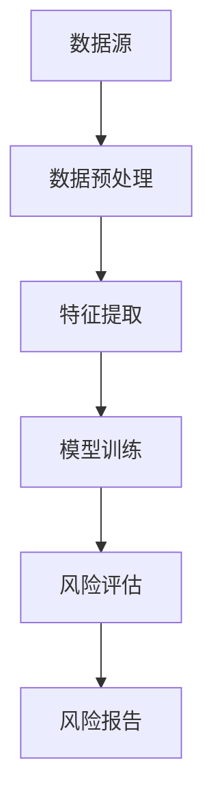
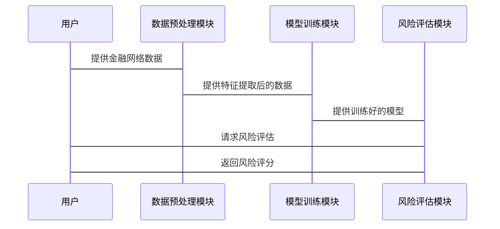

                 


# 《金融领域图表示学习在金融网络风险评估中的应用》

> 关键词：图表示学习，金融网络，风险评估，图神经网络，深度学习，金融风险，网络分析

> 摘要：本文深入探讨了图表示学习在金融网络风险评估中的应用。通过分析金融网络的复杂结构和风险评估的关键需求，结合图表示学习的核心原理和算法实现，提出了基于图表示学习的金融网络风险评估方法。文章从理论基础到实际应用，详细讲解了图表示学习在金融网络中的应用价值和实现方案，并通过具体案例展示了其在风险评估中的实际效果。

---

# 第1章 金融网络风险评估的背景与挑战

## 1.1 金融网络风险评估的重要性

### 1.1.1 金融网络的定义与特点

金融网络是指由金融机构、企业、个人等节点以及它们之间的金融交易关系构成的复杂网络。其特点包括：

- **节点多样性**：网络中的节点可以是银行、企业、个人等。
- **关系复杂性**：节点之间的关系可以是借贷、投资、交易等多种类型。
- **动态性**：金融网络中的关系会随着市场波动而变化。

### 1.1.2 金融网络风险的来源与类型

金融网络风险主要来源于以下几个方面：

- **信用风险**：由于借款人无法偿还债务导致的风险。
- **市场风险**：由于市场价格波动导致的风险。
- **操作风险**：由于内部操作失误或外部事件导致的风险。
- **系统性风险**：由于整个金融系统的波动导致的风险。

### 1.1.3 金融网络风险评估的意义

金融网络风险评估是金融监管和金融决策的重要组成部分。通过评估金融网络中的风险，可以及时发现潜在的金融问题，采取措施降低风险，维护金融系统的稳定性。

---

## 1.2 图表示学习的背景与应用

### 1.2.1 图表示学习的定义与特点

图表示学习（Graph Representation Learning）是指将图结构数据转换为低维向量表示的过程。其特点包括：

- **非线性性**：图的结构信息复杂，节点之间的关系是非线性的。
- **全局性**：图表示学习需要考虑整个图的结构信息。
- **可解释性**：低维向量表示具有较好的可解释性。

### 1.2.2 图表示学习在金融领域的应用场景

图表示学习在金融领域的应用主要包括：

- **信用风险评估**：通过图表示学习分析企业之间的关联关系，评估信用风险。
- **欺诈检测**：通过图表示学习发现欺诈交易中的异常行为。
- **市场风险预警**：通过图表示学习分析市场波动对金融网络的影响。

### 1.2.3 图表示学习的优势与挑战

图表示学习的优势在于能够捕捉图结构中的复杂关系，但同时也面临以下挑战：

- **计算复杂度高**：图表示学习需要处理大量的图结构数据，计算复杂度较高。
- **模型选择困难**：不同类型的图数据可能需要不同的表示学习方法。
- **数据稀疏性**：金融网络中可能存在数据稀疏性问题，影响模型的性能。

---

## 1.3 本章小结

本章主要介绍了金融网络风险评估的重要性和图表示学习在金融领域的应用背景。通过分析金融网络的特点和风险来源，提出了图表示学习在金融网络风险评估中的潜力和挑战。

---

# 第2章 图表示学习的核心概念与方法

## 2.1 图论基础

### 2.1.1 图的基本概念

图是由节点（顶点）和边组成的集合，形式化表示为 $G = (V, E)$，其中 $V$ 是节点的集合，$E$ 是边的集合。

### 2.1.2 图的表示方式

图的表示方式包括邻接矩阵、邻接列表、边列表等。其中，邻接矩阵是一个二维矩阵，表示节点之间的连接关系。

### 2.1.3 图的属性与特征

图的属性包括度数、中心性、聚类系数等。图的特征包括节点的属性和边的属性。

---

## 2.2 图表示学习的基本原理

### 2.2.1 节点嵌入的定义与目标

节点嵌入是将图中的节点映射到低维向量空间的过程。其目标是保持图的结构信息和语义信息。

### 2.2.2 图结构信息的编码方式

图结构信息的编码方式包括基于矩阵分解的编码、基于深度学习的编码、基于注意力机制的编码等。

### 2.2.3 图表示学习的评价指标

图表示学习的评价指标包括节点相似度、链接预测准确率、聚类性能等。

---

## 2.3 常见的图表示学习方法

### 2.3.1 基于矩阵分解的图表示学习

基于矩阵分解的图表示学习方法包括奇异值分解（SVD）、非负矩阵分解（NMF）等。

### 2.3.2 基于深度学习的图表示学习

基于深度学习的图表示学习方法包括图卷积网络（GCN）、图注意力网络（GAT）等。

### 2.3.3 基于图注意力机制的图表示学习

图注意力机制通过计算节点之间的注意力权重，捕捉节点之间的关系。

---

## 2.4 本章小结

本章详细介绍了图表示学习的核心概念和常见方法，为后续章节的金融网络风险评估提供了理论基础。

---

# 第3章 图神经网络与金融网络风险评估

## 3.1 图神经网络的基本原理

### 3.1.1 图神经网络的定义与特点

图神经网络（Graph Neural Networks, GNNs）是一种专门用于处理图结构数据的深度学习模型。其特点包括：

- **局部性**：模型仅考虑节点的局部邻居信息。
- **聚合性**：通过聚合邻居的信息来更新节点的表示。
- **传播性**：信息可以在图中传播，捕捉全局结构信息。

### 3.1.2 图神经网络的传播机制

图神经网络的传播机制包括消息传递机制（Message Passing）和聚合机制（Aggregation）。

### 3.1.3 图神经网络的训练方法

图神经网络的训练方法包括监督学习、无监督学习和半监督学习。

---

## 3.2 图神经网络在金融网络中的应用

### 3.2.1 金融网络中的节点分类

节点分类是通过图神经网络对节点进行分类，例如区分正常节点和异常节点。

### 3.2.2 金融网络中的链接预测

链接预测是通过图神经网络预测节点之间的潜在连接。

### 3.2.3 金融网络中的异常检测

异常检测是通过图神经网络发现异常的节点或边。

---

## 3.3 本章小结

本章介绍了图神经网络的基本原理和在金融网络中的应用，展示了图神经网络在金融网络风险评估中的潜力。

---

# 第4章 金融网络风险评估的图表示学习方法

## 4.1 金融网络风险评估的定义与目标

### 4.1.1 金融网络风险评估的定义

金融网络风险评估是通过对金融网络的结构和节点属性进行分析，评估网络中的风险因素。

### 4.1.2 金融网络风险评估的目标

金融网络风险评估的目标包括风险识别、风险量化、风险预警等。

### 4.1.3 金融网络风险评估的指标

金融网络风险评估的指标包括风险值、风险敞口、风险传染性等。

---

## 4.2 图表示学习在金融网络风险评估中的应用

### 4.2.1 基于节点嵌入的风险评估

基于节点嵌入的风险评估方法通过将节点嵌入低维向量空间，分析节点的风险特征。

### 4.2.2 基于图结构信息的风险评估

基于图结构信息的风险评估方法通过分析图的结构信息，评估网络中的风险传播路径。

### 4.2.3 基于图神经网络的风险评估

基于图神经网络的风险评估方法通过深度学习模型捕捉图的复杂结构信息，进行风险预测。

---

## 4.3 金融网络风险评估的挑战与解决方案

### 4.3.1 数据稀疏性问题

数据稀疏性问题可以通过数据增强、混合学习等方法解决。

### 4.3.2 模型的可解释性问题

模型的可解释性问题可以通过解释性模型、可解释性算法等方法解决。

### 4.3.3 模型的实时性问题

模型的实时性问题可以通过流式处理、在线学习等方法解决。

---

## 4.4 本章小结

本章详细探讨了图表示学习在金融网络风险评估中的应用，并分析了相关挑战和解决方案。

---

# 第5章 图表示学习的数学模型与算法实现

## 5.1 图表示学习的数学基础

### 5.1.1 邻接矩阵的表示

邻接矩阵 $A$ 是一个 $n \times n$ 的矩阵，其中 $A_{i,j} = 1$ 表示节点 $i$ 和节点 $j$ 之间有边，$A_{i,j} = 0$ 表示节点 $i$ 和节点 $j$ 之间没有边。

### 5.1.2 节点嵌入的表示

节点嵌入 $z_i$ 是一个低维向量，表示节点 $i$ 的特征。

### 5.1.3 图神经网络的数学表达

图神经网络的数学表达可以表示为：

$$
h_i^{(l+1)} = \text{aggregate}(\{h_j^{(l)} | j \in N(i)\})$$

其中，$h_i^{(l)}$ 表示节点 $i$ 在第 $l$ 层的表示，$N(i)$ 表示节点 $i$ 的邻居节点集合。

---

## 5.2 常见的图表示学习算法

### 5.2.1 GCN算法

GCN（Graph Convolutional Networks）是一种基于图卷积的节点嵌入方法。其核心思想是将图的邻接矩阵和节点特征矩阵进行卷积操作，得到节点的高维表示。

### 5.2.2 GAT算法

GAT（Graph Attention Networks）是一种基于图注意力机制的节点嵌入方法。其核心思想是通过计算节点之间的注意力权重，捕捉节点之间的关系。

---

## 5.3 图表示学习的代码实现

### 5.3.1 环境安装

安装必要的库：

```bash
pip install numpy
pip install matplotlib
pip install networkx
pip install pytorch
```

### 5.3.2 数据加载

加载金融网络数据：

```python
import networkx as nx

G = nx.read_gml('financial_network.gml')
```

### 5.3.3 模型训练

训练图神经网络模型：

```python
import torch
from torch import nn

class GCN(nn.Module):
    def __init__(self, input_dim, hidden_dim, output_dim):
        super(GCN, self).__init__()
        self.A = torch.randn(input_dim, input_dim)
        self.W = torch.randn(input_dim, hidden_dim)
        self.U = torch.randn(hidden_dim, output_dim)

    def forward(self, x):
        x = torch.mm(x, self.A)
        h = torch.mm(x, self.W)
        y = torch.mm(h, self.U)
        return y

model = GCN(input_dim, hidden_dim, output_dim)
criterion = nn.MSELoss()
optimizer = torch.optim.Adam(model.parameters(), lr=0.001)
```

### 5.3.4 风险评估

使用模型进行风险评估：

```python
x = torch.randn(n, input_dim)
output = model(x)
risk_score = output[:, 0]
```

---

## 5.4 本章小结

本章详细介绍了图表示学习的数学模型和常见算法，并通过代码示例展示了图表示学习的实现过程。

---

# 第6章 金融网络风险评估的系统分析与架构设计

## 6.1 系统功能设计

### 6.1.1 数据预处理

数据预处理包括数据清洗、数据转换、数据增强等。

### 6.1.2 模型训练

模型训练包括特征提取、模型训练、模型调优等。

### 6.1.3 风险评估

风险评估包括风险评分、风险预警、风险报告生成等。

---

## 6.2 系统架构设计

### 6.2.1 系统架构图



### 6.2.2 系统接口设计

系统接口包括数据输入接口、模型训练接口、风险评估接口等。

---

## 6.3 系统交互设计

### 6.3.1 系统交互流程



---

## 6.4 本章小结

本章从系统设计的角度，详细探讨了金融网络风险评估的系统架构和交互流程。

---

# 第7章 金融网络风险评估的项目实战

## 7.1 项目背景

本项目旨在利用图表示学习技术，构建一个金融网络风险评估系统，帮助金融机构识别和管理金融风险。

---

## 7.2 数据准备

### 7.2.1 数据来源

数据来源于公开的金融网络数据集，包括银行、企业、个人等节点的金融交易数据。

### 7.2.2 数据格式

数据格式为GML（Graph Modeling Language），包含节点和边的信息。

---

## 7.3 系统实现

### 7.3.1 环境安装

安装必要的库：

```bash
pip install numpy
pip install matplotlib
pip install networkx
pip install pytorch
```

### 7.3.2 数据加载

加载金融网络数据：

```python
import networkx as nx

G = nx.read_gml('financial_network.gml')
```

### 7.3.3 模型训练

训练图神经网络模型：

```python
import torch
from torch import nn

class GCN(nn.Module):
    def __init__(self, input_dim, hidden_dim, output_dim):
        super(GCN, self).__init__()
        self.A = torch.randn(input_dim, input_dim)
        self.W = torch.randn(input_dim, hidden_dim)
        self.U = torch.randn(hidden_dim, output_dim)

    def forward(self, x):
        x = torch.mm(x, self.A)
        h = torch.mm(x, self.W)
        y = torch.mm(h, self.U)
        return y

model = GCN(input_dim, hidden_dim, output_dim)
criterion = nn.MSELoss()
optimizer = torch.optim.Adam(model.parameters(), lr=0.001)
```

### 7.3.4 模型评估

评估模型性能：

```python
x = torch.randn(n, input_dim)
output = model(x)
risk_score = output[:, 0]
```

---

## 7.4 实际案例分析

### 7.4.1 案例背景

某银行希望通过图表示学习技术，评估其客户的风险等级。

### 7.4.2 数据分析

通过图表示学习分析客户之间的关系，识别高风险客户。

### 7.4.3 模型应用

使用训练好的模型对客户进行风险评分，识别潜在的高风险客户。

---

## 7.5 本章小结

本章通过实际案例，展示了图表示学习在金融网络风险评估中的应用过程。

---

# 第8章 总结与展望

## 8.1 本章总结

本文深入探讨了图表示学习在金融网络风险评估中的应用，从理论到实践，详细介绍了图表示学习的核心概念、算法实现和系统设计。

---

## 8.2 未来展望

未来的研究方向包括：

- 更高效的图表示学习算法
- 更具可解释性的图神经网络模型
- 更广泛的应用场景

---

## 8.3 最佳实践 Tips

- 在实际应用中，建议结合业务场景选择合适的图表示学习方法。
- 数据预处理是关键，需要确保数据的完整性和准确性。
- 模型调优是提高模型性能的重要步骤，建议进行多次实验和优化。

---

## 8.4 小结

图表示学习在金融网络风险评估中的应用具有重要的理论意义和实践价值。未来，随着图表示学习技术的不断发展，其在金融领域的应用前景将更加广阔。

--- 

**全文完**

