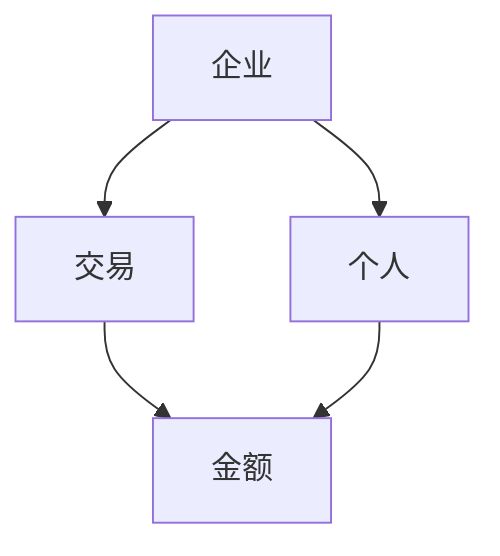
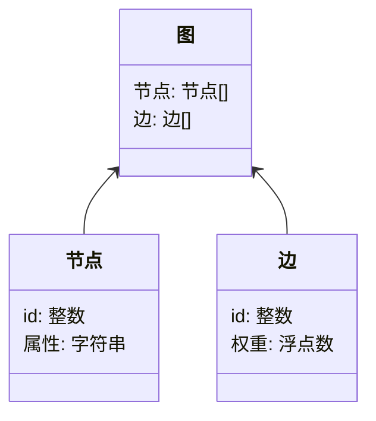
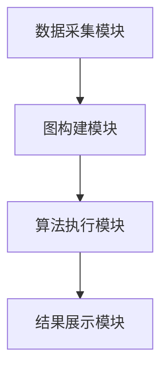
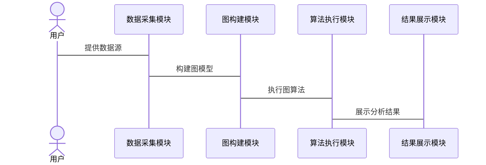

                 


# 《金融领域图计算技术的创新应用》

## 关键词：图计算，金融应用，算法原理，系统架构，项目实战

## 摘要：  
本文深入探讨了图计算技术在金融领域的创新应用，从背景介绍、核心概念、算法原理、系统架构到项目实战，全面解析了图计算如何解决金融领域的复杂问题。通过实际案例分析，本文展示了图计算在金融风险分析、欺诈检测等场景中的强大能力，并为读者提供了从理论到实践的完整指南。

---

# 第一部分: 图计算技术的背景与核心概念

## 第1章: 图计算技术的背景与问题背景

### 1.1 图计算技术的背景介绍

#### 1.1.1 图计算技术的起源与发展  
图计算是一种基于图结构的数据分析方法，起源于20世纪60年代的计算机科学领域。随着大数据技术的兴起，图计算因其强大的连接性分析能力，逐渐在金融、社交网络、生物信息等领域得到广泛应用。  

#### 1.1.2 图计算技术在金融领域的应用潜力  
在金融领域，图计算能够帮助我们发现隐藏的关联关系，例如：  
- **金融风险分析**：通过分析企业之间的关联关系，评估整体风险敞口。  
- **欺诈检测**：通过发现异常交易行为，识别潜在的欺诈交易。  
- **投资组合优化**：通过分析资产之间的相关性，优化投资组合。  

#### 1.1.3 当前金融领域的数据特点与挑战  
金融数据具有以下特点：  
1. 数据量大：金融交易数据、企业关系数据、市场数据等，数据量呈指数级增长。  
2. 数据关联性强：金融数据通常具有复杂的关联关系，例如企业之间的控股关系、交易关系等。  
3. 数据实时性要求高：金融市场的实时性要求，需要快速的计算能力和高效的算法支持。  

#### 1.1.4 问题的边界与外延  
图计算在金融领域的应用边界包括：  
1. 仅限于分析关联关系，无法直接处理非结构化数据（如文本、图像等）。  
2. 对计算资源要求较高，适用于大规模数据场景。  

外延包括：  
1. 结合其他技术（如机器学习、区块链）进一步提升金融分析能力。  
2. 在金融监管、智能投顾等领域进一步拓展应用场景。  

---

### 1.2 问题背景与问题描述

#### 1.2.1 传统金融数据分析的局限性  
传统金融数据分析方法（如统计分析、时间序列分析）通常难以处理复杂的关联关系。例如：  
- 在企业风险分析中，难以发现企业之间的隐性关联关系。  
- 在欺诈检测中，难以识别跨机构、跨市场的复杂欺诈网络。  

#### 1.2.2 图计算技术如何解决金融领域的问题  
图计算通过构建图模型，能够直观地展示数据之间的关联关系，并通过图算法挖掘隐藏的模式和关联。例如：  
- 通过构建企业关系图，识别潜在的关联风险。  
- 通过构建交易网络图，发现异常交易行为。  

#### 1.2.3 问题的边界与外延  
图计算在金融领域的应用需要结合具体业务场景，同时需要考虑数据隐私、计算资源等限制因素。  

---

### 1.3 核心概念与问题解决

#### 1.3.1 图计算的核心概念  
图计算的核心概念包括：  
1. **节点（Node）**：代表数据中的个体或实体，例如企业、个人、资产等。  
2. **边（Edge）**：代表节点之间的关系，例如交易关系、控股关系等。  
3. **权重（Weight）**：表示边的强度或重要性，例如交易金额、控股比例等。  

#### 1.3.2 问题解决的思路与方法  
1. **数据建模**：将金融数据转化为图结构，例如构建企业关系图、交易网络图等。  
2. **图算法应用**：使用图算法（如BFS、DFS、PageRank等）挖掘图中的关联关系。  
3. **结果分析**：根据图算法的结果，进行风险评估、欺诈检测等分析。  

#### 1.3.3 核心要素组成与系统架构  
图计算系统架构通常包括以下要素：  
1. **数据源**：包括金融交易数据、企业关系数据等。  
2. **图数据库**：用于存储和管理图结构数据。  
3. **图算法引擎**：用于执行图算法，例如BFS、DFS等。  
4. **结果展示**：通过可视化工具展示图分析结果。  

---

## 第2章: 图计算技术的核心概念与联系

### 2.1 图计算的核心概念

#### 2.1.1 图的基本概念与属性  
图的基本概念包括：  
- **节点**：代表数据中的个体或实体。  
- **边**：表示节点之间的关系。  
- **权重**：表示边的强度或重要性。  

图的属性包括：  
1. **无向图**：边没有方向，例如社交网络中的朋友关系。  
2. **有向图**：边有方向，例如网页中的超链接。  
3. **加权图**：边具有权重，例如交易金额。  

#### 2.1.2 节点、边、权重的定义与特征  
节点特征：  
- **节点类型**：例如企业、个人、资产等。  
- **节点属性**：例如企业名称、注册资金等。  

边特征：  
- **边类型**：例如交易关系、控股关系等。  
- **边权重**：例如交易金额、控股比例等。  

#### 2.1.3 图的类型与分类  
图的类型包括：  
1. **无向图**：边无方向，例如社交网络图。  
2. **有向图**：边有方向，例如网页图。  
3. **加权图**：边具有权重，例如交通网络图。  
4. **多层图**：包含多个层次的节点和边，例如金融网络中的多层嵌套结构。  

---

### 2.2 核心概念的属性特征对比

#### 2.2.1 节点属性对比表格

| 节点类型 | 节点属性             | 示例                     |
|----------|----------------------|--------------------------|
| 企业     | 企业名称、注册资金、行业 | 例如：苹果公司、谷歌公司 |
| 个人     | 姓名、职业、资产     | 例如：张三、李四         |

#### 2.2.2 边属性对比表格

| 边类型   | 边权重     | 示例                     |
|----------|------------|--------------------------|
| 交易关系 | 交易金额   | 例如：100万人民币         |
| 控股关系 | 股权比例   | 例如：51%               |

---

### 2.3 ER实体关系图架构



---

### 2.4 本章小结

---

# 第三部分: 图计算技术的算法原理与数学模型

## 第3章: 图算法的核心原理

### 3.1 图算法的核心原理

#### 3.1.1 广度优先搜索（BFS）

- **原理**：从起点开始，逐层扩展，遍历图中的所有节点。  
- **应用场景**：发现最短路径、检测连通性等。  

**代码示例**：

```python
from collections import deque

def bfs(graph, start):
    visited = set()
    queue = deque([start])
    visited.add(start)
    while queue:
        node = queue.popleft()
        for neighbor in graph[node]:
            if neighbor not in visited:
                visited.add(neighbor)
                queue.append(neighbor)
    return visited
```

#### 3.1.2 深度优先搜索（DFS）

- **原理**：从起点开始，尽可能深入地遍历图中的节点，回溯时扩展其他分支。  
- **应用场景**：检测连通性、寻找路径等。  

**代码示例**：

```python
def dfs(graph, start, visited=None):
    if visited is None:
        visited = set()
    visited.add(start)
    for neighbor in graph[start]:
        if neighbor not in visited:
            dfs(graph, neighbor, visited)
    return visited
```

#### 3.1.3 最短路径算法（Dijkstra）

- **原理**：通过优先队列选择距离起点最近的节点，逐步扩展到目标节点。  
- **应用场景**：寻找图中的最短路径。  

**数学模型**：

$$d_{i} = \min_{j} (d_{j} + w_{j,i})$$  

**代码示例**：

```python
import heapq

def dijkstra(graph, start, end):
    dist = {node: float('infinity') for node in graph}
    dist[start] = 0
    heap = [(0, start)]
    visited = set()
    
    while heap:
        current_dist, u = heapq.heappop(heap)
        if u in visited:
            continue
        visited.add(u)
        for v, weight in graph[u]:
            if dist[v] > current_dist + weight:
                dist[v] = current_dist + weight
                heapq.heappush(heap, (dist[v], v))
    return dist[end]
```

---

## 第4章: 图计算技术的数学模型与公式

### 4.1 图算法的数学模型

#### 4.1.1 PageRank算法

- **原理**：通过计算网页的pagerank值，衡量网页的重要性。  
- **公式**：

$$
PR(i) = \frac{1 - d}{N} + d \sum_{j} \frac{PR(j)}{OutDegree(j)}
$$  

其中：  
- \( PR(i) \) 表示节点i的PageRank值。  
- \( d \) 表示阻尼因子（通常为0.85）。  
- \( OutDegree(j) \) 表示节点j的出度。  

---

## 第5章: 图计算技术的系统分析与架构设计

### 5.1 问题场景介绍

#### 5.1.1 金融风险分析

- **场景描述**：通过分析企业之间的关联关系，评估整体风险敞口。  
- **数据来源**：企业关系数据、财务数据、市场数据等。  

#### 5.1.2 欺诈检测

- **场景描述**：通过分析交易网络，识别异常交易行为。  
- **数据来源**：交易数据、用户行为数据等。  

---

### 5.2 系统功能设计

#### 5.2.1 功能模块

1. **数据采集模块**：从多种数据源采集金融数据。  
2. **图构建模块**：将数据转化为图结构。  
3. **算法执行模块**：执行图算法，计算风险敞口或欺诈概率。  
4. **结果展示模块**：可视化图分析结果。  

#### 5.2.2 领域模型



---

### 5.3 系统架构设计

#### 5.3.1 系统架构图



#### 5.3.2 系统交互图



---

## 第6章: 图计算技术的项目实战

### 6.1 环境安装

#### 6.1.1 Python环境安装

```bash
python --version
pip install networkx
pip install matplotlib
```

#### 6.1.2 图数据库安装

```bash
pip install neo4j
pip install py2neo
```

---

### 6.2 系统核心实现

#### 6.2.1 数据采集模块

```python
import requests

def fetch_financial_data(api_key):
    url = f"https://api.example.com/financial_data?api_key={api_key}"
    response = requests.get(url)
    return response.json()
```

#### 6.2.2 图构建模块

```python
import networkx as nx

def build_graph(data):
    G = nx.Graph()
    for edge in data['edges']:
        G.add_edge(edge['from'], edge['to'], weight=edge['weight'])
    return G
```

---

### 6.3 案例分析

#### 6.3.1 金融风险分析案例

```python
graph = build_graph(fetch_financial_data(api_key))
risk = dijkstra(graph, 'start_node', 'end_node')
print(f"最短路径风险值为：{risk}")
```

---

## 第7章: 图计算技术的最佳实践

### 7.1 小结

图计算技术在金融领域的应用潜力巨大，尤其是在金融风险分析和欺诈检测方面。通过构建图模型并结合图算法，我们可以更高效地挖掘数据中的关联关系，提升金融分析的能力。

---

### 7.2 注意事项

1. **数据隐私**：在处理金融数据时，需注意数据隐私保护，遵守相关法律法规。  
2. **计算性能**：图计算对计算资源要求较高，需优化算法和硬件配置。  
3. **模型解释性**：图算法的解释性较差，需结合其他技术（如机器学习）提升模型的可解释性。  

---

### 7.3 拓展阅读

1. **《图算法与应用》**：深入讲解图算法的原理与应用。  
2. **《金融风险管理》**：结合金融领域的风险管理案例，分析图计算的应用场景。  
3. **《Neo4j图数据库实战》**：学习如何使用图数据库进行金融数据分析。  

---

## 结语

通过本文的详细讲解，读者可以系统地了解图计算技术在金融领域的创新应用，并掌握从理论到实践的完整流程。未来，随着技术的不断发展，图计算将在金融领域发挥更大的作用，为金融分析和决策提供更强大的支持。  

--- 

**感谢您的阅读！如果对本文有任何疑问或建议，请随时留言。**

