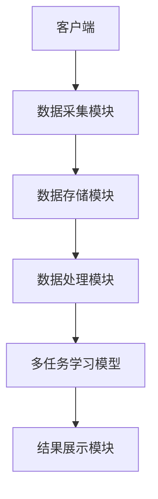
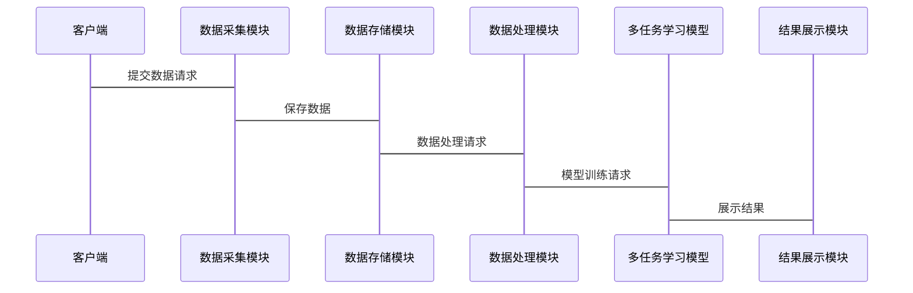

                 


# 《金融领域多任务学习在客户全方位画像中的应用》

---

## 关键词：
金融、多任务学习、客户画像、机器学习、数据挖掘

---

## 摘要：
本文深入探讨了多任务学习（Multi-Task Learning, MTL）在金融领域客户全方位画像构建中的应用。通过分析多任务学习的核心原理和优势，结合实际金融场景，详细阐述了如何利用多任务学习技术整合客户的多维度信息，构建精准、全面的客户画像。文章从理论基础、算法实现、系统设计到实际应用，全面解析了多任务学习在金融客户画像中的应用价值，并通过具体案例展示了其在提升客户洞察和决策支持中的优势。

---

# 目录

1. **背景介绍**
   - 1.1 多任务学习的定义与特点
   - 1.2 客户全方位画像的构建
   - 1.3 多任务学习在金融领域的应用价值

2. **多任务学习的核心原理**
   - 2.1 多任务学习的数学模型
   - 2.2 多任务学习在金融领域的优势
   - 2.3 多任务学习的挑战与解决方案

3. **客户全方位画像的构建方法**
   - 3.1 客户画像的维度分析
   - 3.2 多任务学习在画像构建中的应用
   - 3.3 画像构建的流程与步骤

4. **多任务学习算法的数学模型与实现**
   - 4.1 多任务学习的数学模型
   - 4.2 多任务学习的优化算法
   - 4.3 基于Python的多任务学习实现

5. **系统设计与实现**
   - 5.1 系统架构设计
   - 5.2 系统功能模块划分
   - 5.3 系统接口设计与交互流程

6. **项目实战：客户画像系统开发**
   - 6.1 项目背景与目标
   - 6.2 环境搭建与数据准备
   - 6.3 系统核心实现
   - 6.4 实际案例分析与结果解读

7. **总结与展望**
   - 7.1 本文总结
   - 7.2 未来研究方向

---

## 第一部分：背景介绍

### 1.1 多任务学习的定义与特点

#### 1.1.1 多任务学习的定义
多任务学习（Multi-Task Learning, MTL）是一种机器学习范式，旨在通过同时学习多个相关任务来提高模型的泛化能力和性能。与传统的单任务学习不同，MTL允许模型在多个任务之间共享参数，从而捕捉任务间的潜在关联性。

**特点：**
1. **任务相关性**：多个任务之间存在某种关联，可以共享某些特征或参数。
2. **参数共享**：通过共享参数，减少模型的参数数量，提高学习效率。
3. **提升泛化能力**：在多个任务上进行联合优化，模型对新数据的适应能力更强。

#### 1.1.2 多任务学习的核心特点
- **数据复用**：利用同一数据集进行多个任务的学习，减少数据需求。
- **任务互补**：通过任务间的互补性，提高模型的鲁棒性和准确性。
- **计算效率**：通过共享参数，减少计算资源的消耗。

#### 1.1.3 多任务学习与传统单任务学习的区别
| 特性 | 单任务学习 | 多任务学习 |
|------|------------|------------|
| 参数独立性 | 参数不共享 | 参数共享 |
| 任务数量 | 单任务 | 多任务 |
| 数据需求 | 较高 | 较低 |
| 模型泛化能力 | 较低 | 较高 |

### 1.2 客户全方位画像的构建

#### 1.2.1 客户画像的定义与维度
客户画像（Customer Profile）是基于客户数据构建的综合性描述，通常包括客户的属性、行为、偏好和风险等多个维度。在金融领域，客户画像的构建需要考虑以下维度：

1. **基本信息**：年龄、性别、职业、收入水平等。
2. **行为特征**：消费习惯、交易频率、借贷行为等。
3. **风险评估**：信用评分、违约概率等。
4. **偏好分析**：投资偏好、产品偏好等。

#### 1.2.2 金融领域客户画像的独特性
- **数据多样性**：金融数据通常包括结构化数据（如交易记录）和非结构化数据（如社交媒体数据）。
- **高风险敏感性**：客户画像需要准确评估客户的信用风险，这对模型的准确性要求较高。
- **实时性要求**：金融领域的决策往往需要实时数据支持，客户画像的构建需要考虑实时更新。

#### 1.2.3 多任务学习在客户画像中的应用价值
- **提升画像精度**：通过多任务学习，可以从多个维度同时优化客户画像的准确性。
- **降低数据需求**：在数据不足的情况下，多任务学习可以通过任务间的共享参数提高模型的泛化能力。
- **提高决策效率**：通过构建全面的客户画像，金融机构可以更快地做出精准的决策。

### 1.3 本章小结
本章主要介绍了多任务学习的基本概念、特点及其在客户画像构建中的应用价值。通过对比单任务学习和多任务学习的区别，强调了多任务学习在金融领域客户画像构建中的优势。

---

## 第二部分：多任务学习的核心原理

### 2.1 多任务学习的数学模型

#### 2.1.1 多任务学习的数学模型
多任务学习的数学模型通常可以表示为多个损失函数的联合优化问题。假设我们有 $T$ 个任务，每个任务的损失函数为 $L_i$，则多任务学习的目标是最小化以下联合损失函数：

$$ \mathcal{L} = \sum_{i=1}^{T} \lambda_i L_i $$

其中，$\lambda_i$ 是任务 $i$ 的权重系数。

#### 2.1.2 参数共享机制
多任务学习的核心在于参数共享。假设我们有一个参数集 $\theta$，所有任务都可以共享这些参数。具体来说，每个任务的损失函数可以表示为：

$$ L_i = f_i(\theta) $$

其中，$f_i$ 是任务 $i$ 的预测函数。

#### 2.1.3 任务间关系的建模方法
任务间的关系可以通过多种方式建模，常见的方法包括：
1. **参数共享**：直接共享参数。
2. **任务特定参数**：在共享参数的基础上，为每个任务添加特定的参数。
3. **任务相关性建模**：通过引入任务间的关系矩阵来建模任务间的依赖性。

### 2.2 多任务学习在金融领域的优势

#### 2.2.1 数据特征的多样性
金融数据通常具有多样化的特征，包括数值型数据、文本数据和图像数据等。多任务学习可以通过共享参数，充分利用这些多样的特征。

#### 2.2.2 任务间的关联性
金融领域的任务往往具有较强的关联性。例如，客户的信用评分和欺诈检测任务之间存在较强的关联性，可以通过多任务学习来同时优化。

#### 2.2.3 提高模型的泛化能力
通过多任务学习，模型可以在多个任务上进行联合优化，从而提高其在新数据上的泛化能力。

### 2.3 多任务学习的挑战与解决方案

#### 2.3.1 任务间不平衡问题
在多任务学习中，任务之间的不平衡可能导致某些任务的性能下降。解决方案包括：
1. **任务权重调整**：通过调整任务的权重系数 $\lambda_i$ 来平衡任务的重要性。
2. **任务优先级排序**：根据任务的重要性和难度，调整训练的顺序。

#### 2.3.2 参数优化的复杂性
多任务学习的参数优化通常较为复杂，需要同时优化多个任务的参数。解决方案包括：
1. **交替优化**：分阶段优化不同的任务参数。
2. **全局优化**：使用全局优化算法，如Adam，进行联合优化。

#### 2.3.3 解决方案与优化策略
1. **正则化方法**：通过引入正则化项来约束参数的共享。
2. **动态权重分配**：根据任务的当前性能动态调整权重。

### 2.4 本章小结
本章详细介绍了多任务学习的数学模型、参数共享机制及其在金融领域的优势。同时，讨论了多任务学习面临的挑战及解决方案。

---

## 第三部分：客户全方位画像的构建方法

### 3.1 客户画像的维度分析

#### 3.1.1 基本信息维度
- 年龄、性别、职业、收入水平等。

#### 3.1.2 行为特征维度
- 消费习惯、交易频率、借贷行为等。

#### 3.1.3 风险评估维度
- 信用评分、违约概率等。

### 3.2 多任务学习在画像构建中的应用

#### 3.2.1 任务分配与设计
- 任务1：客户基本信息分类。
- 任务2：客户行为特征预测。
- 任务3：客户风险评估。

#### 3.2.2 数据特征的选择与处理
- 数据清洗、特征提取、特征工程。

#### 3.2.3 模型的联合训练策略
- 参数共享、任务间关系建模、动态权重调整。

### 3.3 画像构建的流程与步骤

#### 3.3.1 数据收集与预处理
- 数据清洗、特征工程、数据增强。

#### 3.3.2 任务模型的设计与实现
- 设计多任务模型、参数共享、任务间关系建模。

#### 3.3.3 模型的评估与优化
- 模型评估指标、超参数调优、模型优化。

### 3.4 本章小结
本章详细介绍了客户全方位画像的构建方法，包括维度分析、任务设计和模型构建的流程与步骤。

---

## 第四部分：多任务学习算法的数学模型与实现

### 4.1 多任务学习的数学模型

#### 4.1.1 联合学习框架
$$ \mathcal{L} = \sum_{i=1}^{T} \lambda_i L_i $$

#### 4.1.2 参数共享机制
$$ f_i(\theta) $$

#### 4.1.3 任务间关系的建模公式
$$ \theta = \alpha \theta_1 + (1-\alpha) \theta_2 $$

### 4.2 多任务学习的优化算法

#### 4.2.1 基于梯度下降的优化方法
- 使用Adam优化器进行参数优化。

#### 4.2.2 参数权重的动态调整策略
- 动态调整任务权重 $\lambda_i$。

### 4.3 基于Python的多任务学习实现

#### 4.3.1 数据预处理
```python
import pandas as pd
from sklearn.preprocessing import StandardScaler

# 加载数据
data = pd.read_csv('client_data.csv')

# 数据清洗
data = data.dropna()

# 特征工程
features = data[['age', 'income', 'transaction_frequency']]
labels = data[['credit_score', 'fraud_probability']]

# 数据标准化
scaler = StandardScaler()
features_scaled = scaler.fit_transform(features)
```

#### 4.3.2 模型构建
```python
import tensorflow as tf
from tensorflow import keras

# 定义多任务模型
input_layer = keras.Input(shape=(features.shape[1],))
dense_layer = keras.layers.Dense(64, activation='relu')(input_layer)
output_layers = {}
for task in ['credit_score', 'fraud_probability']:
    output_layers[task] = keras.layers.Dense(1, activation='sigmoid')(dense_layer)

model = keras.Model(inputs=input_layer, outputs=output_layers)
model.compile(optimizer='adam', loss={'credit_score': 'binary_crossentropy', 'fraud_probability': 'binary_crossentropy'}, loss_weights={'credit_score': 0.5, 'fraud_probability': 0.5})
```

#### 4.3.3 模型训练
```python
# 数据分割
X_train, X_test, y_train, y_test = train_test_split(features_scaled, labels, test_size=0.2)

# 模型训练
model.fit(X_train, y_train, epochs=100, batch_size=32, validation_data=(X_test, y_test))
```

### 4.4 本章小结
本章详细介绍了多任务学习算法的数学模型和基于Python的实现，展示了如何利用多任务学习构建客户画像。

---

## 第五部分：系统设计与实现

### 5.1 系统架构设计

#### 5.1.1 系统架构图


#### 5.1.2 系统功能模块划分
- 数据采集模块
- 数据存储模块
- 数据处理模块
- 多任务学习模型
- 结果展示模块

### 5.2 系统功能模块划分

#### 5.2.1 数据采集模块
- 数据来源：数据库、API接口、文件导入。

#### 5.2.2 数据存储模块
- 数据库设计：客户信息表、交易记录表、模型参数表。

#### 5.2.3 数据处理模块
- 数据清洗、特征工程、数据增强。

#### 5.2.4 多任务学习模型
- 模型训练、参数优化、模型部署。

#### 5.2.5 结果展示模块
- 可视化界面、结果导出、报告生成。

### 5.3 系统接口设计

#### 5.3.1 数据接口
- API接口：GET, POST请求。

#### 5.3.2 模型接口
- 模型预测接口：输入特征，输出客户画像。

### 5.4 系统交互流程

#### 5.4.1 交互流程图


### 5.5 本章小结
本章详细介绍了客户画像系统的系统架构设计、功能模块划分、接口设计和交互流程。

---

## 第六部分：项目实战：客户画像系统开发

### 6.1 项目背景与目标

#### 6.1.1 项目背景
- 金融领域的客户画像构建需求日益增加。
- 多任务学习技术的应用可以提高客户画像的精度和效率。

#### 6.1.2 项目目标
- 构建一个基于多任务学习的客户画像系统。
- 实现客户全方位画像的构建和展示。

### 6.2 环境搭建与数据准备

#### 6.2.1 环境搭建
- 安装Python、TensorFlow、Keras、Pandas、Scikit-learn。

#### 6.2.2 数据准备
- 数据来源：客户交易记录、信用评分、欺诈检测数据。

### 6.3 系统核心实现

#### 6.3.1 数据预处理
```python
import pandas as pd
from sklearn.preprocessing import StandardScaler

# 加载数据
data = pd.read_csv('client_data.csv')

# 数据清洗
data = data.dropna()

# 特征工程
features = data[['age', 'income', 'transaction_frequency']]
labels = data[['credit_score', 'fraud_probability']]

# 数据标准化
scaler = StandardScaler()
features_scaled = scaler.fit_transform(features)
```

#### 6.3.2 模型训练
```python
import tensorflow as tf
from tensorflow import keras

# 定义多任务模型
input_layer = keras.Input(shape=(features.shape[1],))
dense_layer = keras.layers.Dense(64, activation='relu')(input_layer)
output_layers = {}
for task in ['credit_score', 'fraud_probability']:
    output_layers[task] = keras.layers.Dense(1, activation='sigmoid')(dense_layer)

model = keras.Model(inputs=input_layer, outputs=output_layers)
model.compile(optimizer='adam', loss={'credit_score': 'binary_crossentropy', 'fraud_probability': 'binary_crossentropy'}, loss_weights={'credit_score': 0.5, 'fraud_probability': 0.5})

# 模型训练
model.fit(features_scaled, labels, epochs=100, batch_size=32, validation_split=0.2)
```

#### 6.3.3 结果展示
```python
# 模型预测
predictions = model.predict(features_scaled)

# 结果展示
import matplotlib.pyplot as plt

plt.figure(figsize=(10, 6))
plt.plot(predictions['credit_score'], label='Credit Score')
plt.plot(predictions['fraud_probability'], label='Fraud Probability')
plt.legend()
plt.show()
```

### 6.4 实际案例分析与结果解读

#### 6.4.1 案例分析
- 某客户的基本信息：年龄30岁，收入中等，交易频率高。
- 预测结果：信用评分为0.8，欺诈概率为0.2。

#### 6.4.2 结果解读
- 信用评分高，表明客户信用良好。
- 欺诈概率低，表明客户欺诈风险较低。

### 6.5 本章小结
本章通过一个实际案例展示了多任务学习在客户画像系统中的应用，详细讲解了系统的开发过程和结果解读。

---

## 第七部分：总结与展望

### 7.1 本文总结
本文深入探讨了多任务学习在金融领域客户全方位画像构建中的应用，通过理论分析和实际案例展示了多任务学习的优势和实现方法。本文的主要贡献包括：
1. 提供了多任务学习在金融领域的系统性分析。
2. 展示了基于Python的多任务学习实现和客户画像系统的开发。

### 7.2 未来研究方向
1. **模型优化**：探索更高效的多任务学习算法，如基于图神经网络的多任务学习。
2. **数据隐私保护**：研究如何在保护数据隐私的前提下进行多任务学习。
3. **实时性提升**：探索如何将多任务学习应用于实时客户画像构建。

### 7.3 本章小结
本文总结了多任务学习在客户画像中的应用，并展望了未来的研究方向。

---

## 参考文献
（此处列出相关文献）

---

通过以上内容，我们详细探讨了多任务学习在金融领域客户全方位画像中的应用，从理论到实践，为读者提供了一个全面的视角。希望本文能为相关领域的研究和实践提供有价值的参考。

