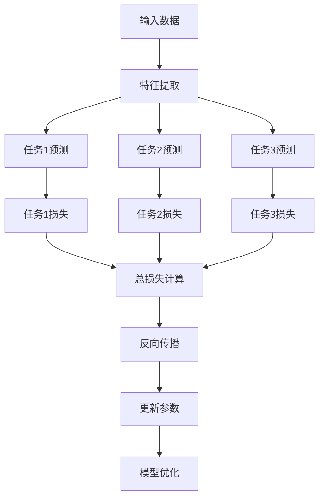
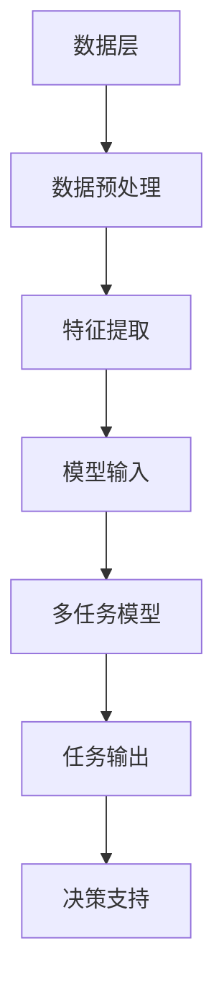

                 


# 《金融领域多任务学习在客户全生命周期管理中的应用》

> 关键词：多任务学习，客户全生命周期管理，金融领域，机器学习，人工智能

> 摘要：本文系统地探讨了多任务学习在金融客户全生命周期管理中的应用。通过分析多任务学习的核心概念、算法原理、系统架构及实际案例，本文展示了如何利用多任务学习技术提升金融客户的管理效率和决策精准度。文章内容涵盖了从理论基础到实际应用的全过程，旨在为金融领域的技术从业者提供深入的技术见解和实践指导。

---

## 第一部分：金融领域多任务学习的背景与概念

### # 第1章：多任务学习的背景与问题背景

#### 1.1 金融领域客户全生命周期管理概述
- 1.1.1 金融客户全生命周期的定义与特点
  - 客户从获取到流失的完整管理流程
  - 数据的实时性、多样性和复杂性
- 1.1.2 传统客户管理的局限性
  - 单一任务处理的低效性
  - 数据割裂导致的决策偏差
- 1.1.3 多任务学习在客户管理中的应用价值
  - 提高管理效率和决策精准度

#### 1.2 多任务学习的基本概念
- 1.2.1 多任务学习的定义与核心概念
  - 同时处理多个相关任务的学习框架
  - 参数共享和任务间关系的核心要素
- 1.2.2 多任务学习与单任务学习的对比
  - 任务独立性 vs. 任务相关性
  - 训练效率 vs. 决策效果
- 1.2.3 多任务学习的优势与挑战
  - 优势：提升模型泛化能力
  - 挑战：任务间冲突和计算复杂度

#### 1.3 多任务学习与客户全生命周期管理的关系
- 1.3.1 客户全生命周期管理中的多任务需求
  - 客户画像、风险评估、行为预测
- 1.3.2 多任务学习在客户管理中的应用场景
  - 客户分层、产品推荐、流失预警
- 1.3.3 多任务学习如何提升客户管理效率
  - 统一模型处理多个管理任务
  - 提高数据利用率和决策效率

---

### # 第2章：多任务学习的核心概念与联系

#### 2.1 多任务学习的原理
- 2.1.1 多任务学习的基本原理
  - 参数共享机制：任务间的共享参数和任务特定参数
  - 损失函数设计：多任务损失的加权求和
- 2.1.2 多任务学习的数学模型
  - 任务间关系的建模
  - 参数共享的数学表达式
- 2.1.3 多任务学习的核心要素与组成
  - 任务目标、任务权重、共享参数

#### 2.2 多任务学习与客户全生命周期管理的关系
- 2.2.1 客户全生命周期管理中的多任务需求
  - 不同阶段的客户行为预测和风险评估
- 2.2.2 多任务学习在客户管理中的应用场景
  - 跨时间、跨场景的任务处理
- 2.2.3 多任务学习如何提升客户管理效率
  - 通过共享参数降低模型复杂度
  - 提高模型对客户全生命周期的理解能力

#### 2.3 多任务学习的核心概念对比
- 2.3.1 多任务学习与传统机器学习的对比
  - 单任务学习 vs. 多任务学习
  - 训练目标和模型结构的差异
- 2.3.2 多任务学习与深度学习的对比
  - 深度学习的多任务能力
  - 多任务学习的优势与局限
- 2.3.3 多任务学习与强化学习的对比
  - 强化学习的反馈机制
  - 多任务学习的任务间关系

---

### # 第3章：多任务学习的算法原理

#### 3.1 多任务学习的主流算法
- 3.1.1 基于共享表示的多任务学习
  - 参数共享机制：共享嵌入层和任务特定层
  - 例如：MCDN（多任务深度神经网络）
- 3.1.2 基于任务权重的多任务学习
  - 动态权重分配：根据任务的重要性调整权重
  - 例如：MTL（多任务学习）
- 3.1.3 基于任务分解的多任务学习
  - 将多任务分解为多个子任务
  - 例如：任务嵌套或多任务协作

#### 3.2 多任务学习的数学模型与公式
- 3.2.1 多任务学习的损失函数
  $$L = \sum_{i=1}^{n} \lambda_i L_i$$
  - $\lambda_i$：任务$i$的权重
  - $L_i$：任务$i$的损失函数
- 3.2.2 任务权重的分配策略
  $$\lambda_i = \frac{1}{1 + e^{-\alpha t_i}}$$
  - $t_i$：任务$i$的时间或重要性指标
  - $\alpha$：超参数，控制权重分配的陡峭程度
- 3.2.3 参数共享机制的数学表达
  $$\theta = \{\theta_1, \theta_2, ..., \theta_n\}$$
  - $\theta_i$：任务$i$的参数
  - 共享参数部分：$\theta_{\text{shared}} \subset \theta_i$

#### 3.3 多任务学习算法的流程图


---

## 第二部分：多任务学习在金融领域的应用

### # 第4章：客户全生命周期管理的多任务需求

#### 4.1 客户全生命周期管理的场景介绍
- 4.1.1 客户获取阶段
  - 风险评估、信用评分
- 4.1.2 客户维护阶段
  - 行为分析、产品推荐
- 4.1.3 客户流失阶段
  - 流失预测、挽留策略

#### 4.2 多任务学习在金融客户管理中的具体应用
- 4.2.1 客户画像与分层
  - 通过多任务学习构建客户画像
  - 基于画像进行客户分层
- 4.2.2 风险评估与预测
  - 多任务预测客户违约风险
  - 结合行为特征和历史数据
- 4.2.3 客户行为预测与产品推荐
  - 预测客户行为模式
  - 推荐个性化金融产品

---

### # 第5章：多任务学习在客户全生命周期管理中的系统设计

#### 5.1 系统功能设计
- 5.1.1 数据采集与预处理
  - 多源数据融合
  - 数据清洗与特征提取
- 5.1.2 多任务模型构建
  - 模型结构设计
  - 参数共享与任务权重分配
- 5.1.3 系统输出与决策支持
  - 多任务预测结果
  - 决策支持报告

#### 5.2 系统架构设计


#### 5.3 接口设计与交互流程
- 5.3.1 系统接口设计
  - 输入接口：特征数据、任务目标
  - 输出接口：预测结果、决策建议
- 5.3.2 系统交互流程
  ```mermaid
  sequenceDiagram
  client ->> server: 提交数据请求
  server ->> client: 返回预测结果
  client ->> server: 请求决策建议
  server ->> client: 返回决策支持报告
  ```

---

## 第三部分：项目实战与深度分析

### # 第6章：多任务学习在客户管理中的实战案例

#### 6.1 项目环境安装与配置
- 安装Python和相关库（如TensorFlow、Keras）
- 数据集获取与预处理

#### 6.2 系统核心实现
- 代码实现：多任务学习模型
  ```python
  import tensorflow as tf
  from tensorflow import keras
  import numpy as np

  class MTLModel(keras.Model):
      def __init__(self, num_tasks=3):
          super(MTLModel, self).__init__()
          self.shared_layer = keras.layers.Dense(64, activation='relu')
          self.task_specific_layers = [keras.layers.Dense(1, activation='sigmoid') for _ in range(num_tasks)]
  
      def call(self, inputs):
          x = self.shared_layer(inputs)
          outputs = []
          for i in range(len(self.task_specific_layers)):
              outputs.append(self.task_specific_layers[i](x))
          return outputs
  ```

#### 6.3 实际案例分析
- 案例背景：某银行客户流失预测
- 数据分析：客户行为、信用评分、交易记录
- 模型训练与调优
- 实验结果与分析
  - 多任务学习 vs. 单任务学习：模型性能对比

---

## 第四部分：总结与展望

### # 第7章：总结与未来展望

#### 7.1 项目总结
- 通过多任务学习提升客户管理效率
- 模型的优势与局限性
- 实际应用中的经验与教训

#### 7.2 未来展望
- 多任务学习在金融领域的更多应用
- 深度学习与强化学习的结合
- 更多任务的协作与优化

---

## 第五部分：最佳实践与注意事项

### # 第8章：最佳实践与注意事项

#### 8.1 小结
- 多任务学习的核心价值
- 在金融领域的应用潜力

#### 8.2 注意事项
- 任务间关系的处理
- 模型调参与优化
- 数据质量和多样性的保障

#### 8.3 拓展阅读
- 推荐的书籍和论文
- 相关技术博客和资源

---

## 第六部分：附录

### # 附录A：数学公式汇总

#### 1. 多任务学习的损失函数
$$L = \sum_{i=1}^{n} \lambda_i L_i$$

#### 2. 任务权重分配公式
$$\lambda_i = \frac{1}{1 + e^{-\alpha t_i}}$$

---

通过以上详细的目录结构和内容安排，文章将从理论到实践，系统地探讨多任务学习在金融客户全生命周期管理中的应用，为读者提供全面的技术指导和实践参考。

