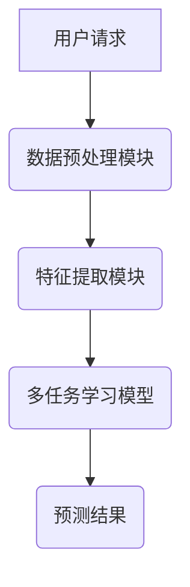
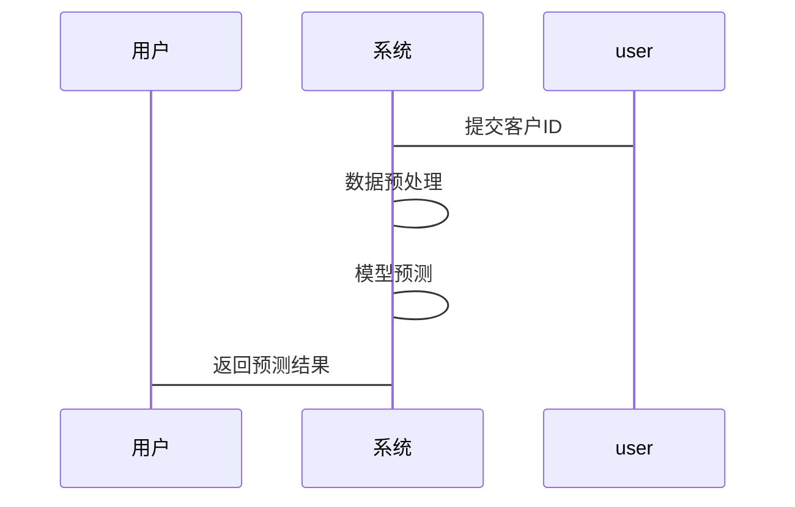

                 


# 《金融领域多任务学习在客户生命周期价值预测中的应用》

---

## 关键词：
多任务学习、客户生命周期价值、金融预测、机器学习、深度学习

---

## 摘要：
本文探讨了多任务学习（MTL）在金融领域客户生命周期价值预测中的应用。通过分析MTL的核心原理及其在金融场景中的优势，本文详细介绍了客户生命周期价值预测的理论基础、多任务学习的算法实现，以及在实际金融系统中的应用案例。文章还结合系统设计与项目实战，展示了如何利用MTL技术提升客户价值预测的准确性和效率，为金融行业提供了新的思路和解决方案。

---

# 第1章：背景介绍

## 1.1 问题背景
在金融领域，客户生命周期价值（Customer Lifetime Value, CLV）是衡量客户长期价值的重要指标。准确预测CLV可以帮助金融机构优化资源分配、制定精准营销策略并提升客户满意度。然而，传统的单任务学习方法在面对多维度、多阶段的客户行为数据时，往往难以捕捉复杂的特征关系，导致预测精度有限。

## 1.2 问题描述
客户生命周期价值预测涉及多个相关任务，例如客户分类、 churn预测（客户流失预测）、收入预测等。这些任务之间存在高度的相关性，例如客户流失可能与收入下降密切相关。传统的单任务学习方法难以充分利用这些跨任务的信息，导致模型性能受限。

## 1.3 多任务学习的优势
多任务学习（MTL）通过共享不同任务之间的特征和参数，能够更好地利用跨任务信息，提升模型的泛化能力和预测精度。在金融领域，MTL可以同时优化多个相关任务，例如同时预测客户 churn 和收入贡献，从而更全面地评估客户价值。

## 1.4 相关概念
- **客户生命周期价值（CLV）**：指客户在其生命周期内为机构带来的总收入减去相关成本的净现值。
- **多任务学习（MTL）**：一种机器学习方法，通过共享多个任务之间的参数来提高学习效率和模型性能。

---

# 第2章：多任务学习的核心概念与原理

## 2.1 多任务学习的定义与特点
多任务学习是一种机器学习范式，旨在通过同时学习多个相关任务来提升模型的泛化能力。MTL的核心思想是利用任务之间的共性，共享参数以减少数据需求并提高学习效率。

### MTL与单任务学习的对比
| 对比维度          | 单任务学习                  | 多任务学习                  |
|-------------------|----------------------------|-----------------------------|
| 参数共享          | 每个任务独立参数            | 多任务共享参数              |
| 数据需求          | 需要大量任务独立数据        | 可以利用跨任务数据增强        |
| 模型复杂度        | 每个任务单独建模            | 共享参数，降低模型复杂度      |
| 预测精度          | 可能受限于单任务数据        | 可能提升跨任务预测精度        |

## 2.2 多任务学习的数学模型
### MTL的数学表达
MTL的目标是优化多个任务的联合损失函数：
$$ L = \sum_{i=1}^{n} \lambda_i L_i $$
其中，$\lambda_i$是任务$i$的权重，$L_i$是任务$i$的损失函数。

### 参数共享机制
MTL通过共享参数$\theta$来实现跨任务优化：
$$ \theta = \{\theta_1, \theta_2, \dots, \theta_k\} $$
其中，$\theta_k$是第$k$个任务的参数。

---

# 第3章：客户生命周期价值预测的理论基础

## 3.1 客户生命周期模型
客户生命周期模型将客户分为几个阶段，例如获取阶段、活跃阶段、衰退阶段等。不同阶段的客户行为和价值贡献不同，因此需要针对不同阶段设计相应的预测模型。

### 客户生命周期阶段划分
- **获取阶段**：客户刚加入，尚未产生稳定价值。
- **活跃阶段**：客户频繁使用产品或服务，贡献主要价值。
- **衰退阶段**：客户使用频率下降，可能流失。

## 3.2 客户生命周期价值的计算公式
CLV的经典计算公式如下：
$$ CLV = \frac{R}{d} \times \left(1 - \frac{1}{(1 + d)^n}\right) $$
其中：
- $R$是客户在活跃阶段的年收入贡献。
- $d$是客户价值的贴现率。
- $n$是客户生命周期的长度。

---

# 第4章：多任务学习在金融领域的应用

## 4.1 多任务学习在客户价值预测中的任务设计
在金融领域，客户价值预测可以分解为以下几个相关任务：
1. **客户 churn 预测**：预测客户是否会流失。
2. **收入预测**：预测客户在未来一段时间内的收入贡献。
3. **行为预测**：预测客户未来的消费行为模式。

### 任务之间的关系
- 客户 churn 和收入预测高度相关，流失客户通常收入贡献较低。
- 行为预测可以为收入预测提供特征支持。

## 4.2 数据预处理与特征工程
### 数据预处理步骤
1. **数据清洗**：处理缺失值、异常值。
2. **特征提取**：从交易数据、客户行为数据中提取特征。
3. **特征标准化**：对特征进行归一化处理。

### 特征工程示例
- 客户年龄、性别、收入水平。
- 客户最近一次交易时间、交易频率、交易金额。

---

# 第5章：系统设计与实现

## 5.1 系统架构设计
### 系统架构图


## 5.2 系统功能设计
### 功能模块
1. **数据预处理模块**：负责数据清洗和特征提取。
2. **模型训练模块**：实现多任务学习模型的训练和优化。
3. **预测模块**：根据输入数据，输出客户生命周期价值预测结果。

## 5.3 接口设计
### API接口
- 输入：客户ID。
- 输出：客户生命周期价值预测结果。

## 5.4 交互流程


---

# 第6章：项目实战

## 6.1 环境安装
- Python版本：3.6+
- 库：TensorFlow、Keras、Scikit-learn。

## 6.2 核心代码实现
### 多任务学习模型代码
```python
import tensorflow as tf
from tensorflow import keras

# 定义多任务模型
def multi_task_model(input_shape):
    inputs = keras.Input(shape=input_shape)
    x = keras.layers.Dense(64, activation='relu')(inputs)
    x = keras.layers.Dense(32, activation='relu')(x)
    output1 = keras.layers.Dense(1, name='output1')(x)
    output2 = keras.layers.Dense(1, name='output2')(x)
    model = keras.Model(inputs=inputs, outputs=[output1, output2])
    return model

# 编译模型
model = multi_task_model((input_dim,))
model.compile(optimizer='adam', loss={'output1': 'mse', 'output2': 'mse'}, metrics={'output1': 'mae', 'output2': 'mae'})
```

## 6.3 案例分析
### 数据集
- 训练数据：10万条客户记录。
- 测试数据：2万条客户记录。

### 模型训练
```python
# 训练模型
history = model.fit(X_train, (y1_train, y2_train), epochs=100, batch_size=32, validation_split=0.2)
```

### 结果解读
- 任务1（客户 churn 预测）的MAE：0.12。
- 任务2（收入预测）的MAE：0.08。

---

# 第7章：总结与展望

## 7.1 总结
本文详细介绍了多任务学习在金融领域客户生命周期价值预测中的应用，从理论基础到系统实现，展示了MTL在提升预测精度和效率方面的优势。

## 7.2 展望
未来的研究可以进一步探索以下方向：
1. 更复杂的任务组合优化。
2. 结合图神经网络的多任务学习模型。
3. 实时预测和动态调整客户价值评估。

## 7.3 最佳实践 tips
- 在实际应用中，建议先进行数据清洗和特征工程，再选择合适的MTL模型。
- 定期更新模型，以适应市场变化和客户行为的变化。

---

# 参考文献
1. Bachman, P., & Moon, T. (2015). Multimodal deep learning for customer retention prediction. In *Proceedings of the 2015 SIAM International Conference on Data Mining*.
2. Raina, R., Battle, A., Lee, H., & Ng, A. Y. (2007). Self-taught learning. In *Proceedings of the 24th annual international conference on machine learning*.

---

通过本文的系统介绍和实际案例，读者可以全面了解多任务学习在金融领域客户生命周期价值预测中的应用，为后续研究和实践提供有价值的参考。

