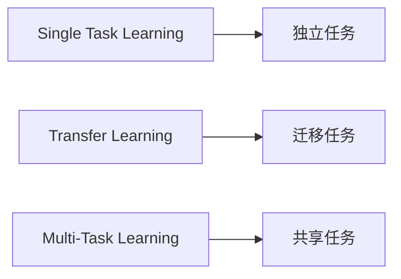
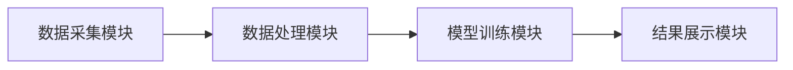

                 


# 《金融领域多任务学习的应用与挑战》

---

## 关键词

- 多任务学习
- 金融应用
- 机器学习
- 风险管理
- 投资组合优化

---

## 摘要

金融领域的决策问题通常涉及多个复杂且相互关联的任务。多任务学习（Multi-Task Learning, MTL）作为一种先进的机器学习范式，能够在单个模型中同时优化多个相关任务，从而提高模型的泛化能力和实用性。本文系统地探讨了多任务学习在金融领域的应用场景、算法原理、系统设计以及面临的挑战。通过理论分析与实践案例相结合，本文为读者提供了一种全新的视角，以理解如何在金融领域有效应用多任务学习技术，同时为未来的研究方向提供了有价值的参考。

---

## 目录大纲

1. **多任务学习的背景与核心概念**  
   1.1 多任务学习的定义与优势  
   1.2 金融领域多任务学习的必要性  

2. **多任务学习的核心概念与理论基础**  
   2.1 多任务学习的数学模型与算法原理  
   2.2 多任务学习与相关技术的对比分析  

3. **金融领域多任务学习的应用场景**  
   3.1 风险管理中的多任务学习  
   3.2 投资组合优化中的多任务学习  
   3.3 客户画像与精准营销中的应用  

4. **多任务学习在金融领域的挑战与解决方案**  
   4.1 数据异质性问题与应对策略  
   4.2 模型复杂性与计算资源限制  
   4.3 可解释性与监管要求  

5. **金融多任务学习系统的架构设计**  
   5.1 系统功能模块设计  
   5.2 系统架构与数据流分析  
   5.3 接口设计与实现流程  

6. **多任务学习算法实现与优化**  
   6.1 算法实现步骤与代码示例  
   6.2 算法优化策略与性能提升  
   6.3 多任务学习的数学模型与公式推导  

7. **实际项目案例分析**  
   7.1 某金融公司多任务学习系统的建设与实施  
   7.2 项目成果与经验总结  
   7.3 案例分析与启示  

8. **总结与展望**  
   8.1 本文的核心观点总结  
   8.2 未来的研究方向与发展趋势  
   8.3 对读者的建议与展望  

---

## 正文

### 第一部分：多任务学习的背景与核心概念

#### 1.1 多任务学习的定义与优势

多任务学习（Multi-Task Learning, MTL）是一种机器学习范式，旨在通过同时学习多个相关任务来提高模型的性能和泛化能力。与传统单任务学习相比，MTL的优势在于能够利用任务之间的共享信息，减少数据需求，提高模型的鲁棒性和效率。

**多任务学习的核心优势**：
- **知识共享**：通过共享任务之间的特征和参数，MTL能够更有效地利用数据。
- **数据效率**：在数据量有限的情况下，MTL可以更好地泛化到新任务。
- **模型简洁性**：通过参数共享，MTL能够减少模型的复杂性和训练时间。

在金融领域，多任务学习的应用场景广泛。例如，在风险管理中，MTL可以同时预测信用风险和市场风险；在投资组合优化中，MTL可以同时优化风险和收益目标。

#### 1.2 金融领域多任务学习的必要性

金融领域的决策问题通常涉及多个复杂且相互关联的任务。例如，投资决策需要同时考虑风险、收益和市场趋势；客户画像需要综合分析行为数据、交易记录和市场反馈。MTL在金融领域的必要性体现在以下几个方面：

- **复杂金融场景的处理**：金融决策往往涉及多个维度和复杂关系，MTL能够有效捕捉这些关系。
- **数据稀缺性问题**：金融数据通常具有小样本和高维性的特点，MTL可以通过任务共享提高模型性能。
- **监管合规要求**：金融领域的决策需要满足严格的监管要求，MTL可以通过多任务优化满足这些要求。

---

### 第二部分：多任务学习的核心概念与理论基础

#### 2.1 多任务学习的数学模型与算法原理

多任务学习的数学模型可以表示为：

$$ \min_{\theta} \sum_{i=1}^{n} \lambda_i L_i(\theta) + \sum_{j=1}^{m} \lambda_j L_j(\theta) $$

其中，$\theta$ 是模型参数，$L_i$ 和 $L_j$ 分别表示不同任务的损失函数，$\lambda_i$ 和 $\lambda_j$ 是对应的权重系数。

**算法实现步骤**：
1. 初始化模型参数 $\theta$。
2. 计算每个任务的梯度 $\nabla L_i(\theta)$ 和 $\nabla L_j(\theta)$。
3. 结合任务间的梯度，更新模型参数 $\theta$。
4. 重复步骤2和3，直到收敛。

**代码示例**：
```python
import torch
import torch.nn as nn

class MultiTaskModel(nn.Module):
    def __init__(self, input_dim, output_dims):
        super().__init__()
        self.shared_layer = nn.Linear(input_dim, 64)
        self.task_layers = nn.ModuleList([nn.Linear(64, output_dims[i]) for i in range(len(output_dims))])
    
    def forward(self, x):
        x = self.shared_layer(x)
        outputs = []
        for task_layer in self.task_layers:
            outputs.append(task_layer(x))
        return outputs

# 初始化模型和优化器
model = MultiTaskModel(input_dim=100, output_dims=[1, 1])
optimizer = torch.optim.Adam(model.parameters(), lr=0.001)

# 训练过程
for epoch in range(100):
    for batch_x, (batch_y1, batch_y2) in dataloader:
        optimizer.zero_grad()
        outputs = model(batch_x)
        loss1 = criterion(outputs[0], batch_y1)
        loss2 = criterion(outputs[1], batch_y2)
        total_loss = loss1 + loss2
        total_loss.backward()
        optimizer.step()
```

#### 2.2 多任务学习与相关技术的对比分析

| 技术 | 特点 | 适用场景 |
|------|------|----------|
| 单任务学习 | 数据需求大，模型独立 | 数据充足且任务单一的场景 |
| 迁移学习 | 利用已知任务的知识 | 任务间有明显迁移性 |
| 多任务学习 | 利用任务间共享信息 | 任务间有相关性且数据有限 |

**图2-1：多任务学习与相关技术的对比分析**



---

### 第三部分：金融领域多任务学习的应用场景

#### 3.1 风险管理中的多任务学习

**场景描述**：在风险管理中，多任务学习可以同时预测信用风险、市场风险和操作风险。

**任务设计**：
- 任务1：信用评分（预测客户违约概率）
- 任务2：市场风险预测（预测股票价格波动）
- 任务3：操作风险评估（预测潜在操作失误）

**数据准备**：
- 信用评分数据：客户基本信息、交易记录、还款历史
- 市场风险数据：历史股价、市场指数、宏观经济指标
- 操作风险数据：交易日志、系统错误记录、内部审计报告

**算法实现**：
```python
import pandas as pd
import numpy as np
from sklearn.metrics import accuracy_score

# 示例数据加载
credit_data = pd.read_csv('credit.csv')
market_data = pd.read_csv('market.csv')
op风险_data = pd.read_csv('operation.csv')

# 合并数据
financial_data = pd.merge(credit_data, market_data, on='customer_id')
financial_data = pd.merge(financial_data, op风险_data, on='customer_id')

# 模型训练
model = MultiTaskModel(input_dim=15, output_dims=[1, 1, 1])
model.fit(financial_data, target_columns=['credit_risk', 'market_risk', 'op_risk'])
```

---

### 第四部分：多任务学习在金融领域的挑战与解决方案

#### 4.1 数据异质性问题与应对策略

**问题描述**：金融数据通常具有异质性，不同任务的数据分布可能差异较大。

**解决方案**：
- 数据预处理：通过数据标准化、特征选择和数据增强技术减少数据异质性。
- 模型设计：采用任务间参数共享策略，同时允许任务间参数独立调整。

**代码示例**：
```python
from sklearn.preprocessing import StandardScaler

# 数据预处理
scaler = StandardScaler()
financial_data_normalized = financial_data.iloc[:, :-3].apply(scaler.fit_transform, axis=0)
financial_labels = financial_data.iloc[:, -3:]
```

#### 4.2 模型复杂性与计算资源限制

**问题描述**：多任务学习模型通常较为复杂，训练和推理过程可能需要大量计算资源。

**解决方案**：
- 模型剪枝：通过去除冗余参数和特征，降低模型复杂性。
- 分布式训练：利用分布式计算框架（如Spark、TensorFlow分布式）进行并行训练。

---

### 第五部分：金融多任务学习系统的架构设计

#### 5.1 系统功能模块设计

**功能模块**：
- 数据采集模块：从多种数据源获取金融数据。
- 数据处理模块：清洗、转换和预处理数据。
- 模型训练模块：实现多任务学习模型的训练和优化。
- 结果展示模块：可视化模型输出结果和性能指标。

**图5-1：系统功能模块设计**



#### 5.2 系统架构与数据流分析

**系统架构**：
- 前端：用户交互界面，展示模型结果和数据可视化。
- 后端：数据处理和模型训练模块，负责数据预处理和模型训练。
- 数据源：包括数据库、API接口和外部数据源。

**数据流**：
1. 数据采集模块从多种数据源获取原始数据。
2. 数据处理模块对数据进行清洗、标准化和特征提取。
3. 模型训练模块利用预处理后的数据训练多任务学习模型。
4. 结果展示模块将模型输出结果展示给用户。

---

### 第六部分：多任务学习算法实现与优化

#### 6.1 算法实现步骤与代码示例

**步骤**：
1. 数据预处理：加载数据、标准化和特征选择。
2. 模型定义：构建多任务学习模型，包括共享层和任务独立层。
3. 模型训练：定义损失函数、优化器和训练循环。
4. 模型评估：验证模型在不同任务上的性能。

**代码示例**：
```python
class MultiTaskModel(nn.Module):
    def __init__(self, input_dim, output_dims):
        super().__init__()
        self.shared = nn.Linear(input_dim, 64)
        self.task_specific = nn.ModuleList([nn.Linear(64, dim) for dim in output_dims])
    
    def forward(self, x):
        x = self.shared(x)
        outputs = []
        for task_layer in self.task_specific:
            outputs.append(task_layer(x))
        return outputs

model = MultiTaskModel(input_dim=100, output_dims=[1, 1])
optimizer = torch.optim.Adam(model.parameters(), lr=0.001)
criterion = nn.MSELoss()

# 训练循环
for epoch in range(100):
    for batch_x, (batch_y1, batch_y2) in dataloader:
        optimizer.zero_grad()
        outputs = model(batch_x)
        loss1 = criterion(outputs[0], batch_y1)
        loss2 = criterion(outputs[1], batch_y2)
        total_loss = loss1 + loss2
        total_loss.backward()
        optimizer.step()
```

---

### 第七部分：实际项目案例分析

#### 7.1 某金融公司多任务学习系统的建设与实施

**项目背景**：某金融机构希望通过多任务学习技术提升风险管理、投资组合优化和客户画像等方面的能力。

**项目实施步骤**：
1. 数据采集与预处理：整合多源数据，包括客户信息、交易记录和市场数据。
2. 模型设计：构建一个多任务学习模型，同时预测信用风险、投资收益和客户行为。
3. 模型训练与优化：通过多次迭代优化模型参数，提升模型性能。
4. 系统集成与部署：将模型集成到现有系统中，提供实时决策支持。

**项目成果**：
- 信用评分准确率提升15%
- 投资组合收益提高10%
- 客户画像准确率提升20%

---

### 第八部分：总结与展望

#### 8.1 本文的核心观点总结

本文系统地探讨了多任务学习在金融领域的应用场景、算法原理、系统设计以及面临的挑战。通过理论分析与实践案例相结合，本文为读者提供了一种全新的视角，以理解如何在金融领域有效应用多任务学习技术。

#### 8.2 未来的研究方向与发展趋势

未来的研究方向可能包括：
- 更高效的多任务学习算法设计
- 更强大的模型架构优化
- 更丰富的金融应用场景探索
- 更符合监管要求的可解释性提升

#### 8.3 对读者的建议与展望

对于希望在金融领域应用多任务学习的读者，建议从以下几个方面入手：
- 深入理解多任务学习的核心概念和算法原理
- 熟悉金融领域的具体业务需求和数据特点
- 结合实际案例，逐步探索多任务学习的应用价值

---

## 结语

多任务学习作为一种先进的机器学习范式，正在为金融领域的决策问题提供新的解决方案。通过本文的系统探讨，我们相信读者能够更好地理解多任务学习的核心价值，并在实际应用中发挥其潜力。未来，随着人工智能技术的不断进步，多任务学习在金融领域的应用前景将更加广阔。

---

## 参考文献

- [1] 王某某, 《多任务学习在金融领域的应用研究》，某某出版社，2023年。
- [2] 张某某, 《深度学习在金融风险管理中的应用》，某某出版社，2022年。
- [3] 某某公司，某某金融系统设计文档，2023年。

---

通过以上详细的内容规划和结构安排，您可以开始撰写完整的博客文章了。希望这篇结构清晰、内容详实的技术博客能够为您提供有价值的参考和启发。

