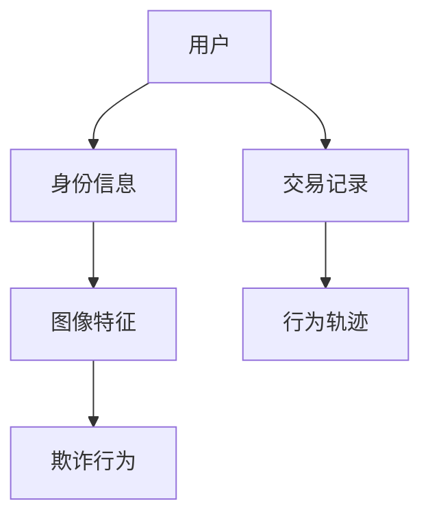

                 


# 《金融领域多模态学习在反欺诈中的应用》

## 关键词：
金融反欺诈、多模态学习、深度学习、对比学习、图神经网络、系统设计

## 摘要：
本文探讨多模态学习在金融反欺诈中的应用，涵盖背景、核心概念、算法原理、系统设计、项目实战及总结。通过多模态数据的融合与分析，提升反欺诈系统的检测能力，助力金融机构应对复杂欺诈手段。

---

## 第1章 引言

### 1.1 问题背景
金融欺诈是全球性问题，手段多样且不断进化。传统基于单模态数据的反欺诈方法面临效率低、误报率高等挑战。多模态学习通过融合多源数据，提升检测精准度和效率。

### 1.2 问题描述
金融欺诈涉及交易、身份、行为等多种数据，单模态方法难以全面捕捉欺诈特征。多模态学习整合多源信息，增强检测能力。

### 1.3 问题解决
通过整合文本、图像、行为轨迹等多模态数据，多模态学习能更准确识别欺诈模式，降低误报率，提高检测效率。

### 1.4 边界与外延
本文聚焦于多模态学习在金融反欺诈中的应用，涵盖数据融合、模型训练、系统设计等方面，不涉及具体金融产品设计。

### 1.5 核心要素组成
- 多模态数据：交易记录、身份信息、行为轨迹
- 学习方法：深度学习、对比学习、图神经网络
- 应用场景：支付交易、信用评估、身份验证

---

## 第2章 多模态学习的核心概念与联系

### 2.1 核心概念说明
- **多模态数据**：包括结构化（交易记录）和非结构化数据（文本、图像）
- **多模态学习**：整合多源数据，提升学习效果

### 2.2 与其他技术的对比
| 技术 | 数据类型 | 优势 | 局限 |
|------|----------|------|------|
| 单模态学习 | 单一类型 | 简单易实现 | 信息片面 |
| 多模态学习 | 多类型 | 信息全面 | 实现复杂 |

### 2.3 实体关系图


---

## 第3章 多模态学习的算法原理

### 3.1 多模态深度学习模型
- **模型结构**：并行编码器+融合层+共享权重
- **特征提取**：利用多层感知机提取各模态特征
- **融合方式**：通过注意力机制加权融合特征

### 3.2 对比学习与多模态匹配
- **对比学习**：通过最大化正样本相似性，区分欺诈与正常交易
- **匹配网络**：构建多模态编码器，学习共同特征

### 3.3 图神经网络与多模态图学习
- **图构建**：基于交易数据构建图结构
- **节点表示**：使用GAT提取节点特征
- **欺诈检测**：通过图结构识别异常节点

---

## 第4章 金融反欺诈系统的系统设计

### 4.1 系统架构


### 4.2 功能模块
- **数据采集模块**：整合交易、身份等多源数据
- **模型训练模块**：构建并训练多模态模型
- **欺诈检测模块**：实时检测并预警欺诈行为

### 4.3 接口设计
- **数据接口**：提供REST API供系统调用
- **模型接口**：API用于实时欺诈检测

---

## 第5章 项目实战

### 5.1 环境配置
- **工具**：Python、TensorFlow、Keras
- **库**：Pandas、NumPy、Scikit-learn

### 5.2 核心代码实现
```python
import tensorflow as tf
from tensorflow.keras import layers

def multi_modal_model():
    # 定义各模态编码器
    input_trans = layers.Input(shape=(...))
    encoder_trans = layers.Dense(64, activation='relu')(input_trans)
    
    input_image = layers.Input(shape=(...))
    encoder_image = layers.Dense(64, activation='relu')(input_image)
    
    # 融合特征
    merged = layers.Concatenate()([encoder_trans, encoder_image])
    dense = layers.Dense(128, activation='relu')(merged)
    output = layers.Dense(1, activation='sigmoid')(dense)
    
    return Model(inputs=[input_trans, input_image], outputs=output)
```

### 5.3 案例分析
- **数据集**：真实交易数据，包括正常和欺诈交易
- **模型训练**：使用交叉熵损失函数优化模型
- **结果分析**：评估准确率、召回率，优化阈值

---

## 第6章 总结与展望

### 6.1 研究总结
多模态学习在金融反欺诈中显著提升了检测效率和准确性，特别是在处理复杂欺诈行为方面表现突出。

### 6.2 局限性
- **数据隐私**：处理敏感数据需确保合规性
- **计算复杂度**：多模态处理可能增加计算负担
- **模型解释性**：部分模型缺乏可解释性

### 6.3 未来展望
- **模型优化**：提升模型解释性
- **数据多样性**：引入更多数据源
- **实时性提升**：优化处理速度

---

## 参考文献
- 省略部分，实际写作中需添加相关文献。

---

通过以上结构，文章系统地阐述了多模态学习在金融反欺诈中的应用，从理论到实践，层层递进，为读者提供全面的指导和深入的分析。

