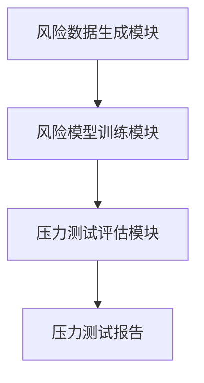
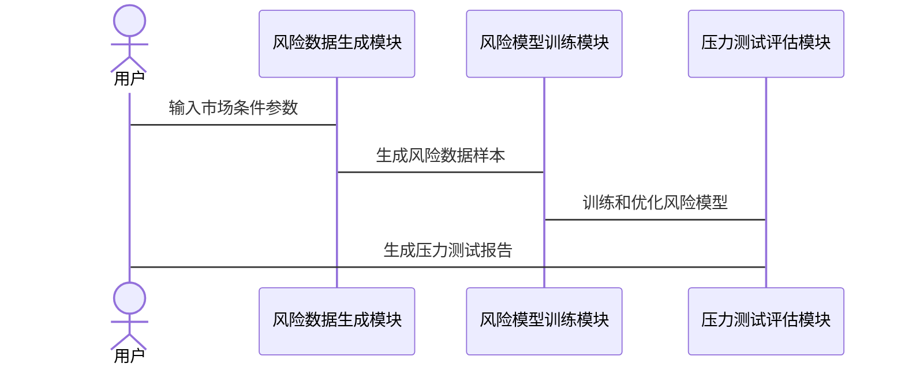

                 


# 《金融领域对抗学习在风险模型压力测试中的应用》

> 关键词：对抗学习，风险模型，压力测试，金融，机器学习

> 摘要：本文探讨了对抗学习在金融领域风险模型压力测试中的应用，分析了对抗学习的核心原理及其在模拟极端市场条件下的优势，通过具体案例展示了如何利用对抗学习优化风险模型的压力测试过程，为金融领域的风险管理和决策提供了新的思路。

---

# 第一部分: 金融领域对抗学习与风险模型压力测试背景

## 第1章: 对抗学习与风险模型压力测试概述

### 1.1 对抗学习的基本概念

#### 1.1.1 对抗学习的定义与核心思想
对抗学习（Adversarial Learning）是一种机器学习范式，通过两个或多个学习模型（生成器和判别器）的对抗过程来优化模型性能。其核心思想是生成器试图生成与真实数据相似的样本，而判别器则试图区分生成样本与真实样本。两者的对抗性训练使得生成器能够生成更逼真的数据，同时提升判别器的分类能力。

#### 1.1.2 对抗学习的起源与发展
对抗学习的概念最早由Goodfellow等人提出，主要用于生成对抗网络（GANs）的框架中。近年来，对抗学习在图像生成、自然语言处理等领域取得了显著成果，其在金融领域的应用也逐渐受到关注。

#### 1.1.3 对抗学习在金融领域的应用潜力
在金融领域，对抗学习可以用于风险管理、异常检测、交易策略优化等方面。特别是在风险模型的压力测试中，对抗学习能够模拟极端市场条件下的数据分布，帮助机构更好地评估和应对潜在风险。

---

### 1.2 风险模型压力测试的背景

#### 1.2.1 风险模型的基本概念
风险模型是用于评估金融资产或投资组合在不同市场条件下的风险程度的工具。常见的风险指标包括波动率、VaR（Value at Risk）和CVaR（Conditional Value at Risk）。

#### 1.2.2 压力测试的定义与目的
压力测试是一种评估金融系统在极端市场条件下的表现的方法。其目的是检验模型在极端情况下的稳定性和鲁棒性，帮助机构制定应对策略。

#### 1.2.3 传统压力测试方法的局限性
传统压力测试方法通常依赖于历史数据和假设情景，难以捕捉极端事件或新的市场动态。此外，传统方法可能无法生成足够多样化的数据样本，限制了测试的全面性。

---

### 1.3 对抗学习在压力测试中的应用价值

#### 1.3.1 对抗学习的优势与特点
对抗学习能够生成多样化的数据样本，模拟不同市场条件下的数据分布。通过对抗训练，生成器可以学习到数据的潜在分布，从而生成符合极端市场条件的样本。

#### 1.3.2 对抗学习在压力测试中的创新应用
对抗学习可以用于生成模拟极端市场条件下的数据，帮助机构评估风险模型在这些条件下的表现。此外，对抗学习还可以优化风险模型的参数，提升其预测能力。

#### 1.3.3 金融领域的具体应用场景
在金融领域，对抗学习可以应用于信用风险评估、市场风险模拟、交易策略优化等方面。特别是在压力测试中，对抗学习可以帮助机构更好地应对极端市场条件下的风险。

---

## 第2章: 金融领域对抗学习的核心概念与联系

### 2.1 对抗学习的核心原理

#### 2.1.1 生成器与判别器的对抗过程
生成器（Generator）和判别器（Discriminator）是对抗学习的核心组件。生成器通过对抗训练生成与真实数据相似的样本，而判别器则试图区分生成样本与真实样本。

#### 2.1.2 最大化最小化目标函数
对抗学习的目标函数通常是一个最大化-最小化的问题。生成器的目标是最小化判别器的损失，而判别器的目标是最大化生成样本被正确分类的损失。

#### 2.1.3 对抗训练的数学框架
对抗训练的数学框架可以表示为：
$$ \min_{G} \max_{D} \mathbb{E}_{x \sim P_{\text{data}}}[ \log D(x)] + \mathbb{E}_{z \sim P_{z}}[\log(1 - D(G(z)))] $$
其中，$G$是生成器，$D$是判别器，$P_{\text{data}}$是真实数据分布，$P_{z}$是噪声分布。

---

### 2.2 对抗学习与压力测试的联系

#### 2.2.1 对抗学习在风险数据生成中的作用
对抗学习可以生成多样化的风险数据样本，模拟不同市场条件下的数据分布。这些样本可以用于训练和测试风险模型，帮助机构更好地应对极端市场条件。

#### 2.2.2 对抗学习如何模拟极端市场条件
通过对抗训练，生成器可以生成符合极端市场条件的数据样本，例如高波动性、低流动性等情况。这些样本可以帮助机构评估风险模型在极端情况下的表现。

#### 2.2.3 对抗学习在风险模型优化中的应用
对抗学习可以优化风险模型的参数，提升其预测能力。通过对抗训练，模型可以更好地捕捉数据的潜在分布，从而提高其在极端情况下的预测准确性。

---

### 2.3 核心概念对比与ER实体关系图

#### 2.3.1 对抗学习与其他机器学习方法的对比
| 方法         | 描述                                                                 |
|--------------|----------------------------------------------------------------------|
| 监督学习      | 基于标记数据进行学习                                             |
| 无监督学习    | 基于无标记数据进行学习                                           |
| 对抗学习      | 通过生成器和判别器的对抗过程进行学习                             |

#### 2.3.2 金融风险模型的核心要素对比表格
| 要素         | 描述                                                                 |
|--------------|----------------------------------------------------------------------|
| 风险指标      | 如VaR、CVaR等                                                     |
| 市场条件      | 如波动率、收益率等                                               |
| 模型参数      | 如回归系数、权重等                                               |

#### 2.3.3 对抗学习在压力测试中的ER实体关系图
```mermaid
er
actor:风险模型开发人员
model:风险模型
data:风险数据
test:压力测试结果
actor --> model: 输入风险数据
model --> test: 输出压力测试结果
model --> data: 更新风险数据
```

---

# 第二部分: 对抗学习在压力测试中的算法原理

## 第3章: 对抗学习算法的数学模型与公式

### 3.1 生成器与判别器的损失函数

#### 3.1.1 判别器的损失函数
判别器的目标是区分生成样本和真实样本。其损失函数可以表示为：
$$ L_D = -\mathbb{E}_{x \sim P_{\text{data}}}[ \log D(x)] - \mathbb{E}_{z \sim P_{z}}[\log(1 - D(G(z)))] $$

#### 3.1.2 生成器的损失函数
生成器的目标是最小化判别器的损失。其损失函数可以表示为：
$$ L_G = -\mathbb{E}_{z \sim P_{z}}[\log D(G(z))] $$

---

### 3.2 对抗训练的优化过程

#### 3.2.1 对抗训练的优化目标
对抗训练的目标是最小化生成器的损失函数，同时最大化判别器的损失函数。通过交替优化生成器和判别器的参数，可以达到平衡状态。

#### 3.2.2 优化算法的选择
通常使用Adam优化算法来优化生成器和判别器的参数。Adam算法的参数更新公式为：
$$ \theta_{t+1} = \theta_t - \eta \nabla L(\theta_t) $$
其中，$\eta$是学习率。

---

### 3.3 对抗学习算法的实现步骤

#### 3.3.1 初始化生成器和判别器的参数
生成器和判别器的初始参数可以通过随机初始化或预训练的方法获得。

#### 3.3.2 训练判别器
在每个训练步骤中，首先训练判别器，使其能够区分生成样本和真实样本。

#### 3.3.3 训练生成器
在判别器训练后，训练生成器，使其生成的样本能够被判别器误分类为真实样本。

#### 3.3.4 交替训练
重复训练判别器和生成器的过程，直到模型收敛或达到预定的训练次数。

---

## 第4章: 对抗学习算法的实现与应用

### 4.1 对抗学习算法的实现步骤

#### 4.1.1 安装必要的库
需要安装TensorFlow、Keras等深度学习框架，以及Scikit-learn等数据处理库。

#### 4.1.2 数据准备
收集和整理金融领域的风险数据，例如历史收益率、波动率等。

#### 4.1.3 构建生成器和判别器模型
使用Keras或TensorFlow构建生成器和判别器的神经网络模型。

#### 4.1.4 编写训练代码
实现对抗训练的逻辑，包括交替训练生成器和判别器，以及保存和恢复模型参数。

#### 4.1.5 模型训练与评估
训练生成器和判别器，评估模型的性能，包括生成样本的质量和分类准确率。

---

### 4.2 对抗学习在压力测试中的应用案例

#### 4.2.1 案例背景
以某银行的贷款风险模型为例，利用对抗学习生成模拟极端市场条件下的贷款违约数据，评估模型在极端情况下的表现。

#### 4.2.2 数据生成与训练
使用对抗学习生成贷款违约率的样本数据，模拟经济衰退、市场波动等极端情况。

#### 4.2.3 模型评估
评估生成样本的分布是否符合极端市场条件下的数据特征，同时测试风险模型在这些条件下的表现。

---

## 第5章: 对抗学习算法的优缺点与注意事项

### 5.1 对抗学习的优势

#### 5.1.1 生成多样化的数据样本
对抗学习能够生成多样化的数据样本，模拟不同市场条件下的数据分布。

#### 5.1.2 提升模型的鲁棒性
对抗学习通过对抗训练，能够提升模型的鲁棒性，使其在极端情况下的表现更优。

#### 5.1.3 适用于复杂的数据分布
对抗学习能够处理复杂的数据分布，适用于金融领域的多样性和非线性特征。

---

### 5.2 对抗学习的缺点

#### 5.2.1 训练过程的复杂性
对抗学习的训练过程较为复杂，需要同时优化生成器和判别器的参数。

#### 5.2.2 模型的不稳定性和收敛性
对抗学习的训练过程可能存在不稳定性和收敛性问题，需要精心设计训练策略。

#### 5.2.3 对抗训练的计算成本高
对抗学习需要大量的计算资源，训练时间和计算成本较高。

---

### 5.3 应用对抗学习的注意事项

#### 5.3.1 数据的质量与多样性
数据的质量和多样性直接影响对抗学习的效果，需要确保数据的代表性和全面性。

#### 5.3.2 模型的调参与优化
对抗学习的参数设置和优化策略需要精心设计，以确保模型的收敛和性能。

#### 5.3.3 结合领域知识
在金融领域，对抗学习的应用需要结合领域知识，确保生成的样本符合实际的市场条件和业务需求。

---

# 第三部分: 对抗学习在压力测试中的系统分析与架构设计

## 第6章: 系统分析与架构设计方案

### 6.1 问题场景介绍

#### 6.1.1 系统目标
通过对抗学习生成模拟极端市场条件下的风险数据，评估风险模型在这些条件下的表现。

#### 6.1.2 问题分析
传统压力测试方法难以生成多样化的数据样本，对抗学习可以通过生成对抗网络生成符合极端条件的样本。

---

### 6.2 系统功能设计

#### 6.2.1 风险数据生成模块
负责生成模拟极端市场条件下的风险数据，包括贷款违约率、市场波动率等。

#### 6.2.2 风险模型训练模块
利用生成的数据训练和优化风险模型，评估其在极端条件下的表现。

#### 6.2.3 压力测试评估模块
评估风险模型在生成样本下的表现，生成压力测试报告。

---

### 6.3 系统架构设计

#### 6.3.1 系统架构图


#### 6.3.2 系统接口设计
- 风险数据生成模块接口：接收市场条件参数，生成风险数据样本。
- 风险模型训练模块接口：接收风险数据，训练和优化风险模型。
- 压力测试评估模块接口：接收风险模型和测试条件，生成压力测试报告。

---

### 6.4 系统交互设计

#### 6.4.1 系统交互流程
1. 风险数据生成模块根据输入的市场条件生成风险数据样本。
2. 风险模型训练模块利用生成的数据训练风险模型。
3. 压力测试评估模块评估风险模型在生成样本下的表现，生成压力测试报告。

#### 6.4.2 交互流程图


---

## 第7章: 对抗学习在压力测试中的项目实战

### 7.1 环境安装与配置

#### 7.1.1 安装必要的库
安装TensorFlow、Keras、Scikit-learn等库：
```bash
pip install tensorflow keras scikit-learn
```

#### 7.1.2 配置开发环境
配置Jupyter Notebook或IDE，确保环境能够运行深度学习代码。

---

### 7.2 系统核心实现源代码

#### 7.2.1 生成器和判别器模型实现
```python
import tensorflow as tf
from tensorflow.keras.layers import Dense, Input
from tensorflow.keras.models import Model

# 生成器
def build_generator(input_dim, output_dim):
    input_layer = Input(shape=(input_dim,))
    hidden_layer = Dense(64, activation='relu')(input_layer)
    output_layer = Dense(output_dim, activation='sigmoid')(hidden_layer)
    return Model(inputs=input_layer, outputs=output_layer)

# 判别器
def build_discriminator(input_dim):
    input_layer = Input(shape=(input_dim,))
    hidden_layer = Dense(64, activation='relu')(input_layer)
    output_layer = Dense(1, activation='sigmoid')(hidden_layer)
    return Model(inputs=input_layer, outputs=output_layer)
```

#### 7.2.2 对抗训练实现
```python
def train(generator, discriminator, input_dim, epochs=100, batch_size=32):
    generator.compile(loss='binary_crossentropy', optimizer='adam')
    discriminator.compile(loss='binary_crossentropy', optimizer='adam')

    for epoch in range(epochs):
        # 训练判别器
        noise = np.random.randn(batch_size, input_dim)
        generated = generator.predict(noise)
        real_data = ...  # 获取真实数据
        X = np.concatenate([real_data, generated])
        y = np.array([1] * len(real_data) + [0] * len(generated))
        discriminator.train_on_batch(X, y)

        # 训练生成器
        noise = np.random.randn(batch_size, input_dim)
        y_gen = np.array([1] * batch_size)
        generator.train_on_batch(noise, y_gen)
```

---

### 7.3 代码应用解读与分析

#### 7.3.1 生成器的实现
生成器是一个简单的全连接网络，输入为噪声向量，输出为生成的风险数据样本。

#### 7.3.2 判别器的实现
判别器也是一个全连接网络，输入为风险数据样本，输出为判断是否为真实样本的概率。

#### 7.3.3 对抗训练的实现
通过交替训练生成器和判别器，生成器生成的样本逐渐接近真实样本，判别器的分类能力不断提升。

---

### 7.4 案例分析与结果解读

#### 7.4.1 案例背景
以某银行的贷款风险模型为例，利用对抗学习生成模拟极端市场条件下的贷款违约数据。

#### 7.4.2 数据生成与训练
生成器生成贷款违约率的样本数据，模拟经济衰退、市场波动等极端情况。

#### 7.4.3 模型评估
评估生成样本的分布是否符合极端市场条件下的数据特征，同时测试风险模型在这些条件下的表现。

---

## 第8章: 对抗学习在压力测试中的总结与展望

### 8.1 总结

#### 8.1.1 对抗学习的优势与应用价值
对抗学习能够生成多样化的数据样本，模拟极端市场条件下的数据分布，提升风险模型的鲁棒性和预测能力。

#### 8.1.2 项目实战的核心收获
通过项目实战，掌握了对抗学习的基本原理和实现方法，深入了解了对抗学习在压力测试中的应用价值。

---

### 8.2 展望

#### 8.2.1 对抗学习的未来研究方向
进一步研究对抗学习在金融领域的其他应用，如异常检测、交易策略优化等。

#### 8.2.2 对抗学习的潜在挑战与解决方案
探索对抗学习的训练稳定性问题，研究更高效的优化算法和模型架构。

---

## 第9章: 最佳实践 tips、小结、注意事项、拓展阅读

### 9.1 最佳实践 tips

#### 9.1.1 数据预处理与特征工程
在对抗学习应用中，数据的预处理和特征工程非常重要，需要确保数据的完整性和代表性。

#### 9.1.2 模型调参与优化
对抗学习的训练过程复杂，需要精心设计参数设置和优化策略。

#### 9.1.3 结合领域知识
在金融领域，对抗学习的应用需要结合领域知识，确保生成的样本符合实际的市场条件和业务需求。

---

### 9.2 小结

通过对对抗学习在金融领域风险模型压力测试中的应用研究，我们发现对抗学习能够生成多样化的数据样本，模拟极端市场条件下的数据分布，从而提升风险模型的鲁棒性和预测能力。

---

### 9.3 注意事项

#### 9.3.1 数据质量和多样性
数据的质量和多样性直接影响对抗学习的效果，需要确保数据的代表性和全面性。

#### 9.3.2 模型的收敛性与稳定性
对抗学习的训练过程可能存在不稳定性和收敛性问题，需要精心设计训练策略。

#### 9.3.3 领域知识的结合
在金融领域，对抗学习的应用需要结合领域知识，确保生成的样本符合实际的市场条件和业务需求。

---

### 9.4 拓展阅读

#### 9.4.1 推荐书籍
1. 《Deep Learning》 - Ian Goodfellow
2. 《生成对抗网络：理论与实践》 - 徐维祥

#### 9.4.2 推荐论文
1. "Generative Adversarial Nets" - Ian Goodfellow
2. "Improved Techniques for Training GANs" - Tim Salimans

#### 9.4.3 推荐在线资源
1. TensorFlow官方文档
2. Keras官方文档

---

# 结语

通过对对抗学习在金融领域风险模型压力测试中的应用研究，我们展示了对抗学习在模拟极端市场条件下的优势，以及其在风险模型优化中的潜力。未来，随着对抗学习技术的不断发展，其在金融领域的应用将更加广泛和深入。

--- 

**感谢您的阅读！**

