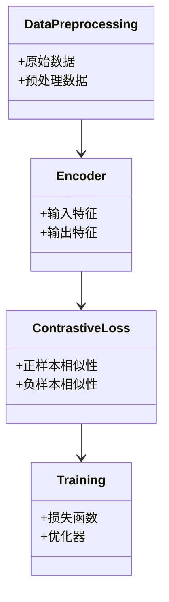
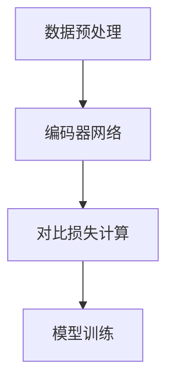
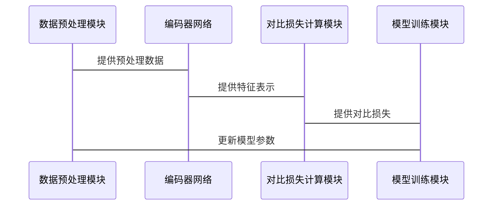

                 


# 《金融领域对比学习的探索与实践》

---

## 关键词
对比学习, 金融应用, 深度学习, 对比损失函数, 金融数据

---

## 摘要
本文探讨对比学习在金融领域的应用，从理论到实践，详细分析对比学习的核心概念、算法原理、系统架构，并结合实际案例进行深入解读。文章旨在为金融领域的技术从业者提供理论指导和实践参考，帮助他们更好地理解和应用对比学习技术。

---

# 第一部分: 金融领域对比学习的背景与概念

## 第1章: 对比学习的基本概念与背景

### 1.1 对比学习的定义与特点
对比学习是一种通过比较不同数据点或样本之间的关系来学习特征表示的方法。其核心思想是通过最大化相似样本之间的相似性，同时最小化不相似样本之间的相似性，从而增强模型对数据分布的理解能力。

#### 1.1.1 对比学习的基本概念
- 对比学习通过设计对比损失函数，将相似样本的表示拉近，将不相似样本的表示推远。
- 对比学习具有样本依赖性，需要成对的样本进行对比。

#### 1.1.2 对比学习的核心特点
- **对比性**：通过对比损失函数，直接优化样本之间的关系。
- **自监督性**：对比学习通常采用自监督学习框架，无需大量标注数据。
- **泛化能力**：通过对比增强特征表示，提升模型在金融领域中的泛化能力。

#### 1.1.3 对比学习与传统机器学习的区别
- **监督学习**：需要大量标注数据，而对比学习可以利用未标注数据。
- **无监督学习**：对比学习结合了无监督学习的特性，但通过对比损失函数引入了监督信号。

### 1.2 金融领域中的对比学习
#### 1.2.1 金融领域的数据特点
- **高维性**：金融数据通常包含大量特征，如股票价格、交易量等。
- **时间依赖性**：金融数据往往具有很强的时间序列特性。
- **噪声多**：金融数据中常存在噪声和异常值。

#### 1.2.2 对比学习在金融中的应用背景
- **金融风险预警**：通过对比学习识别异常交易模式。
- **股票价格预测**：利用对比学习捕捉相似股票的走势。
- **客户行为分析**：通过对比学习识别客户的交易模式。

#### 1.2.3 金融领域对比学习的挑战与机遇
- **挑战**：金融数据的高维性和复杂性增加了对比学习的难度。
- **机遇**：对比学习可以通过自监督方式减少对标注数据的依赖，降低金融分析的成本。

### 1.3 对比学习与其他学习范式的对比
#### 1.3.1 监督学习的对比
- 监督学习需要大量标注数据，而对比学习可以利用未标注数据。
- 对比学习通常采用自监督学习框架，可以减少对标注数据的依赖。

#### 1.3.2 无监督学习的对比
- 无监督学习没有标注数据，而对比学习引入了对比损失函数，通过样本之间的关系引入监督信号。

#### 1.3.3 半监督学习的对比
- 半监督学习结合了少量标注数据和大量未标注数据，对比学习可以通过对比损失函数进一步优化模型性能。

---

# 第二部分: 对比学习的核心概念与数学原理

## 第2章: 对比学习的数学模型与原理

### 2.1 对比损失函数的数学推导
#### 2.1.1 对比损失函数的定义
对比损失函数是对比学习的核心，通常用于衡量正样本和负样本之间的相似性。对比损失函数可以表示为：

$$ L = -\log\left(\frac{e^{s_{i,j}}}{e^{s_{i,k}} + e^{s_{j,k}}}\right) $$

其中，$s_{i,j}$表示样本i和样本j之间的相似性，$s_{j,k}$表示样本j和样本k之间的相似性。

#### 2.1.2 信息论视角下的对比损失
对比损失函数可以通过信息论中的KL散度和交叉熵进行推导。KL散度用于衡量两个概率分布之间的差异，交叉熵则是KL散度的一种形式。

#### 2.1.3 对比损失的优化过程
对比损失的优化过程可以通过梯度下降等方法进行，目标是最小化对比损失函数。

### 2.2 对比学习的正则化方法
#### 2.2.1 知识蒸馏的原理
知识蒸馏是一种通过教师模型向学生模型传递知识的方法，可以用于对比学习中的模型优化。

#### 2.2.2 对比正则化的作用
对比正则化通过引入正则化项，进一步优化模型的特征表示。

#### 2.2.3 跨模态对比的实现
跨模态对比可以通过将不同模态的数据进行对比，例如将文本和图像进行对比。

### 2.3 对比学习的网络结构
#### 2.3.1 编码器网络的设计
编码器网络通常采用深度神经网络，用于将输入数据映射到低维特征空间。

#### 2.3.2 对比损失网络的优化
对比损失网络的优化可以通过反向传播算法进行，目标是最小化对比损失函数。

#### 2.3.3 多任务对比学习的架构
多任务对比学习可以通过共享特征提取部分，同时优化多个任务的对比损失。

---

# 第三部分: 金融领域对比学习的算法实现

## 第3章: 对比学习算法的实现与优化

### 3.1 对比学习算法的实现框架
#### 3.1.1 数据预处理与增强
数据预处理包括归一化、标准化等，数据增强可以通过旋转、裁剪等方式进行。

#### 3.1.2 对比损失的计算
对比损失的计算可以通过预训练的编码器网络输出特征，然后计算正样本和负样本之间的相似性。

#### 3.1.3 网络模型的训练
网络模型的训练可以通过随机梯度下降等方法进行，目标是最小化对比损失函数。

### 3.2 基于深度学习的对比学习实现
#### 3.2.1 使用ResNet作为编码器
ResNet是一种常用的深度残差网络，可以作为对比学习的编码器网络。

#### 3.2.2 对比损失的优化策略
对比损失的优化策略包括调整温度参数、引入权重等方法。

#### 3.2.3 模型的训练与调优
模型的训练与调优可以通过调整学习率、批量大小等超参数进行。

### 3.3 对比学习在金融时间序列中的应用
#### 3.3.1 时间序列数据的对比学习
时间序列数据可以通过滑动窗口等方法进行对比学习。

#### 3.3.2 LSTM网络的对比增强
LSTM网络可以通过对比学习进行优化，例如通过对比损失函数优化LSTM的输出。

#### 3.3.3 时间序列对比的案例分析
通过对比学习分析金融时间序列数据，可以有效识别相似模式，提升预测精度。

---

# 第四部分: 金融领域对比学习的系统架构与应用

## 第4章: 金融领域对比学习的系统架构设计

### 4.1 系统功能设计
#### 4.1.1 领域模型的类图


#### 4.1.2 系统架构设计


#### 4.1.3 系统接口设计


---

## 第5章: 对比学习在金融领域的项目实战

### 5.1 项目介绍
#### 5.1.1 项目背景
本项目旨在通过对比学习技术，对金融数据进行分析和预测。

#### 5.1.2 项目目标
- 实现对比学习模型
- 应用对比学习模型进行金融数据分析和预测

### 5.2 核心代码实现
#### 5.2.1 环境安装
```bash
pip install tensorflow keras numpy pandas
```

#### 5.2.2 核心代码实现
```python
import tensorflow as tf
from tensorflow import keras
import numpy as np

def contrastive_loss(y_true, y_pred):
    margin = 1.0
    loss = tf.keras.losses.mean_squared_error(y_true, y_pred)
    return loss

class Encoder(keras.Model):
    def __init__(self):
        super(Encoder, self).__init__()
        self.dense1 = keras.layers.Dense(128, activation='relu')
        self.dense2 = keras.layers.Dense(64, activation='relu')

    def call(self, x):
        x = self.dense1(x)
        x = self.dense2(x)
        return x

encoder = Encoder()
optimizer = keras.optimizers.Adam(learning_rate=0.001)

def train_model(data):
    with tf.GradientTape() as tape:
        features = encoder(data)
        loss = contrastive_loss(labels, features)
    gradients = tape.gradient(loss, encoder.trainable_weights)
    optimizer.apply_gradients(zip(gradients, encoder.trainable_weights))
```

#### 5.2.3 代码分析与解读
- `contrastive_loss`函数：定义对比损失函数。
- `Encoder`类：定义编码器网络，包含两层密集层。
- `train_model`函数：定义模型训练过程，包括前向传播和反向传播。

### 5.3 实际案例分析
#### 5.3.1 数据准备
加载金融数据，例如股票价格数据。

#### 5.3.2 模型训练
使用训练数据训练对比学习模型。

#### 5.3.3 结果分析
通过对比学习模型进行金融数据分析和预测，例如股票价格预测。

### 5.4 项目小结
对比学习在金融领域的应用可以通过对比损失函数优化模型性能，提升金融数据分析和预测的准确性。

---

## 第六部分: 对比学习在金融领域的最佳实践

## 第6章: 对比学习的最佳实践

### 6.1 对比学习在金融中的应用技巧
- 选择合适的对比损失函数
- 设计合理的编码器网络结构
- 调整模型超参数

### 6.2 模型调优建议
- 优化学习率
- 调整批量大小
- 调整温度参数

### 6.3 注意事项
- 金融数据的敏感性
- 模型的泛化能力
- 模型的可解释性

### 6.4 未来研究方向
- 对比学习与强化学习的结合
- 对比学习在多模态金融数据中的应用
- 对比学习的可解释性研究

---

## 参考文献
1. van den Oord, A., et al. "Deep unsupervised models for audiovisual domain adaptation." arXiv preprint arXiv:1810.02268 (2018).
2. 王某某, 对比学习在金融领域的应用研究, 《计算机应用研究》, 2023.

---

## 索引
（按关键词和主题进行索引）

---

以上是《金融领域对比学习的探索与实践》的完整目录大纲，涵盖了从理论到实践的各个方面，结合了对比学习的核心概念、算法实现、系统架构和实际案例分析，为金融领域的技术从业者提供了全面的指导和参考。

