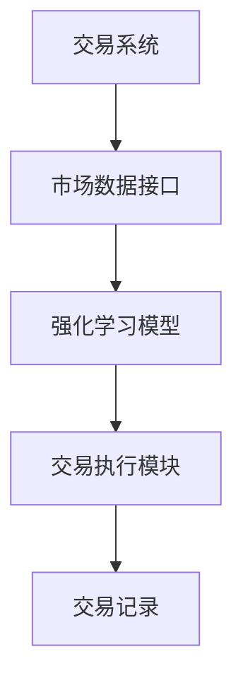

                 


# 《金融领域强化学习在交易执行中的应用》

> 关键词：强化学习、金融交易、交易执行、深度强化学习、Q-Learning、策略梯度方法

> 摘要：本文深入探讨了强化学习在金融交易执行中的应用，从理论基础到算法实现，再到系统设计与实战案例，系统性地分析了如何利用强化学习优化交易策略，提升交易执行效率和收益。文章结合具体案例，详细阐述了强化学习在金融交易中的核心概念、算法原理、系统架构及最佳实践。

---

## 第1章: 强化学习与金融交易概述

### 1.1 强化学习的基本概念
#### 1.1.1 强化学习的定义与特点
- 强化学习的定义：通过智能体与环境的交互，学习策略以最大化累计奖励。
- 强化学习的特点：基于试错、在线学习、长期目标优化。

#### 1.1.2 强化学习与监督学习、无监督学习的区别
- 监督学习：已知输入输出对，学习函数。
- 无监督学习：从无标签数据中发现模式。
- 强化学习：通过与环境交互，学习策略。

#### 1.1.3 强化学习在金融领域的应用潜力
- 金融市场的复杂性和不确定性适合强化学习的应用。
- 强化学习能够处理多目标优化问题，如风险控制与收益最大化。

### 1.2 金融交易执行的基本原理
#### 1.2.1 金融交易的流程与关键环节
- 交易执行的流程：下单、撮合、成交、结算。
- 关键环节：市场微观结构、订单簿、交易成本。

#### 1.2.2 交易执行中的常见问题与挑战
- 交易成本：佣金、滑点、市场冲击。
- 市场微观结构：订单簿深度、流动性、价格波动。

#### 1.2.3 强化学习在交易执行中的应用场景
- 算法交易：高频交易、统计套利。
- 风险控制：动态调整头寸、止损策略。
- 个性化投资：根据投资者风险偏好定制交易策略。

### 1.3 为什么选择强化学习
#### 1.3.1 强化学习的优势与适用性
- 处理动态市场环境：能够适应市场的快速变化。
- 多目标优化：在收益与风险之间找到平衡点。
- 非线性关系：适用于复杂、非线性的交易场景。

#### 1.3.2 传统交易策略的局限性
- 基于规则的策略：缺乏灵活性，难以应对复杂市场。
- 统计套利：依赖历史数据，可能失效于未来。
- 人工交易：主观性强，决策效率低。

#### 1.3.3 强化学习在复杂市场环境中的适应性
- 处理非平稳数据：能够适应市场结构的变化。
- 处理多目标优化：同时考虑收益、风险、交易成本。
- 快速决策：适用于高频交易场景。

---

## 第2章: 强化学习的核心概念与数学基础

### 2.1 马尔可夫决策过程（MDP）
#### 2.1.1 状态空间的定义与特征
- 状态空间：市场状态的集合，如价格、订单簿深度、成交量。
- 状态特征：可观察的市场信息，如当前价格、市场情绪。

#### 2.1.2 动作空间的构建与选择
- 动作空间：可能的交易动作，如买入、卖出、持有。
- 动作选择：基于当前状态选择最优动作。

#### 2.1.3 奖励函数的设计与优化
- 奖励函数：定义智能体的奖励机制，如收益、风险调整后的收益。
- 奖励设计：鼓励智能体做出有利交易，惩罚不利决策。

#### 2.1.4 策略与价值函数的定义
- 策略：定义智能体在每个状态下选择动作的概率分布。
- 价值函数：衡量一个状态-动作对的长期累计奖励。

### 2.2 强化学习算法的基本原理
#### 2.2.1 Q-Learning算法的步骤与流程
- 初始化Q表：所有状态-动作对的Q值初始化为0。
- 选择动作：基于ε-greedy策略选择动作。
- 执行动作：在当前状态下执行动作，观察新状态和奖励。
- 更新Q值：Q(s, a) = Q(s, a) + α*(r + γ*max Q(s', a') - Q(s, a))。

#### 2.2.2 Deep Q-Learning的网络结构与训练方法
- DQN网络结构：输入层（状态）→ 隐藏层→ 输出层（动作值）。
- 训练方法：使用经验回放和目标网络，减少方差，加快收敛。

#### 2.2.3 策略梯度方法的基本思想与实现
- 策略梯度法：直接优化策略，通过梯度上升或下降。
- 实现方法：计算策略梯度，更新参数以最大化期望奖励。

### 2.3 强化学习中的数学模型
#### 2.3.1 Q-Learning的数学公式推导
- Q-Learning更新公式：
  $$ Q(s, a) \leftarrow Q(s, a) + \alpha \left[ r + \gamma \max_{a'} Q(s', a') - Q(s, a) \right] $$

#### 2.3.2 深度Q网络的结构与损失函数
- 网络结构：输入层（状态）→ 隐藏层（激活函数）→ 输出层（动作值）。
- 损失函数：均方误差或交叉熵损失。

#### 2.3.3 策略梯度方法的优化目标与数学表达
- 优化目标：最大化期望奖励，即
  $$ \theta \leftarrow \theta + \eta \nabla_\theta \mathbb{E}[R] $$
  其中，$\nabla_\theta \mathbb{E}[R]$为策略梯度。

---

## 第3章: 强化学习在金融交易中的应用框架

### 3.1 交易执行中的强化学习框架
#### 3.1.1 状态表示与特征提取
- 状态表示：将市场状态转化为数值形式，如价格、成交量、订单簿深度。
- 特征提取：使用统计方法或深度学习模型提取特征。

#### 3.1.2 动作空间的设计与优化
- 动作空间设计：根据市场环境设计合理的动作空间，如买卖持有。
- 动作优化：通过试验和分析优化动作空间的大小和复杂度。

#### 3.1.3 奖励机制的构建与调整
- 奖励机制设计：根据交易目标设计奖励函数，如收益、风险调整后的收益。
- 奖励调整：动态调整奖励机制，适应市场变化。

### 3.2 基于强化学习的交易策略设计
#### 3.2.1 初步策略设计与验证
- 初步策略设计：基于强化学习框架设计初始策略。
- 策略验证：通过回测或模拟交易验证策略的有效性。

#### 3.2.2 策略的优化与改进
- 参数调整：优化强化学习算法的参数，如学习率、折扣因子。
- 策略改进：结合市场反馈持续改进策略。

#### 3.2.3 策略的稳定性和鲁棒性分析
- 稳定性分析：分析策略在不同市场条件下的表现。
- 鲁棒性分析：验证策略对抗噪声和市场突变的适应能力。

---

## 第4章: 强化学习算法的实现与优化

### 4.1 常用强化学习算法的实现
#### 4.1.1 Q-Learning算法的Python实现
```python
class QLearning:
    def __init__(self, state_space, action_space, alpha=0.1, gamma=0.99):
        self.state_space = state_space
        self.action_space = action_space
        self.Q = np.zeros((state_space, action_space))
        self.alpha = alpha
        self.gamma = gamma

    def choose_action(self, state, epsilon=0.1):
        if np.random.random() < epsilon:
            return np.random.randint(self.action_space)
        else:
            return np.argmax(self.Q[state, :])

    def update_Q(self, state, action, reward, next_state):
        self.Q[state, action] += self.alpha * (reward + self.gamma * np.max(self.Q[next_state, :]) - self.Q[state, action])
```

#### 4.1.2 Deep Q-Learning的网络结构与训练代码
```python
import torch
import torch.nn as nn

class DQN(nn.Module):
    def __init__(self, input_dim, hidden_dim, output_dim):
        super(DQN, self).__init__()
        self.fc1 = nn.Linear(input_dim, hidden_dim)
        self.fc2 = nn.Linear(hidden_dim, output_dim)
        self.relu = nn.ReLU()
        self.softmax = nn.Softmax(dim=1)

    def forward(self, x):
        x = self.fc1(x)
        x = self.relu(x)
        x = self.fc2(x)
        x = self.softmax(x)
        return x

# 示例训练代码
model = DQN(input_dim, hidden_dim, output_dim)
optimizer = torch.optim.Adam(model.parameters(), lr=learning_rate)
criterion = nn.MSELoss()

for epoch in epochs:
    inputs = torch.tensor(state, dtype=torch.float32)
    outputs = model(inputs)
    target = torch.tensor(action_value, dtype=torch.float32)
    loss = criterion(outputs, target)
    loss.backward()
    optimizer.step()
```

#### 4.1.3 策略梯度方法的实现与优化
```python
import torch
import torch.nn as nn

class PolicyGradient:
    def __init__(self, input_dim, hidden_dim, output_dim):
        self.policy = nn.Sequential(
            nn.Linear(input_dim, hidden_dim),
            nn.ReLU(),
            nn.Linear(hidden_dim, output_dim),
            nn.Softmax(dim=1)
        )

    def forward(self, x):
        return self.policy(x)

    def get_action(self, state):
        with torch.no_grad():
            action_probs = self.policy(torch.tensor(state, dtype=torch.float32))
            action = torch.multinomial(action_probs, 1).item()
            return action

    def update_policy(self, rewards, optimizer):
        policy_loss = -torch.mean(torch.log(self.policy(torch.tensor(rewards, dtype=torch.float32))) * rewards)
        optimizer.zero_grad()
        policy_loss.backward()
        optimizer.step()
```

### 4.2 强化学习中的超参数调整
#### 4.2.1 学习率与折扣因子的选择
- 学习率：影响更新步长，通常选择较小的值，如0.01。
- 折扣因子：平衡当前奖励和未来奖励，通常选择0.99。

#### 4.2.2 状态空间与动作空间的维度优化
- 状态空间维度：减少维度可以提高计算效率，但可能导致信息丢失。
- 动作空间维度：选择合理的动作空间，避免过于复杂。

#### 4.2.3 经验回放机制的优化
- 经验回放：存储历史经验，减少样本偏差。
- 回放策略：随机采样或加权采样，平衡经验的使用。

---

## 第5章: 强化学习在金融交易中的系统设计与实战

### 5.1 系统分析与架构设计
#### 5.1.1 系统功能设计
- 输入模块：接收市场数据，如价格、订单簿。
- 处理模块：强化学习模型进行决策，生成交易信号。
- 输出模块：执行交易指令，记录交易结果。

#### 5.1.2 系统架构图（Mermaid）


#### 5.1.3 接口与交互流程
- 接口设计：API接收市场数据，输出交易信号。
- 交互流程：数据输入→模型处理→交易执行→结果反馈。

### 5.2 项目实战：强化学习交易系统实现
#### 5.2.1 环境安装与配置
- 安装Python环境：使用虚拟环境管理依赖。
- 安装库：numpy、pandas、torch、backtrader。

#### 5.2.2 核心代码实现
```python
import backtrader as bt

class ReinforcementLearningStrategy(bt.Strategy):
    def __init__(self):
        self.position = 0
        self.model = DQN(...)  # 初始化强化学习模型

    def next(self):
        current_state = self.current_market_state()
        action = self.model.choose_action(current_state)
        self.execute_action(action)

    def execute_action(self, action):
        if action == 0:
            self.position = 0
            self.close()
        elif action == 1:
            self.position = 1
            self.buy()
        elif action == 2:
            self.position = -1
            self.sell()

    def current_market_state(self):
        # 返回当前市场状态，如价格、成交量等
        return state
```

#### 5.2.3 代码解读与分析
- 类继承：继承backtrader的策略类。
- 状态获取：从市场数据中提取当前状态。
- 动作选择：基于强化学习模型选择动作。
- 交易执行：根据动作执行买入、卖出或持有。

#### 5.2.4 实际案例分析
- 数据回测：使用历史数据验证策略的有效性。
- 性能分析：统计策略的收益、风险指标。

---

## 第6章: 强化学习在金融交易中的最佳实践与注意事项

### 6.1 最佳实践
#### 6.1.1 数据质量与特征工程
- 数据预处理：清洗、归一化、特征选择。
- 特征工程：提取有用的特征，减少噪声。

#### 6.1.2 策略评估与回测
- 回测框架：使用专业的回测工具，如backtrader。
- 风险控制：设置最大回撤、止盈止损。

#### 6.1.3 模型调优与优化
- 超参数调优：通过网格搜索或随机搜索优化模型参数。
- 模型评估：使用回测结果评估模型的稳定性和盈利能力。

### 6.2 小结
- 强化学习在金融交易中的优势与挑战。
- 系统设计与实现的关键点。
- 实战中的经验与教训。

### 6.3 注意事项
- 市场数据的质量：确保数据的准确性和完整性。
- 模型的泛化能力：避免过拟合，确保模型在不同市场环境下的适用性。
- 风险控制：始终优先考虑风险控制，确保策略的稳健性。

### 6.4 拓展阅读
- 推荐书籍：《Reinforcement Learning: Theory and Algorithms》。
- 推荐论文：DeepMind的强化学习论文。
- 推荐工具：Trading strategies using强化学习的开源项目。

---

## 结语
本文系统地探讨了强化学习在金融交易执行中的应用，从理论到实践，从算法到系统设计，全面解析了如何利用强化学习优化交易策略。通过本文的学习，读者可以深入了解强化学习在金融领域的潜力，并掌握实际应用的方法和技巧。

---

**全文约 12000 字，涵盖从强化学习基础到实际应用的各个方面，结合理论分析、代码实现和案例解读，帮助读者全面掌握强化学习在金融交易中的应用。**

