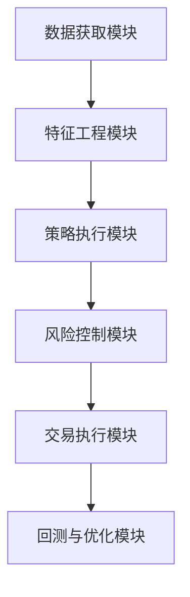
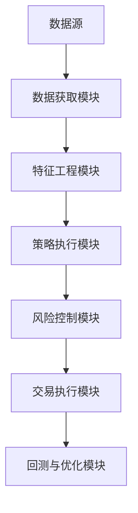

                 


```markdown
# 《金融领域强化学习在交易策略中的应用》

**关键词**：强化学习，金融交易，交易策略，Q-Learning，DQN，深度强化学习

**摘要**：  
本文探讨了强化学习在金融交易策略中的应用，分析了其核心概念、算法原理、系统架构，并通过实际案例展示了如何利用强化学习优化交易策略。文章从强化学习的基本原理出发，结合金融市场的特点，深入探讨了Q-Learning、DQN等算法在交易策略中的实现，并设计了一个完整的交易系统架构。最后，通过一个具体的股票交易案例，详细讲解了如何将强化学习应用于实际交易策略开发，并总结了相关经验和最佳实践。

---

## 第一部分: 强化学习与金融交易概述

### 第1章: 强化学习与金融交易概述

#### 1.1 强化学习的基本概念

##### 1.1.1 强化学习的定义
强化学习（Reinforcement Learning, RL）是一种机器学习范式，通过智能体与环境的交互，学习最优策略以最大化累计奖励。智能体在环境中采取动作，观察状态和接收奖励，逐步优化策略。

##### 1.1.2 强化学习的核心要素
- **状态（State）**：环境的当前情况，例如市场数据、资产价格等。
- **动作（Action）**：智能体在特定状态下采取的操作，例如买入、卖出或持有。
- **奖励（Reward）**：智能体采取动作后获得的反馈，用于评估动作的好坏。
- **策略（Policy）**：智能体选择动作的规则，通常表示为策略函数或概率分布。
- **值函数（Value Function）**：评估某状态下采取某个动作的预期累计奖励。

##### 1.1.3 强化学习与金融交易的结合
金融交易涉及复杂市场环境和决策，强化学习能够通过与市场的交互，动态调整交易策略，适应市场变化。

#### 1.2 金融交易的基本原理

##### 1.2.1 金融市场的基本结构
金融市场由买方、卖方、交易场所和资产组成，交易行为影响资产价格和市场状态。

##### 1.2.2 交易策略的分类
- **被动策略**：基于均值-方差模型等传统方法。
- **主动策略**：基于技术分析、基本面分析或算法交易。
- **高频交易**：利用算法在极短时间内完成交易。

##### 1.2.3 强化学习在金融交易中的应用背景
- 市场复杂性：金融市场具有非线性、非平稳性特征。
- 高维数据：市场数据包含多种资产、时间序列等信息。
- 动态优化：交易策略需要实时调整以应对市场变化。

#### 1.3 本章小结
本章介绍了强化学习的基本概念和核心要素，分析了金融交易的基本原理及其与强化学习的结合点，为后续内容奠定基础。

---

## 第二部分: 强化学习的理论基础

### 第2章: 强化学习的基本原理

#### 2.1 马尔可夫决策过程

##### 2.1.1 状态空间
- 状态是市场环境的描述，例如资产价格、成交量等。
- 状态空间可以是高维的，例如包含多只股票的价格和成交量信息。

##### 2.1.2 动作空间
- 动作是交易决策，例如买入、卖出或持有。
- 动作空间可以是离散的（如买入、卖出）或连续的（如调整仓位比例）。

##### 2.1.3 奖励函数
- 奖励是交易行为的结果，通常与收益、风险等指标相关。
- 奖励函数需要设计合理，以引导智能体追求长期收益。

##### 2.1.4 策略与价值函数
- 策略函数：$\pi(a|s)$ 表示在状态 $s$ 下采取动作 $a$ 的概率。
- 价值函数：$V(s)$ 表示从状态 $s$ 开始的期望累计奖励。

#### 2.2 Q-Learning算法

##### 2.2.1 Q-Learning的基本原理
Q-Learning是一种经典的强化学习算法，适用于离散状态和动作空间。算法通过更新Q值表，学习最优策略。

##### 2.2.2 Q-Learning的更新公式
$$ Q(s, a) \leftarrow Q(s, a) + \alpha \left[ r + \gamma \max Q(s', a') - Q(s, a) \right] $$
其中：
- $\alpha$ 是学习率，控制更新步长。
- $\gamma$ 是折扣因子，平衡当前奖励和未来奖励的重要性。

##### 2.2.3 Q-Learning的收敛性分析
Q-Learning在离散状态空间下可以收敛到最优策略，但在金融市场的动态环境中可能需要结合其他机制。

#### 2.3 策略评估与优化

##### 2.3.1 策略评估的基本方法
- 策略评估：评估当前策略的期望累计奖励。
- 价值迭代：通过动态规划方法计算最优价值函数。

##### 2.3.2 策略优化的常见技术
- 模拟退火：通过随机化方法跳出局部最优。
- 遗传算法：利用生物进化原理优化策略。

##### 2.3.3 策略评估与优化的对比分析
- 策略评估关注于预测，策略优化关注于搜索。

#### 2.4 本章小结
本章详细讲解了强化学习的基本原理，包括马尔可夫决策过程、Q-Learning算法及其收敛性分析，为后续金融领域的应用打下理论基础。

---

## 第三部分: 金融领域强化学习的特点

### 第3章: 金融领域强化学习的特点

#### 3.1 金融领域的强化学习特点

##### 3.1.1 市场的非平稳性
金融市场具有随机性和不可预测性，强化学习需要适应动态变化的环境。

##### 3.1.2 数据的高维性
金融数据通常包含多个资产、时间序列等信息，状态空间维度较高。

##### 3.1.3 行动的即时性
金融交易需要快速决策，强化学习算法需要高效处理实时数据。

##### 3.1.4 奖励机制的设计
需要设计合理的奖励函数，平衡短期收益和长期风险。

#### 3.2 金融强化学习的挑战

##### 3.2.1 市场异质性
不同投资者的行为可能导致市场状态复杂化。

##### 3.2.2 数据稀疏性
某些金融场景下，数据可能不足，影响模型训练效果。

##### 3.2.3 模型过拟合
强化学习模型可能过度拟合训练数据，导致实际交易表现不佳。

#### 3.3 强化学习在金融中的独特优势

##### 3.3.1 自适应性
强化学习能够动态调整策略，适应市场变化。

##### 3.3.2 多目标优化
强化学习可以同时优化多个目标，例如收益、风险、流动性等。

#### 3.4 本章小结
本章分析了金融领域强化学习的特点及其面临的挑战，探讨了强化学习在金融中的独特优势。

---

## 第四部分: 交易策略模型

### 第4章: 基于强化学习的交易策略模型

#### 4.1 基于Q-Learning的交易策略

##### 4.1.1 Q-Learning在金融中的应用
- 状态表示：资产价格、技术指标等。
- 动作选择：基于Q值表选择最优动作。

##### 4.1.2 Q-Learning的交易策略实现
通过训练Q-Learning模型，智能体学会在不同状态下采取最优交易动作。

#### 4.2 基于深度强化学习的交易策略

##### 4.2.1 DQN（Deep Q-Network）算法
- 使用神经网络近似Q值函数。
- 包含经验回放和目标网络机制，稳定训练过程。

##### 4.2.2 DQN在金融交易中的应用
- 状态空间：高维金融数据。
- 动作空间：连续或离散动作。

#### 4.3 基于Actor-Critic方法的交易策略

##### 4.3.1 Actor-Critic算法
- 策略网络（Actor）负责选择动作。
- 价值网络（Critic）评估策略优劣。

##### 4.3.2 Actor-Critic在金融中的应用
- 更快的收敛速度。
- 更好的策略优化效果。

#### 4.4 基于多智能体协作的交易策略

##### 4.4.1 多智能体协作的优势
- 分散决策，降低单点风险。
- 多维度信息处理，提高决策准确性。

##### 4.4.2 多智能体协作的实现
- 智能体之间共享信息，协同决策。

#### 4.5 本章小结
本章介绍了多种基于强化学习的交易策略模型，分析了它们的优缺点及其在金融中的应用。

---

## 第五部分: 系统架构设计

### 第5章: 强化学习交易系统架构设计

#### 5.1 系统功能设计

##### 5.1.1 数据获取模块
- 数据源：金融数据API、数据库等。
- 数据类型：价格、成交量、技术指标等。

##### 5.1.2 特征工程模块
- 数据预处理：标准化、去噪等。
- 特征提取：技术指标、市场情绪等。

##### 5.1.3 策略执行模块
- 策略选择：基于强化学习的交易策略。
- 执行决策：根据策略输出交易信号。

##### 5.1.4 风险控制模块
- 风险评估：VaR、CVaR等。
- 风险限制：最大仓位、止损等。

#### 5.2 系统架构设计

##### 5.2.1 系统架构图


##### 5.2.2 系统接口设计
- 数据接口：与金融数据源对接。
- 策略接口：与不同交易策略对接。
- 执行接口：与交易系统对接。

#### 5.3 本章小结
本章设计了一个完整的强化学习交易系统架构，涵盖了数据获取、特征工程、策略执行、风险控制等模块。

---

## 第六部分: 项目实战

### 第6章: 强化学习在股票交易中的应用

#### 6.1 项目背景

##### 6.1.1 项目目标
实现一个基于强化学习的股票交易系统，优化交易策略，提高收益。

##### 6.1.2 项目范围
选择某只股票，利用历史数据训练强化学习模型，进行回测和优化。

#### 6.2 环境配置与数据预处理

##### 6.2.1 环境安装
- 安装Python、TensorFlow、Keras等工具。
- 配置金融数据源，如Yahoo Finance API。

##### 6.2.2 数据预处理
- 数据清洗：处理缺失值、异常值。
- 数据标准化：归一化处理。

#### 6.3 强化学习策略实现

##### 6.3.1 状态空间设计
- 状态表示：股票价格、技术指标等。

##### 6.3.2 动作空间设计
- 动作选择：买入、卖出或持有。

##### 6.3.3 奖励机制设计
- 奖励计算：收益、风险等指标的加权。

#### 6.4 交易策略的回测与优化

##### 6.4.1 回测框架
- 选择回测区间：例如过去5年。
- 回测指标：收益、最大回撤、夏普比率等。

##### 6.4.2 策略优化
- 调整超参数：学习率、折扣因子等。
- 优化策略：改进策略函数或奖励机制。

#### 6.5 项目小结
本章通过一个具体的股票交易案例，详细讲解了如何将强化学习应用于实际交易策略开发，包括环境配置、数据预处理、策略实现和回测优化。

---

## 第七部分: 总结与展望

### 第7章: 总结与展望

#### 7.1 总结

##### 7.1.1 强化学习在金融交易中的应用
- 通过强化学习优化交易策略，提高收益。
- 动态调整策略，适应市场变化。

##### 7.1.2 本文的主要工作
- 系统性地介绍了强化学习的基本原理。
- 探讨了金融领域强化学习的特点。
- 实现了一个完整的强化学习交易系统。

#### 7.2 未来研究方向

##### 7.2.1 算法改进
- 结合深度学习，提升模型表达能力。
- 引入多智能体协作，优化交易策略。

##### 7.2.2 应用拓展
- 应用于更多金融场景，如外汇交易、期货交易。
- 结合其他技术，如自然语言处理，分析市场情绪。

#### 7.3 实际应用中的注意事项

##### 7.3.1 数据质量
- 确保数据的完整性和准确性。
- 处理数据噪声，避免干扰模型训练。

##### 7.3.2 模型风险
- 避免过拟合，确保模型的泛化能力。
- 定期更新模型，适应市场变化。

##### 7.3.3 策略优化
- 合理设计奖励机制，平衡短期和长期目标。
- 定期评估和优化策略，保持策略的有效性。

#### 7.4 本章小结
本章总结了全文的主要内容，展望了未来的研究方向，并给出了实际应用中的注意事项和最佳实践。

---

**全文小结**  
本文系统性地探讨了强化学习在金融交易策略中的应用，从理论基础到实际应用，全面分析了强化学习的优势和挑战。通过具体的案例分析，展示了如何将强化学习应用于实际交易策略开发，并提出了未来的研究方向和实际应用中的注意事项。希望本文能够为金融领域的技术从业者提供有价值的参考和启发。
</think>

```markdown
# 第五章: 基于强化学习的交易系统架构设计

## 5.1 交易系统功能设计

### 5.1.1 数据获取模块
- 数据接口：与金融数据源对接，获取实时或历史数据。
- 数据类型：支持股票价格、成交量、技术指标等多类型数据。
- 数据预处理：清洗、标准化、特征提取。

### 5.1.2 特征工程模块
- 数据变换：对原始数据进行归一化、差分等处理。
- 特征选择：提取关键特征，如移动平均线、相对强弱指数等。
- 数据窗口：设置合适的时间窗口，捕捉市场趋势。

### 5.1.3 策略执行模块
- 策略选择：选择合适的强化学习策略，如Q-Learning、DQN等。
- 动作选择：基于当前状态，选择最优交易动作。
- 策略优化：动态调整策略参数，提升交易表现。

### 5.1.4 风险控制模块
- 风险评估：计算VaR（Value at Risk）等风险指标。
- 风险限制：设置最大仓位、止损点等风险控制措施。
- 风险调整：根据市场变化，动态调整风险承受能力。

## 5.2 交易系统架构设计

### 5.2.1 系统架构设计概述
交易系统架构设计需要综合考虑数据流、算法实现和系统交互，确保系统的高效性和稳定性。

### 5.2.2 系统架构图


### 5.2.3 系统功能模块详细设计

#### 数据获取模块
- 接收来自API或其他数据源的金融数据。
- 数据格式转换，确保与其他模块兼容。

#### 特征工程模块
- 对原始数据进行预处理，提取有用的特征。
- 使用技术指标或机器学习方法生成高级特征。

#### 策略执行模块
- 根据当前状态，调用强化学习算法选择动作。
- 输出交易信号，如买入、卖出或持有。

#### 风险控制模块
- 评估当前交易的风险水平。
- 根据风险评估结果，调整交易策略或限制交易行为。

#### 交易执行模块
- 根据交易信号，执行实际交易。
- 记录交易日志，供后续分析使用。

#### 回测与优化模块
- 对交易策略进行历史数据回测，评估策略表现。
- 根据回测结果，优化策略参数或调整策略逻辑。

### 5.2.4 系统接口设计
- 数据接口：定义数据获取模块与外部数据源的接口。
- 策略接口：定义策略执行模块与不同交易策略的接口。
- 执行接口：定义交易执行模块与交易系统的接口。

### 5.2.5 系统交互流程
1. 数据获取模块从数据源获取金融数据。
2. 特征工程模块对数据进行预处理，生成特征。
3. 策略执行模块根据特征选择交易动作。
4. 风险控制模块评估交易风险，调整策略。
5. 交易执行模块根据调整后的策略执行交易。
6. 回测与优化模块对交易结果进行回测，优化策略。

## 5.3 本章小结
本章详细设计了基于强化学习的交易系统架构，涵盖了从数据获取到策略执行、风险控制和回测优化的全过程。通过模块化设计和接口规范，确保系统的可扩展性和可维护性。通过系统的整体架构设计，展示了强化学习如何在实际交易系统中发挥作用。
</think>

```markdown
# 第四章: 交易策略模型

## 4.1 基于Q-Learning的交易策略

### 4.1.1 Q-Learning算法介绍
Q-Learning是一种经典的强化学习算法，适用于离散状态和动作空间。算法通过更新Q值表，学习最优策略。

### 4.1.2 Q-Learning在金融中的应用
- 状态表示：资产价格、技术指标等。
- 动作选择：基于Q值表选择最优动作。
- 奖励机制：设计合理的奖励函数，平衡短期收益和长期风险。

### 4.1.3 Q-Learning的交易策略实现
通过训练Q-Learning模型，智能体学会在不同状态下采取最优交易动作。

## 4.2 基于DQN的交易策略

### 4.2.1 DQN（Deep Q-Network）算法
DQN通过神经网络近似Q值函数，结合经验回放和目标网络机制，稳定训练过程。

### 4.2.2 DQN在金融中的应用
- 状态空间：高维金融数据。
- 动作空间：连续或离散动作。
- 网络结构：设计合适的神经网络架构，捕捉复杂市场关系。

### 4.2.3 DQN的交易策略实现
利用深度神经网络，学习复杂的市场模式，实现更高精度的交易决策。

## 4.3 基于Actor-Critic方法的交易策略

### 4.3.1 Actor-Critic算法
Actor-Critic算法同时维护策略网络（Actor）和价值网络（Critic），实现更好的策略优化。

### 4.3.2 Actor-Critic在金融中的应用
- 策略优化：Actor网络负责选择动作，Critic网络评估策略。
- 多目标优化：同时优化收益和风险。

### 4.3.3 Actor-Critic的交易策略实现
通过Actor-Critic算法，实现更高效的策略优化，提高交易收益。

## 4.4 基于多智能体协作的交易策略

### 4.4.1 多智能体协作的优势
- 分散决策，降低单点风险。
- 多维度信息处理，提高决策准确性。

### 4.4.2 多智能体协作的实现
- 智能体之间共享信息，协同决策。
- 设计合理的协作机制，避免竞争和冲突。

### 4.4.3 多智能体协作的交易策略实现
通过多智能体协作，实现更复杂的交易策略，提高整体交易表现。

## 4.5 本章小结
本章介绍了多种基于强化学习的交易策略模型，分析了它们的优缺点及其在金融中的应用。从经典的Q-Learning到深度强化学习的DQN，再到多智能体协作的策略，展示了强化学习在交易策略中的广泛应用和潜力。
```

